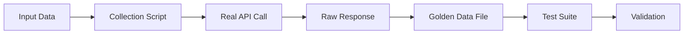

# Golden Data Testing System Design v1.0

**Created:** 2025-11-01
**Status:** Draft
**Priority:** High
**Author:** Architect Mode

## Executive Summary

This document describes a comprehensive "Golden Data" testing system for the Gromozeka bot project, dood! The system captures real API responses from external services (Yandex Search, OpenWeatherMap, LLM providers, etc.) and uses them as test fixtures, replacing heavy mocking with realistic data.

**Key Benefits:**
- ✅ Tests use real API response structures
- ✅ Catches API changes and schema drift early
- ✅ Reduces mock maintenance overhead
- ✅ Provides realistic test scenarios
- ✅ Enables regression testing with actual data
- ✅ Simplifies test writing and debugging

**Target Services:**
- Yandex Search API
- OpenWeatherMap API
- LLM Providers (Yandex Cloud SDK, Yandex Cloud OpenAI, OpenRouter)
- Any future external APIs

---

## Table of Contents

1. [Problem Statement](#problem-statement)
2. [Solution Overview](#solution-overview)
3. [Architecture](#architecture)
4. [Directory Structure](#directory-structure)
5. [Golden Data Collection](#golden-data-collection)
6. [Golden Data Usage](#golden-data-usage)
7. [Implementation Plan](#implementation-plan)
8. [Best Practices](#best-practices)
9. [Security Considerations](#security-considerations)
10. [Future Enhancements](#future-enhancements)

---

## Problem Statement

### Current Testing Approach

The project currently uses extensive mocking for external API testing:

```python
# Current approach - heavy mocking
@pytest.fixture
def mockWeatherClient():
    mock = Mock(spec=OpenWeatherMapClient)
    mock.getCurrentWeather.return_value = {
        "temp": 20.5,
        "description": "clear sky"
    }
    return mock
```

**Problems with Current Approach:**
1. **Mock Drift:** Mocks can diverge from actual API responses over time
2. **Incomplete Coverage:** Mocks may not include all fields from real responses
3. **Maintenance Burden:** Every API change requires updating multiple mocks
4. **False Confidence:** Tests pass with mocks but fail with real APIs
5. **Missing Edge Cases:** Real APIs return unexpected data that mocks don't capture
6. **Schema Changes:** API providers change response structures without notice

### Real-World Example

```python
# Mock says this works:
mock.search.return_value = {"results": [...]}

# But real API returns:
{
    "response": {
        "found": 1000,
        "results": [...],
        "metadata": {...}
    }
}
# Tests pass, production breaks! 💥
```

---

## Solution Overview

### Golden Data Approach

Instead of mocking, we capture real API responses and use them as test fixtures:

```python
# New approach - golden data
def testWeatherParsing():
    goldenData = loadGoldenData("openweathermap/current_weather_minsk.json")
    result = parseWeatherResponse(goldenData)
    assert result.temperature == 20.5
```

**Workflow:**



### Key Principles

1. **Capture Once, Use Many Times:** Collect real API responses and reuse them
2. **Version Control:** Store golden data in git for history and review
3. **Separate Concerns:** Collection scripts are separate from test code
4. **Credential Safety:** Never commit API keys or sensitive data
5. **Reproducibility:** Same input always produces same golden data
6. **Documentation:** Each golden data file is self-documenting

---

## Architecture

### Component Overview

```
┌─────────────────────────────────────────────────────────┐
│                  Golden Data System                      │
├─────────────────────────────────────────────────────────┤
│                                                          │
│  ┌──────────────┐      ┌──────────────┐               │
│  │  Collection  │      │   Storage    │               │
│  │   Scripts    │─────▶│  (JSON/YAML) │               │
│  └──────────────┘      └──────────────┘               │
│         │                      │                        │
│         │                      │                        │
│         ▼                      ▼                        │
│  ┌──────────────┐      ┌──────────────┐               │
│  │  Real APIs   │      │  Test Suite  │               │
│  │  (External)  │      │  (pytest)    │               │
│  └──────────────┘      └──────────────┘               │
│                                                          │
└─────────────────────────────────────────────────────────┘
```

### Data Flow

1. **Collection Phase:**
   ```
   Input Data → Collection Script → Real API → Raw Response → Golden Data File
   ```

2. **Testing Phase:**
   ```
   Golden Data File → Test Fixture → Test Code → Assertions
   ```

---

## Directory Structure

```
tests/
├── golden_data/                    # All golden data files
│   ├── README.md                   # Documentation for golden data system
│   ├── .gitignore                  # Ignore sensitive files
│   │
│   ├── yandex_search/              # Yandex Search API responses
│   │   ├── inputs/                 # Input data for collection
│   │   │   ├── search_queries.json # List of search queries to test
│   │   │   └── README.md           # Input data documentation
│   │   ├── raw/                    # RAW HTTP responses from Yandex server
│   │   │   ├── search_python_programming.xml  # Raw XML response
│   │   │   ├── search_weather_minsk.xml
│   │   │   ├── search_with_grouping.xml
│   │   │   ├── error_invalid_key.xml          # Error responses too!
│   │   │   └── metadata.json       # Metadata about captures
│   │   └── collect.py              # Collection script
│   │
│   ├── openweathermap/             # OpenWeatherMap API responses
│   │   ├── inputs/
│   │   │   ├── locations.json      # Cities and coordinates to test
│   │   │   └── README.md
│   │   ├── raw/                    # RAW HTTP responses from OpenWeatherMap server
│   │   │   ├── current_weather_minsk.json     # Raw JSON response
│   │   │   ├── current_weather_london.json
│   │   │   ├── forecast_minsk_5day.json
│   │   │   ├── geocoding_minsk.json
│   │   │   ├── error_invalid_city.json        # Error responses
│   │   │   ├── error_invalid_key.json
│   │   │   └── metadata.json
│   │   └── collect.py
│   │
│   ├── llm_providers/              # LLM provider responses
│   │   ├── inputs/
│   │   │   ├── prompts.json        # Test prompts
│   │   │   └── README.md
│   │   ├── raw/                    # RAW HTTP responses from LLM servers
│   │   │   ├── yc_sdk/             # Yandex Cloud SDK raw responses
│   │   │   │   ├── simple_completion.json     # Raw API response
│   │   │   │   ├── tool_call_weather.json
│   │   │   │   ├── streaming_response.json    # Streaming format
│   │   │   │   ├── error_rate_limit.json      # Error responses
│   │   │   │   └── metadata.json
│   │   │   ├── yc_openai/          # Yandex Cloud OpenAI raw responses
│   │   │   │   ├── simple_completion.json
│   │   │   │   ├── chat_completion.json
│   │   │   │   ├── error_invalid_model.json
│   │   │   │   └── metadata.json
│   │   │   └── openrouter/         # OpenRouter raw responses
│   │   │       ├── simple_completion.json
│   │   │       ├── tool_use.json
│   │   │       ├── error_no_credit.json
│   │   │       └── metadata.json
│   │   └── collect.py
│   │

---

## Low-Level Golden Data: Raw HTTP Responses

### Core Principle

**Capture at the lowest level possible** - the raw HTTP response body from the API server, BEFORE any processing by our client code.

### Why Raw Responses?

1. **Test the Full Stack:** From raw bytes to parsed objects
2. **Catch Parsing Bugs:** Test our JSON/XML parsing logic
3. **Real API Format:** Exact structure from the server
4. **Error Responses:** Capture real error formats
5. **Edge Cases:** Unusual responses that mocks miss

### What We Capture

```
┌─────────────────────────────────────────────────────┐
│  What We DON'T Capture (Too High Level)            │
├─────────────────────────────────────────────────────┤
│  ❌ client.getCurrentWeather() result               │
│  ❌ Parsed/processed data from our code             │
│  ❌ Python objects/dataclasses                      │
└─────────────────────────────────────────────────────┘

┌─────────────────────────────────────────────────────┐
│  What We DO Capture (Low Level)                    │
├─────────────────────────────────────────────────────┤
│  ✅ Raw HTTP response body (JSON/XML/text)          │
│  ✅ Exact bytes from the server                     │
│  ✅ Before any parsing or transformation            │
│  ✅ Including headers if relevant                   │
└─────────────────────────────────────────────────────┘
```

### Example: OpenWeatherMap

**BAD (Too High Level):**
```python
# ❌ Don't capture this - it's already processed!
async with OpenWeatherMapClient(apiKey=key) as client:
    result = await client.getCurrentWeather("Minsk")  # Already parsed!
    saveGoldenData(result)  # Too late - parsing already happened
```

**GOOD (Low Level):**
```python
# ✅ Capture raw HTTP response
import aiohttp

async with aiohttp.ClientSession() as session:
    url = "https://api.openweathermap.org/data/2.5/weather"
    params = {"q": "Minsk", "appid": apiKey}
    
    async with session.get(url, params=params) as response:
        rawJson = await response.text()  # Raw response body
        saveGoldenData(rawJson)  # Save exactly what server sent
```

**Raw Response Example (`raw/current_weather_minsk.json`):**
```json
{
  "coord": {
    "lon": 27.5667,
    "lat": 53.9000
  },
  "weather": [
    {
      "id": 800,
      "main": "Clear",
      "description": "clear sky",
      "icon": "01d"
    }
  ],
  "base": "stations",
  "main": {
    "temp": 278.15,
    "feels_like": 275.32,
    "temp_min": 278.15,
    "temp_max": 278.15,
    "pressure": 1013,
    "humidity": 76
  },
  "visibility": 10000,
  "wind": {
    "speed": 3.5,
    "deg": 180
  },
  "clouds": {
    "all": 0
  },
  "dt": 1698854400,
  "sys": {
    "type": 1,
    "id": 8939,
    "country": "BY",
    "sunrise": 1698815520,
    "sunset": 1698850320
  },
  "timezone": 10800,
  "id": 625144,
  "name": "Minsk",
  "cod": 200
}
```

### Example: Yandex Search

**BAD (Too High Level):**
```python
# ❌ Don't capture this - it's already processed!
async with YandexSearchClient(apiKey=key) as client:
    result = await client.search("python")  # Already parsed!
    saveGoldenData(result)  # Too late - XML parsing already happened
```

**GOOD (Low Level):**
```python
# ✅ Capture raw HTTP response
import aiohttp

async with aiohttp.ClientSession() as session:
    url = "https://yandex.com/search/xml"
    params = {
        "user": userId,
        "key": apiKey,
        "query": "python programming",
        "l10n": "en",
        "sortby": "rlv",
        "filter": "none",
        "maxpassages": 3,
        "groupby": "attr=d.mode=deep.groups-on-page=10"
    }
    
    async with session.get(url, params=params) as response:
        rawXml = await response.text()  # Raw XML response
        saveGoldenData(rawXml)  # Save exactly what server sent
```

**Raw Response Example (`raw/search_python_programming.xml`):**
```xml
<?xml version="1.0" encoding="utf-8"?>
<yandexsearch version="1.0">
  <request>
    <query>python programming</query>
    <page>0</page>
    <sortby order="descending" priority="no">rlv</sortby>
    <maxpassages>3</maxpassages>
    <groupings>
      <groupby attr="d" mode="deep" groups-on-page="10" docs-in-group="1" curcateg="-1"/>
    </groupings>
  </request>
  <response date="20231101T120000">
    <found priority="phrase">1234567</found>
    <found priority="strict">987654</found>
    <found priority="all">2345678</found>
    <found-human>2 million results found</found-human>
    <results>
      <grouping attr="d" mode="deep" groups-on-page="10" docs-in-group="1" curcateg="-1">
        <found priority="phrase">1234567</found>
        <found priority="strict">987654</found>
        <found priority="all">2345678</found>
        <found-docs priority="phrase">1234567</found-docs>
        <found-docs priority="strict">987654</found-docs>
        <found-docs priority="all">2345678</found-docs>
        <found-docs-human>2 million documents found</found-docs-human>
        <page first="1" last="10">0</page>
        <group>
          <categ attr="d" name="UngroupVital"/>
          <doccount>1</doccount>
          <relevance priority="all"/>
          <doc id="ABCD1234">
            <url>https://www.python.org/</url>
            <domain>www.python.org</domain>
            <title>Welcome to Python.org</title>
            <modtime>20231025T100000</modtime>
            <size>12345</size>
            <charset>utf-8</charset>
            <passages>
              <passage>Python is a programming language that lets you work quickly...</passage>
            </passages>
          </doc>
        </group>
      </grouping>
    </results>
  </response>
</yandexsearch>
```

### Example: LLM Providers

**BAD (Too High Level):**
```python
# ❌ Don't capture this - it's already processed!
model = llmManager.getModel("yc-sdk/yandexgpt-lite")
result = await model.run(messages=[...])  # Already parsed!
saveGoldenData(result)  # Too late - response parsing already happened
```

**GOOD (Low Level):**
```python
# ✅ Capture raw HTTP response
import aiohttp

async with aiohttp.ClientSession() as session:
    url = "https://llm.api.cloud.yandex.net/foundationModels/v1/completion"
    headers = {
        "Authorization": f"Api-Key {apiKey}",
        "Content-Type": "application/json"
    }
    payload = {
        "modelUri": f"gpt://{folderId}/yandexgpt-lite",
        "completionOptions": {
            "stream": False,
            "temperature": 0.7,
            "maxTokens": 1000
        },
        "messages": [
            {"role": "user", "text": "Hello, how are you?"}
        ]
    }
    
    async with session.post(url, headers=headers, json=payload) as response:
        rawJson = await response.text()  # Raw response body
        saveGoldenData(rawJson)  # Save exactly what server sent
```

**Raw Response Example (`raw/yc_sdk/simple_completion.json`):**
```json
{
  "result": {
    "alternatives": [
      {
        "message": {
          "role": "assistant",
          "text": "Hello! I'm doing well, thank you for asking. How can I help you today?"
        },
        "status": "ALTERNATIVE_STATUS_FINAL"
      }
    ],
    "usage": {
      "inputTextTokens": "8",
      "completionTokens": "17",
      "totalTokens": "25"
    },
    "modelVersion": "06.12.2023"
  }
}
```

### Testing with Raw Responses

**Test Structure:**
```python
def testParseCurrentWeather():
    """Test parsing raw OpenWeatherMap response."""
    # Load RAW server response
    rawJson = loadGoldenData("openweathermap/raw/current_weather_minsk.json")
    
    # Parse it with our client code
    parsed = OpenWeatherMapClient._parseCurrentWeatherResponse(json.loads(rawJson))
    
    # Validate the parsing worked correctly
    assert parsed["temperature"] == 278.15 - 273.15  # Kelvin to Celsius
    assert parsed["description"] == "clear sky"
    assert parsed["humidity"] == 76
    assert parsed["wind_speed"] == 3.5


def testParseYandexSearchXml():
    """Test parsing raw Yandex Search XML response."""
    # Load RAW server response
    rawXml = loadGoldenData("yandex_search/raw/search_python_programming.xml")
    
    # Parse it with our XML parser
    parsed = parseSearchResponse(rawXml)
    
    # Validate the parsing worked correctly
    assert parsed["found"] > 0
    assert len(parsed["results"]) > 0
    assert parsed["results"][0]["url"] == "https://www.python.org/"
    assert "Python" in parsed["results"][0]["title"]


def testParseLlmResponse():
    """Test parsing raw LLM API response."""
    # Load RAW server response
    rawJson = loadGoldenData("llm_providers/raw/yc_sdk/simple_completion.json")
    
    # Parse it with our provider code
    parsed = YcSdkProvider._parseCompletionResponse(json.loads(rawJson))
    
    # Validate the parsing worked correctly
    assert "text" in parsed
    assert len(parsed["text"]) > 0
    assert parsed["usage"]["totalTokens"] == 25
```

### Error Responses

**Also capture error responses!** They're just as important:

**Example: Invalid API Key (`raw/error_invalid_key.json`):**
```json
{
  "cod": 401,
  "message": "Invalid API key. Please see https://openweathermap.org/faq#error401 for more info."
}
```

**Test Error Handling:**
```python
def testParseErrorResponse():
    """Test parsing error response from OpenWeatherMap."""
    rawJson = loadGoldenData("openweathermap/raw/error_invalid_key.json")
    
    # Our client should raise appropriate exception
    with pytest.raises(OpenWeatherMapError) as exc_info:
        OpenWeatherMapClient._parseCurrentWeatherResponse(json.loads(rawJson))
    
    assert "Invalid API key" in str(exc_info.value)
    assert exc_info.value.status_code == 401
```

│   └── utils/                      # Shared utilities
│       ├── __init__.py
│       ├── loader.py               # Golden data loading utilities
│       ├── collector.py            # Base collection utilities
│       └── sanitizer.py            # Data sanitization utilities
│
├── fixtures/                       # Pytest fixtures (existing)
│   └── golden_data_fixtures.py     # Fixtures for loading golden data
│
└── integration/                    # Integration tests using golden data
    ├── test_yandex_search_golden.py
    ├── test_openweathermap_golden.py
    └── test_llm_providers_golden.py
```

---

## Golden Data Collection

### Collection Script Template

Each service has a collection script that:
1. Reads input data from `inputs/` directory
2. Loads credentials from `.env` file
3. Calls real API
4. Saves raw response to `outputs/` directory
5. Generates metadata file

**Example: `tests/golden_data/openweathermap/collect.py`**

```python
#!/usr/bin/env python3
"""
Golden Data Collection Script for OpenWeatherMap API

This script collects real API responses from OpenWeatherMap and saves them
as golden data for testing. It reads input data from inputs/locations.json
and credentials from .env file.

Usage:
    ./venv/bin/python3 tests/golden_data/openweathermap/collect.py

Requirements:
    - .env file with OPENWEATHERMAP_API_KEY
    - inputs/locations.json with test locations
"""

import asyncio
import json
import os
from datetime import datetime
from pathlib import Path
from typing import Any, Dict, List

from dotenv import load_dotenv

from lib.openweathermap.client import OpenWeatherMapClient


class GoldenDataCollector:
    """Collects golden data from OpenWeatherMap API."""

    def __init__(self, apiKey: str, outputDir: Path):
        """
        Initialize collector.

        Args:
            apiKey: OpenWeatherMap API key
            outputDir: Directory to save golden data
        """
        self.apiKey = apiKey
        self.outputDir = outputDir
        self.outputDir.mkdir(parents=True, exist_ok=True)
        self.metadata: List[Dict[str, Any]] = []

    async def collectCurrentWeather(self, cityName: str, countryCode: str = "") -> None:
        """
        Collect current weather data for a city.

        Args:
            cityName: Name of the city
            countryCode: Optional country code (e.g., "BY")
        """
        print(f"Collecting current weather for {cityName}...")

        async with OpenWeatherMapClient(apiKey=self.apiKey) as client:
            # Get weather data
            weatherData = await client.getCurrentWeatherByCity(
                cityName=cityName,
                countryCode=countryCode
            )

            # Generate filename
            safeCityName = cityName.lower().replace(" ", "_")
            filename = f"current_weather_{safeCityName}.json"
            filepath = self.outputDir / filename

            # Save golden data
            with open(filepath, "w", encoding="utf-8") as f:
                json.dump(weatherData, f, indent=2, ensure_ascii=False)

            # Record metadata
            self.metadata.append({
                "filename": filename,
                "type": "current_weather",
                "city": cityName,
                "country_code": countryCode,
                "collected_at": datetime.utcnow().isoformat(),
                "api_endpoint": "current",
            })

            print(f"  ✓ Saved to {filename}")

    async def collectForecast(self, cityName: str, countryCode: str = "") -> None:
        """
        Collect forecast data for a city.

        Args:
            cityName: Name of the city
            countryCode: Optional country code
        """
        print(f"Collecting forecast for {cityName}...")

        async with OpenWeatherMapClient(apiKey=self.apiKey) as client:
            # Get forecast data
            forecastData = await client.getDailyForecastByCity(
                cityName=cityName,
                countryCode=countryCode,
                days=5
            )

            # Generate filename
            safeCityName = cityName.lower().replace(" ", "_")
            filename = f"forecast_{safeCityName}_5day.json"
            filepath = self.outputDir / filename

            # Save golden data
            with open(filepath, "w", encoding="utf-8") as f:
                json.dump(forecastData, f, indent=2, ensure_ascii=False)

            # Record metadata
            self.metadata.append({
                "filename": filename,
                "type": "forecast",
                "city": cityName,
                "country_code": countryCode,
                "days": 5,
                "collected_at": datetime.utcnow().isoformat(),
                "api_endpoint": "forecast",
            })

            print(f"  ✓ Saved to {filename}")

    async def collectGeocoding(self, cityName: str, countryCode: str = "") -> None:
        """
        Collect geocoding data for a city.

        Args:
            cityName: Name of the city
            countryCode: Optional country code
        """
        print(f"Collecting geocoding for {cityName}...")

        async with OpenWeatherMapClient(apiKey=self.apiKey) as client:
            # Get geocoding data
            geocodingData = await client.getCoordinatesByCity(
                cityName=cityName,
                countryCode=countryCode
            )

            # Generate filename
            safeCityName = cityName.lower().replace(" ", "_")
            filename = f"geocoding_{safeCityName}.json"
            filepath = self.outputDir / filename

            # Save golden data
            with open(filepath, "w", encoding="utf-8") as f:
                json.dump(geocodingData, f, indent=2, ensure_ascii=False)

            # Record metadata
            self.metadata.append({
                "filename": filename,
                "type": "geocoding",
                "city": cityName,
                "country_code": countryCode,
                "collected_at": datetime.utcnow().isoformat(),
                "api_endpoint": "geocoding",
            })

            print(f"  ✓ Saved to {filename}")

    def saveMetadata(self) -> None:
        """Save metadata file with collection information."""
        metadataPath = self.outputDir / "metadata.json"
        with open(metadataPath, "w", encoding="utf-8") as f:
            json.dump({
                "collected_at": datetime.utcnow().isoformat(),
                "total_files": len(self.metadata),
                "files": self.metadata,
            }, f, indent=2, ensure_ascii=False)
        print(f"\n✓ Metadata saved to {metadataPath}")


async def main():
    """Main collection workflow."""
    # Load environment variables
    load_dotenv()
    apiKey = os.getenv("OPENWEATHERMAP_API_KEY")
    if not apiKey:
        print("❌ Error: OPENWEATHERMAP_API_KEY not found in .env file")
        return

    # Setup paths
    scriptDir = Path(__file__).parent
    inputsDir = scriptDir / "inputs"
    outputsDir = scriptDir / "outputs"

    # Load input data
    locationsFile = inputsDir / "locations.json"
    if not locationsFile.exists():
        print(f"❌ Error: {locationsFile} not found")
        return

    with open(locationsFile, "r", encoding="utf-8") as f:
        locations = json.load(f)

    # Initialize collector
    collector = GoldenDataCollector(apiKey=apiKey, outputDir=outputsDir)

    # Collect data for each location
    print(f"\n🌍 Collecting golden data for {len(locations)} locations...\n")

    for location in locations:
        cityName = location["city"]
        countryCode = location.get("country_code", "")

        try:
            # Collect current weather
            await collector.collectCurrentWeather(cityName, countryCode)

            # Collect forecast
            await collector.collectForecast(cityName, countryCode)

            # Collect geocoding
            await collector.collectGeocoding(cityName, countryCode)

            print()  # Empty line between locations

        except Exception as e:
            print(f"  ❌ Error collecting data for {cityName}: {e}\n")
            continue

    # Save metadata
    collector.saveMetadata()

    print(f"\n✅ Golden data collection complete!")
    print(f"📁 Data saved to: {outputsDir}")


if __name__ == "__main__":
    asyncio.run(main())
```

### Input Data Format

**Example: `tests/golden_data/openweathermap/inputs/locations.json`**

```json
[
  {
    "city": "Minsk",
    "country_code": "BY",
    "description": "Capital of Belarus, test Cyrillic handling"
  },
  {
    "city": "London",
    "country_code": "GB",
    "description": "Major city, test English responses"
  },
  {
    "city": "Tokyo",
    "country_code": "JP",
    "description": "Test Asian timezone and characters"
  },
  {
    "city": "São Paulo",
    "country_code": "BR",
    "description": "Test special characters in city names"
  }
]
```

### Metadata Format

**Example: `tests/golden_data/openweathermap/outputs/metadata.json`**

```json
{
  "collected_at": "2025-11-01T14:30:00.000Z",
  "total_files": 12,
  "files": [
    {
      "filename": "current_weather_minsk.json",
      "type": "current_weather",
      "city": "Minsk",
      "country_code": "BY",
      "collected_at": "2025-11-01T14:30:05.123Z",
      "api_endpoint": "current"
    },
    {
      "filename": "forecast_minsk_5day.json",
      "type": "forecast",
      "city": "Minsk",
      "country_code": "BY",
      "days": 5,
      "collected_at": "2025-11-01T14:30:08.456Z",
      "api_endpoint": "forecast"
    }
  ]
}
```

---

## Golden Data Usage

### Loading Golden Data in Tests

**Utility Function: `tests/golden_data/utils/loader.py`**

```python
"""
Golden Data Loading Utilities

Provides functions to load golden data files in tests.
"""

import json
from pathlib import Path
from typing import Any, Dict


def loadGoldenData(relativePath: str) -> Dict[str, Any]:
    """
    Load golden data from JSON file.

    Args:
        relativePath: Path relative to golden_data directory
                     Example: "openweathermap/outputs/current_weather_minsk.json"

    Returns:
        Dict containing the golden data

    Raises:
        FileNotFoundError: If golden data file doesn't exist
        json.JSONDecodeError: If file is not valid JSON

    Example:
        >>> data = loadGoldenData("openweathermap/outputs/current_weather_minsk.json")
        >>> assert data["main"]["temp"] > 0
    """
    goldenDataDir = Path(__file__).parent.parent
    filepath = goldenDataDir / relativePath

    if not filepath.exists():
        raise FileNotFoundError(
            f"Golden data file not found: {filepath}\n"
            f"Run collection script to generate golden data:\n"
            f"  ./venv/bin/python3 tests/golden_data/{relativePath.split('/')[0]}/collect.py"
        )

    with open(filepath, "r", encoding="utf-8") as f:
        return json.load(f)


def listGoldenDataFiles(service: str, dataType: str = None) -> list[str]:
    """
    List available golden data files for a service.

    Args:
        service: Service name (e.g., "openweathermap", "yandex_search")
        dataType: Optional filter by data type (e.g., "current_weather")

    Returns:
        List of available golden data filenames

    Example:
        >>> files = listGoldenDataFiles("openweathermap", "current_weather")
        >>> assert "current_weather_minsk.json" in files
    """
    goldenDataDir = Path(__file__).parent.parent
    outputsDir = goldenDataDir / service / "outputs"

    if not outputsDir.exists():
        return []

    files = []
    for filepath in outputsDir.glob("*.json"):
        if filepath.name == "metadata.json":
            continue
        if dataType and not filepath.name.startswith(dataType):
            continue
        files.append(filepath.name)

    return sorted(files)
```

### Pytest Fixtures

**File: `tests/fixtures/golden_data_fixtures.py`**

```python
"""
Pytest fixtures for golden data testing.
"""

import pytest

from tests.golden_data.utils.loader import loadGoldenData


@pytest.fixture
def goldenWeatherMinsk():
    """Load golden data for Minsk current weather."""
    return loadGoldenData("openweathermap/outputs/current_weather_minsk.json")


@pytest.fixture
def goldenForecastMinsk():
    """Load golden data for Minsk 5-day forecast."""
    return loadGoldenData("openweathermap/outputs/forecast_minsk_5day.json")


@pytest.fixture
def goldenYandexSearchPython():
    """Load golden data for Yandex Search: 'python programming'."""
    return loadGoldenData("yandex_search/outputs/search_python_programming.json")


@pytest.fixture
def goldenLlmSimpleCompletion():
    """Load golden data for simple LLM completion."""
    return loadGoldenData("llm_providers/outputs/yc_sdk/simple_completion.json")
```

### Test Examples

**Example 1: Testing Weather Data Parsing**

```python
"""
Test OpenWeatherMap client with golden data.
"""

import pytest

from lib.openweathermap.client import OpenWeatherMapClient


def testParseCurrentWeather(goldenWeatherMinsk):
    """Test parsing current weather response."""
    # Parse the golden data
    result = OpenWeatherMapClient._parseCurrentWeatherResponse(goldenWeatherMinsk)

    # Validate structure
    assert "temperature" in result
    assert "description" in result
    assert "humidity" in result
    assert "wind_speed" in result

    # Validate types
    assert isinstance(result["temperature"], (int, float))
    assert isinstance(result["description"], str)
    assert isinstance(result["humidity"], int)

    # Validate reasonable values
    assert -50 <= result["temperature"] <= 50  # Celsius
    assert 0 <= result["humidity"] <= 100
    assert result["wind_speed"] >= 0


def testParseForecast(goldenForecastMinsk):
    """Test parsing forecast response."""
    result = OpenWeatherMapClient._parseForecastResponse(goldenForecastMinsk)

    # Validate structure
    assert isinstance(result, list)
    assert len(result) > 0

    # Validate each forecast entry
    for entry in result:
        assert "date" in entry
        assert "temperature" in entry
        assert "description" in entry
```

**Example 2: Testing Yandex Search Parsing**

```python
"""
Test Yandex Search client with golden data.
"""

from lib.yandex_search.client import YandexSearchClient
from lib.yandex_search.xml_parser import parseSearchResponse


def testParseSearchResults(goldenYandexSearchPython):
    """Test parsing Yandex Search XML response."""
    # Parse the golden data (XML string)
    results = parseSearchResponse(goldenYandexSearchPython)

    # Validate structure
    assert "found" in results
    assert "results" in results
    assert isinstance(results["results"], list)

    # Validate result entries
    for result in results["results"]:
        assert "url" in result
        assert "title" in result
        assert "snippet" in result
        assert isinstance(result["url"], str)
        assert result["url"].startswith("http")
```

**Example 3: Testing LLM Response Handling**

```python
"""
Test LLM provider response handling with golden data.
"""

from lib.ai.providers.yc_sdk_provider import YcSdkProvider


def testParseLlmResponse(goldenLlmSimpleCompletion):
    """Test parsing LLM completion response."""
    # Parse the golden data
    result = YcSdkProvider._parseCompletionResponse(goldenLlmSimpleCompletion)

    # Validate structure
    assert "text" in result
    assert "usage" in result
    assert isinstance(result["text"], str)
    assert len(result["text"]) > 0

    # Validate usage stats
    assert "prompt_tokens" in result["usage"]
    assert "completion_tokens" in result["usage"]
    assert result["usage"]["prompt_tokens"] > 0
```

---

## Implementation Plan

### Phase 1: Infrastructure Setup (Week 1)

**Tasks:**
1. Create directory structure for golden data
2. Implement base utilities (`loader.py`, `collector.py`, `sanitizer.py`)
3. Create `.gitignore` for sensitive data
4. Write documentation (`README.md` files)
5. Set up pytest fixtures for golden data

**Deliverables:**
- [ ] Directory structure created
- [ ] Base utilities implemented
- [ ] Documentation written
- [ ] Fixtures ready for use

### Phase 2: OpenWeatherMap Golden Data (Week 2)

**Tasks:**
1. Create input data file (`locations.json`)
2. Implement collection script (`collect.py`)
3. Run collection script to generate golden data
4. Create pytest fixtures for weather data
5. Write tests using golden data
6. Update existing tests to use golden data

**Deliverables:**
- [ ] Collection script working
- [ ] Golden data files generated
- [ ] Tests migrated to golden data
- [ ] Documentation updated

### Phase 3: Yandex Search Golden Data (Week 3)

**Tasks:**
1. Create input data file (`search_queries.json`)
2. Implement collection script
3. Run collection script
4. Create pytest fixtures
5. Write tests using golden data
6. Update existing tests

**Deliverables:**
- [ ] Collection script working
- [ ] Golden data files generated
- [ ] Tests migrated to golden data

### Phase 4: LLM Providers Golden Data (Week 4-5)

**Tasks:**
1. Create input data file (`prompts.json`)
2. Implement collection scripts for each provider:
   - Yandex Cloud SDK
   - Yandex Cloud OpenAI
   - OpenRouter
3. Run collection scripts
4. Create pytest fixtures
5. Write tests using golden data
6. Update existing tests

**Deliverables:**
- [ ] Collection scripts for all providers
- [ ] Golden data files generated
- [ ] Tests migrated to golden data

### Phase 5: Integration and Documentation (Week 6)

**Tasks:**
1. Review all golden data files
2. Update comprehensive testing plan
3. Write migration guide for developers
4. Create CI/CD integration guide
5. Document golden data refresh process

**Deliverables:**
- [ ] All documentation complete
- [ ] Migration guide published
- [ ] CI/CD integration documented

---

## Best Practices

### 1. Input Data Design

**DO:**
- ✅ Include diverse test cases (edge cases, special characters, different languages)
- ✅ Document why each test case is included
- ✅ Use descriptive names for test scenarios
- ✅ Include both success and error scenarios

**DON'T:**
- ❌ Use production data without sanitization
- ❌ Include personally identifiable information (PII)
- ❌ Hardcode API keys or credentials
- ❌ Create too many similar test cases

**Example:**

```json
{
  "test_cases": [
    {
      "name": "basic_search",
      "query": "python programming",
      "description": "Basic search with common English terms"
    },
    {
      "name": "cyrillic_search",
      "query": "программирование python",
      "description": "Test Cyrillic character handling"
    },
    {
      "name": "special_chars",
      "query": "C++ vs C#",
      "description": "Test special characters in query"
    },
    {
      "name": "long_query",
      "query": "how to implement asynchronous programming in python with asyncio and aiohttp",
      "description": "Test long query handling"
    }
  ]
}
```

### 2. Collection Script Guidelines

**DO:**
- ✅ Load credentials from `.env` file
- ✅ Include error handling and retry logic
- ✅ Generate metadata for each capture
- ✅ Use descriptive filenames
- ✅ Add timestamps to metadata
- ✅ Print progress information

**DON'T:**
- ❌ Commit API keys to git
- ❌ Overwrite existing golden data without backup
- ❌ Skip error handling
- ❌ Use generic filenames like `test1.json`

### 3. Golden Data Maintenance

**Refresh Schedule:**
- **Monthly:** Update golden data for frequently changing APIs
- **Quarterly:** Update golden data for stable APIs
- **On Demand:** Update when API changes are detected

**Version Control:**
- Commit golden data files to git
- Use meaningful commit messages: `"Update OpenWeatherMap golden data - 2025-11"`
- Review diffs before committing to catch unexpected changes

**Validation:**
- Run tests after updating golden data
- Compare old vs new responses for breaking changes
- Document any schema changes in commit message

### 4. Test Writing Guidelines

**DO:**
- ✅ Test data structure and types
- ✅ Test reasonable value ranges
- ✅ Test error handling
- ✅ Use descriptive test names
- ✅ Add comments explaining complex assertions

**DON'T:**
- ❌ Test exact values (they change over time)
- ❌ Make tests dependent on specific golden data
- ❌ Skip edge case testing
- ❌ Write brittle tests that break on minor changes

**Example:**

```python
def testWeatherDataStructure(goldenWeatherMinsk):
    """Test that weather data has expected structure."""
    # Test required fields exist
    assert "main" in goldenWeatherMinsk
    assert "temp" in goldenWeatherMinsk["main"]
    assert "humidity" in goldenWeatherMinsk["main"]

    # Test types
    assert isinstance(goldenWeatherMinsk["main"]["temp"], (int, float))
    assert isinstance(goldenWeatherMinsk["main"]["humidity"], int)

    # Test reasonable ranges (not exact values!)
    assert -50 <= goldenWeatherMinsk["main"]["temp"] <= 50
    assert 0 <= goldenWeatherMinsk["main"]["humidity"] <= 100
```

---

## Security Considerations

### 1. Credential Management

**NEVER commit to git:**
- API keys
- Access tokens
- Folder IDs
- User IDs
- Any authentication credentials

**Use `.env` file:**

```bash
# .env (NOT committed to git)
OPENWEATHERMAP_API_KEY=your_key_here
YANDEX_SEARCH_API_KEY=your_key_here
YANDEX_SEARCH_FOLDER_ID=your_folder_id_here
YANDEX_CLOUD_API_KEY=your_key_here
OPENROUTER_API_KEY=your_key_here
```

**Add to `.gitignore`:**

```gitignore
# Golden data .gitignore
.env
*.key
*_credentials.json
*_secret.json
```

### 2. Data Sanitization

**Sanitize before committing:**
- Remove user IDs
- Remove IP addresses
- Remove email addresses
- Remove phone numbers
- Remove location coordinates (if sensitive)

**Example Sanitizer: `tests/golden_data/utils/sanitizer.py`**

```python
"""
Data sanitization utilities for golden data.
"""

import re
from typing import Any, Dict


def sanitize
ResponseDict(response: Dict[str, Any]) -> Dict[str, Any]:
    """
    Sanitize API response data before saving as golden data.

    Args:
        response: Raw API response

    Returns:
        Sanitized response safe for committing to git

    Example:
        >>> response = {"user_id": 12345, "email": "user@example.com"}
        >>> sanitized = sanitizeResponseDict(response)
        >>> assert sanitized["user_id"] == "USER_ID_REDACTED"
    """
    if isinstance(response, dict):
        sanitized = {}
        for key, value in response.items():
            # Sanitize known sensitive fields
            if key in ["user_id", "userId", "id"] and isinstance(value, int):
                sanitized[key] = "USER_ID_REDACTED"
            elif key in ["email", "phone", "phoneNumber"]:
                sanitized[key] = "REDACTED"
            elif key in ["ip", "ipAddress", "ip_address"]:
                sanitized[key] = "0.0.0.0"
            elif key in ["token", "apiKey", "api_key", "secret"]:
                sanitized[key] = "REDACTED"
            elif isinstance(value, dict):
                sanitized[key] = sanitizeResponseDict(value)
            elif isinstance(value, list):
                sanitized[key] = [sanitizeResponseDict(item) if isinstance(item, dict) else item for item in value]
            else:
                sanitized[key] = value
        return sanitized
    return response
```

### 3. Personal Data

**Be careful with:**
- User messages (may contain personal information)
- Location data (exact coordinates)
- Timestamps (can be used for tracking)
- Device information

**Recommendation:**
- Use synthetic data for user-generated content
- Round coordinates to city level
- Use relative timestamps instead of absolute

---

## Future Enhancements

### 1. Automated Golden Data Refresh

**Goal:** Automatically update golden data on schedule

**Implementation:**
```yaml
# .github/workflows/refresh-golden-data.yml
name: Refresh Golden Data

on:
  schedule:
    - cron: '0 0 1 * *'  # Monthly on 1st day
  workflow_dispatch:  # Manual trigger

jobs:
  refresh:
    runs-on: ubuntu-latest
    steps:
      - uses: actions/checkout@v3
      
      - name: Setup Python
        uses: actions/setup-python@v4
        with:
          python-version: '3.12'
      
      - name: Install dependencies
        run: |
          pip install -r requirements.txt
      
      - name: Refresh OpenWeatherMap data
        env:
          OPENWEATHERMAP_API_KEY: ${{ secrets.OPENWEATHERMAP_API_KEY }}
        run: |
          ./venv/bin/python3 tests/golden_data/openweathermap/collect.py
      
      - name: Refresh Yandex Search data
        env:
          YANDEX_SEARCH_API_KEY: ${{ secrets.YANDEX_SEARCH_API_KEY }}
          YANDEX_SEARCH_FOLDER_ID: ${{ secrets.YANDEX_SEARCH_FOLDER_ID }}
        run: |
          ./venv/bin/python3 tests/golden_data/yandex_search/collect.py
      
      - name: Create Pull Request
        uses: peter-evans/create-pull-request@v5
        with:
          title: 'Update Golden Data - Monthly Refresh'
          body: 'Automated golden data refresh'
          branch: golden-data-refresh
```

### 2. Golden Data Validation

**Goal:** Validate golden data files for completeness and correctness

**Implementation:**
```python
# tests/golden_data/utils/validator.py

def validateGoldenDataFile(filepath: Path, schema: Dict[str, Any]) -> bool:
    """
    Validate golden data file against schema.

    Args:
        filepath: Path to golden data file
        schema: JSON schema for validation

    Returns:
        True if valid, False otherwise
    """
    import jsonschema
    
    with open(filepath, 'r') as f:
        data = json.load(f)
    
    try:
        jsonschema.validate(data, schema)
        return True
    except jsonschema.ValidationError as e:
        print(f"Validation error in {filepath}: {e}")
        return False
```

### 3. Golden Data Diff Tool

**Goal:** Compare old and new golden data to detect API changes

**Implementation:**
```python
# tests/golden_data/utils/diff.py

def compareGoldenData(oldFile: Path, newFile: Path) -> Dict[str, Any]:
    """
    Compare two golden data files and report differences.

    Args:
        oldFile: Path to old golden data file
        newFile: Path to new golden data file

    Returns:
        Dict with comparison results
    """
    import deepdiff
    
    with open(oldFile, 'r') as f:
        oldData = json.load(f)
    
    with open(newFile, 'r') as f:
        newData = json.load(f)
    
    diff = deepdiff.DeepDiff(oldData, newData, ignore_order=True)
    
    return {
        "has_changes": bool(diff),
        "added_fields": diff.get("dictionary_item_added", []),
        "removed_fields": diff.get("dictionary_item_removed", []),
        "changed_values": diff.get("values_changed", {}),
        "type_changes": diff.get("type_changes", {}),
    }
```

### 4. Golden Data Browser

**Goal:** Web UI to browse and search golden data files

**Features:**
- Browse golden data by service
- Search by metadata
- View file contents
- Compare versions
- Download files

### 5. Smart Test Generation

**Goal:** Automatically generate tests from golden data

**Implementation:**
```python
# tests/golden_data/utils/generator.py

def generateTestsFromGoldenData(service: str) -> str:
    """
    Generate pytest test code from golden data files.

    Args:
        service: Service name (e.g., "openweathermap")

    Returns:
        Generated test code as string
    """
    files = listGoldenDataFiles(service)
    
    testCode = f'''"""
Auto-generated tests for {service} golden data.
Generated on {datetime.now().isoformat()}
"""

import pytest
from tests.golden_data.utils.loader import loadGoldenData

'''
    
    for filename in files:
        testName = filename.replace('.json', '').replace('-', '_')
        testCode += f'''
def test_{testName}():
    """Test parsing {filename}."""
    data = loadGoldenData("{service}/outputs/{filename}")
    
    # Add your assertions here
    assert data is not None
    assert isinstance(data, dict)

'''
    
    return testCode
```

### 6. Performance Benchmarking

**Goal:** Use golden data for performance testing

**Implementation:**
```python
# tests/performance/test_golden_data_performance.py

import pytest
import time

def testParsingPerformance(goldenWeatherMinsk):
    """Benchmark weather data parsing performance."""
    iterations = 1000
    
    start = time.time()
    for _ in range(iterations):
        result = parseWeatherResponse(goldenWeatherMinsk)
    end = time.time()
    
    avgTime = (end - start) / iterations
    
    # Assert performance requirements
    assert avgTime < 0.001  # Less than 1ms per parse
    
    print(f"Average parsing time: {avgTime*1000:.2f}ms")
```

---

## Summary

The Golden Data Testing System provides a robust, maintainable approach to testing external API integrations, dood! By capturing real API responses and using them as test fixtures, we can:

1. **Improve Test Quality:** Tests use real data structures and edge cases
2. **Reduce Maintenance:** No need to update mocks when APIs change
3. **Catch Regressions:** Detect API changes before they break production
4. **Simplify Development:** Easier to write and understand tests
5. **Enable Offline Testing:** Tests run without API access

### Next Steps

1. **Review this design document** with the team
2. **Gather feedback** on approach and implementation details
3. **Create implementation tasks** in project management system
4. **Start with Phase 1** (Infrastructure Setup)
5. **Iterate and improve** based on real-world usage

### Questions for Discussion

1. Should we commit golden data to git or use external storage?
2. How often should we refresh golden data?
3. Should we sanitize all golden data or only sensitive fields?
4. Do we need golden data for error responses too?
5. Should collection scripts support rate limiting?

---

**Document Version:** 1.0  
**Last Updated:** 2025-11-01  
**Status:** Ready for Review  
**Next Review:** After team feedback