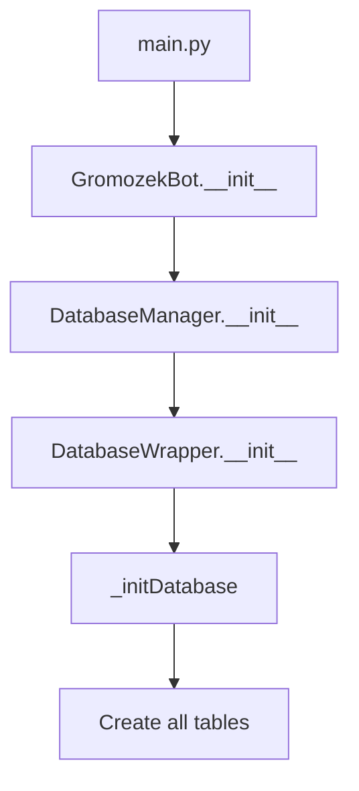
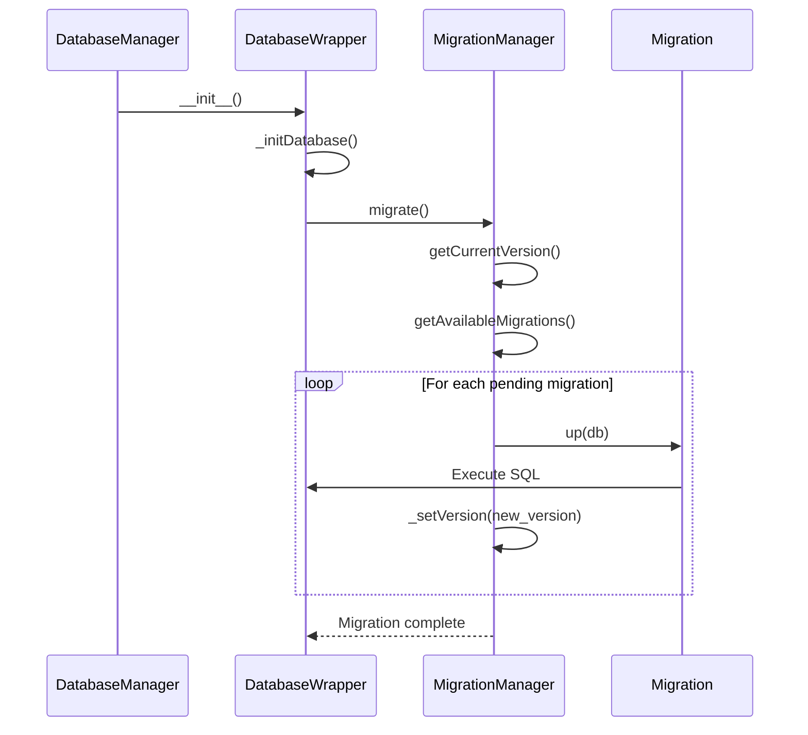
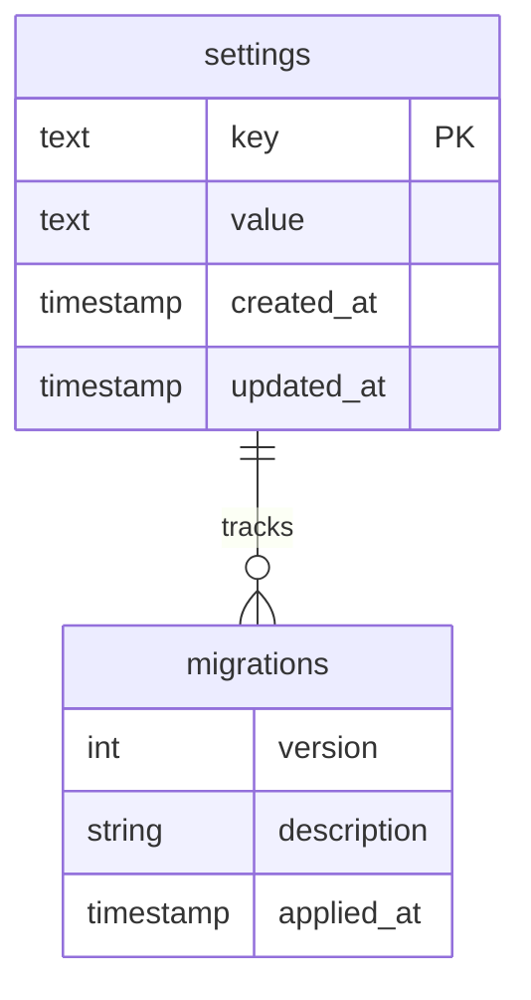
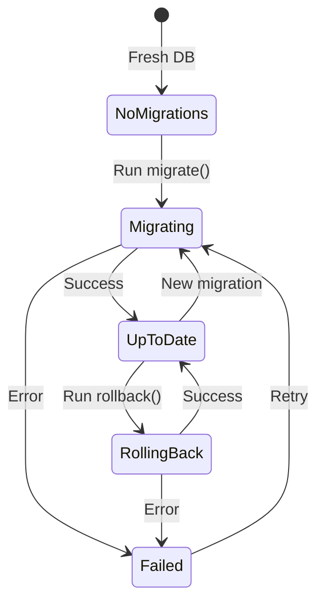

# Database Migrations Module Implementation Plan

**Project:** Gromozeka Telegram Bot  
**Task:** Add Database Migrations Module to `internal/database`  
**Date:** 2025-10-23  
**Status:** Planning Phase

---

## 1. Executive Summary

This plan outlines the implementation of a database migrations system for the Gromozeka bot, dood! The system will:
- Track migration versions using the existing `settings` table
- Support sequential migration execution
- Provide rollback capabilities
- Include example migrations
- Integrate seamlessly with the existing [`DatabaseWrapper`](internal/database/wrapper.py:77) initialization flow

---

## 2. Current State Analysis

### 2.1 Existing Database Infrastructure

**Database Wrapper** ([`internal/database/wrapper.py`](internal/database/wrapper.py:77))
- Uses SQLite with thread-local connections
- Implements context manager pattern for transactions
- Has [`_initDatabase()`](internal/database/wrapper.py:123) method that creates all tables
- Already has a [`settings`](internal/database/wrapper.py:127) table for key-value storage

**Database Manager** ([`internal/database/manager.py`](internal/database/manager.py:14))
- Initializes [`DatabaseWrapper`](internal/database/wrapper.py:77) with config
- Called from [`main.py`](main.py:40) during bot startup

**Settings Table Structure** (lines 127-136 in wrapper.py):
```sql
CREATE TABLE IF NOT EXISTS settings (
    key TEXT PRIMARY KEY,
    value TEXT,
    created_at TIMESTAMP DEFAULT CURRENT_TIMESTAMP,
    updated_at TIMESTAMP DEFAULT CURRENT_TIMESTAMP
)
```

### 2.2 Current Initialization Flow



### 2.3 Identified Challenges

1. **Existing Schema**: All tables are created in [`_initDatabase()`](internal/database/wrapper.py:123) - need to migrate this to migration files
2. **Backward Compatibility**: Must not break existing databases
3. **Migration Ordering**: Need deterministic execution order
4. **Error Handling**: Failed migrations should not corrupt database
5. **Testing**: Need to test both fresh installs and upgrades

---

## 3. Proposed Architecture

### 3.1 Module Structure

```
internal/database/
├── __init__.py
├── wrapper.py              # Existing
├── manager.py              # Existing - will be modified
├── models.py               # Existing
├── migrations/             # NEW
│   ├── __init__.py        # Migration registry and runner
│   ├── base.py            # Base migration class
│   ├── manager.py         # Migration manager
│   └── versions/          # Migration files
│       ├── __init__.py
│       ├── 001_initial_schema.py
│       └── 002_example_migration.py
```

### 3.2 Component Design

#### 3.2.1 Base Migration Class

**File:** `internal/database/migrations/base.py`

```python
from abc import ABC, abstractmethod
from typing import TYPE_CHECKING

if TYPE_CHECKING:
    from ..wrapper import DatabaseWrapper

class BaseMigration(ABC):
    """Base class for all database migrations, dood!"""
    
    # Migration metadata
    version: int
    description: str
    
    @abstractmethod
    def up(self, db: 'DatabaseWrapper') -> None:
        """Apply the migration"""
        pass
    
    @abstractmethod
    def down(self, db: 'DatabaseWrapper') -> None:
        """Rollback the migration"""
        pass
```

#### 3.2.2 Migration Manager

**File:** `internal/database/migrations/manager.py`

**Responsibilities:**
- Track current migration version in settings table
- Discover available migrations
- Execute migrations in order
- Handle migration failures
- Support rollback operations

**Key Methods:**
- [`getCurrentVersion()`](internal/database/migrations/manager.py:1) - Get current migration version from settings
- [`getAvailableMigrations()`](internal/database/migrations/manager.py:1) - List all migration classes
- [`migrate(targetVersion=None)`](internal/database/migrations/manager.py:1) - Run migrations up to target version
- [`rollback(steps=1)`](internal/database/migrations/manager.py:1) - Rollback N migrations
- [`_setVersion(version)`](internal/database/migrations/manager.py:1) - Update version in settings table

**Settings Table Keys:**
- `db_migration_version` - Current migration version (integer)
- `db_migration_last_run` - Timestamp of last migration

#### 3.2.3 Migration Registry

**File:** `internal/database/migrations/__init__.py`

**Purpose:** Central registry for all migrations

```python
from typing import List, Type
from .base import BaseMigration
from .versions import migration_001_initial_schema
from .versions import migration_002_example

# Registry of all migrations in order
MIGRATIONS: List[Type[BaseMigration]] = [
    migration_001_initial_schema.Migration001InitialSchema,
    migration_002_example.Migration002Example,
]
```

### 3.3 Migration Execution Flow



---

## 4. Implementation Details

### 4.1 Migration Version Tracking

**Storage:** Use existing [`settings`](internal/database/wrapper.py:127) table

**Keys:**
- `db_migration_version`: Current version (default: 0)
- `db_migration_last_run`: ISO timestamp of last migration

**Version Numbering:**
- Start at 1 (0 = no migrations run)
- Sequential integers (001, 002, 003, ...)
- Gaps not allowed

### 4.2 Migration File Naming Convention

**Format:** `{version:03d}_{description}.py`

**Examples:**
- `001_initial_schema.py`
- `002_add_user_preferences.py`
- `003_add_spam_detection_tables.py`

**Class Naming:** `Migration{version:03d}{PascalCaseDescription}`

**Examples:**
- `Migration001InitialSchema`
- `Migration002AddUserPreferences`

### 4.3 Initial Schema Migration

**File:** `internal/database/migrations/versions/001_initial_schema.py`

**Purpose:** Move existing table creation from [`_initDatabase()`](internal/database/wrapper.py:123) to first migration

**Strategy:**
1. Extract all `CREATE TABLE` statements from [`wrapper.py`](internal/database/wrapper.py:123)
2. Create [`Migration001InitialSchema`](internal/database/migrations/versions/001_initial_schema.py:1) class
3. Implement [`up()`](internal/database/migrations/base.py:1) method with table creation
4. Implement [`down()`](internal/database/migrations/base.py:1) method with table drops
5. Modify [`_initDatabase()`](internal/database/wrapper.py:123) to call migration manager

**Backward Compatibility:**
- Check if tables already exist before running migration
- If settings table exists and has data, assume database is initialized
- Set version to 1 automatically for existing databases

### 4.4 Example Migration

**File:** `internal/database/migrations/versions/002_example_migration.py`

**Purpose:** Demonstrate migration pattern with a simple example

**Example Changes:**
- Add a new column to an existing table
- Create a new simple table
- Add an index

**Example Implementation:**
```python
class Migration002Example(BaseMigration):
    version = 2
    description = "Add example feature table"
    
    def up(self, db: DatabaseWrapper) -> None:
        with db.getCursor() as cursor:
            # Add new table
            cursor.execute("""
                CREATE TABLE IF NOT EXISTS example_features (
                    id INTEGER PRIMARY KEY AUTOINCREMENT,
                    name TEXT NOT NULL,
                    enabled BOOLEAN DEFAULT TRUE,
                    created_at TIMESTAMP DEFAULT CURRENT_TIMESTAMP
                )
            """)
            
            # Add index
            cursor.execute("""
                CREATE INDEX IF NOT EXISTS idx_example_features_name 
                ON example_features(name)
            """)
    
    def down(self, db: DatabaseWrapper) -> None:
        with db.getCursor() as cursor:
            cursor.execute("DROP TABLE IF EXISTS example_features")
```

### 4.5 Integration with DatabaseWrapper

**Modify:** [`internal/database/wrapper.py`](internal/database/wrapper.py:77)

**Changes to [`_initDatabase()`](internal/database/wrapper.py:123):**

```python
def _initDatabase(self):
    """Initialize the database with required tables."""
    # Import here to avoid circular dependency
    from .migrations.manager import MigrationManager
    
    # Run migrations
    migrationManager = MigrationManager(self)
    migrationManager.migrate()
    
    # Note: All table creation moved to migrations
```

### 4.6 Error Handling Strategy

**Transaction Management:**
- Each migration runs in its own transaction
- Failed migration rolls back automatically
- Version not updated on failure

**Error Recovery:**
```python
try:
    migration.up(db)
    self._setVersion(migration.version)
except Exception as e:
    logger.error(f"Migration {migration.version} failed: {e}")
    # Transaction auto-rolled back by context manager
    raise MigrationError(f"Failed to apply migration {migration.version}") from e
```

**Logging:**
- Log start of each migration
- Log completion with timing
- Log errors with full traceback
- Store migration history in logs

---

## 5. Implementation Steps

### Phase 1: Core Infrastructure (Priority: High)

1. **Create migration module structure**
   - Create `internal/database/migrations/` directory
   - Create `__init__.py`, `base.py`, `manager.py`
   - Create `versions/` subdirectory

2. **Implement [`BaseMigration`](internal/database/migrations/base.py:1) class**
   - Define abstract interface
   - Add version and description attributes
   - Add type hints

3. **Implement [`MigrationManager`](internal/database/migrations/manager.py:1) class**
   - Version tracking methods
   - Migration discovery
   - Migration execution logic
   - Error handling

4. **Create migration registry**
   - Import all migrations
   - Maintain ordered list
   - Validate no duplicate versions

### Phase 2: Initial Migration (Priority: High)

5. **Create [`Migration001InitialSchema`](internal/database/migrations/versions/001_initial_schema.py:1)**
   - Extract table creation from [`wrapper.py`](internal/database/wrapper.py:123)
   - Implement [`up()`](internal/database/migrations/base.py:1) method
   - Implement [`down()`](internal/database/migrations/base.py:1) method
   - Add backward compatibility checks

6. **Modify [`DatabaseWrapper._initDatabase()`](internal/database/wrapper.py:123)**
   - Replace table creation with migration call
   - Keep settings table creation (needed for migration tracking)
   - Add migration manager initialization

### Phase 3: Example Migration (Priority: Medium)

7. **Create [`Migration002Example`](internal/database/migrations/versions/002_example_migration.py:1)**
   - Add example table
   - Add example index
   - Demonstrate best practices
   - Add comprehensive comments

### Phase 4: Testing & Documentation (Priority: High)

8. **Write unit tests**
   - Test migration manager
   - Test version tracking
   - Test rollback functionality
   - Test error handling

9. **Update documentation**
   - Add migration guide
   - Document how to create new migrations
   - Add troubleshooting section

10. **Integration testing**
    - Test fresh database initialization
    - Test upgrading existing database
    - Test migration failures
    - Test rollback scenarios

---

## 6. Migration Creation Guide

### 6.1 Creating a New Migration

**Step 1:** Determine next version number
```bash
# List existing migrations
ls internal/database/migrations/versions/
# Next version = highest + 1
```

**Step 2:** Create migration file
```bash
# Format: {version:03d}_{description}.py
touch internal/database/migrations/versions/003_add_new_feature.py
```

**Step 3:** Implement migration class
```python
from ..base import BaseMigration
from typing import TYPE_CHECKING

if TYPE_CHECKING:
    from ...wrapper import DatabaseWrapper

class Migration003AddNewFeature(BaseMigration):
    version = 3
    description = "Add new feature table"
    
    def up(self, db: 'DatabaseWrapper') -> None:
        """Apply migration"""
        with db.getCursor() as cursor:
            # Your SQL here
            pass
    
    def down(self, db: 'DatabaseWrapper') -> None:
        """Rollback migration"""
        with db.getCursor() as cursor:
            # Reverse SQL here
            pass
```

**Step 4:** Register migration
```python
# In internal/database/migrations/__init__.py
from .versions import migration_003_add_new_feature

MIGRATIONS = [
    # ... existing migrations ...
    migration_003_add_new_feature.Migration003AddNewFeature,
]
```

### 6.2 Migration Best Practices

**DO:**
- ✅ Use `IF NOT EXISTS` for CREATE statements
- ✅ Use `IF EXISTS` for DROP statements
- ✅ Test both [`up()`](internal/database/migrations/base.py:1) and [`down()`](internal/database/migrations/base.py:1) methods
- ✅ Keep migrations small and focused
- ✅ Add comments explaining complex changes
- ✅ Use transactions (automatic via [`getCursor()`](internal/database/wrapper.py:103))

**DON'T:**
- ❌ Modify existing migration files after deployment
- ❌ Skip version numbers
- ❌ Make migrations dependent on application code
- ❌ Include data migrations with schema changes (separate them)
- ❌ Use database-specific features (stick to SQLite standard)

---

## 7. Testing Strategy

### 7.1 Unit Tests

**File:** `internal/database/migrations/test_migrations.py`

**Test Cases:**
1. **Version Tracking**
   - Test [`getCurrentVersion()`](internal/database/migrations/manager.py:1) with no migrations
   - Test [`getCurrentVersion()`](internal/database/migrations/manager.py:1) after migrations
   - Test [`_setVersion()`](internal/database/migrations/manager.py:1)

2. **Migration Discovery**
   - Test [`getAvailableMigrations()`](internal/database/migrations/manager.py:1)
   - Test migration ordering
   - Test duplicate version detection

3. **Migration Execution**
   - Test running single migration
   - Test running multiple migrations
   - Test idempotency (running twice)
   - Test target version parameter

4. **Rollback**
   - Test single rollback
   - Test multiple rollbacks
   - Test rollback to version 0

5. **Error Handling**
   - Test failed migration rollback
   - Test version not updated on failure
   - Test recovery after failure

### 7.2 Integration Tests

**Scenarios:**
1. **Fresh Install**
   - Create new database
   - Run all migrations
   - Verify all tables exist
   - Verify version is correct

2. **Upgrade Path**
   - Create database with old schema
   - Run migrations
   - Verify schema updated
   - Verify data preserved

3. **Backward Compatibility**
   - Test with existing database
   - Verify no data loss
   - Verify version set correctly

---

## 8. Rollout Strategy

### 8.1 Deployment Phases

**Phase 1: Development (Week 1)**
- Implement core migration system
- Create initial schema migration
- Test with fresh databases

**Phase 2: Testing (Week 2)**
- Test with existing databases
- Verify backward compatibility
- Create example migration
- Write documentation

**Phase 3: Production (Week 3)**
- Deploy to production
- Monitor for issues
- Gather feedback

### 8.2 Rollback Plan

**If Issues Occur:**
1. Revert to previous version of code
2. Database will remain in migrated state (safe)
3. Old code should work with new schema (backward compatible)
4. Fix issues and redeploy

**Database Rollback:**
- Only if absolutely necessary
- Use [`rollback()`](internal/database/migrations/manager.py:1) method
- Test thoroughly before production rollback

---

## 9. Future Enhancements

### 9.1 Potential Features

1. **Migration Status Command**
   - CLI command to check migration status
   - Show pending migrations
   - Show migration history

2. **Data Migrations**
   - Separate data migration support
   - Bulk data transformation utilities
   - Progress tracking for large migrations

3. **Migration Validation**
   - Dry-run mode
   - Schema comparison
   - Automatic rollback on validation failure

4. **Migration Generator**
   - CLI tool to generate migration templates
   - Auto-increment version numbers
   - Boilerplate code generation

5. **Migration Locking**
   - Prevent concurrent migrations
   - Use database locks or file locks
   - Timeout handling

### 9.2 Advanced Features

1. **Branching Support**
   - Handle multiple development branches
   - Merge conflict detection
   - Branch-specific migrations

2. **Performance Optimization**
   - Batch migrations
   - Parallel execution (where safe)
   - Progress callbacks

3. **Monitoring & Alerting**
   - Migration duration tracking
   - Failure notifications
   - Performance metrics

---

## 10. Risk Assessment

### 10.1 Identified Risks

| Risk | Probability | Impact | Mitigation |
|------|-------------|--------|------------|
| Data loss during migration | Low | Critical | Transaction rollback, backups |
| Migration failure in production | Medium | High | Thorough testing, rollback plan |
| Backward compatibility issues | Medium | High | Compatibility checks, gradual rollout |
| Performance impact | Low | Medium | Test with production-size data |
| Concurrent migration execution | Low | High | Add locking mechanism |

### 10.2 Mitigation Strategies

1. **Automated Backups**
   - Backup before migrations
   - Keep multiple backup versions
   - Test restore procedures

2. **Comprehensive Testing**
   - Unit tests for all components
   - Integration tests for scenarios
   - Load testing with large datasets

3. **Monitoring**
   - Log all migration activities
   - Track migration duration
   - Alert on failures

4. **Documentation**
   - Clear migration guide
   - Troubleshooting procedures
   - Recovery instructions

---

## 11. Success Criteria

### 11.1 Functional Requirements

- ✅ Migrations execute in correct order
- ✅ Version tracking works correctly
- ✅ Rollback functionality works
- ✅ Backward compatible with existing databases
- ✅ Error handling prevents corruption
- ✅ Example migration demonstrates pattern

### 11.2 Non-Functional Requirements

- ✅ Migration execution < 5 seconds for typical migration
- ✅ Zero data loss during migrations
- ✅ 100% test coverage for migration manager
- ✅ Clear documentation for developers
- ✅ Logging provides audit trail

### 11.3 Acceptance Criteria

1. Fresh database initialization works
2. Existing database upgrade works
3. All tests pass
4. Documentation complete
5. Code review approved
6. Production deployment successful

---

## 12. Timeline Estimate

| Phase | Duration | Dependencies |
|-------|----------|--------------|
| Core Infrastructure | 2-3 days | None |
| Initial Migration | 1-2 days | Core Infrastructure |
| Example Migration | 1 day | Initial Migration |
| Testing | 2-3 days | All above |
| Documentation | 1-2 days | All above |
| **Total** | **7-11 days** | |

---

## 13. Open Questions

1. **Q:** Should we support downgrading to arbitrary versions?
   **A:** Start with simple rollback (N steps), add arbitrary version later if needed

2. **Q:** How to handle long-running migrations?
   **A:** Add progress logging, consider async execution for future

3. **Q:** Should migrations be reversible?
   **A:** Yes, all migrations should implement [`down()`](internal/database/migrations/base.py:1), but some may be no-ops

4. **Q:** How to handle migration conflicts in team environment?
   **A:** Use sequential numbering, coordinate through version control

5. **Q:** Should we validate schema after migration?
   **A:** Good idea for future enhancement, not in initial version

---

## 14. References

### 14.1 Internal Documentation

- [`internal/database/wrapper.py`](internal/database/wrapper.py:77) - Database wrapper implementation
- [`internal/database/manager.py`](internal/database/manager.py:14) - Database manager
- [`internal/database/models.py`](internal/database/models.py:1) - Database models

### 14.2 External Resources

- [SQLite Documentation](https://www.sqlite.org/docs.html)
- [Alembic Migrations](https://alembic.sqlalchemy.org/) - Reference implementation
- [Django Migrations](https://docs.djangoproject.com/en/stable/topics/migrations/) - Design patterns
- [Database Migration Best Practices](https://www.liquibase.org/get-started/best-practices)

---

## 15. Appendix

### 15.1 Example Migration Files

See implementation steps for detailed examples of:
- [`BaseMigration`](internal/database/migrations/base.py:1) class
- [`MigrationManager`](internal/database/migrations/manager.py:1) class
- [`Migration001InitialSchema`](internal/database/migrations/versions/001_initial_schema.py:1)
- [`Migration002Example`](internal/database/migrations/versions/002_example_migration.py:1)

### 15.2 Database Schema Diagram



### 15.3 Migration State Machine



---

**End of Plan**

*This plan will be updated as implementation progresses and new requirements emerge, dood!*