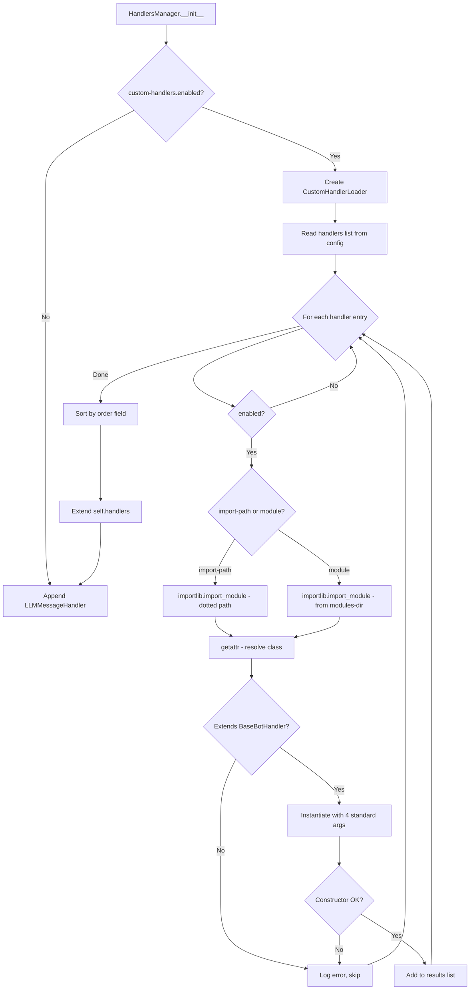

# Custom Handler Modules — Design Document

> **Status:** Draft  
> **Date:** 2026-03-29  
> **Scope:** Dynamic loading of custom handler modules via TOML configuration

---

## 1. Overview

This document describes the architecture for loading custom handler modules into the Gromozeka bot's handler chain via configuration. Custom modules extend [`BaseBotHandler`](internal/bot/common/handlers/base.py:110) and are inserted **after** all built-in handlers but **before** [`LLMMessageHandler`](internal/bot/common/handlers/llm_messages.py) — the catch-all that must always be last.

### Goals

- Allow users to add custom handlers without modifying core code
- Support two module sources: Python import paths and a local modules directory
- Provide ordering control between custom handlers
- Fail gracefully with clear error messages on misconfiguration
- Stay consistent with existing config-gated handler patterns

---

## 2. TOML Configuration Format

A new top-level `[custom-handlers]` section is added to the TOML config. This follows the same pattern as existing integrations like `[openweathermap]` and `[resender]` in [`configs/00-defaults/00-config.toml`](configs/00-defaults/00-config.toml:73).

### 2.1 Schema

```toml
[custom-handlers]
# Enable/disable the entire custom handler loading system
enabled = true

# Directory for local handler modules (relative to application root-dir)
# Files in this directory are auto-discovered if they are listed below
modules-dir = "custom_handlers"

# Each handler is defined as [[custom-handlers.handlers]]
[[custom-handlers.handlers]]
# Unique identifier for this handler (used in logs and error messages)
id = "my-greeting-handler"

# Module source — exactly one of "import-path" or "module" must be set:
#   import-path: fully qualified Python import path (for installed packages)
#   module: filename (without .py) inside modules-dir (for local files)
import-path = "my_package.handlers.GreetingHandler"
# module = "greeting_handler"   # alternative: loads from {modules-dir}/greeting_handler.py

# Class name to import from the module. Required when using "module" source.
# For "import-path", the last dotted component is treated as the class name
# unless "class" is explicitly set.
# class = "GreetingHandler"

# Handler parallelism: "sequential" or "parallel" (default: "parallel")
parallelism = "parallel"

# Order priority for sorting among custom handlers (default: 100)
# Lower numbers run first. Handlers with equal order keep config-file order.
order = 10

# Whether this handler is enabled (default: true)
enabled = true
```

### 2.2 Full Example

```toml
[custom-handlers]
enabled = true
modules-dir = "custom_handlers"

[[custom-handlers.handlers]]
id = "greeting-handler"
module = "greeting_handler"
class = "GreetingHandler"
parallelism = "parallel"
order = 10
enabled = true

[[custom-handlers.handlers]]
id = "audit-logger"
import-path = "audit_tools.handlers.AuditLogHandler"
parallelism = "sequential"
order = 20
enabled = true

[[custom-handlers.handlers]]
id = "disabled-experiment"
module = "experiment"
class = "ExperimentHandler"
enabled = false
```

### 2.3 Config Defaults File

A new defaults file is created at `configs/00-defaults/custom-handlers.toml`:

```toml
[custom-handlers]
enabled = false
modules-dir = "custom_handlers"
```

---

## 3. Module Loader Component

A new module [`internal/bot/common/handlers/module_loader.py`](internal/bot/common/handlers/module_loader.py) provides the loading logic.

### 3.1 Class Design

```
┌──────────────────────────────────────────┐
│         CustomHandlerLoader              │
├──────────────────────────────────────────┤
│ - configManager: ConfigManager           │
│ - database: DatabaseWrapper              │
│ - llmManager: LLMManager                │
│ - botProvider: BotProvider               │
│ - modulesDir: str                        │
├──────────────────────────────────────────┤
│ + loadAll: List[HandlerTuple]            │
│ - _loadSingle: HandlerTuple             │
│ - _importFromPath: type                  │
│ - _importFromLocalModule: type           │
│ - _validateHandlerClass: None            │
│ - _resolveClassName: str                 │
└──────────────────────────────────────────┘
```

### 3.2 `loadAll()` Method — Main Entry Point

```python
def loadAll(self) -> List[HandlerTuple]:
    """Load all enabled custom handlers from config, sorted by order.

    Returns:
        List of HandlerTuple - handler instance paired with parallelism setting.
    """
```

**Algorithm:**

1. Read `custom-handlers` config section via `configManager.get("custom-handlers", {})`
2. If not `enabled`, return empty list
3. Resolve `modules-dir` path (relative to working directory)
4. Add `modules-dir` to `sys.path` if not already present (for local imports)
5. Iterate over `handlers` list entries
6. Skip entries where `enabled` is `False`
7. For each entry, call `_loadSingle()` — wrapped in try/except for per-handler error isolation
8. Sort loaded handlers by `order` field (stable sort preserves config order for equal values)
9. Return sorted `List[HandlerTuple]`

### 3.3 `_loadSingle()` Method — Per-Handler Loading

```python
def _loadSingle(self, handlerConfig: Dict[str, Any]) -> HandlerTuple:
    """Load a single custom handler from its config entry.

    Args:
        handlerConfig: Dict with handler configuration from TOML.

    Returns:
        HandlerTuple with instantiated handler and parallelism.

    Raises:
        CustomHandlerLoadError: On any loading/validation failure.
    """
```

**Steps:**

1. Validate that exactly one of `import-path` or `module` is set
2. Resolve the class:
   - **`import-path`**: Use `importlib.import_module()` on the module portion, then `getattr()` for the class
   - **`module`**: Use `importlib.import_module()` on the module name (requires `modules-dir` in `sys.path`), then `getattr()` for the `class` field
3. Call `_validateHandlerClass()` to verify inheritance
4. Instantiate with standard 4-arg constructor: `(configManager, database, llmManager, botProvider)`
5. Resolve parallelism string to [`HandlerParallelism`](internal/bot/common/handlers/manager.py:64) enum
6. Return `(handlerInstance, parallelism)`

### 3.4 `_validateHandlerClass()` — Validation

Checks performed:

| Check | Error if fails |
|-------|---------------|
| Class is a type (not instance) | `"{id}": expected a class, got {type}` |
| Subclass of `BaseBotHandler` | `"{id}": {cls} does not extend BaseBotHandler` |
| Constructor accepts 4 positional args | `"{id}": constructor signature mismatch` |

Constructor signature validation uses `inspect.signature()` to verify the class accepts `(configManager, database, llmManager, botProvider)` — or at minimum 4 positional parameters after `self`.

---

## 4. Local Modules Directory Convention

```
storage/                    # application root-dir
├── custom_handlers/        # modules-dir (configurable)
│   ├── __init__.py         # optional, not required
│   ├── greeting_handler.py # contains GreetingHandler class
│   └── audit_handler.py    # contains AuditLogHandler class
├── bot_data.db
└── ...
```

- The directory path is resolved relative to the application's working directory (after `root-dir` chdir in [`ConfigManager.__init__`](internal/config/manager.py:71))
- Each `.py` file is a standalone module; no package structure required
- The directory is added to `sys.path` at load time so `importlib.import_module()` can find modules by name
- The directory is **not** auto-scanned — only modules explicitly listed in `[[custom-handlers.handlers]]` are loaded

---

## 5. Ordering

### 5.1 Between Custom Handlers

Each handler entry has an `order` field (default: `100`). Custom handlers are sorted by `order` ascending using a **stable sort**, so handlers with the same `order` preserve their declaration order from the config.

### 5.2 Relative to Built-in Handlers

Custom handlers are always placed in a fixed position in the chain:

```
┌─────────────────────────────────┐
│ 1. MessagePreprocessorHandler   │ SEQUENTIAL - always first
│ 2. SpamHandler                  │ SEQUENTIAL - always second
│ 3. ConfigureCommandHandler      │ PARALLEL
│ 4. SummarizationHandler         │ PARALLEL
│ 5. UserDataHandler              │ PARALLEL
│ 6. DevCommandsHandler           │ PARALLEL
│ 7. MediaHandler                 │ PARALLEL
│ 8. CommonHandler                │ PARALLEL
│ 9. HelpHandler                  │ PARALLEL
│ 10. [Platform-specific]         │ PARALLEL (Telegram-only)
│ 11. [Config-gated built-ins]    │ PARALLEL (Weather, Yandex, Resender)
├─────────────────────────────────┤
│ 12+ Custom Handlers             │ ◄── inserted here, sorted by order
├─────────────────────────────────┤
│ LAST. LLMMessageHandler         │ SEQUENTIAL - always last
└─────────────────────────────────┘
```

This is non-negotiable: custom handlers cannot be placed before built-in handlers or after `LLMMessageHandler`.

---

## 6. Error Handling

All errors during custom handler loading are **non-fatal** to the bot — a failing custom handler must not prevent the bot from starting. Errors are logged at `ERROR` level with the handler's `id` for easy identification.

### 6.1 Error Scenarios

| Scenario | Behavior |
|----------|----------|
| `custom-handlers.enabled = false` | Skip silently, no handlers loaded |
| `modules-dir` doesn't exist | Log warning, proceed (import-path handlers still work) |
| Neither `import-path` nor `module` set | Log error with handler `id`, skip handler |
| Both `import-path` and `module` set | Log error with handler `id`, skip handler |
| Module not found / `ImportError` | Log error with full traceback, skip handler |
| Class not found in module | Log error, skip handler |
| Class doesn't extend `BaseBotHandler` | Log error, skip handler |
| Constructor raises exception | Log error with full traceback, skip handler |
| Invalid `parallelism` value | Log warning, default to `PARALLEL` |
| Missing `id` field | Log error, skip handler (use index as fallback identifier in log) |
| Duplicate `id` values | Log warning, load both (id is informational, not a unique key) |

### 6.2 Custom Exception

```python
class CustomHandlerLoadError(Exception):
    """Raised when a custom handler fails to load.

    Attributes:
        handlerId: The id of the handler that failed.
        reason: Human-readable description of the failure.
    """

    def __init__(self, handlerId: str, reason: str):
        self.handlerId = handlerId
        self.reason = reason
        super().__init__(f"Failed to load custom handler '{handlerId}': {reason}")
```

---

## 7. Integration Points in HandlersManager

The changes to [`HandlersManager.__init__`](internal/bot/common/handlers/manager.py:185) are minimal — just insert the loader call between the config-gated built-ins and the final `LLMMessageHandler` append.

### 7.1 Code Integration Point

In [`manager.py`](internal/bot/common/handlers/manager.py:311), right before the `LLMMessageHandler` append (line 313):

```python
        # ... existing config-gated handlers (weather, yandex, resender) ...

        # Load custom handlers from config
        from .module_loader import CustomHandlerLoader

        customLoader = CustomHandlerLoader(
            configManager=configManager,
            database=database,
            llmManager=llmManager,
            botProvider=botProvider,
        )
        customHandlers = customLoader.loadAll()
        if customHandlers:
            logger.info(f"Loaded {len(customHandlers)} custom handler(s)")
            self.handlers.extend(customHandlers)

        self.handlers.append(
            # Should be last messageHandler as it can handle any message
            (LLMMessageHandler(configManager, database, llmManager, botProvider), HandlerParallelism.SEQUENTIAL)
        )
```

### 7.2 Import Addition

Add a new import to [`manager.py`](internal/bot/common/handlers/manager.py) — the `CustomHandlerLoader` is imported inline (inside `__init__`) to avoid circular imports and to make the feature fully optional.

### 7.3 No Changes to Other Files

- [`BaseBotHandler`](internal/bot/common/handlers/base.py:110) — no changes needed
- [`ConfigManager`](internal/config/manager.py:59) — no changes needed (uses existing `get()` method)
- [`HandlerParallelism`](internal/bot/common/handlers/manager.py:64) — no changes needed

---

## 8. Example Custom Module

File: `custom_handlers/greeting_handler.py`

```python
"""
Custom greeting handler for Gromozeka bot.

Responds with a greeting when a user sends /hello command.
"""

import logging
from typing import Optional

from internal.bot.common.handlers.base import BaseBotHandler, HandlerResultStatus
from internal.bot.common.models import UpdateObjectType
from internal.bot.common.typing_manager import TypingManager
from internal.bot.models import (
    BotProvider,
    CommandCategory,
    CommandHandlerOrder,
    CommandPermission,
    EnsuredMessage,
    commandHandlerV2,
)
from internal.config.manager import ConfigManager
from internal.database.models import MessageCategory
from internal.database.wrapper import DatabaseWrapper
from lib.ai import LLMManager

logger = logging.getLogger(__name__)


class GreetingHandler(BaseBotHandler):
    """Custom handler that adds a /hello greeting command."""

    def __init__(
        self,
        configManager: ConfigManager,
        database: DatabaseWrapper,
        llmManager: LLMManager,
        botProvider: BotProvider,
    ):
        """Initialize greeting handler.

        Args:
            configManager: Configuration manager instance.
            database: Database wrapper for persistence.
            llmManager: LLM manager for AI features.
            botProvider: Bot provider type.
        """
        super().__init__(
            configManager=configManager,
            database=database,
            llmManager=llmManager,
            botProvider=botProvider,
        )
        logger.info("GreetingHandler initialized!")

    async def newMessageHandler(
        self, ensuredMessage: EnsuredMessage, updateObj: UpdateObjectType
    ) -> HandlerResultStatus:
        """Process incoming messages — skip all, commands handled separately.

        Args:
            ensuredMessage: The incoming message.
            updateObj: Raw update object from platform.

        Returns:
            HandlerResultStatus.SKIPPED always.
        """
        return HandlerResultStatus.SKIPPED

    @commandHandlerV2(
        commands=("hello",),
        shortDescription="- say hello",
        helpMessage="Sends a friendly greeting!",
        visibility={CommandPermission.DEFAULT},
        availableFor={CommandPermission.DEFAULT},
        helpOrder=CommandHandlerOrder.OTHER,
        category=CommandCategory.TOOLS,
    )
    async def helloCommand(
        self,
        ensuredMessage: EnsuredMessage,
        command: str,
        args: str,
        updateObj: UpdateObjectType,
        typingManager: Optional[TypingManager],
    ) -> None:
        """Handle /hello command.

        Args:
            ensuredMessage: The command message.
            command: Command name.
            args: Command arguments.
            updateObj: Raw update object.
            typingManager: Optional typing indicator manager.
        """
        name = args.strip() if args.strip() else ensuredMessage.sender.name
        await self.sendMessage(
            ensuredMessage,
            messageText=f"Hello, **{name}**! 👋",
            messageCategory=MessageCategory.BOT_COMMAND_REPLY,
        )
```

### Config for the example:

```toml
[custom-handlers]
enabled = true

[[custom-handlers.handlers]]
id = "greeting"
module = "greeting_handler"
class = "GreetingHandler"
order = 10
```

---

## 9. File Changes Summary

| File | Change |
|------|--------|
| `internal/bot/common/handlers/module_loader.py` | **New file** — `CustomHandlerLoader` class and `CustomHandlerLoadError` exception |
| `internal/bot/common/handlers/manager.py` | ~10 lines added in `__init__` between config-gated handlers and LLMMessageHandler |
| `configs/00-defaults/custom-handlers.toml` | **New file** — default config with `enabled = false` |
| `custom_handlers/` | **New directory** — convention for local handler modules (user-created) |

---

## 10. Flow Diagram


