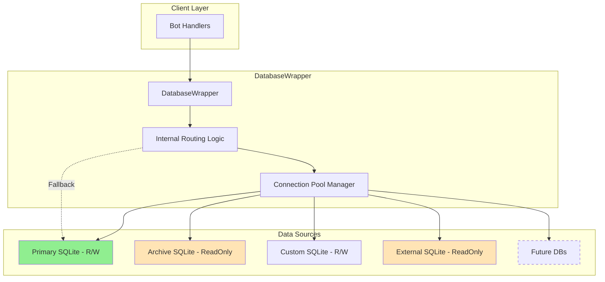

# Multi-Source Database Architecture Design v2

**Date Created:** 2025-11-30  
**Author:** Architect Mode  
**Purpose:** Revised design for supporting multiple data sources without circular dependencies

## Executive Summary

Simplified architecture for supporting multiple SQLite databases with readonly support and optional data source selection on read operations. No decorators, no circular dependencies - just clean, simple routing logic.

## Key Changes from v1

1. **Eliminated circular dependency** - Single DatabaseWrapper manages all connections internally
2. **Removed decorator pattern** - Simple method-level routing logic
3. **Added readonly support** - Data sources can be marked as readonly
4. **Added dataSource parameter** - All read methods accept optional dataSource parameter

## Architecture Overview



## Core Design Principles

### 1. Single DatabaseWrapper Class
- Manages all data source connections internally
- No external router class - routing logic is internal
- No circular dependencies

### 2. Connection Pool Manager (Internal)
- Simple dictionary of connection pools
- Key: source name, Value: connection details
- Thread-safe connection management per source

### 3. Routing Logic (Internal)
- Simple if/else logic in each method
- Priority order:
  1. Explicit dataSource parameter (if provided)
  2. ChatId mapping (for chat-specific methods)
  3. Default source fallback

## Implementation Structure

### Configuration Schema

```python
# config.toml or environment
DATA_SOURCES = {
    "primary": {
        "type": "sqlite",
        "path": "bot.db",
        "readonly": False,  # Can read and write
        "options": {
            "timeout": 30.0,
            "maxConnections": 5
        }
    },
    "archive": {
        "type": "sqlite",
        "path": "archive.db", 
        "readonly": True,   # Only read operations allowed
        "options": {
            "timeout": 30.0,
            "maxConnections": 3
        }
    },
    "external_bot": {
        "type": "sqlite",
        "path": "/shared/other_bot.db",
        "readonly": True,   # External data, readonly
        "options": {
            "timeout": 10.0,
            "maxConnections": 2
        }
    }
}

# Chat to source mapping
CHAT_SOURCE_MAPPING = {
    123456: "archive",
    789012: "archive"
}

# Default source for operations
DEFAULT_SOURCE = "primary"
DEFAULT_READONLY_SOURCE = "primary"  # For read operations without specific source
```

### Modified DatabaseWrapper Class

```python
class DatabaseWrapper:
    """
    Single wrapper managing multiple data sources internally.
    No external dependencies, no circular imports.
    """
    
    def __init__(self, config: Dict[str, Any]):
        self._sources = {}  # source_name -> connection_details
        self._connections = {}  # source_name -> connection_pool
        self._chatMapping = {}  # chatId -> source_name
        self._defaultSource = "primary"
        self._initializeSources(config)
    
    def _initializeSources(self, config: Dict[str, Any]):
        """Initialize all data sources from configuration"""
        for sourceName, sourceConfig in config["sources"].items():
            self._sources[sourceName] = sourceConfig
            self._connections[sourceName] = self._createConnectionPool(sourceConfig)
        
        self._chatMapping = config.get("chat_mapping", {})
        self._defaultSource = config.get("default_source", "primary")
    
    def _getConnection(self, 
                       chatId: Optional[int] = None,
                       dataSource: Optional[str] = None,
                       requireWrite: bool = False) -> sqlite3.Connection:
        """
        Get connection based on priority:
        1. Explicit dataSource parameter
        2. ChatId mapping
        3. Default source
        
        Args:
            chatId: Optional chat ID for routing
            dataSource: Optional explicit data source name
            requireWrite: If True, verify source allows writes
        
        Returns:
            Connection to appropriate data source
        
        Raises:
            ValueError: If readonly source requested for write operation
        """
        # Determine source name
        sourceName = self._defaultSource
        
        if dataSource:
            # Explicit source takes priority
            sourceName = dataSource
        elif chatId and chatId in self._chatMapping:
            # Chat-specific mapping
            sourceName = self._chatMapping[chatId]
        
        # Validate write permission if needed
        if requireWrite and self._sources[sourceName].get("readonly", False):
            raise ValueError(f"Cannot write to readonly source: {sourceName}")
        
        # Return connection from pool
        return self._connections[sourceName].getConnection()
```

## Method Signature Updates

### Read Methods (Accept Optional dataSource)

```python
# Before
def getChatMessageByMessageId(self, chatId: int, messageId: MessageIdType):
    ...

# After
def getChatMessageByMessageId(self, chatId: int, messageId: MessageIdType, 
                              dataSource: Optional[str] = None):
    """
    Get message by ID.
    
    Args:
        chatId: Chat identifier
        messageId: Message identifier
        dataSource: Optional specific data source to query
    """
    conn = self._getConnection(chatId=chatId, dataSource=dataSource)
    ...

# Cross-chat read methods
def getUserChats(self, userId: int, dataSource: Optional[str] = None):
    """
    Get all chats for user.
    Can specify source or will aggregate from all sources.
    """
    if dataSource:
        # Query specific source
        conn = self._getConnection(dataSource=dataSource)
        ...
    else:
        # Aggregate from all sources
        results = []
        for sourceName in self._sources:
            if not self._sources[sourceName].get("readonly", False):
                conn = self._getConnection(dataSource=sourceName)
                results.extend(self._queryUserChats(conn, userId))
        return self._deduplicateResults(results)
```

### Write Methods (No dataSource Parameter)

```python
def updateChatUser(self, chatId: int, userId: int, username: str, fullName: str):
    """
    Update user info - always writes to chat's designated source.
    No dataSource parameter for write operations.
    """
    conn = self._getConnection(chatId=chatId, requireWrite=True)
    ...
```

## Readonly Source Handling

### Write Operation Protection

```python
def setChatSetting(self, chatId: int, key: str, value: Any) -> bool:
    """Write operations check for readonly flag"""
    try:
        conn = self._getConnection(chatId=chatId, requireWrite=True)
        # Proceed with write
    except ValueError as e:
        logger.error(f"Write to readonly source attempted: {e}")
        return False
```

### Readonly Source Use Cases

1. **Archive Database**: Historical data, readonly
2. **External Bot Database**: Shared data from another bot, readonly  
3. **Replica Database**: Read-only replica for load distribution
4. **Analytics Database**: Optimized for read queries

## Migration Strategy

### Phase 1: Backward Compatible Mode
```python
class DatabaseWrapper:
    def __init__(self, dbPath: Optional[str] = None, config: Optional[Dict] = None):
        if config:
            # New multi-source mode
            self._multiSourceMode = True
            self._initializeSources(config)
        else:
            # Legacy single database mode
            self._multiSourceMode = False
            self._legacyPath = dbPath
            self._legacyConnection = sqlite3.connect(dbPath)
```

### Phase 2: Method Updates
1. Add optional dataSource parameter to all read methods
2. Update internal routing logic
3. Maintain backward compatibility

### Phase 3: Testing & Rollout
1. Test with single source (legacy mode)
2. Test with multiple sources
3. Test readonly enforcement
4. Gradual rollout with feature flag

## Example Usage

### Basic Usage
```python
# Initialize with config
config = load_config("database.toml")
db = DatabaseWrapper(config=config)

# Read from default source for chat
messages = db.getChatMessagesByUser(chatId=12345, userId=67890)

# Read from specific source
archived = db.getChatMessagesByUser(
    chatId=12345, 
    userId=67890,
    dataSource="archive"
)

# Cross-bot communication - read from external bot's database
external_data = db.getUserData(
    userId=11111,
    chatId=22222,
    dataSource="external_bot"  # Readonly external source
)
```

### Advanced Cross-Bot Communication
```python
# Bot A writes to its database
botA_db.addUserData(userId=123, chatId=456, key="preference", data="value")

# Bot B reads from Bot A's database (configured as readonly source)
preference = botB_db.getUserData(
    userId=123,
    chatId=456, 
    dataSource="bot_a_db"  # Readonly external source
)
```

## Benefits of This Design

1. **No Circular Dependencies**: Single class manages everything internally
2. **Simple Implementation**: No complex decorators or patterns
3. **Flexible Routing**: Explicit source selection for any read operation
4. **Readonly Safety**: Write operations protected at connection level
5. **Cross-Bot Communication**: Easy to read data from other bot databases
6. **Backward Compatible**: Can work in legacy single-database mode
7. **Extensible**: Easy to add new database types in future

## Performance Considerations

- Connection pooling per source (no connection creation overhead)
- Cached routing decisions (minimal lookup time)
- Lazy connection initialization (sources connected only when used)
- Estimated overhead: <0.5ms per routing decision

## Security Considerations

- Readonly enforcement at connection level
- No accidental writes to external sources
- Clear audit trail of cross-source operations
- Optional access logging per source

## Success Metrics

1. Zero circular dependency issues
2. 100% backward compatibility
3. <0.5ms routing overhead
4. Readonly enforcement working correctly
5. Cross-bot data sharing functional
6. No breaking changes to existing code

---

**Next Steps**:
1. Review and approve revised design
2. Update implementation plan
3. Begin implementation with backward compatibility
4. Test thoroughly with multiple scenarios