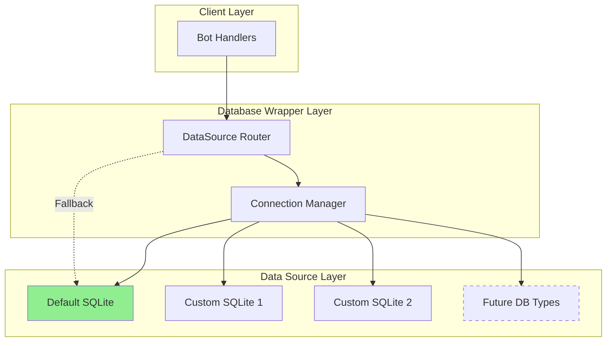

# Multi-Source Database Architecture Design

**Date Created:** 2025-11-30
**Author:** Architect Mode
**Purpose:** Design a simple, extensible architecture for supporting multiple data sources per chat

## Executive Summary

This document outlines the architecture for enabling different chats to use different database sources while maintaining simplicity and extensibility. The initial implementation focuses on multiple SQLite database files with a clear path for future database type support.

## Design Goals

1. **Simplicity**: Keep the implementation straightforward and maintainable
2. **Backward Compatibility**: Existing functionality must continue working without changes
3. **Extensibility**: Easy to add support for different database types in the future
4. **Performance**: Minimal overhead for routing and connection management
5. **Reliability**: Robust fallback mechanism to ensure system stability

## Architecture Overview



## Core Components

### 1. DataSource Configuration

**Location**: Configuration in TOML or environment variables

```python
# Example configuration structure
DATA_SOURCES = {
    "default": {
        "type": "sqlite",
        "path": "bot.db",
        "options": {
            "timeout": 30.0,
            "maxConnections": 5
        }
    },
    "custom_chats": {
        "type": "sqlite", 
        "path": "custom_chats.db",
        "options": {
            "timeout": 30.0,
            "maxConnections": 3
        }
    }
}

# Chat-to-source mapping
CHAT_SOURCE_MAPPING = {
    # chatId: sourceName
    123456: "custom_chats",
    789012: "custom_chats",
    # All other chats use "default"
}
```

### 2. Connection Manager

**Responsibilities**:
- Maintain connection pools per data source
- Handle connection lifecycle (create, reuse, close)
- Thread-safe connection management

```python
class ConnectionManager:
    """Manages connections to multiple data sources"""
    
    def __init__(self):
        self._sources = {}  # sourceName -> DatabaseWrapper
        self._lock = threading.Lock()
    
    def registerSource(self, name: str, config: dict):
        """Register a new data source"""
        
    def getSource(self, name: str) -> DatabaseWrapper:
        """Get or create connection to named source"""
        
    def closeAll(self):
        """Close all managed connections"""
```

### 3. DataSource Router

**Responsibilities**:
- Map chatId to appropriate data source
- Handle fallback to default source
- Provide transparent routing for all methods

```python
class DataSourceRouter:
    """Routes database operations to appropriate data source"""
    
    def __init__(self, connectionManager: ConnectionManager):
        self._manager = connectionManager
        self._mapping = {}  # chatId -> sourceName
        self._defaultSource = "default"
    
    def getSourceForChat(self, chatId: Optional[int]) -> DatabaseWrapper:
        """Get appropriate data source for chat"""
        if chatId and chatId in self._mapping:
            sourceName = self._mapping[chatId]
            return self._manager.getSource(sourceName)
        return self._manager.getSource(self._defaultSource)
    
    def routeToSource(self, chatId: Optional[int]):
        """Decorator for routing methods to appropriate source"""
```

### 4. Modified DatabaseWrapper

**Changes Required**:
- Extract connection management to ConnectionManager
- Make DatabaseWrapper stateless (or per-source state only)
- Add routing decorator to chat-specific methods

```python
class DatabaseWrapper:
    """Modified wrapper to support multi-source routing"""
    
    def __init__(self, dbPath: str, router: Optional[DataSourceRouter] = None):
        self._dbPath = dbPath
        self._router = router or self._createDefaultRouter()
    
    @routeToSource
    def getChatMessageByMessageId(self, chatId: int, messageId: MessageIdType):
        # Method automatically routed to correct source
        # Implementation remains the same
        pass
```

## Implementation Strategy

### Phase 1: Infrastructure Setup
1. Create ConnectionManager class
2. Create DataSourceRouter class
3. Add configuration loading mechanism
4. Set up logging and monitoring

### Phase 2: DatabaseWrapper Refactoring
1. Extract connection logic to ConnectionManager
2. Add routing decorators to chat-specific methods
3. Update initialization to support router injection
4. Ensure backward compatibility

### Phase 3: Testing and Validation
1. Unit tests for new components
2. Integration tests for multi-source scenarios
3. Performance testing for routing overhead
4. Fallback mechanism testing

## Method Routing Strategy

### Chat-Specific Methods (Use Routing)
These methods will be decorated with `@routeToSource`:
- All methods in Category 1 from the analysis document
- Methods that accept chatId as parameter

### Cross-Chat Methods (Special Handling)
These methods need special consideration:
- `getUserChats()`: Query all sources and merge results
- `getAllGroupChats()`: Query all sources and merge results  
- `getSpamMessages()`: Query all sources or use central source

### System-Wide Methods (Use Default Source)
These methods always use the default source:
- System settings management
- Cache management
- Delayed tasks
- Media management (shared resource)

## Configuration Examples

### Simple Two-Database Setup
```toml
[database]
default_source = "primary"

[database.sources.primary]
type = "sqlite"
path = "bot.db"
timeout = 30.0
max_connections = 5

[database.sources.archive]
type = "sqlite"
path = "archive.db"
timeout = 30.0
max_connections = 3

[database.chat_mapping]
# Old/archived chats use archive database
-1001234567890 = "archive"
-1009876543210 = "archive"
```

### Future Multi-Type Setup
```toml
[database.sources.primary]
type = "postgresql"
host = "localhost"
port = 5432
database = "bot_main"

[database.sources.cache]
type = "redis"
host = "localhost"
port = 6379
```

## Error Handling and Fallback

### Connection Failures
1. Try to connect to mapped source
2. If failed, log error and try default source
3. If default fails, raise critical error

### Missing Mappings
1. Check chat mapping
2. If not found, use default source
3. Log mapping miss for monitoring

### Source Unavailable
1. Mark source as temporarily unavailable
2. Route to default source
3. Retry connection periodically

## Migration Path

### Step 1: Backward Compatible Implementation
- Add new components without breaking existing code
- Use feature flag to enable multi-source support
- Default behavior unchanged

### Step 2: Gradual Migration
- Move specific chats to separate databases
- Monitor performance and stability
- Adjust configuration as needed

### Step 3: Full Deployment
- Enable multi-source by default
- Document configuration options
- Provide migration tools

## Performance Considerations

### Connection Pooling
- Separate pools per data source
- Configurable pool sizes
- Connection reuse within same thread

### Routing Overhead
- Cached routing decisions
- Minimal lookup time (O(1) hash lookup)
- No impact on query execution

### Memory Usage
- Multiple connection pools
- Cached routing table
- Estimated overhead: ~1MB per source

## Security Considerations

### Access Control
- Per-source access credentials (future)
- Read/write permissions per source
- Audit logging for source access

### Data Isolation
- Chats in different sources are isolated
- No cross-source queries by default
- Explicit permission for cross-source operations

## Testing Strategy

### Unit Tests
```python
def test_router_returns_correct_source():
    """Test that router returns correct source for chatId"""
    
def test_fallback_to_default():
    """Test fallback mechanism when source unavailable"""
    
def test_connection_pooling():
    """Test connection reuse and pooling"""
```

### Integration Tests
```python
def test_multi_source_operations():
    """Test operations across multiple sources"""
    
def test_source_failure_handling():
    """Test system behavior when source fails"""
```

## Future Enhancements

### Near-term (v2)
- PostgreSQL/MySQL support
- Dynamic source configuration (no restart required)
- Per-source monitoring metrics

### Long-term (v3+)
- Distributed database support
- Read/write splitting
- Automatic sharding based on chatId
- Cloud database support (DynamoDB, Firestore)

## Decision Rationale

### Why Router Pattern?
- Clean separation of concerns
- Easy to test and maintain
- Minimal changes to existing code
- Flexible for future requirements

### Why Keep It Simple?
- Reduces complexity and bugs
- Easier to understand and maintain
- Faster initial implementation
- Can be enhanced incrementally

### Why SQLite First?
- Current system uses SQLite
- No additional dependencies
- Proves the concept
- Easy migration path

## Risks and Mitigations

| Risk | Impact | Mitigation |
|------|--------|------------|
| Performance degradation | Medium | Connection pooling, caching |
| Configuration complexity | Low | Clear documentation, examples |
| Migration issues | Medium | Backward compatibility, gradual rollout |
| Source synchronization | High | Not supported initially, document limitations |

## Success Metrics

1. **Zero downtime** during migration
2. **<1ms routing overhead** per operation
3. **100% backward compatibility** maintained
4. **Support 10+ data sources** simultaneously
5. **<5% memory overhead** for routing

---

**Next Steps**:
1. Review and approve design
2. Create detailed implementation plan
3. Begin Phase 1 implementation
4. Set up testing infrastructure