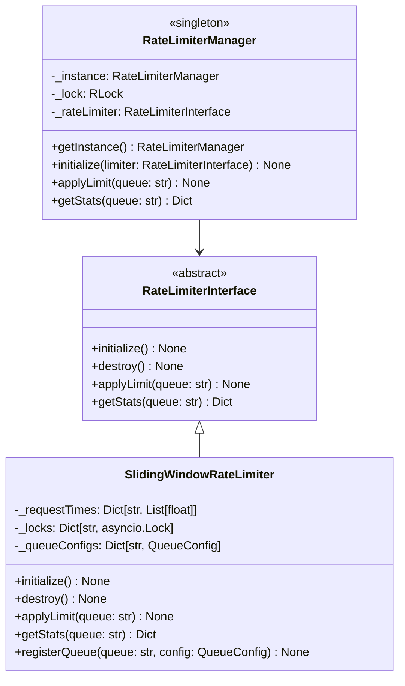

# Rate Limiter Library Design Document

**Task**: Design and implement a reusable rate limiter library for the Gromozeka project  
**Location**: `lib/rate_limiter/`  
**Author**: SourceCraft Code Assistant (Prinny Mode)  
**Date**: 2025-11-12  
**Status**: Design Phase

---

## 1. Overview

This document describes the design for a reusable rate limiter library that will be placed in `lib/rate_limiter/`. The library will provide a base interface and a simple sliding window implementation, supporting multiple queues and following the singleton pattern used throughout the project, dood!

### 1.1 Goals

- Create a reusable, thread-safe rate limiter library
- Support multiple independent rate limit queues (e.g., API calls, database operations, etc.)
- Provide a clean interface for easy extension
- Follow existing project patterns (singleton, async/await, ABC interfaces)
- Extract and improve the rate limiting logic from [`lib/yandex_search/client.py`](lib/yandex_search/client.py:463-518)

### 1.2 Non-Goals

- Distributed rate limiting across multiple processes/servers
- Redis-based or database-backed rate limiting
- Complex rate limiting algorithms (token bucket, leaky bucket, etc.)

---

## 2. Architecture

### 2.1 Component Structure

```
lib/rate_limiter/
├── __init__.py              # Package exports
├── interface.py             # Abstract base class for rate limiters
├── sliding_window.py        # Sliding window implementation
├── manager.py               # Singleton manager for multiple queues
└── README.md                # Usage documentation
```

### 2.2 Class Hierarchy



---

## 3. Detailed Design

### 3.1 Base Interface (`interface.py`)

The base interface defines the contract that all rate limiter implementations must follow, dood!

```python
from abc import ABC, abstractmethod
from typing import Any, Dict, Optional


class RateLimiterInterface(ABC):
    """
    Abstract base class for rate limiter implementations.
    
    All rate limiters must implement initialization, destruction,
    rate limiting application, and statistics retrieval methods.
    Supports multiple independent queues for different purposes.
    """
    
    @abstractmethod
    async def initialize(self) -> None:
        """
        Initialize the rate limiter.
        
        This method should set up any necessary resources,
        data structures, or connections needed for rate limiting.
        Called once during setup.
        """
        pass
    
    @abstractmethod
    async def destroy(self) -> None:
        """
        Clean up rate limiter resources.
        
        This method should release any resources, close connections,
        and perform cleanup operations. Called during shutdown.
        """
        pass
    
    @abstractmethod
    async def applyLimit(self, queue: str = "default") -> None:
        """
        Apply rate limiting for the specified queue.
        
        This method blocks (sleeps) if the rate limit has been exceeded,
        ensuring that the caller respects the configured limits.
        
        Args:
            queue: Name of the queue to apply rate limiting to.
                   Different queues can have different rate limits.
        
        Raises:
            ValueError: If the queue is not registered
        """
        pass
    
    @abstractmethod
    def getStats(self, queue: str = "default") -> Dict[str, Any]:
        """
        Get current rate limiting statistics for a queue.
        
        Args:
            queue: Name of the queue to get statistics for
        
        Returns:
            Dictionary containing rate limit statistics:
            - requestsInWindow: Current requests in the time window
            - maxRequests: Maximum allowed requests per window
            - windowSeconds: Time window duration in seconds
            - resetTime: Unix timestamp when window will reset
        
        Raises:
            ValueError: If the queue is not registered
        """
        pass
```

**Key Design Decisions:**

1. **Async Methods**: All methods are async to support non-blocking operations
2. **Queue Parameter**: The `queue` parameter allows different rate limits for different purposes (API calls, DB operations, etc.)
3. **Lifecycle Methods**: `initialize()` and `destroy()` provide clear setup/teardown hooks
4. **Statistics**: `getStats()` enables monitoring and debugging

### 3.2 Sliding Window Implementation (`sliding_window.py`)

This implementation is based on the existing rate limiter in [`lib/yandex_search/client.py`](lib/yandex_search/client.py:463-518), but generalized and improved, dood!

```python
import asyncio
import logging
import time
from dataclasses import dataclass
from typing import Any, Dict, List

from .interface import RateLimiterInterface

logger = logging.getLogger(__name__)


@dataclass
class QueueConfig:
    """
    Configuration for a rate limit queue.
    
    Attributes:
        maxRequests: Maximum requests allowed within the time window
        windowSeconds: Time window duration in seconds
    """
    maxRequests: int
    windowSeconds: int
    
    def __post_init__(self):
        """Validate configuration values"""
        if self.maxRequests <= 0:
            raise ValueError("maxRequests must be positive")
        if self.windowSeconds <= 0:
            raise ValueError("windowSeconds must be positive")


class SlidingWindowRateLimiter(RateLimiterInterface):
    """
    Sliding window rate limiter implementation.
    
    This implementation uses a sliding window algorithm to track
    request timestamps and enforce rate limits. Each queue maintains
    its own independent sliding window.
    
    Algorithm:
        1. Remove timestamps outside the current time window
        2. Check if remaining requests exceed the limit
        3. If limit exceeded, calculate wait time and sleep
        4. Add current request timestamp
    
    Thread Safety:
        Uses asyncio.Lock per queue for thread-safe operations
        in concurrent async environments.
    
    Example:
        >>> limiter = SlidingWindowRateLimiter()
        >>> await limiter.initialize()
        >>> limiter.registerQueue("api", QueueConfig(maxRequests=10, windowSeconds=60))
        >>> await limiter.applyLimit("api")  # Blocks if limit exceeded
    """
    
    def __init__(self):
        """Initialize the sliding window rate limiter"""
        self._requestTimes: Dict[str, List[float]] = {}
        self._locks: Dict[str, asyncio.Lock] = {}
        self._queueConfigs: Dict[str, QueueConfig] = {}
        self._initialized = False
    
    async def initialize(self) -> None:
        """
        Initialize the rate limiter.
        
        Sets up the default queue with sensible defaults.
        """
        if self._initialized:
            logger.warning("SlidingWindowRateLimiter already initialized")
            return
        
        # Register default queue
        self.registerQueue("default", QueueConfig(maxRequests=10, windowSeconds=60))
        self._initialized = True
        logger.info("SlidingWindowRateLimiter initialized, dood!")
    
    async def destroy(self) -> None:
        """
        Clean up rate limiter resources.
        
        Clears all tracking data and resets state.
        """
        self._requestTimes.clear()
        self._locks.clear()
        self._queueConfigs.clear()
        self._initialized = False
        logger.info("SlidingWindowRateLimiter destroyed, dood!")
    
    def registerQueue(
        self,
        queue: str,
        config: QueueConfig
    ) -> None:
        """
        Register a new queue with specific rate limit configuration.
        
        Args:
            queue: Name of the queue to register
            config: Rate limit configuration for this queue
        
        Raises:
            ValueError: If queue is already registered
        
        Example:
            >>> limiter.registerQueue("api", QueueConfig(maxRequests=20, windowSeconds=60))
            >>> limiter.registerQueue("db", QueueConfig(maxRequests=100, windowSeconds=60))
        """
        if queue in self._queueConfigs:
            raise ValueError(f"Queue '{queue}' is already registered")
        
        self._queueConfigs[queue] = config
        self._requestTimes[queue] = []
        self._locks[queue] = asyncio.Lock()
        logger.info(
            f"Registered queue '{queue}' with {config.maxRequests} "
            f"requests per {config.windowSeconds} seconds, dood!"
        )
    
    async def applyLimit(self, queue: str = "default") -> None:
        """
        Apply rate limiting for the specified queue.
        
        This method implements the sliding window algorithm:
        1. Removes old timestamps outside the window
        2. Checks if limit is exceeded
        3. Sleeps if necessary to respect the limit
        4. Records the current request timestamp
        
        Args:
            queue: Name of the queue to apply rate limiting to
        
        Raises:
            ValueError: If the queue is not registered
        
        Example:
            >>> await limiter.applyLimit("api")  # May sleep if limit exceeded
        """
        if queue not in self._queueConfigs:
            raise ValueError(f"Queue '{queue}' is not registered")
        
        config = self._queueConfigs[queue]
        
        async with self._locks[queue]:
            currentTime = time.time()
            
            # Remove old request times outside the window
            self._requestTimes[queue] = [
                reqTime
                for reqTime in self._requestTimes[queue]
                if currentTime - reqTime < config.windowSeconds
            ]
            
            # Check if we've exceeded the rate limit
            if len(self._requestTimes[queue]) >= config.maxRequests:
                # Calculate how long to wait
                oldestRequest = min(self._requestTimes[queue])
                waitTime = config.windowSeconds - (currentTime - oldestRequest)
                
                if waitTime > 0:
                    logger.debug(
                        f"Rate limit reached for queue '{queue}', "
                        f"waiting {waitTime:.2f} seconds, dood!"
                    )
                    await asyncio.sleep(waitTime)
                    
                    # Clean up old requests after waiting
                    currentTime = time.time()
                    self._requestTimes[queue] = [
                        reqTime
                        for reqTime in self._requestTimes[queue]
                        if currentTime - reqTime < config.windowSeconds
                    ]
            
            # Add current request time
            self._requestTimes[queue].append(currentTime)
    
    def getStats(self, queue: str = "default") -> Dict[str, Any]:
        """
        Get current rate limiting statistics for a queue.
        
        Args:
            queue: Name of the queue to get statistics for
        
        Returns:
            Dictionary containing:
            - requestsInWindow: Current requests in the time window
            - maxRequests: Maximum allowed requests per window
            - windowSeconds: Time window duration in seconds
            - resetTime: Unix timestamp when window will reset
            - utilizationPercent: Percentage of limit used (0-100)
        
        Raises:
            ValueError: If the queue is not registered
        
        Example:
            >>> stats = limiter.getStats("api")
            >>> print(f"Using {stats['utilizationPercent']:.1f}% of rate limit")
        """
        if queue not in self._queueConfigs:
            raise ValueError(f"Queue '{queue}' is not registered")
        
        config = self._queueConfigs[queue]
        currentTime = time.time()
        
        # Get recent requests within the window
        recentRequests = [
            reqTime
            for reqTime in self._requestTimes[queue]
            if currentTime - reqTime < config.windowSeconds
        ]
        
        requestsInWindow = len(recentRequests)
        utilizationPercent = (requestsInWindow / config.maxRequests) * 100
        
        return {
            "requestsInWindow": requestsInWindow,
            "maxRequests": config.maxRequests,
            "windowSeconds": config.windowSeconds,
            "resetTime": max(recentRequests) + config.windowSeconds if recentRequests else currentTime,
            "utilizationPercent": utilizationPercent,
        }
```

**Key Design Decisions:**

1. **QueueConfig Dataclass**: Clean configuration with validation
2. **Per-Queue Locks**: Each queue has its own lock for better concurrency
3. **Sliding Window Algorithm**: Same proven algorithm from YandexSearchClient
4. **Enhanced Statistics**: Added utilization percentage for better monitoring
5. **Registration Pattern**: Explicit queue registration before use

### 3.3 Singleton Manager (`manager.py`)

The manager provides a singleton interface for accessing rate limiters throughout the application, dood!

```python
import logging
from threading import RLock
from typing import Any, Dict, Optional

from .interface import RateLimiterInterface

logger = logging.getLogger(__name__)


class RateLimiterManager:
    """
    Singleton manager for rate limiter instances.
    
    This class provides a global access point to the rate limiter,
    following the singleton pattern used in CacheService and QueueService.
    
    Usage:
        >>> from lib.rate_limiter import RateLimiterManager, SlidingWindowRateLimiter, QueueConfig
        >>> 
        >>> # Initialize once at application startup
        >>> manager = RateLimiterManager.getInstance()
        >>> limiter = SlidingWindowRateLimiter()
        >>> await limiter.initialize()
        >>> limiter.registerQueue("api", QueueConfig(maxRequests=20, windowSeconds=60))
        >>> manager.setRateLimiter(limiter)
        >>> 
        >>> # Use anywhere in the application
        >>> manager = RateLimiterManager.getInstance()
        >>> await manager.applyLimit("api")
    """
    
    _instance: Optional["RateLimiterManager"] = None
    _lock = RLock()
    
    def __new__(cls) -> "RateLimiterManager":
        """
        Create or return singleton instance with thread safety.
        
        Returns:
            The singleton RateLimiterManager instance
        """
        with cls._lock:
            if cls._instance is None:
                cls._instance = super().__new__(cls)
            return cls._instance
    
    def __init__(self):
        """
        Initialize the manager instance.
        
        Only runs once due to singleton pattern.
        """
        if not hasattr(self, "initialized"):
            self._rateLimiter: Optional[RateLimiterInterface] = None
            self.initialized = True
            logger.info("RateLimiterManager initialized, dood!")
    
    @classmethod
    def getInstance(cls) -> "RateLimiterManager":
        """
        Get the singleton instance.
        
        Returns:
            The singleton RateLimiterManager instance
        """
        return cls()
    
    def setRateLimiter(self, limiter: RateLimiterInterface) -> None:
        """
        Set the rate limiter implementation to use.
        
        Args:
            limiter: Rate limiter instance to use
        
        Example:
            >>> limiter = SlidingWindowRateLimiter()
            >>> await limiter.initialize()
            >>> manager.setRateLimiter(limiter)
        """
        self._rateLimiter = limiter
        logger.info(f"Rate limiter set to {type(limiter).__name__}, dood!")
    
    def getRateLimiter(self) -> Optional[RateLimiterInterface]:
        """
        Get the current rate limiter instance.
        
        Returns:
            The current rate limiter, or None if not set
        """
        return self._rateLimiter
    
    async def applyLimit(self, queue: str = "default") -> None:
        """
        Apply rate limiting for the specified queue.
        
        Args:
            queue: Name of the queue to apply rate limiting to
        
        Raises:
            RuntimeError: If no rate limiter has been set
            ValueError: If the queue is not registered
        
        Example:
            >>> await manager.applyLimit("api")
        """
        if self._rateLimiter is None:
            raise RuntimeError("No rate limiter has been set, dood!")
        
        await self._rateLimiter.applyLimit(queue)
    
    def getStats(self, queue: str = "default") -> Dict[str, Any]:
        """
        Get rate limiting statistics for a queue.
        
        Args:
            queue: Name of the queue to get statistics for
        
        Returns:
            Dictionary containing rate limit statistics
        
        Raises:
            RuntimeError: If no rate limiter has been set
            ValueError: If the queue is not registered
        
        Example:
            >>> stats = manager.getStats("api")
            >>> print(f"Requests: {stats['requestsInWindow']}/{stats['maxRequests']}")
        """
        if self._rateLimiter is None:
            raise RuntimeError("No rate limiter has been set, dood!")
        
        return self._rateLimiter.getStats(queue)
```

**Key Design Decisions:**

1. **Singleton Pattern**: Follows the exact pattern from CacheService/QueueService
2. **Dependency Injection**: Rate limiter is injected via `setRateLimiter()`
3. **Delegation**: Manager delegates all operations to the underlying limiter
4. **Error Handling**: Clear error messages when limiter not set

### 3.4 Package Exports (`__init__.py`)

```python
"""
Rate Limiter Library

This library provides reusable rate limiting functionality with support
for multiple independent queues and a singleton manager pattern.

Example:
    >>> from lib.rate_limiter import (
    ...     RateLimiterManager,
    ...     SlidingWindowRateLimiter,
    ...     QueueConfig
    ... )
    >>> 
    >>> # Setup
    >>> manager = RateLimiterManager.getInstance()
    >>> limiter = SlidingWindowRateLimiter()
    >>> await limiter.initialize()
    >>> limiter.registerQueue("api", QueueConfig(maxRequests=20, windowSeconds=60))
    >>> manager.setRateLimiter(limiter)
    >>> 
    >>> # Usage
    >>> await manager.applyLimit("api")
"""

from .interface import RateLimiterInterface
from .manager import RateLimiterManager
from .sliding_window import QueueConfig, SlidingWindowRateLimiter

__all__ = [
    "RateLimiterInterface",
    "RateLimiterManager",
    "SlidingWindowRateLimiter",
    "QueueConfig",
]
```

---

## 4. Usage Examples

### 4.1 Basic Usage

```python
from lib.rate_limiter import (
    RateLimiterManager,
    SlidingWindowRateLimiter,
    QueueConfig
)

# Initialize at application startup
async def initializeRateLimiter():
    manager = RateLimiterManager.getInstance()
    limiter = SlidingWindowRateLimiter()
    await limiter.initialize()
    
    # Register queues for different purposes
    limiter.registerQueue("api", QueueConfig(maxRequests=20, windowSeconds=60))
    limiter.registerQueue("database", QueueConfig(maxRequests=100, windowSeconds=60))
    
    manager.setRateLimiter(limiter)

# Use anywhere in the application
async def makeApiCall():
    manager = RateLimiterManager.getInstance()
    await manager.applyLimit("api")  # Blocks if limit exceeded
    # ... make API call ...
```

### 4.2 Integration with YandexSearchClient

```python
# In lib/yandex_search/client.py

from lib.rate_limiter import RateLimiterManager

class YandexSearchClient:
    def __init__(self, ...):
        # ... existing code ...
        
        # Register this client's queue
        manager = RateLimiterManager.getInstance()
        limiter = manager.getRateLimiter()
        if limiter:
            limiter.registerQueue(
                "yandex_search",
                QueueConfig(
                    maxRequests=self.rateLimitRequests,
                    windowSeconds=self.rateLimitWindow
                )
            )
    
    async def _applyRateLimit(self) -> None:
        """Apply rate limiting using the global rate limiter"""
        manager = RateLimiterManager.getInstance()
        await manager.applyLimit("yandex_search")
```

### 4.3 Monitoring Rate Limits

```python
from lib.rate_limiter import RateLimiterManager

async def monitorRateLimits():
    manager = RateLimiterManager.getInstance()
    
    for queue in ["api", "database"]:
        stats = manager.getStats(queue)
        print(f"Queue: {queue}")
        print(f"  Usage: {stats['requestsInWindow']}/{stats['maxRequests']}")
        print(f"  Utilization: {stats['utilizationPercent']:.1f}%")
        print(f"  Resets at: {stats['resetTime']}")
```

---

## 5. Implementation Plan

### Phase 1: Core Implementation (2-3 hours)

1. **Create directory structure**
   - Create `lib/rate_limiter/` directory
   - Create `__init__.py`, `interface.py`, `sliding_window.py`, `manager.py`

2. **Implement base interface** (`interface.py`)
   - Define `RateLimiterInterface` abstract class
   - Add comprehensive docstrings
   - Add type hints

3. **Implement sliding window rate limiter** (`sliding_window.py`)
   - Create `QueueConfig` dataclass
   - Implement `SlidingWindowRateLimiter` class
   - Port and improve algorithm from YandexSearchClient
   - Add queue registration mechanism
   - Add enhanced statistics

4. **Implement singleton manager** (`manager.py`)
   - Create `RateLimiterManager` singleton
   - Follow CacheService/QueueService pattern
   - Add delegation methods

5. **Create package exports** (`__init__.py`)
   - Export all public classes
   - Add package-level documentation

### Phase 2: Documentation (1 hour)

1. **Create README.md**
   - Usage examples
   - API documentation
   - Integration guide

2. **Add inline documentation**
   - Ensure all methods have docstrings
   - Add usage examples in docstrings

### Phase 3: Testing (2-3 hours)

1. **Create test file** (`tests/lib_rate_limiter/test_rate_limiter.py`)
   - Test basic rate limiting
   - Test multiple queues
   - Test statistics
   - Test edge cases
   - Test thread safety

2. **Create integration tests**
   - Test with YandexSearchClient
   - Test singleton behavior
   - Test concurrent access

### Phase 4: Integration (1-2 hours)

1. **Update YandexSearchClient**
   - Replace internal rate limiter with library
   - Register queue on initialization
   - Update tests

2. **Update documentation**
   - Add migration guide
   - Update project documentation

---

## 6. Testing Strategy

### 6.1 Unit Tests

```python
# tests/lib_rate_limiter/test_rate_limiter.py

import asyncio
import pytest
import time
from lib.rate_limiter import (
    SlidingWindowRateLimiter,
    QueueConfig,
    RateLimiterManager
)

class TestSlidingWindowRateLimiter:
    """Test sliding window rate limiter implementation"""
    
    @pytest.mark.asyncio
    async def testBasicRateLimiting(self):
        """Test that rate limiting blocks when limit exceeded"""
        limiter = SlidingWindowRateLimiter()
        await limiter.initialize()
        limiter.registerQueue("test", QueueConfig(maxRequests=2, windowSeconds=1))
        
        # First two requests should be immediate
        start = time.time()
        await limiter.applyLimit("test")
        await limiter.applyLimit("test")
        elapsed = time.time() - start
        assert elapsed < 0.1  # Should be nearly instant
        
        # Third request should block
        start = time.time()
        await limiter.applyLimit("test")
        elapsed = time.time() - start
        assert elapsed >= 0.9  # Should wait ~1 second
    
    @pytest.mark.asyncio
    async def testMultipleQueues(self):
        """Test that different queues have independent limits"""
        limiter = SlidingWindowRateLimiter()
        await limiter.initialize()
        limiter.registerQueue("fast", QueueConfig(maxRequests=10, windowSeconds=1))
        limiter.registerQueue("slow", QueueConfig(maxRequests=2, windowSeconds=1))
        
        # Fast queue should not be affected by slow queue
        for _ in range(10):
            await limiter.applyLimit("fast")
        
        stats = limiter.getStats("fast")
        assert stats["requestsInWindow"] == 10
    
    @pytest.mark.asyncio
    async def testStatistics(self):
        """Test that statistics are accurate"""
        limiter = SlidingWindowRateLimiter()
        await limiter.initialize()
        limiter.registerQueue("test", QueueConfig(maxRequests=5, windowSeconds=1))
        
        # Make 3 requests
        for _ in range(3):
            await limiter.applyLimit("test")
        
        stats = limiter.getStats("test")
        assert stats["requestsInWindow"] == 3
        assert stats["maxRequests"] == 5
        assert stats["utilizationPercent"] == 60.0

class TestRateLimiterManager:
    """Test singleton manager"""
    
    def testSingleton(self):
        """Test that manager is a singleton"""
        manager1 = RateLimiterManager.getInstance()
        manager2 = RateLimiterManager.getInstance()
        assert manager1 is manager2
    
    @pytest.mark.asyncio
    async def testDelegation(self):
        """Test that manager delegates to limiter"""
        manager = RateLimiterManager.getInstance()
        limiter = SlidingWindowRateLimiter()
        await limiter.initialize()
        limiter.registerQueue("test", QueueConfig(maxRequests=5, windowSeconds=1))
        manager.setRateLimiter(limiter)
        
        await manager.applyLimit("test")
        stats = manager.getStats("test")
        assert stats["requestsInWindow"] == 1
```

### 6.2 Integration Tests

```python
# tests/lib_rate_limiter/test_integration.py

import pytest
from lib.rate_limiter import RateLimiterManager, SlidingWindowRateLimiter, QueueConfig

class TestYandexSearchIntegration:
    """Test integration with YandexSearchClient"""
    
    @pytest.mark.asyncio
    async def testClientUsesRateLimiter(self):
        """Test that YandexSearchClient uses the rate limiter"""
        # Setup rate limiter
        manager = RateLimiterManager.getInstance()
        limiter = SlidingWindowRateLimiter()
        await limiter.initialize()
        limiter.registerQueue("yandex_search", QueueConfig(maxRequests=2, windowSeconds=1))
        manager.setRateLimiter(limiter)
        
        # Create client and make requests
        # ... test implementation ...
```

---

## 7. Migration Guide

### 7.1 Updating YandexSearchClient

**Before:**
```python
class YandexSearchClient:
    def __init__(self, ...):
        self.rateLimitRequests = rateLimitRequests
        self.rateLimitWindow = rateLimitWindow
        self._requestTimes: List[float] = []
        self._rateLimitLock = asyncio.Lock()
    
    async def _applyRateLimit(self) -> None:
        # ... internal implementation ...
```

**After:**
```python
from lib.rate_limiter import RateLimiterManager, QueueConfig

class YandexSearchClient:
    def __init__(self, ...):
        # Register queue with rate limiter
        manager = RateLimiterManager.getInstance()
        limiter = manager.getRateLimiter()
        if limiter:
            try:
                limiter.registerQueue(
                    "yandex_search",
                    QueueConfig(
                        maxRequests=rateLimitRequests,
                        windowSeconds=rateLimitWindow
                    )
                )
            except ValueError:
                # Queue already registered, that's fine
                pass
    
    async def _applyRateLimit(self) -> None:
        """Apply rate limiting using the global rate limiter"""
        manager = RateLimiterManager.getInstance()
        await manager.applyLimit("yandex_search")
```

---

## 8. Future Enhancements

### 8.1 Potential Improvements

1. **Token Bucket Algorithm**
   - Implement alternative rate limiting algorithm
   - Better for bursty traffic patterns

2. **Distributed Rate Limiting**
   - Redis-based implementation
   - Support for multi-process/multi-server deployments

3. **Dynamic Rate Limits**
   - Adjust limits based on response times
   - Adaptive rate limiting

4. **Metrics and Monitoring**
   - Prometheus metrics export
   - Grafana dashboard templates

5. **Configuration File Support**
   - Load queue configurations from TOML
   - Hot-reload configuration changes

### 8.2 Extension Points

The design allows for easy extension:

1. **New Algorithms**: Implement `RateLimiterInterface` with different algorithms
2. **Custom Statistics**: Override `getStats()` to add custom metrics
3. **Persistence**: Add database-backed request tracking
4. **Distributed Locks**: Replace `asyncio.Lock` with distributed locks

---

## 9. Open Questions

1. **Should we support dynamic queue registration?**
   - Currently requires explicit registration before use
   - Could auto-register with default config on first use
   - **Recommendation**: Keep explicit registration for clarity

2. **Should we add queue removal/cleanup?**
   - Currently no way to unregister a queue
   - Could add `unregisterQueue()` method
   - **Recommendation**: Add in Phase 2 if needed

3. **Should we persist rate limit state?**
   - Currently all state is in-memory
   - Could persist to database for restart recovery
   - **Recommendation**: Not needed for initial implementation

4. **Should we add rate limit bypass for testing?**
   - Could add a "bypass" mode for tests
   - Or use dependency injection in tests
   - **Recommendation**: Use dependency injection pattern

---

## 10. Conclusion

This design provides a clean, reusable rate limiter library that:

- ✅ Follows existing project patterns (singleton, ABC, async/await)
- ✅ Supports multiple independent queues
- ✅ Provides a proven sliding window algorithm
- ✅ Offers comprehensive statistics and monitoring
- ✅ Enables easy testing and extension
- ✅ Integrates cleanly with existing code

The implementation should take approximately 6-9 hours total, with the core functionality taking 2-3 hours, doo