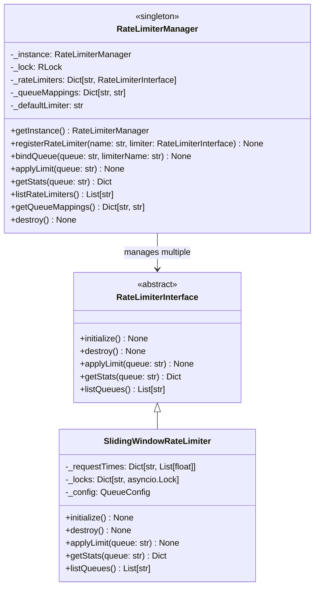
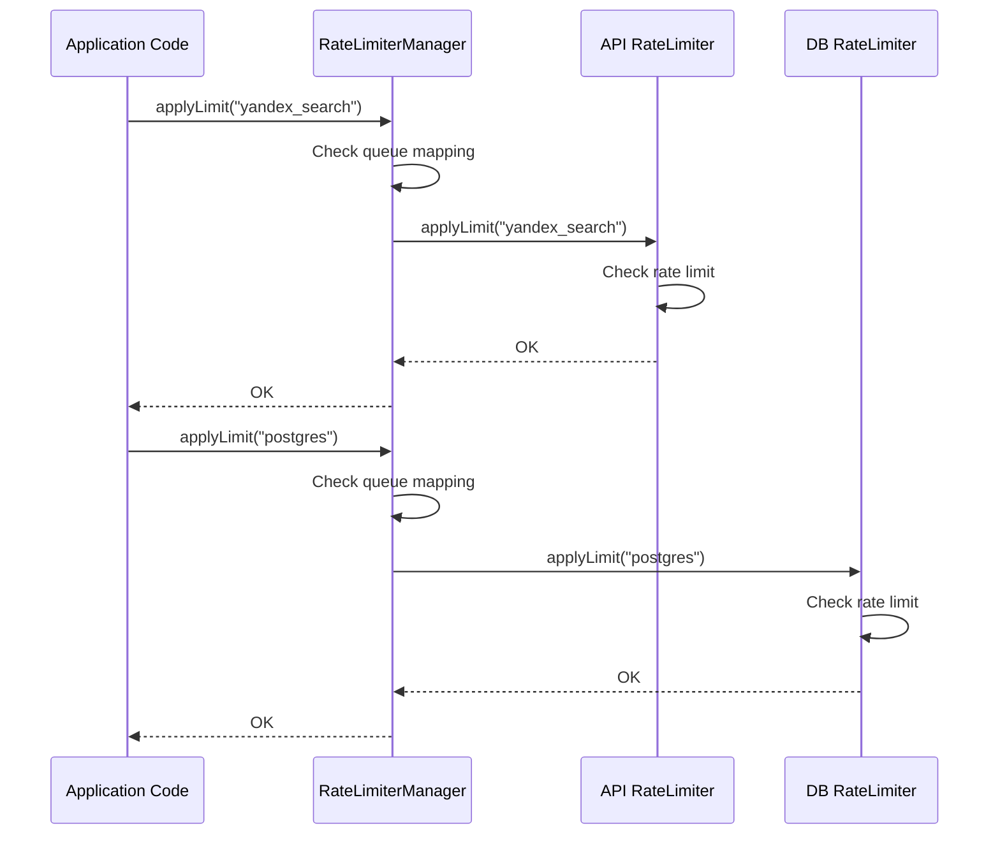
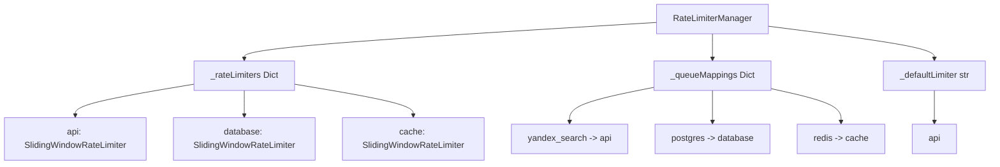

# Rate Limiter Library Design Document

**Task**: Design and implement a reusable rate limiter library for the Gromozeka project  
**Location**: `lib/rate_limiter/`  
**Author**: SourceCraft Code Assistant (Prinny Mode)  
**Date**: 2025-11-12  
**Status**: Design Phase - Updated with Feedback

---

## 1. Overview
 
This document describes the design for a reusable rate limiter library that will be placed in `lib/rate_limiter/`. The library will provide a base interface and a simple sliding window implementation, supporting multiple queues with different rate limiter backends through a powerful singleton manager, dood!

### 1.1 Goals

- Create a reusable, thread-safe rate limiter library
- Support multiple independent rate limit queues (e.g., API calls, database operations, etc.)
- Allow different rate limiter backends for different queues
- Support dynamic queue registration
- Provide a clean interface for easy extension
- Follow existing project patterns (singleton, async/await, ABC interfaces)
- Extract and improve the rate limiting logic from [`lib/yandex_search/client.py`](lib/yandex_search/client.py:463-518)

### 1.2 Non-Goals

- Distributed rate limiting across multiple processes/servers
- Redis-based or database-backed rate limiting (for initial implementation)
- Complex rate limiting algorithms (token bucket, leaky bucket, etc.) in initial version
- Rate limit state persistence

---

## 2. Architecture

### 2.1 Component Structure

```
lib/rate_limiter/
├── __init__.py              # Package exports
├── interface.py             # Abstract base class for rate limiters
├── sliding_window.py        # Sliding window implementation
├── manager.py               # Singleton manager with queue-to-limiter mapping
└── README.md                # Usage documentation
```

### 2.2 Class Hierarchy



### 2.3 Key Architectural Decisions

1. **Simplified Rate Limiter**: Each rate limiter instance uses a single config for all queues it manages
2. **Flexible Manager**: Manager maps queues to different rate limiter backends
3. **Dynamic Registration**: Queues are auto-registered on first use
4. **Multiple Backends**: Different queues can use different rate limiter instances with different configs

---

## 3. Detailed Design

### 3.1 Base Interface (`interface.py`)

The base interface defines the contract that all rate limiter implementations must follow, dood!

```python
from abc import ABC, abstractmethod
from typing import Any, Dict, List


class RateLimiterInterface(ABC):
    """
    Abstract base class for rate limiter implementations.
    
    All rate limiters must implement initialization, destruction,
    rate limiting application, statistics retrieval, and queue listing methods.
    Supports multiple independent queues with dynamic registration.
    """
    
    @abstractmethod
    async def initialize(self) -> None:
        """
        Initialize the rate limiter.
        
        This method should set up any necessary resources,
        data structures, or connections needed for rate limiting.
        Called once during setup.
        """
        pass
    
    @abstractmethod
    async def destroy(self) -> None:
        """
        Clean up rate limiter resources.
        
        This method should release any resources, close connections,
        and perform cleanup operations. Called during shutdown.
        """
        pass
    
    @abstractmethod
    async def applyLimit(self, queue: str = "default") -> None:
        """
        Apply rate limiting for the specified queue.
        
        This method blocks (sleeps) if the rate limit has been exceeded,
        ensuring that the caller respects the configured limits.
        Queues are automatically registered on first use.
        
        Args:
            queue: Name of the queue to apply rate limiting to.
                   Will be auto-registered if not seen before.
        """
        pass
    
    @abstractmethod
    def getStats(self, queue: str = "default") -> Dict[str, Any]:
        """
        Get current rate limiting statistics for a queue.
        
        Args:
            queue: Name of the queue to get statistics for
        
        Returns:
            Dictionary containing rate limit statistics:
            - requestsInWindow: Current requests in the time window
            - maxRequests: Maximum allowed requests per window
            - windowSeconds: Time window duration in seconds
            - resetTime: Unix timestamp when window will reset
            - utilizationPercent: Percentage of limit used (0-100)
        
        Raises:
            ValueError: If the queue doesn't exist
        """
        pass
    
    @abstractmethod
    def listQueues(self) -> List[str]:
        """
        Get list of all known queues managed by this rate limiter.
        
        Returns:
            List of queue names that have been used with this limiter
        
        Example:
            >>> limiter.listQueues()
            ['default', 'api', 'database']
        """
        pass
```

**Key Design Decisions:**

1. **Async Methods**: All lifecycle and limiting methods are async
2. **Dynamic Registration**: Queues auto-register on first use
3. **Statistics**: `getStats()` enables monitoring and debugging
4. **Queue Discovery**: `listQueues()` allows introspection of active queues

### 3.2 Sliding Window Implementation (`sliding_window.py`)

This implementation is based on the existing rate limiter in [`lib/yandex_search/client.py`](lib/yandex_search/client.py:463-518), but simplified to use a single config for all queues, dood!

```python
import asyncio
import logging
import time
from dataclasses import dataclass
from typing import Any, Dict, List

from .interface import RateLimiterInterface

logger = logging.getLogger(__name__)


@dataclass
class QueueConfig:
    """
    Configuration for rate limiting.
    
    This config applies to all queues managed by a single
    SlidingWindowRateLimiter instance.
    
    Attributes:
        maxRequests: Maximum requests allowed within the time window
        windowSeconds: Time window duration in seconds
    """
    maxRequests: int
    windowSeconds: int
    
    def __post_init__(self):
        """Validate configuration values"""
        if self.maxRequests <= 0:
            raise ValueError("maxRequests must be positive")
        if self.windowSeconds <= 0:
            raise ValueError("windowSeconds must be positive")


class SlidingWindowRateLimiter(RateLimiterInterface):
    """
    Sliding window rate limiter implementation.
    
    This implementation uses a sliding window algorithm to track
    request timestamps and enforce rate limits. All queues managed
    by this instance share the same rate limit configuration.
    
    To have different rate limits for different queues, create
    multiple SlidingWindowRateLimiter instances with different
    configs and register them with the manager.
    
    Algorithm:
        1. Remove timestamps outside the current time window
        2. Check if remaining requests exceed the limit
        3. If limit exceeded, calculate wait time and sleep
        4. Add current request timestamp
    
    Thread Safety:
        Uses asyncio.Lock per queue for thread-safe operations
        in concurrent async environments.
    
    Example:
        >>> # Create limiter for API calls (20 req/min)
        >>> apiLimiter = SlidingWindowRateLimiter(
        ...     QueueConfig(maxRequests=20, windowSeconds=60)
        ... )
        >>> await apiLimiter.initialize()
        >>> 
        >>> # Create limiter for DB operations (100 req/min)
        >>> dbLimiter = SlidingWindowRateLimiter(
        ...     QueueConfig(maxRequests=100, windowSeconds=60)
        ... )
        >>> await dbLimiter.initialize()
        >>> 
        >>> # Register with manager
        >>> manager = RateLimiterManager.getInstance()
        >>> manager.registerRateLimiter("api", apiLimiter)
        >>> manager.registerRateLimiter("database", dbLimiter)
        >>> manager.bindQueue("yandex_search", "api")
        >>> manager.bindQueue("postgres", "database")
    """
    
    def __init__(self, config: QueueConfig):
        """
        Initialize the sliding window rate limiter.
        
        Args:
            config: Rate limit configuration to apply to all queues
        """
        self._config = config
        self._requestTimes: Dict[str, List[float]] = {}
        self._locks: Dict[str, asyncio.Lock] = {}
        self._initialized = False
    
    async def initialize(self) -> None:
        """
        Initialize the rate limiter.
        
        Sets up internal state. Queues are registered dynamically
        on first use.
        """
        if self._initialized:
            logger.warning("SlidingWindowRateLimiter already initialized")
            return
        
        self._initialized = True
        logger.info(
            f"SlidingWindowRateLimiter initialized with "
            f"{self._config.maxRequests} requests per "
            f"{self._config.windowSeconds} seconds, dood!"
        )
    
    async def destroy(self) -> None:
        """
        Clean up rate limiter resources.
        
        Clears all tracking data and resets state.
        """
        self._requestTimes.clear()
        self._locks.clear()
        self._initialized = False
        logger.info("SlidingWindowRateLimiter destroyed, dood!")
    
    def _ensureQueue(self, queue: str) -> None:
        """
        Ensure queue is registered (internal helper).
        
        Args:
            queue: Queue name to ensure exists
        """
        if queue not in self._requestTimes:
            self._requestTimes[queue] = []
            self._locks[queue] = asyncio.Lock()
            logger.debug(f"Auto-registered queue '{queue}', dood!")
    
    async def applyLimit(self, queue: str = "default") -> None:
        """
        Apply rate limiting for the specified queue.
        
        This method implements the sliding window algorithm:
        1. Auto-registers queue if needed
        2. Removes old timestamps outside the window
        3. Checks if limit is exceeded
        4. Sleeps if necessary to respect the limit
        5. Records the current request timestamp
        
        Args:
            queue: Name of the queue to apply rate limiting to.
                   Auto-registered on first use.
        
        Example:
            >>> await limiter.applyLimit("api")  # May sleep if limit exceeded
            >>> await limiter.applyLimit("other_api")  # Different queue, same limits
        """
        # Auto-register queue on first use
        self._ensureQueue(queue)
        
        async with self._locks[queue]:
            currentTime = time.time()
            
            # Remove old request times outside the window
            self._requestTimes[queue] = [
                reqTime
                for reqTime in self._requestTimes[queue]
                if currentTime - reqTime < self._config.windowSeconds
            ]
            
            # Check if we've exceeded the rate limit
            if len(self._requestTimes[queue]) >= self._config.maxRequests:
                # Calculate how long to wait
                oldestRequest = min(self._requestTimes[queue])
                waitTime = self._config.windowSeconds - (currentTime - oldestRequest)
                
                if waitTime > 0:
                    logger.debug(
                        f"Rate limit reached for queue '{queue}', "
                        f"waiting {waitTime:.2f} seconds, dood!"
                    )
                    await asyncio.sleep(waitTime)
                    
                    # Clean up old requests after waiting
                    currentTime = time.time()
                    self._requestTimes[queue] = [
                        reqTime
                        for reqTime in self._requestTimes[queue]
                        if currentTime - reqTime < self._config.windowSeconds
                    ]
            
            # Add current request time
            self._requestTimes[queue].append(currentTime)
    
    def getStats(self, queue: str = "default") -> Dict[str, Any]:
        """
        Get current rate limiting statistics for a queue.
        
        Args:
            queue: Name of the queue to get statistics for
        
        Returns:
            Dictionary containing:
            - requestsInWindow: Current requests in the time window
            - maxRequests: Maximum allowed requests per window
            - windowSeconds: Time window duration in seconds
            - resetTime: Unix timestamp when window will reset
            - utilizationPercent: Percentage of limit used (0-100)
        
        Raises:
            ValueError: If the queue doesn't exist
        
        Example:
            >>> stats = limiter.getStats("api")
            >>> print(f"Using {stats['utilizationPercent']:.1f}% of rate limit")
        """
        if queue not in self._requestTimes:
            raise ValueError(f"Queue '{queue}' does not exist")
        
        currentTime = time.time()
        
        # Get recent requests within the window
        recentRequests = [
            reqTime
            for reqTime in self._requestTimes[queue]
            if currentTime - reqTime < self._config.windowSeconds
        ]
        
        requestsInWindow = len(recentRequests)
        utilizationPercent = (requestsInWindow / self._config.maxRequests) * 100
        
        return {
            "requestsInWindow": requestsInWindow,
            "maxRequests": self._config.maxRequests,
            "windowSeconds": self._config.windowSeconds,
            "resetTime": max(recentRequests) + self._config.windowSeconds if recentRequests else currentTime,
            "utilizationPercent": utilizationPercent,
        }
    
    def listQueues(self) -> List[str]:
        """
        Get list of all known queues.
        
        Returns:
            List of queue names that have been used
        
        Example:
            >>> limiter.listQueues()
            ['default', 'api_endpoint_1', 'api_endpoint_2']
        """
        return list(self._requestTimes.keys())
```

**Key Design Decisions:**

1. **Single Config**: All queues share the same rate limit config
2. **Auto-Registration**: Queues are created on first use via `_ensureQueue()`
3. **Per-Queue Locks**: Each queue still has its own lock for concurrency
4. **Simplified API**: No explicit registration needed
5. **Multiple Instances**: Use different instances for different rate limits

### 3.3 Singleton Manager (`manager.py`)

The manager provides a powerful singleton interface with queue-to-limiter mapping, allowing different queues to use different rate limiter backends, dood!

```python
import logging
from threading import RLock
from typing import Any, Dict, List, Optional

from .interface import RateLimiterInterface

logger = logging.getLogger(__name__)


class RateLimiterManager:
    """
    Singleton manager for rate limiter instances with queue-to-limiter mapping.
    
    This class provides a global access point to multiple rate limiters,
    allowing different queues to use different rate limiter backends.
    Follows the singleton pattern used in CacheService and QueueService.
    
    Architecture:
        - Manages multiple named rate limiter instances (backends)
        - Maps queues to specific rate limiters
        - Provides a default rate limiter for unmapped queues
        - Supports dynamic queue and limiter registration
    
    Usage:
        >>> from lib.rate_limiter import (
        ...     RateLimiterManager,
        ...     SlidingWindowRateLimiter,
        ...     QueueConfig
        ... )
        >>> 
        >>> # Initialize at application startup
        >>> manager = RateLimiterManager.getInstance()
        >>> 
        >>> # Create different rate limiters for different purposes
        >>> apiLimiter = SlidingWindowRateLimiter(
        ...     QueueConfig(maxRequests=20, windowSeconds=60)
        ... )
        >>> await apiLimiter.initialize()
        >>> 
        >>> dbLimiter = SlidingWindowRateLimiter(
        ...     QueueConfig(maxRequests=100, windowSeconds=60)
        ... )
        >>> await dbLimiter.initialize()
        >>> 
        >>> # Register rate limiters with names
        >>> manager.registerRateLimiter("api", apiLimiter)
        >>> manager.registerRateLimiter("database", dbLimiter)
        >>> 
        >>> # Set default limiter
        >>> manager.setDefaultLimiter("api")
        >>> 
        >>> # Bind specific queues to specific limiters
        >>> manager.bindQueue("yandex_search", "api")
        >>> manager.bindQueue("openweather", "api")
        >>> manager.bindQueue("postgres_queries", "database")
        >>> 
        >>> # Use anywhere in the application
        >>> await manager.applyLimit("yandex_search")  # Uses api limiter
        >>> await manager.applyLimit("postgres_queries")  # Uses database limiter
        >>> await manager.applyLimit("unknown_queue")  # Uses default (api) limiter
    """
    
    _instance: Optional["RateLimiterManager"] = None
    _lock = RLock()
    
    def __new__(cls) -> "RateLimiterManager":
        """
        Create or return singleton instance with thread safety.
        
        Returns:
            The singleton RateLimiterManager instance
        """
        with cls._lock:
            if cls._instance is None:
                cls._instance = super().__new__(cls)
            return cls._instance
    
    def __init__(self):
        """
        Initialize the manager instance.
        
        Only runs once due to singleton pattern. Sets up:
        - Rate limiter registry (name -> instance)
        - Queue mappings (queue -> limiter name)
        - Default limiter name
        """
        if not hasattr(self, "initialized"):
            self._rateLimiters: Dict[str, RateLimiterInterface] = {}
            self._queueMappings: Dict[str, str] = {}
            self._defaultLimiter: Optional[str] = None
            self.initialized = True
            logger.info("RateLimiterManager initialized, dood!")
    
    @classmethod
    def getInstance(cls) -> "RateLimiterManager":
        """
        Get the singleton instance.
        
        Returns:
            The singleton RateLimiterManager instance
        """
        return cls()
    
    def registerRateLimiter(
        self,
        name: str,
        limiter: RateLimiterInterface
    ) -> None:
        """
        Register a rate limiter instance with a name.
        
        Args:
            name: Unique name for this rate limiter backend
            limiter: Rate limiter instance to register
        
        Raises:
            ValueError: If name is already registered
        
        Example:
            >>> apiLimiter = SlidingWindowRateLimiter(
            ...     QueueConfig(maxRequests=20, windowSeconds=60)
            ... )
            >>> await apiLimiter.initialize()
            >>> manager.registerRateLimiter("api", apiLimiter)
        """
        if name in self._rateLimiters:
            raise ValueError(f"Rate limiter '{name}' is already registered")
        
        self._rateLimiters[name] = limiter
        
        # Set as default if it's the first one
        if self._defaultLimiter is None:
            self._defaultLimiter = name
            logger.info(f"Set '{name}' as default rate limiter, dood!")
        
        logger.info(f"Registered rate limiter '{name}', dood!")
    
    def setDefaultLimiter(self, name: str) -> None:
        """
        Set the default rate limiter to use for unmapped queues.
        
        Args:
            name: Name of the rate limiter to use as default
        
        Raises:
            ValueError: If the rate limiter name is not registered
        
        Example:
            >>> manager.setDefaultLimiter("api")
        """
        if name not in self._rateLimiters:
            raise ValueError(f"Rate limiter '{name}' is not registered")
        
        self._defaultLimiter = name
        logger.info(f"Set '{name}' as default rate limiter, dood!")
    
    def bindQueue(self, queue: str, limiterName: str) -> None:
        """
        Bind a queue to a specific rate limiter.
        
        Args:
            queue: Name of the queue to bind
            limiterName: Name of the rate limiter to use for this queue
        
        Raises:
            ValueError: If the rate limiter name is not registered
        
        Example:
            >>> manager.bindQueue("yandex_search", "api")
            >>> manager.bindQueue("postgres_queries", "database")
        """
        if limiterName not in self._rateLimiters:
            raise ValueError(f"Rate limiter '{limiterName}' is not registered")
        
        self._queueMappings[queue] = limiterName
        logger.info(f"Bound queue '{queue}' to rate limiter '{limiterName}', dood!")
    
    def _getLimiterForQueue(self, queue: str) -> RateLimiterInterface:
        """
        Get the appropriate rate limiter for a queue (internal helper).
        
        Args:
            queue: Queue name
        
        Returns:
            Rate limiter instance to use for this queue
        
        Raises:
            RuntimeError: If no rate limiters are registered
        """
        if not self._rateLimiters:
            raise RuntimeError("No rate limiters registered, dood!")
        
        # Check if queue has explicit mapping
        if queue in self._queueMappings:
            limiterName = self._queueMappings[queue]
            return self._rateLimiters[limiterName]
        
        # Use default limiter
        if self._defaultLimiter is None:
            raise RuntimeError("No default rate limiter set, dood!")
        
        return self._rateLimiters[self._defaultLimiter]
    
    async def applyLimit(self, queue: str = "default") -> None:
        """
        Apply rate limiting for the specified queue.
        
        Routes the request to the appropriate rate limiter based on
        queue mappings. Uses default limiter if queue is not mapped.
        
        Args:
            queue: Name of the queue to apply rate limiting to
        
        Raises:
            RuntimeError: If no rate limiters are registered
        
        Example:
            >>> await manager.applyLimit("yandex_search")  # Uses mapped limiter
            >>> await manager.applyLimit()  # Uses default limiter
        """
        limiter = self._getLimiterForQueue(queue)
        await limiter.applyLimit(queue)
    
    def getStats(self, queue: str = "default") -> Dict[str, Any]:
        """
        Get rate limiting statistics for a queue.
        
        Args:
            queue: Name of the queue to get statistics for
        
        Returns:
            Dictionary containing rate limit statistics
        
        Raises:
            RuntimeError: If no rate limiters are registered
            ValueError: If the queue doesn't exist in its limiter
        
        Example:
            >>> stats = manager.getStats("yandex_search")
            >>> print(f"Requests: {stats['requestsInWindow']}/{stats['maxRequests']}")
        """
        limiter = self._getLimiterForQueue(queue)
        return limiter.getStats(queue)
    
    def listRateLimiters(self) -> List[str]:
        """
        Get list of all registered rate limiter names.
        
        Returns:
            List of rate limiter names
        
        Example:
            >>> manager.listRateLimiters()
            ['api', 'database', 'cache']
        """
        return list(self._rateLimiters.keys())
    
    def getQueueMappings(self) -> Dict[str, str]:
        """
        Get all queue-to-limiter mappings.
        
        Returns:
            Dictionary mapping queue names to rate limiter names
        
        Example:
            >>> manager.getQueueMappings()
            {
                'yandex_search': 'api',
                'openweather': 'api',
                'postgres_queries': 'database'
            }
        """
        return self._queueMappings.copy()
    
    def getDefaultLimiter(self) -> Optional[str]:
        """
        Get the name of the default rate limiter.
        
        Returns:
            Name of default rate limiter, or None if not set
        
        Example:
            >>> manager.getDefaultLimiter()
            'api'
        """
        return self._defaultLimiter
    
    async def destroy(self) -> None:
        """
        Destroy all registered rate limiters and clean up.
        
        This method:
        1. Calls destroy() on each registered rate limiter
        2. Clears all rate limiter registrations
        3. Clears all queue mappings
        4. Resets default limiter
        
        Should be called during application shutdown.
        
        Example:
            >>> await manager.destroy()
        """
        logger.info("Destroying all rate limiters, dood!")
        
        # Destroy each rate limiter
        for name, limiter in self._rateLimiters.items():
            try:
                await limiter.destroy()
                logger.info(f"Destroyed rate limiter '{name}', dood!")
            except Exception as e:
                logger.error(f"Error destroying rate limiter '{name}': {e}")
        
        # Clear all state
        self._rateLimiters.clear()
        self._queueMappings.clear()
        self._defaultLimiter = None
        
        logger.info("RateLimiterManager cleanup complete, dood!")
```

**Key Design Decisions:**

1. **Multiple Backends**: Manages multiple rate limiter instances
2. **Queue Mapping**: Maps queues to specific rate limiters
3. **Default Limiter**: Fallback for unmapped queues
4. **Discovery Methods**: `listRateLimiters()` and `getQueueMappings()` for introspection
5. **Cleanup**: `destroy()` method cleans up all rate limiters
6. **Auto-Default**: First registered limiter becomes default

### 3.4 Package Exports (`__init__.py`)

```python
"""
Rate Limiter Library

This library provides reusable rate limiting functionality with support
for multiple independent queues, different rate limiter backends per queue,
and a powerful singleton manager pattern.

Example:
    >>> from lib.rate_limiter import (
    ...     RateLimiterManager,
    ...     SlidingWindowRateLimiter,
    ...     QueueConfig
    ... )
    >>> 
    >>> # Setup different rate limiters
    >>> manager = RateLimiterManager.getInstance()
    >>> 
    >>> apiLimiter = SlidingWindowRateLimiter(
    ...     QueueConfig(maxRequests=20, windowSeconds=60)
    ... )
    >>> await apiLimiter.initialize()
    >>> 
    >>> dbLimiter = SlidingWindowRateLimiter(
    ...     QueueConfig(maxRequests=100, windowSeconds=60)
    ... )
    >>> await dbLimiter.initialize()
    >>> 
    >>> # Register and map
    >>> manager.registerRateLimiter("api", apiLimiter)
    >>> manager.registerRateLimiter("database", dbLimiter)
    >>> manager.bindQueue("yandex_search", "api")
    >>> manager.bindQueue("postgres", "database")
    >>> 
    >>> # Usage
    >>> await manager.applyLimit("yandex_search")  # Uses api limiter
    >>> await manager.applyLimit("postgres")  # Uses database limiter
"""

from .interface import RateLimiterInterface
from .manager import RateLimiterManager
from .sliding_window import QueueConfig, SlidingWindowRateLimiter

__all__ = [
    "RateLimiterInterface",
    "RateLimiterManager",
    "SlidingWindowRateLimiter",
    "QueueConfig",
]
```

---

## 4. Usage Examples

### 4.1 Basic Usage with Single Rate Limiter

```python
from lib.rate_limiter import (
    RateLimiterManager,
    SlidingWindowRateLimiter,
    QueueConfig
)

# Initialize at application startup
async def initializeRateLimiter():
    manager = RateLimiterManager.getInstance()
    
    # Create a single rate limiter
    limiter = SlidingWindowRateLimiter(
        QueueConfig(maxRequests=20, windowSeconds=60)
    )
    await limiter.initialize()
    
    # Register it (becomes default automatically)
    manager.registerRateLimiter("default", limiter)

# Use anywhere in the application
async def makeApiCall():
    manager = RateLimiterManager.getInstance()
    await manager.applyLimit("api_endpoint_1")  # Auto-registered, uses default limiter
    # ... make API call ...
```

### 4.2 Advanced Usage with Multiple Rate Limiters

```python
from lib.rate_limiter import (
    RateLimiterManager,
    SlidingWindowRateLimiter,
    QueueConfig
)

async def setupAdvancedRateLimiting():
    manager = RateLimiterManager.getInstance()
    
    # Create rate limiter for external APIs (strict limits)
    apiLimiter = SlidingWindowRateLimiter(
        QueueConfig(maxRequests=20, windowSeconds=60)
    )
    await apiLimiter.initialize()
    
    # Create rate limiter for database (higher limits)
    dbLimiter = SlidingWindowRateLimiter(
        QueueConfig(maxRequests=100, windowSeconds=60)
    )
    await dbLimiter.initialize()
    
    # Create rate limiter for cache (very high limits)
    cacheLimiter = SlidingWindowRateLimiter(
        QueueConfig(maxRequests=1000, windowSeconds=60)
    )
    await cacheLimiter.initialize()
    
    # Register all limiters
    manager.registerRateLimiter("api", apiLimiter)
    manager.registerRateLimiter("database", dbLimiter)
    manager.registerRateLimiter("cache", cacheLimiter)
    
    # Set default
    manager.setDefaultLimiter("api")
    
    # Bind specific queues
    manager.bindQueue("yandex_search", "api")
    manager.bindQueue("openweather", "api")
    manager.bindQueue("postgres_queries", "database")
    manager.bindQueue("redis_operations", "cache")
    
    # Check configuration
    print(f"Rate limiters: {manager.listRateLimiters()}")
    print(f"Queue mappings: {manager.getQueueMappings()}")

### 4.3 Integration with YandexSearchClient

```python
# In lib/yandex_search/client.py

from lib.rate_limiter import RateLimiterManager

class YandexSearchClient:
    def __init__(
        self,
        *,
        iamToken: Optional[str] = None,
        apiKey: Optional[str] = None,
        folderId: str = "",
        requestTimeout: int = 30,
        cache: Optional[SearchCacheInterface] = None,
        cacheTTL: Optional[int] = 3600,
        useCache: bool = True,
        rateLimitRequests: int = 10,
        rateLimitWindow: int = 60,
    ):
        # ... existing initialization ...
        
        # No need to store rate limit config or create internal limiter
        # Just use the global rate limiter manager
        # The queue will be auto-registered on first use
    
    async def _applyRateLimit(self) -> None:
        """Apply rate limiting using the global rate limiter"""
        manager = RateLimiterManager.getInstance()
        await manager.applyLimit("yandex_search")
```

### 4.4 Monitoring Rate Limits

```python
from lib.rate_limiter import RateLimiterManager

async def monitorRateLimits():
    manager = RateLimiterManager.getInstance()
    
    # Get all rate limiters
    for limiterName in manager.listRateLimiters():
        print(f"\nRate Limiter: {limiterName}")
        limiter = manager._rateLimiters[limiterName]
        
        # Get all queues for this limiter
        for queue in limiter.listQueues():
            stats = limiter.getStats(queue)
            print(f"  Queue: {queue}")
            print(f"    Usage: {stats['requestsInWindow']}/{stats['maxRequests']}")
            print(f"    Utilization: {stats['utilizationPercent']:.1f}%")
    
    # Show queue mappings
    print(f"\nQueue Mappings: {manager.getQueueMappings()}")
    print(f"Default Limiter: {manager.getDefaultLimiter()}")
```

### 4.5 Application Shutdown

```python
async def shutdownApplication():
    """Clean shutdown of rate limiters"""
    manager = RateLimiterManager.getInstance()
    await manager.destroy()
    print("All rate limiters destroyed, dood!")
```

---

## 5. Implementation Plan

### Phase 1: Core Implementation (2-3 hours)

1. **Create directory structure**
   - Create `lib/rate_limiter/` directory
   - Create `__init__.py`, `interface.py`, `sliding_window.py`, `manager.py`

2. **Implement base interface** (`interface.py`)
   - Define `RateLimiterInterface` abstract class
   - Add `listQueues()` method
   - Add comprehensive docstrings
   - Add type hints

3. **Implement sliding window rate limiter** (`sliding_window.py`)
   - Create `QueueConfig` dataclass
   - Implement `SlidingWindowRateLimiter` class with single config
   - Port and improve algorithm from YandexSearchClient
   - Add auto-registration via `_ensureQueue()`
   - Implement `listQueues()` method
   - Add enhanced statistics

4. **Implement singleton manager** (`manager.py`)
   - Create `RateLimiterManager` singleton
   - Follow CacheService/QueueService pattern
   - Add rate limiter registry (`_rateLimiters`)
   - Add queue mappings (`_queueMappings`)
   - Implement `registerRateLimiter()`, `bindQueue()`
   - Implement `listRateLimiters()`, `getQueueMappings()`
   - Implement `destroy()` method
   - Add delegation methods with routing logic

5. **Create package exports** (`__init__.py`)
   - Export all public classes
   - Add package-level documentation

### Phase 2: Documentation (1 hour)

1. **Create README.md**
   - Usage examples
   - API documentation
   - Integration guide
   - Architecture overview

2. **Add inline documentation**
   - Ensure all methods have docstrings
   - Add usage examples in docstrings
   - Document the queue-to-limiter mapping concept

### Phase 3: Testing (3-4 hours)

1. **Create test file** (`tests/lib_rate_limiter/test_rate_limiter.py`)
   - Test basic rate limiting
   - Test auto-registration
   - Test statistics
   - Test `listQueues()` method
   - Test edge cases
   - Test thread safety

2. **Create manager tests** (`tests/lib_rate_limiter/test_manager.py`)
   - Test singleton behavior
   - Test multiple rate limiter registration
   - Test queue-to-limiter mapping
   - Test default limiter behavior
   - Test `listRateLimiters()` and `getQueueMappings()`
   - Test `destroy()` method
   - Test routing logic

3. **Create integration tests**
   - Test with YandexSearchClient
   - Test concurrent access
   - Test multiple backends scenario

### Phase 4: Integration (1-2 hours)

1. **Update YandexSearchClient**
   - Remove internal rate limiter implementation
   - Use global rate limiter manager
   - Update tests

2. **Update documentation**
   - Add migration guide
   - Update project documentation
   - Add architecture diagrams

---

## 6. Testing Strategy

### 6.1 Unit Tests

```python
# tests/lib_rate_limiter/test_sliding_window.py

import asyncio
import pytest
import time
from lib.rate_limiter import SlidingWindowRateLimiter, QueueConfig

class TestSlidingWindowRateLimiter:
    """Test sliding window rate limiter implementation"""
    
    @pytest.mark.asyncio
    async def testBasicRateLimiting(self):
        """Test that rate limiting blocks when limit exceeded"""
        limiter = SlidingWindowRateLimiter(
            QueueConfig(maxRequests=2, windowSeconds=1)
        )
        await limiter.initialize()
        
        # First two requests should be immediate
        start = time.time()
        await limiter.applyLimit("test")
        await limiter.applyLimit("test")
        elapsed = time.time() - start
        assert elapsed < 0.1  # Should be nearly instant
        
        # Third request should block
        start = time.time()
        await limiter.applyLimit("test")
        elapsed = time.time() - start
        assert elapsed >= 0.9  # Should wait ~1 second
    
    @pytest.mark.asyncio
    async def testAutoRegistration(self):
        """Test that queues are auto-registered on first use"""
        limiter = SlidingWindowRateLimiter(
            QueueConfig(maxRequests=5, windowSeconds=1)
        )
        await limiter.initialize()
        
        # Use multiple queues without explicit registration
        await limiter.applyLimit("queue1")
        await limiter.applyLimit("queue2")
        await limiter.applyLimit("queue3")
        
        # All should be listed
        queues = limiter.listQueues()
        assert "queue1" in queues
        assert "queue2" in queues
        assert "queue3" in queues
    
    @pytest.mark.asyncio
    async def testSharedConfig(self):
        """Test that all queues share the same config"""
        limiter = SlidingWindowRateLimiter(
            QueueConfig(maxRequests=2, windowSeconds=1)
        )
        await limiter.initialize()
        
        # Each queue should have the same limits
        await limiter.applyLimit("queue1")
        await limiter.applyLimit("queue1")
        
        await limiter.applyLimit("queue2")
        await limiter.applyLimit("queue2")
        
        stats1 = limiter.getStats("queue1")
        stats2 = limiter.getStats("queue2")
        
        assert stats1["maxRequests"] == 2
        assert stats2["maxRequests"] == 2
    
    @pytest.mark.asyncio
    async def testListQueues(self):
        """Test listQueues method"""
        limiter = SlidingWindowRateLimiter(
            QueueConfig(maxRequests=10, windowSeconds=1)
        )
        await limiter.initialize()
        
        # Initially empty
        assert limiter.listQueues() == []
        
        # Add some queues
        await limiter.applyLimit("api")
        await limiter.applyLimit("database")
        
        queues = limiter.listQueues()
        assert len(queues) == 2
        assert "api" in queues
        assert "database" in queues
```

### 6.2 Manager Tests

```python
# tests/lib_rate_limiter/test_manager.py

import pytest
from lib.rate_limiter import (
    RateLimiterManager,
    SlidingWindowRateLimiter,
    QueueConfig
)

class TestRateLimiterManager:
    """Test singleton manager with queue-to-limiter mapping"""
    
    def testSingleton(self):
        """Test that manager is a singleton"""
        manager1 = RateLimiterManager.getInstance()
        manager2 = RateLimiterManager.getInstance()
        assert manager1 is manager2
    
    @pytest.mark.asyncio
    async def testMultipleLimiters(self):
        """Test registering multiple rate limiters"""
        manager = RateLimiterManager.getInstance()
        
        # Create two different limiters
        fastLimiter = SlidingWindowRateLimiter(
            QueueConfig(maxRequests=100, windowSeconds=60)
        )
        await fastLimiter.initialize()
        
        slowLimiter = SlidingWindowRateLimiter(
            QueueConfig(maxRequests=10, windowSeconds=60)
        )
        await slowLimiter.initialize()
        
        # Register both
        manager.registerRateLimiter("fast", fastLimiter)
        manager.registerRateLimiter("slow", slowLimiter)
        
        # Check they're registered
        limiters = manager.listRateLimiters()
        assert "fast" in limiters
        assert "slow" in limiters
    
    @pytest.mark.asyncio
    async def testQueueMapping(self):
        """Test queue-to-limiter mapping"""
        manager = RateLimiterManager.getInstance()
        
        apiLimiter = SlidingWindowRateLimiter(
            QueueConfig(maxRequests=20, windowSeconds=60)
        )
        await apiLimiter.initialize()
        
        dbLimiter = SlidingWindowRateLimiter(
            QueueConfig(maxRequests=100, windowSeconds=60)
        )
        await dbLimiter.initialize()
        
        manager.registerRateLimiter("api", apiLimiter)
        manager.registerRateLimiter("database", dbLimiter)
        
        # Bind queues
        manager.bindQueue("yandex_search", "api")
        manager.bindQueue("postgres", "database")
        
        # Check mappings
        mappings = manager.getQueueMappings()
        assert mappings["yandex_search"] == "api"
        assert mappings["postgres"] == "database"
    
    @pytest.mark.asyncio
    async def testDefaultLimiter(self):
        """Test default limiter behavior"""
        manager = RateLimiterManager.getInstance()
        
        limiter = SlidingWindowRateLimiter(
            QueueConfig(maxRequests=50, windowSeconds=60)
        )
        await limiter.initialize()
        
        # First registered becomes default
        manager.registerRateLimiter("default", limiter)
        assert manager.getDefaultLimiter() == "default"
        
        # Can change default
        limiter2 = SlidingWindowRateLimiter(
            QueueConfig(maxRequests=100, windowSeconds=60)
        )
        await limiter2.initialize()
        manager.registerRateLimiter("other", limiter2)
        manager.setDefaultLimiter("other")
        assert manager.getDefaultLimiter() == "other"
    
    @pytest.mark.asyncio
    async def testDestroy(self):
        """Test destroy method cleans up everything"""
        manager = RateLimiterManager.getInstance()
        
        limiter1 = SlidingWindowRateLimiter(
            QueueConfig(maxRequests=10, windowSeconds=60)
        )
        await limiter1.initialize()
        
        limiter2 = SlidingWindowRateLimiter(
            QueueConfig(maxRequests=20, windowSeconds=60)
        )
        await limiter2.initialize()
        
        manager.registerRateLimiter("limiter1", limiter1)
        manager.registerRateLimiter("limiter2", limiter2)
        manager.bindQueue("queue1", "limiter1")
        
        # Destroy everything
        await manager.destroy()
        
        # Everything should be cleared
        assert manager.listRateLimiters() == []
        assert manager.getQueueMappings() == {}
        assert manager.getDefaultLimiter() is None
```

### 6.3 Integration Tests

```python
# tests/lib_rate_limiter/test_integration.py

import pytest
from lib.rate_limiter import (
    RateLimiterManager,
    SlidingWindowRateLimiter,
    QueueConfig
)

class TestIntegration:
    """Test integration scenarios"""
    
    @pytest.mark.asyncio
    async def testMultipleBackendsScenario(self):
        """Test realistic scenario with multiple backends"""
        manager = RateLimiterManager.getInstance()
        
        # Setup: API limiter (strict), DB limiter (moderate), Cache limiter (loose)
        apiLimiter = SlidingWindowRateLimiter(
            QueueConfig(maxRequests=20, windowSeconds=60)
        )
        await apiLimiter.initialize()
        
        dbLimiter = SlidingWindowRateLimiter(
            QueueConfig(maxRequests=100, windowSeconds=60)
        )
        await dbLimiter.initialize()
        
        cacheLimiter = SlidingWindowRateLimiter(
            QueueConfig(maxRequests=1000, windowSeconds=60)
        )
        await cacheLimiter.initialize()
        
        # Register all
        manager.registerRateLimiter("api", apiLimiter)
        manager.registerRateLimiter("database", dbLimiter)
        manager.registerRateLimiter("cache", cacheLimiter)
        
        # Bind queues
        manager.bindQueue("yandex_search", "api")
        manager.bindQueue("openweather", "api")
        manager.bindQueue("postgres_queries", "database")
        manager.bindQueue("redis_ops", "cache")
        
        # Use different queues
        await manager.applyLimit("yandex_search")
        await manager.applyLimit("postgres_queries")
        await manager.applyLimit("redis_ops")
        
        # Verify they used different limiters
        assert "yandex_search" in apiLimiter.listQueues()
        assert "postgres_queries" in dbLimiter.listQueues()
        assert "redis_ops" in cacheLimiter.listQueues()
        
        # Verify stats reflect different configs
        apiStats = manager.getStats("yandex_search")
        dbStats = manager.getStats("postgres_queries")
        cacheStats = manager.getStats("redis_ops")
        
        assert apiStats["maxRequests"] == 20
        assert dbStats["maxRequests"] == 100
        assert cacheStats["maxRequests"] == 1000
```

---

## 7. Migration Guide

### 7.1 Updating YandexSearchClient

**Before:**
```python
class YandexSearchClient:
    def __init__(self, ...):
        self.rateLimitRequests = rateLimitRequests
        self.rateLimitWindow = rateLimitWindow
        self._requestTimes: List[float] = []
        self._rateLimitLock = asyncio.Lock()
    
    async def _applyRateLimit(self) -> None:
        async with self._rateLimitLock:
            currentTime = time.time()
            # ... internal implementation ...
```

**After:**
```python
from lib.rate_limiter import RateLimiterManager

class YandexSearchClient:
    def __init__(self, ...):
        # No need to store rate limit config or create internal structures
        # The rate limiter manager handles everything
        pass
    
    async def _applyRateLimit(self) -> None:
        """Apply rate limiting using the global rate limiter"""
        manager = RateLimiterManager.getInstance()
        await manager.applyLimit("yandex_search")
```

**Application Initialization:**
```python
from lib.rate_limiter import (
    RateLimiterManager,
    SlidingWindowRateLimiter,
    QueueConfig
)

async def initializeApp():
    # Setup rate limiter for API calls
    manager = RateLimiterManager.getInstance()
    
    apiLimiter = SlidingWindowRateLimiter(
        QueueConfig(maxRequests=20, windowSeconds=60)
    )
    await apiLimiter.initialize()
    
    manager.registerRateLimiter("api", apiLimiter)
    manager.bindQueue("yandex_search", "api")
    
    # Now YandexSearchClient will use this rate limiter
    client = YandexSearchClient(...)
```

---

## 8. Future Enhancements

### 8.1 Potential Improvements

1. **Token Bucket Algorithm**
   - Implement alternative rate limiting algorithm
   - Better for bursty traffic patterns
   - Create `TokenBucketRateLimiter` class

2. **Distributed Rate Limiting**
   - Redis-based implementation
   - Support for multi-process/multi-server deployments
   - Create `RedisRateLimiter` class

3. **Dynamic Rate Limits**
   - Adjust limits based on response times
   - Adaptive rate limiting
   - Circuit breaker integration

4. **Metrics and Monitoring**
   - Prometheus metrics export
   - Grafana dashboard templates
   - Real-time monitoring dashboard

5. **Configuration File Support**
   - Load queue configurations from TOML
   - Hot-reload configuration changes
   - Environment-specific configs

6. **Rate Limit Policies**
   - Per-user rate limiting
   - Per-IP rate limiting
   - Hierarchical rate limits

### 8.2 Extension Points

The design allows for easy extension:

1. **New Algorithms**: Implement `RateLimiterInterface` with different algorithms
2. **Custom Statistics**: Override `getStats()` to add custom metrics
3. **Persistence**: Add database-backed request tracking
4. **Distributed Locks**: Replace `asyncio.Lock` with distributed locks
5. **Custom Routing**: Extend manager with custom queue-to-limiter routing logic

---

## 9. Decisions on Open Questions

Based on feedback, here are the decisions on the open questions:

### 9.1 Dynamic Queue Registration
**Decision**: ✅ **YES - Implemented**

Queues are automatically registered on first use via the `_ensureQueue()` method in `SlidingWindowRateLimiter`. This provides a seamless developer experience where you don't need to pre-register queues.

**Rationale**: Simplifies usage and reduces boilerplate code. The auto-registration is safe because each rate limiter instance has a single configuration that applies to all its queues.

### 9.2 Queue Removal/Cleanup
**Decision**: ❌ **NO - Not needed right now**

We won't implement queue removal or cleanup methods in the initial version.

**Rationale**: Queues are lightweight (just a list of timestamps and a lock), so there's minimal overhead in keeping them around. If needed in the future, we can add `removeQueue()` methods.

### 9.3 Rate Limit State Persistence
**Decision**: ❌ **NO - Not needed**

We won't persist rate limit state to database or disk.

**Rationale**: Rate limits are meant to be short-term (typically 1-60 seconds), so losing state on restart is acceptable. The system will naturally recover within one time window. If distributed rate limiting is needed in the future, we can implement a Redis-based backend.

### 9.4 Rate Limit Bypass for Testing
**Decision**: ❌ **NO - Use proper configuration instead**

We won't add a special "bypass" mode for testing.

**Rationale**: Tests should properly configure rate limiters with high limits (e.g., `QueueConfig(maxRequests=100500, windowSeconds=1)`) rather than bypassing the system entirely. This ensures tests actually exercise the rate limiting code paths.

---

## 10. Architecture Diagrams

### 10.1 Component Interaction



### 10.2 Manager State



---

## 11. Conclusion

This updated design provides a powerful, flexible rate limiter library that:

- ✅ Follows existing project patterns (singleton, ABC, async/await)
- ✅ Supports multiple independent queues with auto-registration
- ✅ Allows different rate limiter backends for different queues
- ✅ Provides a proven sliding window algorithm
- ✅ Offers comprehensive statistics and monitoring
- ✅ Enables easy testing and extension
- ✅ Integrates cleanly with existing code
- ✅ Includes powerful manager with queue-to-limiter mapping
- ✅ Supports proper cleanup via `destroy()` method

The implementation should take approximately 7-10 hours total:
- Core functionality: 2-3 hours
- Documentation: 1 hour
- Testing: 3-4 hours
- Integration: 1-2 hours

The design is ready for implementation, dood!