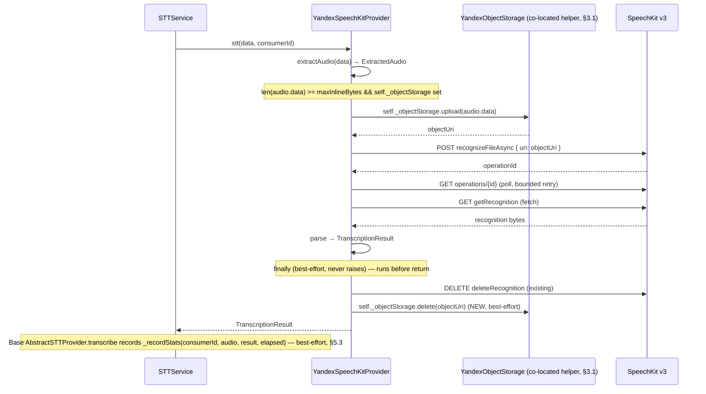

# Design: STT v1.1 — Object Storage routing (gate-3) + statistics recording (gate-4)

Status: **IMPLEMENTED** (branch `add-audio-transcribation-v2`; 3726 passed / 11 skipped / 0 failed)  
Date: 2026-08-04 (design) · 2026-08-08 (implementation verified)  
Owner: TBD  
Companion docs: [`media-transcription-stt-v1.md`](./media-transcription-stt-v1.md) (parent v1 plan), [`lib-stt-v1.md`](./lib-stt-v1.md) (lib/stt spec), [`stt-next-steps.md`](../archive/design/stt-next-steps.md) (integration roadmap + release gates), [`architecture.md`](../llm/architecture.md), [`configuration.md`](../llm/configuration.md), [`services.md`](../llm/services.md), [`libraries.md`](../llm/libraries.md)

> v1.1 is **fully implemented** on branch `add-audio-transcribation-v2`. The
> implementation went through a template-method refactor and four user-confirmed
> simplifications; this document has been reconciled against the final code state
> (2026-08-08). §9 (implementation steps) and §10 (documentation impact) are
> marked DONE where applicable. §12 (rejected alternatives) is an intentional
> historical record.

## 1. Context and goal

The v1 STT feature ([`media-transcription-stt-v1.md`](./media-transcription-stt-v1.md),
[`stt-next-steps.md`](../archive/design/stt-next-steps.md)) ships default-off, inline-only: every
transcribable clip is base64-encoded into the SpeechKit `content` field and POSTed
inline. The product caps the inline payload at 40 MiB (`max-inline-bytes`), well
under SpeechKit's 60 MB inline ceiling. Clips whose extracted form exceeds the inline
threshold cannot be transcribed today.

v1.1 adds two enhancements, each mapped to one of the manual release gates from
[parent §13.3](./media-transcription-stt-v1.md):

- **Enhancement 1 — gate-3 (inline vs Object Storage routing).** Clips below the
  threshold stay inline as today; clips at/above the threshold are uploaded to
  Yandex Object Storage (S3-compatible) and submitted via the `uri` field, raising
  the admissible payload from ~40 MiB inline to 1 GB via Object Storage. This is
  the code behind the gate-3 "inline-limit semantics" item: instead of merely
  *confirming* the inline ceiling, v1.1 *works around* it for large clips.
- **Enhancement 2 — gate-4 (statistics recording).** Per-transcription statistics
  (audio length + processing time + status/error) are recorded in `lib/stt`,
  mirroring how `lib/ai` already records LLM usage stats. This is observability to
  inform whether the 10-minute latency gate needs action; it is not a behavior
  change.

The remaining release gates — gate-2 (model), gate-5 (RSS), gate-6 (shutdown),
gate-7 (Alpine wheel), gate-8 (encoders), gate-9 (quality) — **require no code
changes from v1.1**. They are operational/confirmation gates (see §8).

### 1.1 Verified grounding (current state)

The following are facts verified against source, not assumptions:

- The Yandex provider builds the submit body in
  [`lib/stt/providers/yandex_speechkit.py`](../../lib/stt/providers/yandex_speechkit.py)
  `_buildSubmitBody`: it base64-encodes `audio.data` into `"content"` for the
  inline path, or sends the staged object `"uri"` for the Object Storage path;
  both set `container_audio.container_audio_type` from
  `audio.container.toYandexSpeechKit()`.
- The bytes that become the API payload are `audio.data` — the **extracted** audio
  produced by [`lib/stt/audio.py`](../../lib/stt/audio.py) `extractAudio()`
  (post pass-through/transcode), NOT the raw source bytes. The inline-vs-Object-Storage
  threshold therefore applies to `len(audio.data)`.
- `STTService` enforces the source-byte cap before calling the provider;
  `max-inline-bytes` is a provider-owned positive routing threshold on
  `len(audio.data)`. It is configured in `[stt]` and routes at/above-threshold
  extracted audio through Object Storage when configured.
- `lib/stt` has a hard dependency firewall: zero `internal.*` imports, no singleton
  access. The proxy is injected as an already-resolved `ProxyConfig`
  ([`yandex_speechkit.py:146-266`](../../lib/stt/providers/yandex_speechkit.py));
  `YandexSpeechKitProvider` cannot import or call `StorageService` directly.
- An S3 backend exists for **attachment storage** but is **not** reused by STT.
  [`internal/services/storage/backends/s3.py`](../../internal/services/storage/backends/s3.py)
  `S3StorageBackend` wraps one boto3 client for the general `[storage.s3]` backend
  (whose default endpoint is AWS `https://s3.amazonaws.com`, see
  [`configs/00-defaults/storage.toml`](../../configs/00-defaults/storage.toml)) —
  that backend may point at a different provider/bucket/credentials than SpeechKit
  can read. boto3 is already a pinned project dependency (`boto3==1.43.48`), but it
  is **new to `lib/`** (zero `lib/` boto3 imports today); the co-located helper
  imports it guarded (§3.1). STT does **not** reuse `S3StorageBackend` — it has its
  own Yandex-specific helper next to the provider (§3.1, §12).
- **A concrete `StatsStorage` exists and is wired** for `lib/ai`
  ([`internal/database/stats_storage.py`](../../internal/database/stats_storage.py)
  `DatabaseStatsStorage`, constructed in [`main.py`](../../main.py):82-94; `lib/ai`
   records via `_recordAttemptStats`,
   [`lib/ai/abstract.py:850-887`](../../lib/ai/abstract.py)). See §5.1 for the full
   finding and the implication for STT.

**`channelTag` compatibility.** The response-only per-segment `channelTag`
contract is owned by [`lib-stt-v1.md` §4/§6/§7.3](./lib-stt-v1.md). It is parsed
from recognition events and affects only `TranscriptionSegment` metadata and
service transcript rendering. It does not affect v1.1 submission-body selection,
Object Storage routing, configuration, or statistics.

## 2. Scope

### 2.1 Goals

1. Route clips below `max-inline-bytes` inline (unchanged) and clips at/above the
   threshold through Yandex Object Storage via the `uri` field, without breaking the
   `lib/stt` dependency firewall.
2. Co-locate a Yandex-Object-Storage-specific helper **next to** the Yandex SpeechKit
   provider (`lib/stt/providers/yandex_object_storage.py`), used directly by the
   provider; do **not** reuse `S3StorageBackend` or the `[storage.s3]`
   attachment-storage backend (SpeechKit consumes Yandex Object Storage specifically,
   and the SpeechKit SA must be able to read the bucket — see §3.1 and §3.2).
3. Define a complete object lifecycle (upload → submit(uri) → poll → fetch → delete
   operation → delete object) with best-effort cleanup that never invalidates a
   successful transcript; leaked objects (e.g. a bot crash after upload) are
   reclaimed by the Yandex Object Storage bucket lifecycle TTL (operator-configured,
   no bot sweep — §3.3).
4. Add per-transcription statistics recording to `lib/stt`, mirroring `lib/ai`, so
   the gate-4 latency question can be answered from data.
5. Keep every new behavior default-off so a green v1.1 does not enable any billable
   Object-Storage traffic or stats writes until an operator turns it on.

### 2.2 Non-goals

- Speaker labeling, language auto-detection, streaming transcripts, a `/transcribe`
  command, or any structured transcript persistence (all inherited from v1
  non-goals).
- Decoded-PCM memory bounding inside `lib/stt` (the accepted decoded-memory gap,
  [`lib-stt-v1.md`](./lib-stt-v1.md) §5; revisit only if gate-5 fails).
- Per-chat STT statistics dashboards or retention policy (v1.1 records raw events
  into the existing `stat_events` table; aggregation/display reuse the
  `lib/ai`-shared `aggregate()` path).
- Changing the inline path for small clips — it stays byte-for-byte identical to v1.
- A killable-subprocess decode path or in-process hard shutdown deadline (gate-6;
  deferred as in v1).

## 3. The Object-Storage integration — a co-located Yandex-specific helper (Enhancement 1, core decision)

Object-Storage routing is a *provider transport* concern: it decides how the
extracted bytes reach Yandex (inline in the POST body vs via a `uri`). The routing
decision needs `len(audio.data)`, which only exists inside the provider after
`extractAudio()` — so the routing, the upload, the `uri` submit-body shape, and the
object delete all belong in the Yandex provider.

v1.1 therefore co-locates a small Yandex-Object-Storage-specific helper **next to**
the Yandex SpeechKit provider in `lib/stt/providers/` and lets the provider use it
directly. The helper lives in `lib/stt` (not `internal.*`), so the `lib/stt`
dependency firewall — specifically about zero `internal.*` imports — is intact; boto3
is a new *external* dependency for `lib/stt`'s import graph and is imported as a hard,
unconditional top-level import (§3.1). Earlier revisions (service-layer client,
injected `uploadFn`/`deleteFn` callables, bot TTL sweep) are rejected — see §12 for
the trade-off analysis.

### 3.1 The co-located helper — `lib/stt/providers/yandex_object_storage.py`

A new module [`lib/stt/providers/yandex_object_storage.py`](../../lib/stt/providers/yandex_object_storage.py)
defines a `YandexObjectStorage` class. It is **Yandex-Object-Storage-specific**: the
endpoint (`https://storage.yandexcloud.net`) and region (`ru-central1`) are Yandex
constants baked into the helper, not config knobs. There is no provider abstraction
over Object Storage because only the Yandex provider uses it.

**Why co-located and Yandex-specific.**

- Only `YandexSpeechKitProvider` needs Object Storage; co-locating the helper in
  `lib/stt/providers/` keeps every Yandex wire detail (URI scheme, `content` vs
  `uri` submit body, operation/object delete ordering) in one place.
- boto3 is a *new* import for `lib/stt`. It is already a pinned project dependency
  ([`requirements.direct.txt`](../../requirements.direct.txt):6, `boto3==1.43.48`,
  used by attachment storage at
  [`internal/services/storage/backends/s3.py`](../../internal/services/storage/backends/s3.py)),
  but `lib/` had zero boto3 imports before v1.1. It is imported as a **hard,
  unconditional top-level import** — boto3 is a pinned dependency and is always
  present; there is no `try/except ImportError` guard. An absent boto3 fails at
  import time.
- The `lib/stt` dependency firewall is about `internal.*`; boto3 is external, so
  importing it in `lib/stt` does not violate the firewall. The provider still has
  **zero `internal.*` imports**.

**Construction.** The helper is constructed by
`YandexSpeechKitProvider.__init__` from the flat `[stt]` Object-Storage params (§6)
when a bucket is configured, and held as `self._objectStorage:
Optional[YandexObjectStorage]`. When Object Storage is not configured
(`object-storage-bucket` unset), `self._objectStorage is None` and the provider is
inline-only (§4.2). The boto3 client is built once, with a bounded
`botocore.config.Config` carrying finite `connect_timeout` / `read_timeout` and a
bounded retry count — so a wedged Object Storage endpoint cannot hold an STT
semaphore slot indefinitely. This folds the v1 parent plan §8.3 transport-timeout
concern into the helper as an intrinsic property (it is new code, so the timeouts
land here rather than as a retrofit of `S3StorageBackend`):

```python
from botocore.config import Config

_STT_S3_CONFIG = Config(
    connect_timeout=5,      # seconds
    read_timeout=30,        # seconds; bounds put_object / delete_object
    retries={"max_attempts": 3, "mode": "standard"},
)
```

**Methods** (both raise on infrastructure failure; the provider wraps them
best-effort, §4.3):

- `upload(data: bytes) -> str` — generate a unique key (`{prefix}{uuid}`),
  `put_object`, and return the URI SpeechKit consumes. The helper owns the URI
  scheme (a smoke item, §11); `upload` returns whatever shape SpeechKit expects.
- `delete(uri: str) -> None` — recover the key from the URI and `delete_object`.
  **A missing object is a no-op** (catch `NoSuchKey` / 404, return without raising)
  — the same idempotent-delete contract attachment storage has, re-implemented in
  the helper rather than reused (§12).

**Lifecycle.** The helper's boto3 client is closed by the provider's `aclose()`,
which `STTService.aclose` already calls
([`internal/services/stt/service.py`](../../internal/services/stt/service.py):234).
`STTService.aclose` manages no Object-Storage-specific task — there is no sweep and
no shutdown drain; reclamation of leaked objects is delegated to the Yandex Object
Storage bucket lifecycle (§3.3).

### 3.2 Service-account / authorization model

SpeechKit reads staged objects from **Yandex Object Storage under the service
account (SA) tied to the STT credentials** (`[stt].api-key` / `[stt].folder-id`).
For SpeechKit to read a staged object, **that SA must have read access** to the
bucket.

**One SA for both SpeechKit and Object Storage (recommended, user-confirmed).** Use
the *same* Yandex service account for SpeechKit operations and for the STT bucket's
read/write. Grant it `storage.editor` on the STT bucket (covers upload + delete);
SpeechKit — running as the same SA — inherits read for free. This keeps the auth
model to a single principal.

**Cannot reuse the SpeechKit `api-key` for S3 — use the same SA's static access
keys.** The `[stt].api-key` is an **IAM API key** (`Authorization: Api-Key …`) used
to call SpeechKit and other Yandex Cloud APIs. Object Storage (S3-compatible)
authenticates with a **static access-key pair** via SigV4 — a different credential
type. One API key cannot satisfy both. The resolution: for the *same* SA, create a
**static access key** (Yandex Cloud console or `yc iam access-key create`); its
`key-id` / `key-secret` become the `[stt].object-storage-key-id` /
`object-storage-key-secret` config (§6). So one SA holds both credential types (an
API key for SpeechKit; a static access-key pair for Object Storage), and the S3
credentials and SpeechKit credentials are different objects issued to the same
principal — which is what guarantees the same SA can access both services.

- **Public-read is NOT acceptable.** Do not grant anonymous / `allUsers` read on the
  bucket; the objects are user-supplied audio and must stay private to the SA.
- **Alternative: separate SAs.** If org policy forbids one SA holding both SpeechKit
  and storage roles, use two SAs (the bucket SA with the static access keys, granted
  `storage.editor`; the SpeechKit SA granted `storage.viewer` on the same bucket).
  This adds a role assignment but no bot code.

**Deployment prerequisite (call out alongside the release gates).** Before
configuring `object-storage-bucket`, the operator must:

1. Create (or designate) the STT bucket in Yandex Object Storage.
2. Create a static access key for the SpeechKit SA and grant it `storage.editor` on
   the bucket.
3. Confirm the SpeechKit SA can read objects under the configured `prefix` (the §11
   smoke verifies a round-trip end to end).

This is a deployment-time concern, not startup validation: the bot cannot verify IAM
roles, and a startup credential check only proves the static keys authenticate, not
that SpeechKit can read the bucket. Startup validation (§6.3) covers the
config-shape prerequisites; §3.2 covers the IAM prerequisite.

### 3.3 Object TTL — Yandex Object Storage native lifecycle (no bot sweep)

The per-request `finally` delete (§4.3) is best-effort: if the bot crashes or is
killed between `upload` and the `finally`, the staged object leaks. v1.1 does **not**
add a bot-enforced TTL sweep. Per user direction ("Yandex Object Store supports ttl
to drop old objects automatically"), leaked objects are reclaimed by **Yandex Object
Storage's native bucket lifecycle rule**, operator-configured in the Yandex Cloud
console or Terraform: expire objects under `prefix` after a TTL.

**Deployment recommendation: TTL = 86400 s (24 h).** This is comfortably longer than
the SpeechKit operation budget (default 2400 s, §4.3) plus poll/fetch, so a live
transcription is never expired mid-flight, while bounding accumulated leaks to about
a day. This figure is **deployment guidance only** — it is operator-configured on
the bucket, not a `[stt]` key (the bot enforces no TTL), and it is carried into the
deployment-prerequisite checklist (§6.3, §11). The integer-seconds unit matches
every other TTL in the repo (`CACHE_CLEANUP_DEFAULT_TTL_SECS`,
`DELAYED_TASKS_CLEANUP_TTL_SECS`, `max_webhook_receiver.CLEANUP_TTL_SECONDS`), which
keeps the documented figure consistent with the repo's other TTLs even though the
bot no longer enforces it.

## 4. Enhancement 1 — gate-3 (parent §13.3 gate-3): inline vs Object Storage routing

### 4.1 Threshold semantics

| Knob | Default | Measured on | Relationship |
|---|---:|---|---|
| `max-source-bytes` | 1,073,741,824 (1 GiB) | `len(data)` (raw source, post-download) | Admission gate, enforced by `STTService` *before* the provider is called. Unchanged from v1. |
| `max-inline-bytes` | 41,943,040 (40 MiB) | `len(audio.data)` (extracted payload) | Routing threshold, evaluated by the provider *after* extraction. New in v1.1. |

A source up to 1 GiB remains admissible. If its extracted form is below
`max-inline-bytes`, it goes inline (v1 path, byte-for-byte identical). If its
extracted form is at/above `max-inline-bytes`, it routes to Object Storage (when
enabled). The vendor ceilings: 60 MB inline (base64-expanded), 1 GB Object-Storage
(raw), 4 h duration — v1.1 defaults stay conservative on all three, exactly as v1
([`media-transcription-stt-v1.md`](./media-transcription-stt-v1.md) §8.1).

The default `max-inline-bytes = 40 MiB` matches the v1 product cap
([`media-transcription-stt-v1.md`](./media-transcription-stt-v1.md) §8.1). v1.1
makes it explicit and enforces it from
[`configs/00-defaults/stt.toml`](../../configs/00-defaults/stt.toml).

### 4.2 Object Storage disabled + over-threshold clip

When `self._objectStorage is None` (Object Storage not configured —
`object-storage-bucket` unset) and `len(audio.data) >= maxInlineBytes`, the clip
cannot be transcribed: inlining it would exceed the 60 MB vendor ceiling after base64
expansion, and there is no Object Storage fallback.

**Decision:** the provider returns `TranscriptionResult(status=ERROR,
errorCode=SOURCE_TOO_LARGE)`. This reuses the existing `SOURCE_TOO_LARGE` code with
a documented ownership extension (§4.5). The operator remedy is uniform: enable
Object Storage or raise the threshold. The tradeoff — a clip whose source is within
`max-source-bytes` but whose extracted form exceeds the inline threshold is rejected
without OS — is accepted and is the explicit reason v1.1 introduces Object Storage.

### 4.3 Object lifecycle

The provider's `_transcribe()` (the abstract override, called by the base
`AbstractSTTProvider.transcribe` template method) extends the existing lifecycle
([`yandex_speechkit.py:368-472`](../../lib/stt/providers/yandex_speechkit.py)):

```text
_transcribe(audio):
    objectUri = None
    # Staging (OUTSIDE the operation budget — upload is prep, not a SpeechKit op step).
    if len(audio.data) >= maxInlineBytes:
        if self._objectStorage is None:
            return ERROR(SOURCE_TOO_LARGE)                       # §4.2
        try:
            objectUri = await self._objectStorage.upload(audio.data)  # stage in OS
        except Exception:
            return ERROR(OBJECT_STORAGE_ERROR)                    # §4.5
    # SpeechKit operation (INSIDE the operation budget, unchanged from v1).
    try:
        async with asyncio.timeout(operationBudgetSeconds):
            operationId = await submit(audio, objectUri)   # branches content vs uri
            recognitionBytes = await pollAndFetch(operationId)
    except _ProviderFailure / Timeout / Exception:
        return ERROR(...)                              # existing mapping
    finally:
        if operationId is not None:
            await bestEffortDeleteOperation(operationId)   # existing (lib-stt-v1.md §7.2)
        if objectUri is not None:
            await self._bestEffortDeleteObject(objectUri)  # NEW: best-effort, never raises
    return parse(recognitionBytes)                      # existing
```

Key lifecycle rules:

- **Upload is outside the operation budget.** The 2400 s (configurable,
  `operation-budget-seconds`) budget "starts
  immediately before submit and includes submit, polling, and the successful result
  fetch" ([`lib-stt-v1.md`](./lib-stt-v1.md) §7.4). The upload is staging, not a
  SpeechKit operation step; it is bounded by the helper's own transport timeouts
  (see §3.1). Keeping the upload outside the budget preserves the budget's semantics
  unchanged.
- **Object delete is best-effort and never invalidates a successful transcript** —
  the same contract as the existing operation delete
  ([`yandex_speechkit.py:575-595`](../../lib/stt/providers/yandex_speechkit.py)).
  `_bestEffortDeleteObject` wraps `self._objectStorage.delete` in `try/except`,
  logs a warning on failure, and returns. It runs in the `finally` block after the
  operation delete.
- **Idempotency of delete on a missing object.** `self._objectStorage.delete`
  (§3.1) treats a missing object as a no-op — the same idempotent-delete contract
  attachment storage has, re-implemented in the co-located helper. The provider's
  `try/except` around it is defense-in-depth.
- **Upload failure → `OBJECT_STORAGE_ERROR`** (§4.5), returned before any submit. No
  operation is created, so no operation delete is needed; the `finally` skips the
  object delete because `objectUri` was never assigned.
- **Operation failure after a successful upload** still triggers the object delete in
  `finally` — the staged object must not leak just because recognition failed.
- **Stats recording wraps both outcomes.** `_recordStats` (§5.3) records on the
  success result and on every `ERROR` result, best-effort and never raising, so it
  cannot interfere with the `finally` cleanup. It is omitted from the pseudocode
  above (which focuses on the Object-Storage lifecycle); the call ordering is shown
  in §7.

### 4.4 Submit body shape (content vs uri)

`_buildSubmitBody` branches on whether a URI is present. The `recognition_model`
block (model, `audio_format.container_audio`, `language_restriction`,
`text_normalization`) is **identical** for both paths; only the top-level input field
differs:

```jsonc
// Inline path (unchanged from v1)
{
  "content": "<base64 of audio.data>",
  "recognition_model": { "model": "general",
    "audio_format": { "container_audio": { "container_audio_type": "OGG_OPUS" } },
    "language_restriction": { "restriction_type": "WHITELIST", "language_code": ["ru-RU"] },
    "text_normalization": { "literature_text": true } }
}

// Object-Storage path (new)
{
  "uri": "<URI returned by self._objectStorage.upload (§3.1)>",
  "recognition_model": { /* identical to the inline block above */ }
}
```

The design includes `container_audio.container_audio_type` on the `uri` path too (the
uploaded bytes are in a known container — the extracted audio's container). Whether
SpeechKit *requires* or *ignores* it on the `uri` path is a verification point for
the smoke test (§11); including correct metadata is the safe default. The exact URI
scheme SpeechKit expects (`s3://bucket/key` vs an HTTPS URL) is likewise a smoke
verification item — the co-located helper constructs the URI (it owns the URI
scheme, smoke-verified §11); the format is not a service-layer concern.

### 4.5 Error codes

Two error-code changes accompany Object-Storage routing:

1. **New: `OBJECT_STORAGE_ERROR`** (provider-owned group, alongside
   `PROVIDER_ERROR` / `PROTOCOL_ERROR`). Surfaced by the provider when the
   co-located helper's `upload()` raises before submit (§4.3); a delete failure is
   swallowed by the best-effort wrapper and does not surface as this code.
   Rationale: a distinct, actionable category — "couldn't stage the clip in Object
   Storage" has a different operator remedy (bucket/credentials/network/roles) than
   "SpeechKit recognition failed" (`PROVIDER_ERROR`) or "clip too large, OS not
   enabled" (`SOURCE_TOO_LARGE`). The v1 enum had exactly eight members; v1.1 adds a
   ninth because it introduces a genuinely new transport mode.
2. **Extended: `SOURCE_TOO_LARGE`** ownership. Currently documented as
   "STTService vocabulary; never produced inside `lib/stt`"
   ([`lib-stt-v1.md`](./lib-stt-v1.md) §4). v1.1 extends it: the provider now also
   surfaces `SOURCE_TOO_LARGE` for the "extracted payload ≥ inline threshold AND
   Object Storage disabled" case (§4.2). The ownership docstring is updated to:
   "produced by `STTService` (source-byte cap) and surfaced by the Yandex provider
   (inline-threshold exceeded without Object-Storage fallback)."

   A minimal alternative (reuse `PROVIDER_ERROR`) is rejected — see §12.

## 5. Enhancement 2 — gate-4 (parent §13.3 gate-4): statistics recording in lib/stt

### 5.1 Concrete StatsStorage finding (resolved)

The research open question — "is a concrete `StatsStorage` wired in the service
layer, or does everything hit `NullStatsStorage`?" — is **resolved: a concrete,
DB-backed `StatsStorage` exists and is wired for `lib/ai`.**

- [`internal/database/stats_storage.py`](../../internal/database/stats_storage.py)
  `DatabaseStatsStorage` (line 39) subclasses `lib.stats.StatsStorage`. It writes raw
  events to `stat_events` and aggregates into `stat_aggregates`, both in a named data
  source.
- It is constructed in [`main.py`](../../main.py) at lines 82-94, gated on
  `[stats].enabled` (default `false`, [`configs/00-defaults/stats.toml`](../../configs/00-defaults/stats.toml)),
  with `eventType="llm_request"` and a `dataSource` from `[stats].llm-stats-data-source`.
- When stats is disabled, `LLMManager` receives `None` and defaults to
  `NullStatsStorage` ([`lib/ai/manager.py:88`](../../lib/ai/manager.py)).

**Implication for STT:** v1.1 reuses the same `DatabaseStatsStorage` class with a
distinct `eventType="stt_request"` discriminator, so STT events stay separate from
LLM events in `stat_events` without a new table or migration. STT stats use their
own `[stats].stt-stats-data-source` config key (default `"default"`, added to
[`configs/00-defaults/stats.toml`](../../configs/00-defaults/stats.toml)). STT stats
are gated on the global `[stats].enabled` flag (via `main.py`), not on an independent
`[stt].stats-enabled` key — one global stats flag simplifies the config surface.

### 5.2 Injection and recording point

`StatsStorage` is injected into `AbstractSTTProvider.__init__` (the base class)
alongside the proxy config, defaulting to `NullStatsStorage` when not supplied —
identical to the `lib/ai` injection pattern
([`lib/ai/abstract.py:91-133`](../../lib/ai/abstract.py)). The wiring path:

1. [`main.py`](../../main.py) constructs `sttStatsStorage` (a
   `DatabaseStatsStorage(eventType="stt_request")` when `[stats].enabled`, else
   `None`) alongside the existing `llmStatsStorage` block.
2. `STTService.initialize(configManager, statsStorage=sttStatsStorage)` stores it and
   passes it to the provider constructor. (`STTService.initialize` currently takes
   only `configManager`; v1.1 adds the optional `statsStorage` parameter.)
3. The provider holds `self.statsStorage` (inherited from the base) and records
   after every `transcribe()` via the base-class `_recordStats` method.

**Template-method refactor.** `_recordStats` and the timing/recording logic live in
the **base** `AbstractSTTProvider.transcribe` (a concrete method wrapping the abstract
`_transcribe`): the call is timed, `_transcribe` is awaited, any unexpected
`Exception` is caught and mapped to `PROVIDER_ERROR`, and the outcome is recorded
best-effort via `_recordStats` (never raises). `YandexSpeechKitProvider._transcribe`
no longer owns stats timing/recording — it just returns a `TranscriptionResult`.
`consumerId` stays on `stt()`/`transcribe()` (for stats), removed from `_transcribe()`.

**Recording scope (deliberate boundary).** Stats are recorded inside
`AbstractSTTProvider.transcribe()` (the base-class template method wrapping
`_transcribe()`) — covering the SpeechKit interaction (staging upload +
submit + poll + fetch + parse), for both success and failure. Extraction failures
(`NO_AUDIO`, `AudioDecodeError`, `EncoderError`) occur in `stt()` *before*
`transcribe()` is reached and are therefore **not** recorded as provider stats in
v1.1; they remain operator-visible via the existing structured logs and the terminal
`FAILED` row. Rationale: gate-4 is specifically about SpeechKit processing latency
for large clips; extraction is bounded by the source/duration caps and is a separate
(PyAV) concern. This boundary is documented; extraction-failure observability can be
added later by extending `stt()` if needed.

**Consumer dimension.** To mirror `lib/ai`'s per-consumer rollup, v1.1 threads an
optional `consumerId` through the call chain: `AbstractSTTProvider.stt(data, *,
consumerId=None)` (concrete on the base) forwards to
`transcribe(audio, *, consumerId=None)` (concrete on the base — the template method;
the abstract override `_transcribe(audio)` does NOT receive `consumerId`).
`STTService.transcribeMedia` passes
`str(chatId) if chatId is not None else None`. Default `None` → global rollup only
(`GLOBAL_CONSUMER_ID`). This is a minor, backward-compatible contract evolution of
the `lib/stt` abstract surface; [`lib-stt-v1.md`](./lib-stt-v1.md) §8 ("takes
`ExtractedAudio` only") must be updated when implemented to note the new keyword-only
`consumerId` (a stats dimension, not a chat-settings argument).

### 5.3 Stats dict and labels

`AbstractSTTProvider._recordStats()` (in the base class, hoisted from the Yandex
provider) mirrors `lib/ai`'s `_recordAttemptStats`
([`lib/ai/abstract.py:850-887`](../../lib/ai/abstract.py)) exactly in shape:
best-effort, wrapped in `try/except` that logs and swallows.

```python
async def _recordStats(
    self, *, consumerId: Optional[str], audio: ExtractedAudio,
    result: TranscriptionResult, elapsedSeconds: float,
) -> None:
    """Record one STT attempt. Best-effort — never raises (mirrors lib/ai)."""
    try:
        labels = {
            "provider": type(self).__name__,              # e.g. "YandexSpeechKitProvider"
            "generationType": "stt",
            "status": result.status,                       # StrEnum value, e.g. "final"
            **self._extraLabels,                           # e.g. {"model": "general"}
        }
        if result.errorCode:
            labels["errorCode"] = result.errorCode

        await self.statsStorage.record(
            stats={
                "generation_stt": 1,                      # mirrors generation_{type}
                "request_count": 1,                        # mirrors lib/ai
                "audio_duration_ms": audio.durationMs,     # STT input-size dimension
                "elapsed_time": elapsedSeconds,            # wall-clock of transcribe()
                "is_error": 1 if result.status is STTResultStatus.ERROR else 0,
                f"status_{result.status}": 1,              # status_final/no_speech/error
            },
            consumerId=consumerId,
            labels=labels,
        )
    except Exception:
        logger.error("Failed to record STT stats")
        logger.exception(...)
```

- `audio_duration_ms` (from `ExtractedAudio.durationMs`) is the STT analogue of
  `lib/ai`'s `input_tokens` — it lets operators correlate latency to audio length,
  which is the exact correlation gate-4 needs ("does a 10-minute clip process within
  budget?").
- `elapsed_time` is the wall-clock of `transcribe()` (entry to result). For the
  Object-Storage path this includes the upload; for the inline path it does not.
  Extraction time (PyAV) is excluded (see §5.2 boundary).
- `is_error` and `status_{STATUS}` mirror `lib/ai`'s status dimensions verbatim.
  `STATUS` is the **StrEnum value** (lowercase: `final`, `no_speech`, `error`), not
  the `.name` (uppercase).
- `errorCode` is conditionally added to labels (only on ERROR results — when
  `result.errorCode` is truthy). This overrides the earlier design's "errorCode
  intentionally omitted at v1.1" deferral.
- The `model` label is present — injected by `YandexSpeechKitProvider.__init__` via
  `self._extraLabels["model"] = model` (e.g. `"general"`). The base class spreads
  `**self._extraLabels` into the labels dict, so subclass-specific labels are
  included automatically.
- `provider` = `type(self).__name__` (e.g. `"YandexSpeechKitProvider"`), not a
  kebab-case slug.

## 6. Configuration

All Object-Storage knobs are **flat keys in `[stt]`**, alongside the existing
`api-key` / `folder-id` / `model` / `language` — there is no Object-Storage
subsection. Object Storage is **implicitly enabled when `object-storage-bucket` is
configured** (with both access keys); TTL is delegated to Yandex Object Storage's
native bucket lifecycle (§3.3, a deployment recommendation, not a `[stt]` key). The
Yandex endpoint / region are constants baked into the helper, not config (§3.1).

### 6.1 `[stt]` additions

Added to [`configs/00-defaults/stt.toml`](../../configs/00-defaults/stt.toml):

```toml
[stt]
# ... existing keys (enabled, api-key, folder-id, model, language, provider,
#     max-source-bytes, max-concurrency, ...) unchanged ...

# v1.1 — gate-3 routing threshold (made explicit + enforced).
# Clips whose extracted form (len(audio.data)) is below this go inline;
# at/above this they route to Object Storage (when configured). Default 40 MiB
# keeps base64-expanded requests under the 60 MB vendor inline ceiling.
max-inline-bytes = 41943040

# v1.1 — gate-3 Object Storage (Yandex Object Storage, S3-compatible).
# Implicitly enabled when object-storage-bucket is set together with both keys;
# when the bucket is unset, STT is inline-only and clips whose extracted form
# >= max-inline-bytes fail with SOURCE_TOO_LARGE (§4.2). All three are REQUIRED
# together; no [storage.s3] fallback. endpoint/region are helper constants (§3.1).
# Unresolved ${...} placeholders → startup fail (same rule as api-key/folder-id).
object-storage-bucket  = "stt-clips"          # REQUIRED (with the two keys) to enable
object-storage-prefix  = "stt/"               # optional; default "stt/"
object-storage-key-id     = "${YC_STT_S3_KEY_ID}"
object-storage-key-secret = "${YC_STT_S3_SECRET_KEY}"
```

**How the keys reach the provider.** `STTService.initialize` already spreads the
`[stt]` section into the provider constructor via `kebabToCamelCase`
([`internal/services/stt/service.py`](../../internal/services/stt/service.py):201-208),
so `object-storage-bucket` → `objectStorageBucket`,
`object-storage-key-id` → `objectStorageKeyId`, etc. land as provider kwargs with no
special-cased extraction. The provider declares them as named `__init__` params (and
validates them, load-bearing contract #2) and constructs the `YandexObjectStorage`
helper when `objectStorageBucket` is present (§3.1).

**Required vs. defaulted keys.** `object-storage-bucket`, `object-storage-key-id`,
`object-storage-key-secret` are **all-or-nothing** (all three present + non-empty +
free of unresolved `${...}` when the feature is on; all three absent → inline-only).
`object-storage-prefix` defaults to `"stt/"`. `max-inline-bytes` defaults to
`41943040`.

### 6.2 STT statistics gating

STT statistics are gated on the **global `[stats].enabled`** flag (via `main.py`),
not on an independent `[stt].stats-enabled` key. Rationale: simplified — one global
stats flag. When `[stats].enabled` is `true`, `main.py` constructs
`DatabaseStatsStorage(db, eventType="stt_request",
dataSource=<from [stats].stt-stats-data-source or default>)` and passes it to
`STTService.initialize`. When `[stats].enabled` is `false`, the provider receives
`None` → defaults to `NullStatsStorage` (no-op). The `eventType="stt_request"`
discriminator keeps STT events separate from `llm_request` events without a new
table.

### 6.3 Validation and deployment prerequisites

Startup validation (in `STTService.initialize`, consistent with how it validates
`provider` and resolves the proxy; the provider additionally validates the params it
receives before constructing the helper, following the existing pattern in
[`yandex_speechkit.py`](../../lib/stt/providers/yandex_speechkit.py):209-237):

- `max-inline-bytes` positive (the vendor inline ceiling is 60 MB *base64-expanded*;
  40 MiB raw → ~53 MB base64, safely under). The 60 MB vendor inline ceiling is the
  design's `max-inline-bytes` default rationale (40 MiB default), but no upper bound
  is enforced at startup — an operator can set it higher (risk: opaque runtime
  SpeechKit rejection after base64 expansion).
- **Object-Storage all-or-nothing.** If `object-storage-bucket` is set, require
  `object-storage-key-id` **and** `object-storage-key-secret` (reject partial config
  with a clear error). All three must be non-empty and free of unresolved `${...}`
  placeholders (same rule as `api-key` / `folder-id`). There is **no**
  `[storage.s3]` fallback. If `object-storage-bucket` is unset → Object Storage
  disabled (inline-only, §4.2); the keys, if present without a bucket, are also
  rejected (partial config).
- **boto3 is a hard import** — boto3 is a pinned dependency and is always present
  (unconditional top-level `import boto3` in
  [`lib/stt/providers/yandex_object_storage.py`](../../lib/stt/providers/yandex_object_storage.py)).
  There is no guarded import and no construction-time `ValueError` for absent boto3.
- STT stats gating requires no extra validation (`NullStatsStorage` is the safe
  default; a missing `stat_events` table would surface as a best-effort log error,
  never a transcription failure).

**Transport timeouts are intrinsic to the helper** (§3.1), not a configurable knob;
this supersedes the v1 parent plan §8.3 `[storage.s3]` timeout proposal for the STT
path (that proposal, if it lands, governs only attachment storage).

**Deployment prerequisites (operator-side, call out alongside the release gates):**

1. Create (or designate) the STT bucket in Yandex Object Storage.
2. Create a static access key for the SpeechKit SA and grant it `storage.editor` on
   the bucket (§3.2).
3. **Configure a bucket lifecycle rule** expiring objects under `prefix` after a TTL
   of **86400 s (24 h)** — this is the primary reclamation mechanism for objects that
   survive the best-effort per-request delete (§3.3). The bot does **not** run a
   sweep; without this rule, leaked objects accumulate.

## 7. Object lifecycle — sequence (Object-Storage path)



The inline path omits the upload/delete-object steps and is otherwise identical. The
ERROR paths (`OBJECT_STORAGE_ERROR` on upload failure, `SOURCE_TOO_LARGE` when over
threshold without Object Storage — §4.2/§4.5) also build a result, record stats, and
run the `finally` cleanup; only the happy Object-Storage path is drawn above.

## 8. Release-gate scope (what v1.1 does and does not touch)

v1.1 delivers the **code** behind two release gates:

- **gate-3** — inline-limit semantics. v1.1 implements Object-Storage routing so
  clips over the inline threshold are transcribable instead of merely rejected. The
  *manual confirmation* parts of gate-3 (exact URI scheme, whether
  `container_audio_type` is required on the `uri` path, the 60 MB inline-vs-base64
  behavior) remain smoke-test activities (§11), but the code they exercise is what
  v1.1 adds.
- **gate-4** — 10-minute end-to-end latency. v1.1 adds the stats recording that lets
  gate-4 be answered from data (`audio_duration_ms` vs `elapsed_time`). The actual
  latency *measurement* against representative 10-minute media remains a manual smoke
  activity.

The other release gates **require no code changes from v1.1** and are not in scope:

| Gate | Why no v1.1 code |
|---|---|
| gate-2 (model) | Configuration/operational confirmation; model is a config value. |
| gate-5 (RSS) | Operational measurement; decoded-memory bounding is the accepted v1 gap (revisit only if measurement fails). |
| gate-6 (shutdown) | Operational; the graceful-drain ordering is unchanged. Object-Storage cleanup is best-effort in `finally` and does not alter shutdown semantics. |
| gate-7 (Alpine wheel) | CI/container proof; PyAV pinning unchanged. |
| gate-8 (encoders) | Already verified present; PyAV pinning unchanged. |
| gate-9 (quality) | Operational comparison; recognition path unchanged for inline clips. |

## 9. Implementation plan (high-level — DONE)

Implementation is complete on branch `add-audio-transcribation-v2` (3726 passed /
11 skipped / 0 failed, `make format lint` 0/0/0, `make check-docs` 0 broken). The
steps below record the plan as executed; all are DONE.

| Step | Work | Verification | Status |
|---:|---|---|---|
| 1 | Add `OBJECT_STORAGE_ERROR` to `STTErrorCode` and update its ownership docstring; extend `SOURCE_TOO_LARGE` ownership docstring. | Enum membership tests; ownership-docstring assertions in `tests/lib/stt/test_models.py`. | **DONE** |
| 2 | Create `lib/stt/providers/yandex_object_storage.py` (new module — the `YandexObjectStorage` helper, §3.1): hard `boto3` import (unconditional top-level, pinned dependency), `botocore.config.Config` with bounded connect/read timeouts + retry cap, `upload(data) -> str` (key `{prefix}{uuid}`, `put_object`, returns the SpeechKit URI), `delete(uri) -> None` (missing object = no-op). Add the corresponding constructor params to `YandexSpeechKitProvider` (`maxInlineBytes`, `objectStorageBucket`, `objectStoragePrefix`, `objectStorageKeyId`, `objectStorageKeySecret`, `statsStorage`); the provider constructs `self._objectStorage` when the bucket is present and validates the params (load-bearing contract #2). | Helper unit tests with mocked boto3 (mirror [`tests/services/storage/test_s3_backend.py`](../../tests/services/storage/test_s3_backend.py)): upload key generation + URI shape; delete missing-object no-op. Provider construction tests: inline-only default (`self._objectStorage is None`); helper constructed when bucket + keys present; partial-config rejected. | **DONE** |
| 3 | Extend `_buildSubmitBody` to branch `content` vs `uri`; extend `_transcribe()` with the §4.3 lifecycle (upload outside budget; object delete in `finally`, via `self._objectStorage`). | Golden-HTTP tests for the `uri` body shape + lifecycle with the helper mocked (no real S3). Assert upload failure → `OBJECT_STORAGE_ERROR`; helper-disabled + over-threshold → `SOURCE_TOO_LARGE`; object delete never raises / never invalidates a success. | **DONE** |
| 4 | Add `_recordStats` to `AbstractSTTProvider` base class (template-method: concrete `transcribe` wraps abstract `_transcribe` with timing + `_recordStats` best-effort + `except Exception`→`PROVIDER_ERROR` + `CancelledError` propagation); thread `consumerId` through `stt()`/`transcribe()`; inject `statsStorage` (default `NullStatsStorage`) into the base `__init__`. `YandexSpeechKitProvider.transcribe` → `_transcribe` (no longer owns stats timing/recording). | Stats-recording tests with a recording fake `StatsStorage`; assert best-effort (never raises); assert `NullStatsStorage` default is a no-op; assert stats recorded on `_transcribe` raise. | **DONE** |
| 5 | Extend `STTService.initialize(configManager, statsStorage=...)` (§6.1): validate the flat `[stt]` Object-Storage keys are all-or-nothing (bucket set → both keys required; no `[storage.s3]` fallback) and free of unresolved `${...}`; pass `statsStorage` (§5). `STTService.aclose` is unchanged (§3.1). STT stats are gated on the global `[stats].enabled` (no per-service flag). | Service tests: inline-only when `object-storage-bucket` unset; partial-config → startup `ValueError`; stats-on/stats-off. No boto3 client is constructed when STT or Object Storage is disabled. | **DONE** |
| 6 | Update [`configs/00-defaults/stt.toml`](../../configs/00-defaults/stt.toml) with the §6.1 flat keys (`max-inline-bytes`; `object-storage-bucket` / `-prefix` / `-key-id` / `-key-secret`); update [`main.py`](../../main.py) to construct `sttStatsStorage` (gated on `[stats].enabled`) and pass it to `STTService.initialize`. `[stats].stt-stats-data-source` added to [`configs/00-defaults/stats.toml`](../../configs/00-defaults/stats.toml). | Config print/validate tests; startup-without-credentials tests; disabled-STT starts without S3/PyAV. | **DONE** |
| 7 | Run the §11 smoke verifications against live SpeechKit + Object Storage. | Record only redacted structural output (URI scheme, container_audio behavior, latency). No secrets/audio/transcripts stored. | **OPEN** (live smoke) |
| 8 | Documentation pass (§10) + `CHANGELOG.md` `Added`/`Changed` entries. | `make check-docs`, `make format lint`, `make test`, `make ci`. | **PARTIAL** (CHANGELOG done; design docs reconciled 2026-08-08; `docs/llm/*` reconciled; `lib-stt-v1.md` spec reconciled 2026-08-08) |

Dependency note: v1.1 does **not** depend on the v1 §8.3 `[storage.s3]` timeout
proposal landing — transport timeouts are intrinsic to the helper (§3.1), and that
proposal, if it lands, governs only attachment storage.

## 10. Documentation impact

After implementation, load `update-project-docs` and update:

- [x] [`docs/llm/libraries.md`](../llm/libraries.md): `lib/stt` gains the co-located
  `YandexObjectStorage` helper (`lib/stt/providers/yandex_object_storage.py`,
  hard `boto3` import) + Object-Storage routing + stats recording (template-method
  refactor: `_recordStats` + timing in base `AbstractSTTProvider.transcribe`).
  **DONE (reconciled).**
- [x] [`docs/design/lib-stt-v1.md`](./lib-stt-v1.md): §4 (`STTErrorCode` — add
  `OBJECT_STORAGE_ERROR`, extend `SOURCE_TOO_LARGE` ownership), §7.1 (the `uri` body
  shape), §8 (`transcribe` → `_transcribe`; `stt`/`transcribe` gain keyword-only
  `consumerId`; "takes ExtractedAudio only" caveat), the §10 inherited-limits table
  (`max-inline-bytes` now enforced; Object-Storage row); note the new co-located
  helper and the hard `boto3` dependency new to `lib/`. **Operation-budget
  reconciliation DONE:** §7.4 and the §10 inherited-limits table now both ship
  2400 s, matching [`configs/00-defaults/stt.toml`](../../configs/00-defaults/stt.toml)
  (the earlier "still say 180 s" item is obsolete). **Spec reconciliation DONE
  (2026-08-08):** `lib-stt-v1.md` §3/§4/§8/§9/§10 updated to reflect the
  template-method refactor (`transcribe` concrete / `_transcribe` abstract),
  `_recordStats` location, `consumerId` threading, and v1.1 Object-Storage routing.
- [x] [`docs/llm/services.md`](../llm/services.md): `STTService.initialize` signature
  change (adds `statsStorage`); the flat `[stt]` Object-Storage keys ride the
  existing `kebabToCamelCase` spread into the provider (no service-layer Object
  Storage client, no sweep); stats wiring. **DONE (reconciled).**
- [x] [`docs/llm/configuration.md`](../llm/configuration.md): `[stt]` new flat keys
  (`max-inline-bytes`, `object-storage-bucket`, `object-storage-prefix`,
  `object-storage-key-id`, `object-storage-key-secret`); no
  Object-Storage subsection (flat `[stt]` keys only); STT stats gated on the
  global `[stats].enabled` (no `stats-enabled` key); `[stats].stt-stats-data-source`
  key added to `stats.toml`; the Yandex Object Storage bucket lifecycle TTL (86400 s)
  as a deployment recommendation. **DONE (reconciled).**
- [x] [`docs/archive/design/stt-next-steps.md`](../archive/design/stt-next-steps.md): mark gate-3/gate-4 code as
  delivered (manual confirmation parts remain). **DONE (2026-08-08).**
- [x] [`docs/llm/architecture.md`](../llm/architecture.md): note the co-located
  `YandexObjectStorage` helper in `lib/stt/providers/` (`boto3` is a hard external
  import; the `lib/stt` firewall — zero `internal.*` imports — is intact, so
  this is **not** a new dependency-firewall seam). STT has no Object Storage client
  at the service layer and no sweep task. **DONE (reconciled via ADR-020 update).**
- [x] `CHANGELOG.md`: one `Added` entry (Object-Storage routing) and one `Changed` entry
  (STT stats recording gated on `[stats].enabled`), under `## [Unreleased]`.
  **DONE.**

## 11. Open questions / verification items (deferred to the SpeechKit smoke)

These require live SpeechKit + Object Storage credentials and cannot be resolved by
static review. They do **not** block the design — the code is shaped to make them
config/smoke confirmations, not architectural dependencies.

1. **URI scheme.** Whether SpeechKit consumes `s3://bucket/key`, an HTTPS URL, or a
   `https://storage.yandexcloud.net/bucket/key` form. The co-located helper
   constructs the URI (§3.1), so this is a format confirmation in `lib/stt`.
2. **`container_audio_type` on the `uri` path.** Whether SpeechKit requires, ignores,
   or rejects the `audio_format.container_audio` block when input is a `uri`. The
   design includes it (safe default); the smoke confirms.
3. **Service-account access (deployment prerequisite — see §3.2).** Confirm the
   SpeechKit SA can read objects under the configured `prefix`, using the **same
   SA's static access keys** (`object-storage-key-id` / `-key-secret`) granted
   `storage.editor` on the bucket — the `api-key` cannot be reused for S3 (§3.2).
   The §11 smoke round-trip verifies this implicitly end-to-end.
4. **1 GB Object-Storage limit semantics.** Confirmed raw (not base64); the smoke
   should confirm a large (but `< max-source-bytes`) clip round-trips.
5. **gate-3 inline confirmation (carried from v1).** Confirm the 60 MB inline ceiling
   is on the base64-expanded payload; the product stays at the conservative 40 MiB
   default regardless.
6. **gate-4 latency measurement.** Using the new stats, measure p95 `elapsed_time`
   for representative 10-minute media and decide whether the duration default or the
   originating-turn wait needs adjustment (per parent §13.3 gate-4).
7. **Bucket lifecycle TTL (deployment recommendation — see §3.3, §6.3).** Configure
   the Yandex Object Storage bucket lifecycle rule to expire objects under `prefix`
   after 86400 s (24 h); confirm an object that is uploaded but never deleted (a
   simulated leak) is reaped within ~24 h. The bot runs no sweep, so this rule is
   the primary reclamation mechanism.

No secrets, full audio, full transcripts, or authorization headers may be stored in
smoke-test artifacts.

## 12. Alternatives and trade-offs

| Alternative | Decision |
|---|---|
| **Co-located S3 client inside `lib/stt/providers/`** | **Chosen.** `boto3` is external (not `internal.*`), so the `lib/stt` firewall is intact; co-locating the `YandexObjectStorage` helper next to `YandexSpeechKitProvider` keeps every Yandex wire detail (URI scheme, `content` vs `uri` body, object delete) in one place (§3.1). |
| Inject `uploadFn` / `deleteFn` callables into the provider (first-revision design) | **Rejected (user direction — "too difficult").** The injected-seam indirection is unnecessary now that the client is allowed inside `lib/stt`; the provider uses the helper directly. |
| Service-layer `STTObjectStorage` client (first-revision design) | **Rejected (user direction).** Object Storage is only needed for the Yandex provider; a service-layer client + injected callables added machinery for no benefit. The helper is co-located and Yandex-specific (§3.1). |
| Service-side upload (service decides + uploads, hands a URI to the provider) | Rejected. Cannot evaluate `len(audio.data)` at the service boundary without splitting the never-raise `stt(data)` entry or routing on the wrong byte count; leaks Yandex wire details into the service. |
| Reuse `[storage.s3]` attachment-storage backend for STT | **Rejected (user direction).** SpeechKit consumes Yandex Object Storage specifically, and the SpeechKit SA must be able to read the bucket; `[storage.s3]` may point at a different provider/bucket/credentials (its default endpoint is AWS). STT uses its own flat `[stt]` Object-Storage keys (§6.1). |
| Reuse the `S3StorageBackend` class for the STT client | **Rejected.** The co-located `YandexObjectStorage` helper keeps STT decoupled from attachment-storage evolution and makes bounded timeouts intrinsic to the new code (§3.1); only the Yandex provider needs it. |
| **TTL via Yandex Object Storage native bucket lifecycle (no bot sweep)** | **Chosen (user direction — "Yandex Object Store supports ttl to drop old objects automatically").** Recommended TTL = 86400 s (§3.3); the bot runs no sweep. |
| Bot-enforced TTL sweep loop (first-revision design) | **Rejected (user direction).** Removed machinery (`_objectStorageSweepLoop`, `sweep-interval-seconds`, `ttl` bot config, shutdown drain); the Yandex native lifecycle covers reclamation without bot code. |
| Reuse `[stats].enabled` for STT stats (no dedicated flag) | **Chosen (simplified).** One global stats flag; STT stats gated on `[stats].enabled` via `main.py`. |
| Reuse `PROVIDER_ERROR` for upload/delete failures (no new enum member) | Rejected as primary (collapses operator remedies); documented as the acceptable minimal fallback. |
| Record stats in `stt()` (abstract base) to capture extraction failures | **Chosen (template-method refactor).** `_recordStats` + timing now live in `AbstractSTTProvider.transcribe` (base class), hoisted from the Yandex provider. Extraction failures in `stt()` are still not recorded (they occur before `transcribe`). |
| Bound the upload inside the SpeechKit operation budget | Rejected. The budget covers submit/poll/fetch by definition (§7.4); upload is staging and is bounded by the helper's transport timeouts (§3.1). |
