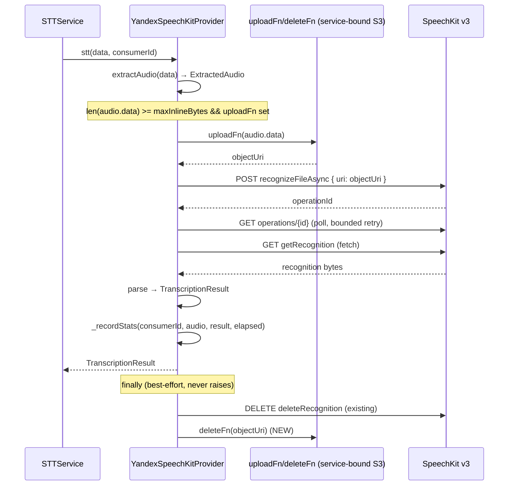

# Design: STT v1.1 — Object Storage routing (gate-3) + statistics recording (gate-4)

Status: **DESIGN (implementation pending)**  
Date: 2026-08-04  
Owner: TBD  
Companion docs: [`media-transcription-stt-v1.md`](./media-transcription-stt-v1.md) (parent v1 plan), [`lib-stt-v1.md`](./lib-stt-v1.md) (lib/stt spec), [`stt-next-steps.md`](./stt-next-steps.md) (integration roadmap + release gates), [`architecture.md`](../llm/architecture.md), [`configuration.md`](../llm/configuration.md), [`services.md`](../llm/services.md), [`libraries.md`](../llm/libraries.md)

> This is a design document only. It does not modify source code, config, or
> tests. Implementation is a later round via `software-developer`; the final
> documentation pass must load the `update-project-docs` skill.

## 1. Context and goal

The v1 STT feature ([`media-transcription-stt-v1.md`](./media-transcription-stt-v1.md),
[`stt-next-steps.md`](./stt-next-steps.md)) ships default-off, inline-only: every
transcribable clip is base64-encoded into the SpeechKit `content` field and POSTed
inline. The product caps the inline payload at 40 MiB (`max-inline-bytes`), well
under SpeechKit's 60 MB inline ceiling. Clips whose extracted form exceeds the inline
threshold cannot be transcribed today.

v1.1 adds two enhancements, each mapped to one of the manual release gates from
[parent §13.3](./media-transcription-stt-v1.md):

- **Enhancement 1 — gate-3 (inline vs Object Storage routing).** Clips below the
  threshold stay inline as today; clips at/above the threshold are uploaded to
  Yandex Object Storage (S3-compatible) and submitted via the `uri` field, raising
  the admissible payload from ~40 MiB inline to 1 GB via Object Storage. This is
  the code behind the gate-3 "inline-limit semantics" item: instead of merely
  *confirming* the inline ceiling, v1.1 *works around* it for large clips.
- **Enhancement 2 — gate-4 (statistics recording).** Per-transcription statistics
  (audio length + processing time + status/error) are recorded in `lib/stt`,
  mirroring how `lib/ai` already records LLM usage stats. This is observability to
  inform whether the 10-minute latency gate needs action; it is not a behavior
  change.

The remaining release gates — gate-2 (model), gate-5 (RSS), gate-6 (shutdown),
gate-7 (Alpine wheel), gate-8 (encoders), gate-9 (quality) — **require no code
changes from v1.1**. They are operational/confirmation gates (see §8).

### 1.1 Verified grounding (current state)

The following are facts verified against source, not assumptions:

- The Yandex provider builds the inline body in
  [`lib/stt/providers/yandex_speechkit.py`](../../lib/stt/providers/yandex_speechkit.py)
  `_buildSubmitBody` (lines 415-442): it base64-encodes `audio.data` into the
  `"content"` field and sets `container_audio.container_audio_type` from
  `audio.container.toYandexSpeechKit()`. **No `"uri"` field exists today.**
- The bytes that become the API payload are `audio.data` — the **extracted** audio
  produced by [`lib/stt/audio.py`](../../lib/stt/audio.py) `extractAudio()`
  (post pass-through/transcode), NOT the raw source bytes. The inline-vs-Object-Storage
  threshold therefore applies to `len(audio.data)`.
- Caps live in `STTService` (service layer), not in `lib/stt`
  ([`internal/services/stt/service.py`](../../internal/services/stt/service.py)).
  `SOURCE_TOO_LARGE` is produced at `service.py:272-273` when
  `len(data) > self._maxSourceBytes`. The current `[stt]` config has **no
  `max-inline-bytes` key** (it was shed when caps moved out of `lib/stt` and v1
  relied on the 60 MB vendor ceiling + the source-byte cap).
- `lib/stt` has a hard dependency firewall: zero `internal.*` imports, no singleton
  access. The proxy is injected as an already-resolved `ProxyConfig`
  ([`yandex_speechkit.py:146-266`](../../lib/stt/providers/yandex_speechkit.py));
  `YandexSpeechKitProvider` cannot import or call `StorageService` directly.
- S3 support already exists and is reusable:
  [`internal/services/storage/backends/s3.py`](../../internal/services/storage/backends/s3.py)
  `S3StorageBackend(endpoint, region, keyId, keySecret, bucket, prefix=...)` with
  `store(key, data)` (`:113-135`), `delete(key)` (`:191-215`), and custom-endpoint
  support (`:85-91`). `StorageService` (`internal/services/storage/service.py`) is a
  singleton wrapping one backend. boto3 is already pinned.
- **A concrete `StatsStorage` exists and is wired.**
  [`internal/database/stats_storage.py`](../../internal/database/stats_storage.py)
  `DatabaseStatsStorage` subclasses `lib.stats.StatsStorage`
  (`stats_storage.py:39`). It is constructed in [`main.py`](../../main.py) at lines
  82-94: when `[stats].enabled`, a `DatabaseStatsStorage(db, eventType="llm_request",
  dataSource=...)` is built and passed to `LLMManager(statsStorage=...)`; otherwise
  `None`, which `LLMManager` defaults to `NullStatsStorage`
  ([`lib/ai/manager.py:88`](../../lib/ai/manager.py)). `lib/ai` records via
  `_recordAttemptStats` ([`lib/ai/abstract.py:850-887`](../../lib/ai/abstract.py)).
  See §5.1 for the implication on STT.

## 2. Scope

### 2.1 Goals

1. Route clips below `max-inline-bytes` inline (unchanged) and clips at/above the
   threshold through Yandex Object Storage via the `uri` field, without breaking the
   `lib/stt` dependency firewall.
2. Reuse the existing `S3StorageBackend` / `StorageService` infrastructure; do not
   design a new S3 client.
3. Define a complete object lifecycle (upload → submit(uri) → poll → fetch → delete
   operation → delete object) with best-effort cleanup that never invalidates a
   successful transcript.
4. Add per-transcription statistics recording to `lib/stt`, mirroring `lib/ai`, so
   the gate-4 latency question can be answered from data.
5. Keep every new behavior default-off so a green v1.1 does not enable any billable
   Object-Storage traffic or stats writes until an operator turns it on.

### 2.2 Non-goals

- Speaker labeling, language auto-detection, streaming transcripts, a `/transcribe`
  command, or any structured transcript persistence (all inherited from v1
  non-goals).
- Decoded-PCM memory bounding inside `lib/stt` (the accepted decoded-memory gap,
  [`lib-stt-v1.md`](./lib-stt-v1.md) §5; revisit only if gate-5 fails).
- Per-chat STT statistics dashboards or retention policy (v1.1 records raw events
  into the existing `stat_events` table; aggregation/display reuse the
  `lib/ai`-shared `aggregate()` path).
- Changing the inline path for small clips — it stays byte-for-byte identical to v1.
- A killable-subprocess decode path or in-process hard shutdown deadline (gate-6;
  deferred as in v1).

## 3. The firewall tension and its resolution (Enhancement 1, core decision)

### 3.1 The tension

Object-Storage routing is fundamentally a *provider transport* concern: it decides
how the extracted bytes reach Yandex (inline in the POST body vs via a `uri`). But
the routing decision needs `len(audio.data)`, and `audio.data` is produced by
`extractAudio()` **inside `lib/stt`** — it does not exist at the service boundary.
The service hands the provider raw `bytes`, and only the provider (after extraction)
knows the payload size that would be base64'd or uploaded.

Meanwhile `lib/stt` cannot import `StorageService` (the firewall), and cap values
are service-owned.

### 3.2 Options considered

**(a) Inject a storage callable into the provider (chosen).** The service passes the
threshold value plus two async callables at provider construction:
`maxInlineBytes: int`, `uploadFn: Callable[[bytes], Awaitable[str]]` (uploads bytes,
returns the Object-Storage URI), and `deleteFn: Callable[[str], Awaitable[None]]`
(deletes by the same URI). The provider's `transcribe()` evaluates
`len(audio.data) >= maxInlineBytes` and routes accordingly. The provider owns the
routing logic; the service owns the threshold value and the storage capability.

**(b) Service-side upload.** `STTService` decides + uploads, then passes either bytes
or a URI to the provider; the provider's `_buildSubmitBody` branches on input type.

### 3.3 Decision: Option (a)

Option (a) is chosen. Justification:

- **Firewall integrity.** The provider never imports `internal.*`. It receives the
  storage capability as injected callables — the same seam pattern as the injected
  `ProxyConfig` (dependency-firewall seam #1,
  [`lib-stt-v1.md`](./lib-stt-v1.md) §1) and the (now-removed) typed loader seam.
  The provider stays independently unit-testable with mock callables (no real S3).
- **Correct measurement point.** The routing decision can only be made where
  `audio.data` exists — inside `transcribe()`. Option (b) cannot evaluate
  `len(audio.data)` at the service boundary without either (b1) routing on
  `len(data)` (source bytes), which is semantically wrong (the threshold applies to
  the *extracted* payload; on the transcode path `audio.data` can be far smaller than
  `data`), or (b2) splitting the never-raise `stt(data)` entry so the service
  inspects `ExtractedAudio` between extraction and transcription — breaking the clean
  boundary and pushing Yandex-specific URI construction into the service.
- **Provider owns its wire protocol.** The `uri` submit-body shape, the
  `container_audio_type` question for the `uri` path, and the operation/object
  delete ordering are Yandex wire details. They belong in the provider, not the
  service. Option (b) leaks them upward.
- **Cap ownership is preserved.** The threshold *value* is read from `[stt]` config
  and validated by the service, then injected — exactly like `requestTimeoutSeconds`,
  `operationBudgetSeconds`, and `maxResultBytes` are already injected provider caps
  ([`yandex_speechkit.py:146-250`](../../lib/stt/providers/yandex_speechkit.py)). The
  statement "caps live in `STTService`" refers to caps that gate *before* extraction
  (source bytes, duration, decoded buffer). The inline-routing threshold is
  categorically different: it can only be evaluated *after* extraction, so the check
  must run in the provider while the value remains service-supplied. This mirrors how
  `maxResultBytes` is injected into `parseRecognitionEvents` today.

### 3.4 The injected abstraction

New types live in `lib/stt` (the provider's contract surface; no `internal.*`
imports):

```python
from typing import Awaitable, Callable

#: Upload extracted audio bytes to Object Storage; return the URI SpeechKit consumes.
STTObjectUpload = Callable[[bytes], Awaitable[str]]

#: Delete the object identified by the URI returned by the matching STTObjectUpload.
#: Best-effort: must treat a missing object as a no-op (return without raising).
STTObjectDelete = Callable[[str], Awaitable[None]]
```

`YandexSpeechKitProvider.__init__` gains three optional keyword parameters:

```python
def __init__(
    self,
    *,
    proxyConfig: Optional[ProxyConfig] = None,
    apiKey: str,
    folderId: str,
    # ... existing caps ...
    maxResultBytes: int = DEFAULT_MAX_RESULT_BYTES,
    # --- v1.1 additions ---
    maxInlineBytes: int = 41_943_040,        # 40 MiB default; routing threshold
    uploadFn: Optional[STTObjectUpload] = None,
    deleteFn: Optional[STTObjectDelete] = None,
    statsStorage: "Optional[StatsStorage]" = None,   # §5
    **extraKwargs,
) -> None: ...
```

The pairing is deliberate: `uploadFn` and `deleteFn` are both-or-neither. The service
constructs them as a matched pair sharing key-derivation logic (the service owns the
URI format, so `deleteFn(uri)` can deterministically recover the object key). The
provider holds the URI returned by `uploadFn` and passes it back to `deleteFn`;
`lib/stt` never parses S3 keys or knows the URI scheme.

When `uploadFn is None` (Object Storage disabled), the provider is inline-only —
behaviorally identical to v1 for every clip below the threshold (see §4.2 for the
over-threshold failure).

## 4. Enhancement 1 — gate-3: inline vs Object Storage routing

### 4.1 Threshold semantics

| Knob | Default | Measured on | Relationship |
|---|---:|---|---|
| `max-source-bytes` | 1,073,741,824 (1 GiB) | `len(data)` (raw source, post-download) | Admission gate, enforced by `STTService` *before* the provider is called. Unchanged from v1. |
| `max-inline-bytes` | 41,943,040 (40 MiB) | `len(audio.data)` (extracted payload) | Routing threshold, evaluated by the provider *after* extraction. New in v1.1. |

A source up to 1 GiB remains admissible. If its extracted form is below
`max-inline-bytes`, it goes inline (v1 path, byte-for-byte identical). If its
extracted form is at/above `max-inline-bytes`, it routes to Object Storage (when
enabled). The vendor ceilings: 60 MB inline (base64-expanded), 1 GB Object-Storage
(raw), 4 h duration — v1.1 defaults stay conservative on all three, exactly as v1
([`lib-stt-v1.md`](./lib-stt-v1.md) §8.1).

The default `max-inline-bytes = 40 MiB` matches the v1 product cap
([`media-transcription-stt-v1.md`](./media-transcription-stt-v1.md) §8.1). v1.1
makes it **explicit and enforced** (it is currently documented but absent from
[`configs/00-defaults/stt.toml`](../../configs/00-defaults/stt.toml) because
inline-only v1 never needed to act on it).

### 4.2 Object Storage disabled + over-threshold clip

When `uploadFn is None` (Object Storage not configured) and
`len(audio.data) >= maxInlineBytes`, the clip cannot be transcribed: inlining it
would exceed the 60 MB vendor ceiling after base64 expansion, and there is no Object
Storage fallback.

**Decision:** the provider returns `TranscriptionResult(status=ERROR,
errorCode=SOURCE_TOO_LARGE)`. This reuses the existing `SOURCE_TOO_LARGE` code with
a documented ownership extension (§4.5). The operator remedy is uniform: enable
Object Storage or raise the threshold. The tradeoff — a clip whose source is within
`max-source-bytes` but whose extracted form exceeds the inline threshold is rejected
without OS — is accepted and is the explicit reason v1.1 introduces Object Storage.

### 4.3 Object lifecycle

The provider's `transcribe()` extends the existing lifecycle
([`yandex_speechkit.py:280-355`](../../lib/stt/providers/yandex_speechkit.py)):

```text
transcribe(audio):
    objectUri = None
    # Staging (OUTSIDE the operation budget — upload is prep, not a SpeechKit op step).
    if len(audio.data) >= maxInlineBytes:
        if uploadFn is None:
            return ERROR(SOURCE_TOO_LARGE)          # §4.2
        try:
            objectUri = await uploadFn(audio.data)   # upload to OS, get URI
        except Exception:
            return ERROR(OBJECT_STORAGE_ERROR)       # §4.5
    # SpeechKit operation (INSIDE the operation budget, unchanged from v1).
    try:
        async with asyncio.timeout(operationBudgetSeconds):
            operationId = await submit(audio, objectUri)   # branches content vs uri
            recognitionBytes = await pollAndFetch(operationId)
    except _ProviderFailure / Timeout / Exception:
        return ERROR(...)                              # existing mapping
    finally:
        if operationId is not None:
            await bestEffortDeleteOperation(operationId)   # existing (§7.2)
        if objectUri is not None:
            await bestEffortDeleteObject(objectUri)        # NEW: best-effort, never raises
    return parse(recognitionBytes)                      # existing
```

Key lifecycle rules:

- **Upload is outside the operation budget.** The 180 s (configurable) budget "starts
  immediately before submit and includes submit, polling, and the successful result
  fetch" ([`lib-stt-v1.md`](./lib-stt-v1.md) §7.4). The upload is staging, not a
  SpeechKit operation step; it is bounded by the S3 client's own transport timeouts
  (see §6.4). Keeping the upload outside the budget preserves the budget's semantics
  unchanged.
- **Object delete is best-effort and never invalidates a successful transcript** —
  the same contract as the existing operation delete
  ([`yandex_speechkit.py:575-595`](../../lib/stt/providers/yandex_speechkit.py)).
  `bestEffortDeleteObject` wraps `deleteFn` in `try/except`, logs a warning on
  failure, and returns. It runs in the `finally` block after the operation delete.
- **Idempotency of delete on a missing object.** `deleteFn` (service-bound to
  `S3StorageBackend.delete`) must treat a missing object as a no-op.
  `S3StorageBackend.delete` already returns `False` for a missing key instead of
  raising ([`s3.py:191-215`](../../internal/services/storage/backends/s3.py)); the
  service's `deleteFn` closure preserves this, and the provider's
  `try/except` is defense-in-depth.
- **Upload failure → `OBJECT_STORAGE_ERROR`** (§4.5), returned before any submit. No
  operation is created, so no operation delete is needed; the `finally` skips the
  object delete because `objectUri` was never assigned.
- **Operation failure after a successful upload** still triggers the object delete in
  `finally` — the staged object must not leak just because recognition failed.

### 4.4 Submit body shape (content vs uri)

`_buildSubmitBody` branches on whether a URI is present. The `recognition_model`
block (model, `audio_format.container_audio`, `language_restriction`,
`text_normalization`) is **identical** for both paths; only the top-level input field
differs:

```jsonc
// Inline path (unchanged from v1)
{
  "content": "<base64 of audio.data>",
  "recognition_model": { "model": "general",
    "audio_format": { "container_audio": { "container_audio_type": "OGG_OPUS" } },
    "language_restriction": { "restriction_type": "WHITELIST", "language_code": ["ru-RU"] },
    "text_normalization": { "literature_text": true } }
}

// Object-Storage path (new)
{
  "uri": "<URI returned by uploadFn>",
  "recognition_model": { /* identical to the inline block above */ }
}
```

The design includes `container_audio.container_audio_type` on the `uri` path too (the
uploaded bytes are in a known container — the extracted audio's container). Whether
SpeechKit *requires* or *ignores* it on the `uri` path is a verification point for
the smoke test (§11); including correct metadata is the safe default. The exact URI
scheme SpeechKit expects (`s3://bucket/key` vs an HTTPS URL) is likewise a smoke
verification item — the service constructs the URI, so the format is operator-facing
config, not a `lib/stt` concern.

### 4.5 Error codes

Two error-code changes accompany Object-Storage routing:

1. **New: `OBJECT_STORAGE_ERROR`** (provider-owned group, alongside
   `PROVIDER_ERROR` / `PROTOCOL_ERROR`). Surfaced by the provider when `uploadFn` or
   `deleteFn` raises (upload failure before submit; or — if a non-best-effort
   surface ever needs it — a delete failure that escapes the best-effort wrapper).
   Rationale: a distinct, actionable category. "Couldn't stage the clip in Object
   Storage" has a different operator remedy (bucket/credentials/network/roles) than
   "SpeechKit recognition failed" (`PROVIDER_ERROR`) or "clip too large, OS not
   enabled" (`SOURCE_TOO_LARGE`). The v1 enum had exactly eight members; v1.1 adds a
   ninth because it introduces a genuinely new transport mode.
2. **Extended: `SOURCE_TOO_LARGE`** ownership. Currently documented as
   "STTService vocabulary; never produced inside `lib/stt`"
   ([`lib-stt-v1.md`](./lib-stt-v1.md) §4). v1.1 extends it: the provider now also
   surfaces `SOURCE_TOO_LARGE` for the "extracted payload ≥ inline threshold AND
   Object Storage disabled" case (§4.2). The ownership docstring is updated to:
   "produced by `STTService` (source-byte cap) and surfaced by the Yandex provider
   (inline-threshold exceeded without Object-Storage fallback)."

   **Minimal alternative (rejected):** reuse `PROVIDER_ERROR` for both cases and
   avoid touching the enum. Rejected because it collapses three distinct operator
   remedies into one opaque code, defeating the observability goal of gate-4. If the
   team prefers to avoid any enum growth, `PROVIDER_ERROR` is the fallback — but the
   design recommends the two changes above.

## 5. Enhancement 2 — gate-4: statistics recording in lib/stt

### 5.1 Concrete StatsStorage finding (resolved)

The research open question — "is a concrete `StatsStorage` wired in the service
layer, or does everything hit `NullStatsStorage`?" — is **resolved: a concrete,
DB-backed `StatsStorage` exists and is wired for `lib/ai`.**

- [`internal/database/stats_storage.py`](../../internal/database/stats_storage.py)
  `DatabaseStatsStorage` (line 39) subclasses `lib.stats.StatsStorage`. It writes raw
  events to `stat_events` and aggregates into `stat_aggregates`, both in a named data
  source.
- It is constructed in [`main.py`](../../main.py) at lines 82-94, gated on
  `[stats].enabled` (default `false`, [`configs/00-defaults/stats.toml`](../../configs/00-defaults/stats.toml)),
  with `eventType="llm_request"` and a `dataSource` from `[stats].llm-stats-data-source`.
- When stats is disabled, `LLMManager` receives `None` and defaults to
  `NullStatsStorage` ([`lib/ai/manager.py:88`](../../lib/ai/manager.py)).

**Implication for STT:** v1.1 reuses the same `DatabaseStatsStorage` class with a
distinct `eventType="stt_request"` discriminator, so STT events stay separate from
LLM events in `stat_events` without a new table or migration. The stats gate is a
dedicated `[stt].stats-enabled` flag (§6.3), independent of `[stats].enabled`, so
operators can measure STT latency in isolation for gate-4 without collecting all LLM
stats.

### 5.2 Injection and recording point

`StatsStorage` is injected into `YandexSpeechKitProvider.__init__` (§3.4), defaulting
to `NullStatsStorage` when not supplied — identical to the `lib/ai` injection pattern
([`lib/ai/abstract.py:91-133`](../../lib/ai/abstract.py)). The wiring path:

1. [`main.py`](../../main.py) constructs `sttStatsStorage` (a
   `DatabaseStatsStorage(eventType="stt_request")` when `[stt].stats-enabled`, else
   `None`) alongside the existing `llmStatsStorage` block.
2. `STTService.initialize(configManager, statsStorage=sttStatsStorage)` stores it and
   passes it to the provider constructor. (`STTService.initialize` currently takes
   only `configManager`; v1.1 adds the optional `statsStorage` parameter.)
3. The provider holds `self.statsStorage` and records after every `transcribe()`.

**Recording scope (deliberate boundary).** Stats are recorded inside
`YandexSpeechKitProvider.transcribe()` — the SpeechKit interaction (staging upload +
submit + poll + fetch + parse), for both success and failure. Extraction failures
(`NO_AUDIO`, `AudioDecodeError`, `EncoderError`) occur in `stt()` *before*
`transcribe()` is reached and are therefore **not** recorded as provider stats in
v1.1; they remain operator-visible via the existing structured logs and the terminal
`FAILED` row. Rationale: gate-4 is specifically about SpeechKit processing latency
for large clips; extraction is bounded by the source/duration caps and is a separate
(PyAV) concern. This boundary is documented; extraction-failure observability can be
added later by extending `stt()` if needed.

**Consumer dimension.** To mirror `lib/ai`'s per-consumer rollup, v1.1 threads an
optional `consumerId` through the call chain: `AbstractSTTProvider.stt(data, *,
consumerId=None)` (concrete on the base) forwards to
`transcribe(audio, *, consumerId=None)` (abstract signature gains the keyword-only
param; the one concrete impl accepts it). `STTService.transcribeMedia` passes
`str(chatId) if chatId is not None else None`. Default `None` → global rollup only
(`GLOBAL_CONSUMER_ID`). This is a minor, backward-compatible contract evolution of
the `lib/stt` abstract surface; [`lib-stt-v1.md`](./lib-stt-v1.md) §8 ("takes
`ExtractedAudio` only") must be updated when implemented to note the new keyword-only
`consumerId` (a stats dimension, not a chat-settings argument).

### 5.3 Stats dict and labels

`YandexSpeechKitProvider._recordStats()` mirrors `lib/ai`'s
`_recordAttemptStats` ([`lib/ai/abstract.py:850-887`](../../lib/ai/abstract.py))
exactly in shape: best-effort, wrapped in `try/except` that logs and swallows.

```python
async def _recordStats(
    self, *, consumerId: Optional[str], audio: ExtractedAudio,
    result: TranscriptionResult, elapsedSeconds: float,
) -> None:
    """Record one STT attempt. Best-effort — never raises (mirrors lib/ai)."""
    try:
        await self.statsStorage.record(
            stats={
                "generation_stt": 1,                      # mirrors generation_{type}
                "request_count": 1,                        # mirrors lib/ai
                "audio_duration_ms": audio.durationMs,     # STT input-size dimension
                "elapsed_time": elapsedSeconds,            # wall-clock of transcribe()
                "is_error": 1 if result.status is STTResultStatus.ERROR else 0,
                f"status_{result.status.name}": 1,         # status_FINAL/NO_SPEECH/ERROR
            },
            consumerId=consumerId,
            labels={
                "provider": "yandex-speechkit",
                "generationType": "stt",
                "status": result.status.name,
                "model": self._model,
            },
        )
    except Exception:
        logger.error("Failed to record STT stats")
        logger.exception(...)
```

- `audio_duration_ms` (from `ExtractedAudio.durationMs`) is the STT analogue of
  `lib/ai`'s `input_tokens` — it lets operators correlate latency to audio length,
  which is the exact correlation gate-4 needs ("does a 10-minute clip process within
  budget?").
- `elapsed_time` is the wall-clock of `transcribe()` (entry to result). For the
  Object-Storage path this includes the upload; for the inline path it does not.
  Extraction time (PyAV) is excluded (see §5.2 boundary).
- `is_error` and `status_{STATUS}` mirror `lib/ai`'s status dimensions verbatim.
- The `error` label is intentionally omitted at v1.1; the `status_ERROR` +
  `errorCode`-in-logs combination is sufficient. (If label-level error breakdown is
  wanted later, add `"errorCode": result.errorCode.value if result.errorCode else ""`
  — but `errorCode` is not always present on non-ERROR results, so it is deferred.)

## 6. Configuration

### 6.1 `[stt]` additions

Added to [`configs/00-defaults/stt.toml`](../../configs/00-defaults/stt.toml):

```toml
[stt]
# ... existing keys unchanged ...

# v1.1 — gate-3 routing threshold (made explicit + enforced).
# Clips whose extracted form (len(audio.data)) is below this go inline;
# at/above this they route to Object Storage (when enabled). Default 40 MiB
# keeps base64-expanded requests under the 60 MB vendor inline ceiling.
max-inline-bytes = 41943040

# v1.1 — gate-3 Object Storage enable flag. When false (default), STT is
# inline-only; clips whose extracted form >= max-inline-bytes fail with
# SOURCE_TOO_LARGE. When true, such clips are uploaded and submitted via uri.
object-storage-enabled = false

# v1.1 — gate-4 statistics enable flag. Independent of [stats].enabled.
# When true, per-transcription stats are recorded (eventType="stt_request").
stats-enabled = false
```

### 6.2 `[stt.object-storage]` subsection (optional override)

By default, when `object-storage-enabled = true` and `[stt.object-storage]` is
**absent**, STT reuses the shared `StorageService` backend (i.e. `[storage.s3]`,
requiring `[storage].type = "s3"`). This is the minimal-surprise path for simple
deployments: one S3 backend, already configured.

When STT must use a **different bucket** than attachment storage (the common case —
STT clips are short-lived and large; attachment storage is long-lived), an explicit
`[stt.object-storage]` subsection overrides it. The keys mirror `[storage.s3]`:

```toml
[stt.object-storage]
# Present only when STT uses a dedicated S3 bucket. Omit to reuse [storage.s3].
endpoint = "https://storage.yandexcloud.net"
region = "ru-central1"
key-id = "${YC_S3_KEY_ID}"
key-secret = "${YC_S3_SECRET_KEY}"
bucket = "stt-clips"
prefix = "stt/"          # isolates STT objects in a shared/dedicated bucket
```

Resolution in `STTService.initialize`:

- `object-storage-enabled = false` → `uploadFn = deleteFn = None` (inline-only).
- `object-storage-enabled = true` + `[stt.object-storage]` present → construct a
  dedicated `S3StorageBackend` from the subsection (REUSE the existing class; no new
  S3 client) and build the `uploadFn` / `deleteFn` closures bound to it.
- `object-storage-enabled = true` + `[stt.object-storage]` absent → use
  `StorageService.getInstance()` (the shared backend) and build the closures bound to
  it. Requires `[storage].type = "s3"`; startup validation rejects the combination
  "OS enabled, no subsection, non-S3 shared backend" with a clear error.

The `uploadFn` closure generates a unique object key (UUID-based), applies the
configured `prefix`, calls `backend.store(key, audio.data)`, and returns the URI.
The `deleteFn` closure recovers the key from the URI (the service owns the URI
format, so the mapping is deterministic) and calls `backend.delete(key)`. The
`prefix` isolates STT objects from attachment storage in a shared bucket.

### 6.3 `stats-enabled` flag

`[stt].stats-enabled` (default `false`) is **independent of `[stats].enabled`**.
Rationale: gate-4 is specifically about measuring STT latency; an operator should be
able to enable STT stats without enabling full LLM stats (and its DB write volume).
When `true`, [`main.py`](../../main.py) constructs
`DatabaseStatsStorage(db, eventType="stt_request",
dataSource=<from [stats].llm-stats-data-source or default>)` and passes it to
`STTService.initialize`. When `false`, the provider receives `None` → defaults to
`NullStatsStorage` (no-op). The `eventType="stt_request"` discriminator keeps STT
events separate from `llm_request` events without a new table.

### 6.4 Validation

Startup validation (in `STTService.initialize` and/or the provider constructor,
following the v1 pattern in [`yandex_speechkit.py:209-237`](../../lib/stt/providers/yandex_speechkit.py)):

- `max-inline-bytes` positive and `<= 60_000_000` (the vendor inline ceiling is 60 MB
  *base64-expanded*; 40 MiB raw → ~53 MB base64, safely under). Reject a default
  above the safe inline ceiling.
- When `object-storage-enabled = true`:
  - If `[stt.object-storage]` present: required keys `endpoint`, `region`, `key-id`,
    `key-secret`, `bucket` non-empty and free of unresolved `${...}` placeholders.
  - If `[stt.object-storage]` absent: `[storage].type == "s3"` (reject otherwise).
- Unresolved `${...}` placeholders in any Object-Storage credential → startup fail
  (same rule as the existing Yandex credential validation).
- `stats-enabled` requires no extra validation (`NullStatsStorage` is the safe
  default; a missing `stat_events` table would surface as a best-effort log error,
  never a transcription failure).

**S3 transport timeouts (dependency note).** `S3StorageBackend` currently constructs
the boto3 client without a `botocore.config.Config` (no explicit connect/read
timeouts or retry caps). The v1 parent plan §8.3 proposed adding
`connect-timeout-seconds` / `read-timeout-seconds` / `total-max-attempts` to
`[storage.s3]`. v1.1's STT uploads are bounded in practice by the provider's
best-effort handling (upload failure → `OBJECT_STORAGE_ERROR`, never a hang that
blocks shutdown beyond the accepted v1 native-hang limitation), but **properly
bounded S3 timeouts should land alongside or before v1.1** so a wedged Object
Storage endpoint cannot hold a semaphore slot indefinitely. If the §8.3 storage
timeout proposal has not landed, v1.1 should extend `S3StorageBackend` (or the
`[stt.object-storage]` client construction) with a `botocore.config.Config` carrying
finite connect/read timeouts and bounded attempts.

## 7. Object lifecycle — sequence (Object-Storage path)



The inline path omits the upload/delete-object steps and is otherwise identical.

## 8. Release-gate scope (what v1.1 does and does not touch)

v1.1 delivers the **code** behind two release gates:

- **gate-3** — inline-limit semantics. v1.1 implements Object-Storage routing so
  clips over the inline threshold are transcribable instead of merely rejected. The
  *manual confirmation* parts of gate-3 (exact URI scheme, whether
  `container_audio_type` is required on the `uri` path, the 60 MB inline-vs-base64
  behavior) remain smoke-test activities (§11), but the code they exercise is what
  v1.1 adds.
- **gate-4** — 10-minute end-to-end latency. v1.1 adds the stats recording that lets
  gate-4 be answered from data (`audio_duration_ms` vs `elapsed_time`). The actual
  latency *measurement* against representative 10-minute media remains a manual smoke
  activity.

The other release gates **require no code changes from v1.1** and are not in scope:

| Gate | Why no v1.1 code |
|---|---|
| gate-2 (model) | Configuration/operational confirmation; model is a config value. |
| gate-5 (RSS) | Operational measurement; decoded-memory bounding is the accepted v1 gap (revisit only if measurement fails). |
| gate-6 (shutdown) | Operational; the graceful-drain ordering is unchanged. Object-Storage cleanup is best-effort in `finally` and does not alter shutdown semantics. |
| gate-7 (Alpine wheel) | CI/container proof; PyAV pinning unchanged. |
| gate-8 (encoders) | Already verified present; PyAV pinning unchanged. |
| gate-9 (quality) | Operational comparison; recognition path unchanged for inline clips. |

## 9. Implementation plan (high-level — for the future round)

This is a design doc; the steps below sketch the future implementation round for
`software-developer`. Each step must run `make format lint` and `make test` (load
the `run-quality-gates` skill); bug fixes must load `write-regression-test`.

| Step | Work | Verification |
|---:|---|---|
| 1 | Add `OBJECT_STORAGE_ERROR` to `STTErrorCode` and update its ownership docstring; extend `SOURCE_TOO_LARGE` ownership docstring. | Enum membership tests; ownership-docstring assertions in `tests/lib/stt/test_models.py`. |
| 2 | Add `STTObjectUpload` / `STTObjectDelete` types and the three new constructor params (`maxInlineBytes`, `uploadFn`, `deleteFn`, `statsStorage`) to `YandexSpeechKitProvider`. | Provider construction tests (inline-only default; OS-enabled wiring). |
| 3 | Extend `_buildSubmitBody` to branch `content` vs `uri`; extend `transcribe()` with the §4.3 lifecycle (upload outside budget; object delete in `finally`). | Golden-HTTP tests for the `uri` body shape + lifecycle; mock-callable upload/delete (no real S3). Assert upload failure → `OBJECT_STORAGE_ERROR`; OS-disabled + over-threshold → `SOURCE_TOO_LARGE`; object delete never raises / never invalidates a success. |
| 4 | Add `_recordStats` + thread `consumerId` through `stt()`/`transcribe()`; inject `statsStorage` (default `NullStatsStorage`). | Stats-recording tests with a recording fake `StatsStorage`; assert best-effort (never raises); assert `NullStatsStorage` default is a no-op. |
| 5 | Extend `STTService.initialize(configManager, statsStorage=...)`: read `max-inline-bytes`/`object-storage-enabled`/`stats-enabled`; build `uploadFn`/`deleteFn` from `StorageService` or a dedicated `S3StorageBackend`; pass threshold + callables + stats into the provider. | Service tests: inline-only when OS disabled; dedicated-vs-shared backend selection; closure key isolation; stats-on/stats-off. |
| 6 | Update [`configs/00-defaults/stt.toml`](../../configs/00-defaults/stt.toml) with the §6.1 keys; update [`main.py`](../../main.py) to construct `sttStatsStorage` and pass it to `STTService.initialize`. | Config print/validate tests; startup-without-credentials tests; disabled-STT starts without S3/PyAV. |
| 7 | Run the §11 smoke verifications against live SpeechKit + Object Storage. | Record only redacted structural output (URI scheme, container_audio behavior, latency). No secrets/audio/transcripts stored. |
| 8 | Documentation pass (§10) + `CHANGELOG.md` `Added`/`Changed` entries. | `make check-docs`, `make format lint`, `make test`, `make ci`. |

Dependency note: if bounded S3 timeouts (§6.4) are not yet in `S3StorageBackend`,
step 5/6 must add them (or depend on the v1 §8.3 proposal landing first).

## 10. Documentation impact

After implementation, load `update-project-docs` and update:

- [`docs/llm/libraries.md`](../llm/libraries.md): `lib/stt` gains Object-Storage
  routing (the injected callable seam) and stats recording.
- [`docs/design/lib-stt-v1.md`](./lib-stt-v1.md): §4 (`STTErrorCode` — add
  `OBJECT_STORAGE_ERROR`, extend `SOURCE_TOO_LARGE` ownership), §7.1 (the `uri` body
  shape), §8 (`transcribe` signature gains keyword-only `consumerId`; "takes
  ExtractedAudio only" caveat), §8.1 cap table (`max-inline-bytes` now enforced;
  Object-Storage row).
- [`docs/llm/services.md`](../llm/services.md): `STTService.initialize` signature
  change; Object-Storage backend selection; stats wiring.
- [`docs/llm/configuration.md`](../llm/configuration.md): `[stt]` new keys,
  `[stt.object-storage]` subsection, `stats-enabled` flag.
- [`docs/design/stt-next-steps.md`](./stt-next-steps.md): mark gate-3/gate-4 code as
  delivered (manual confirmation parts remain).
- [`docs/llm/architecture.md`](../llm/architecture.md): note the injected-storage
  seam in the `lib/stt` firewall description (a third seam alongside proxy +
  raw-bytes).
- `CHANGELOG.md`: one `Added` entry (Object-Storage routing) and one `Changed` entry
  (STT stats recording), under `## [Unreleased]`.

## 11. Open questions / verification items (deferred to the SpeechKit smoke)

These require live SpeechKit + Object Storage credentials and cannot be resolved by
static review. They do **not** block the design — the code is shaped to make them
config/smoke confirmations, not architectural dependencies.

1. **URI scheme.** Whether SpeechKit consumes `s3://bucket/key`, an HTTPS URL, or a
   `https://storage.yandexcloud.net/bucket/key` form. The service constructs the URI
   (operator-facing), so this is a config/format confirmation, not a `lib/stt`
   change.
2. **`container_audio_type` on the `uri` path.** Whether SpeechKit requires, ignores,
   or rejects the `audio_format.container_audio` block when input is a `uri`. The
   design includes it (safe default); the smoke confirms.
3. **Service-account roles.** Object Storage upload/delete needs `storage.editor`
   (or uploader + deleter) for the bot's credentials; SpeechKit reading the object
   needs the folder's service account to have read access (`storage.viewer` or a
   bucket ACL). Deployment/verification concern.
4. **1 GB Object-Storage limit semantics.** Confirmed raw (not base64); the smoke
   should confirm a large (but `< max-source-bytes`) clip round-trips.
5. **gate-3 inline confirmation (carried from v1).** Confirm the 60 MB inline ceiling
   is on the base64-expanded payload; the product stays at the conservative 40 MiB
   default regardless.
6. **gate-4 latency measurement.** Using the new stats, measure p95 `elapsed_time`
   for representative 10-minute media and decide whether the duration default or the
   originating-turn wait needs adjustment (per parent §13.3 gate-4).

No secrets, full audio, full transcripts, or authorization headers may be stored in
smoke-test artifacts.

## 12. Alternatives and trade-offs

| Alternative | Decision |
|---|---|
| Service-side upload (Option (b) in §3) | Rejected. Cannot evaluate `len(audio.data)` at the service boundary without splitting the never-raise `stt(data)` entry or routing on the wrong byte count; leaks Yandex wire details into the service. |
| New S3 client inside `lib/stt` | Rejected. Violates the firewall and duplicates `S3StorageBackend`. v1.1 reuses the existing backend via injected callables. |
| Dedicated `[stt.object-storage]` only (no `[storage.s3]` reuse) | Rejected as the sole option. Reuse-by-default with optional override is less surprising for simple deployments. |
| Reuse `[stats].enabled` for STT stats (no dedicated flag) | Rejected. gate-4 wants STT latency in isolation; a dedicated `stats-enabled` avoids forcing full LLM stats on. |
| Reuse `PROVIDER_ERROR` for upload/delete failures (no new enum member) | Rejected as primary (collapses operator remedies); documented as the acceptable minimal fallback. |
| Record stats in `stt()` (abstract base) to capture extraction failures | Deferred. The base lacks provider metadata (`model`); v1.1 scopes stats to the concrete provider's `transcribe()` and documents the boundary (§5.2). |
| Bound the upload inside the SpeechKit operation budget | Rejected. The budget covers submit/poll/fetch by definition (§7.4); upload is staging and is bounded by S3 transport timeouts (§6.4). |
