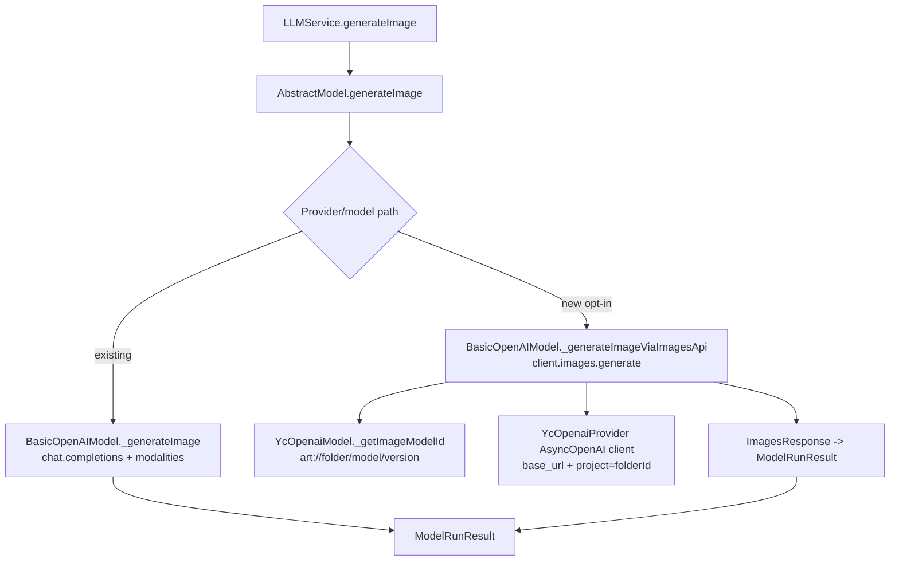

# YC OpenAI Images API Design v1

**Author:** OpenCode Architect
**Date:** 2026-05-21
**Status:** Proposed

---

## Context & Goal

Gromozeka already supports image generation through two different stacks:

- the native YC SDK / YandexART path (`yandex-art`), and
- OpenAI-compatible providers that currently generate images through `chat.completions.create(..., modalities=["image", "text"])`.

The new requirement is to add support for Yandex Cloud's new image model `aliceai-image-art-3.0`, which is exposed through the **OpenAI Images API** (`client.images.generate(...)`), without replacing the current image-generation mechanism used by other providers.

The design goal is therefore:

1. add a **new** OpenAI Images API execution path in `lib/ai/providers/basic_openai_provider.py`,
2. keep the current chat-completions image path intact,
3. use the new path for `yc-openai` image models that opt into it,
4. keep the public `AbstractModel.generateImage()` / `LLMService.generateImage()` contract unchanged, and
5. keep the current bot defaults unchanged for rollout safety.

User clarifications captured before this design:

- **Default rollout:** keep the current default image model for now.
- **V1 scope:** configurable **non-streaming** image generation.
- **Options location:** operator-level `model extraConfig`, not new chat settings.
- **YC example available:** yes; see “External API Findings”.

---

## Current State

### Existing image flow in `lib/ai`

The current OpenAI-compatible image path is implemented in `BasicOpenAIModel._generateImage()` and uses `chat.completions.create()` with `modalities = ["image", "text"]` (`lib/ai/providers/basic_openai_provider.py:502-596`).

That path assumes the returned chat message contains `message.images[*].image_url.url` as a data URL, which the method base64-decodes into `ModelRunResult.mediaData`.

This works for the current OpenRouter image models and any other provider that exposes image generation through chat-completions-style multimodal output.

### YC OpenAI provider today

The YC OpenAI-compatible provider already uses the correct base URL for OpenAI-compatible traffic: `https://ai.api.cloud.yandex.net/v1` (`lib/ai/providers/yc_openai_provider.py:232-242`).

For text models, `YcOpenaiModel._getModelId()` constructs model URIs in `gpt://<folderId>/<modelId>/<modelVersion>` format (`lib/ai/providers/yc_openai_provider.py:126-150`).

The provider currently does **not** add OpenAI client `project`/folder metadata during client initialization; `BasicOpenAIProvider._initClient()` only passes `api_key`, `base_url`, and subclass-supplied extra client params (`lib/ai/providers/basic_openai_provider.py:677-700`).

### Callers above `lib/ai`

`LLMService.generateImage()` resolves the configured image model and calls:

```python
await imageGenerationModel.generateImage(
    [ModelMessage(content=prompt)],
    fallbackModels=[fallbackImageLLM],
)
```

(`internal/services/llm/service.py:871-910`)

This is important because it means the new OpenAI Images API path does **not** need a new service or handler contract. The current callers already pass a single plain-text prompt wrapped in one `ModelMessage`.

### Existing config state

The repo already contains a YC OpenAI model entry for the new image model:

- `configs/00-defaults/yc-openai-models.toml:123-133`

```toml
[models.models."aliceai-image-art"]
provider = "yc-openai"
model_id = "aliceai-image-art-3.0"
model_version = "latest"
support_tools = false
support_text = false
support_images = true
support_structured_output = false
```

However, the bot default still points to the older native YC image model:

- `configs/00-defaults/bot-defaults.toml:151-152`

```toml
image-generation-model          = "yandex-art"
image-generation-fallback-model = "openrouter/gemini-2.5-flash-image"
```

So the codebase is already partially prepared for the new model, but the actual `yc-openai` image execution path is not wired for the OpenAI Images API yet.

---

## External API Findings

### OpenAI Images API shape

The pinned SDK in this repo is `openai==2.36.0` (`requirements.txt:39`).

That SDK already exposes a first-class async Images API:

- `AsyncOpenAI.images.generate(...)`
- request parameters include `prompt`, `model`, `size`, `quality`, `output_format`, `background`, `moderation`, `n`, `response_format`, `stream`, `style`, `user`
- non-streaming returns `ImagesResponse`
- `ImagesResponse.data[*]` can contain `b64_json` and/or `url`
- `ImagesResponse.usage` may be present for GPT-style image models

References:

- OpenAI API reference: `POST /images/generations`
- OpenAI Python SDK 2.36.0: `src/openai/resources/images.py`
- OpenAI Python SDK 2.36.0: `src/openai/types/image_generate_params.py`
- OpenAI Python SDK 2.36.0: `src/openai/types/images_response.py`
- OpenAI Python SDK 2.36.0: `src/openai/types/image.py`

### YC public docs: partial coverage only

Public YC docs currently confirm the following:

1. `Yandex Cloud AI Studio` exposes image generation through its native image-generation APIs.
2. The common-models page still documents `YandexART` as:

   - `art://<folder_ID>/yandex-art-2.0`
   - available via **Image generation APIs**

   Source: `https://yandex.cloud/en/docs/ai-studio/concepts/generation/models`

3. The native async image-generation API uses the `art://...` model URI pattern and folder-scoped auth.

4. AI Studio API keys can be granted image-generation scope `yc.ai.imageGeneration.execute`.

   Source: `https://yandex.cloud/en/docs/ai-studio/operations/get-api-key`

### YC docs gap for `aliceai-image-art-3.0`

At the time of writing, the YC documentation surfaces available through public docs / documentation search do **not** clearly document `aliceai-image-art-3.0` under the OpenAI-compatible Images API.

This is documentation drift / rollout lag, not necessarily a blocker, because the user provided a vendor-supplied working example.

### Vendor-provided YC example

The concrete working example provided by the requester is:

```python
import openai
import base64

YANDEX_CLOUD_FOLDER = "<FOLDER_ID>"
YANDEX_CLOUD_API_KEY = "<API_key_value>"
YANDEX_CLOUD_MODEL = "aliceai-image-art-3.0/latest"

client = openai.OpenAI(
  api_key=YANDEX_CLOUD_API_KEY,
  base_url="https://ai.api.cloud.yandex.net/v1",
  project=YANDEX_CLOUD_FOLDER
)

img = client.images.generate(
  model=f"art://{YANDEX_CLOUD_FOLDER}/{YANDEX_CLOUD_MODEL}",
  prompt="Нарисуй кота",
  size="1024x1024"
)

image_bytes = base64.b64decode(img.data[0].b64_json)
```

This example is the strongest source of truth for the new YC integration path. It establishes three critical facts:

1. the base URL remains `https://ai.api.cloud.yandex.net/v1`,
2. the OpenAI client should be initialized with `project=<folderId>`, and
3. the image model URI should be `art://<folderId>/aliceai-image-art-3.0/latest`.

---

## Proposed Design

### Overview

Introduce a **second** image-generation transport in `BasicOpenAIModel`:

- existing transport: `chat.completions.create(..., modalities=["image", "text"])`
- new transport: `images.generate(...)`

Only models explicitly configured for the new transport should use it.

That yields a low-risk architecture:

- OpenRouter image models continue using the existing path.
- Native YC SDK / YandexART remains unchanged.
- New YC OpenAI image models opt into the Images API path.

### Proposed component changes

#### 1. `BasicOpenAIModel`: add a reusable OpenAI Images API helper

Add a new internal helper to `lib/ai/providers/basic_openai_provider.py`, for example:

- `_generateImageViaImagesApi(messages: Sequence[ModelMessage]) -> ModelRunResult`

This helper should:

1. validate that image generation is supported,
2. extract a single text prompt from `messages`,
3. build a whitelisted `images.generate(...)` request,
4. call `await self._client.images.generate(...)`,
5. map the response back into `ModelRunResult`, and
6. preserve the current single-image binary output contract.

This helper is additive. It does **not** replace the current `_generateImage()` implementation.

#### 2. `BasicOpenAIModel`: add image-specific hooks

To keep the new helper reusable without hardcoding YC logic into it, add two small hooks:

- `_getImageModelId() -> str`
- `_getImageRequestOptions() -> Dict[str, Any]`

Recommended behavior:

- `BasicOpenAIModel._getImageModelId()` default: return `self._getModelId()`.
- `BasicOpenAIModel._getImageRequestOptions()` default: return sanitized, whitelisted options from `extraConfig`.

This lets provider-specific subclasses override only what differs.

#### 3. `YcOpenaiProvider`: pass `project=<folderId>` into the OpenAI client

Override `_getClientParams()` in `YcOpenaiProvider` so the underlying `AsyncOpenAI` client is created with:

```python
{
    "project": self._folderId,
}
```

Rationale:

- the vendor-provided working example explicitly uses `project=folderId`,
- the repo already has a provider hook for extra client params (`BasicOpenAIProvider._getClientParams()`), and
- this keeps the change localized to the YC OpenAI provider.

#### 4. `YcOpenaiModel`: build `art://...` model IDs for the Images API

Override `_getImageModelId()` in `YcOpenaiModel` so image models use:

```text
art://<folderId>/<modelId>/<modelVersion>
```

Example result for the current config:

```text
art://<folderId>/aliceai-image-art-3.0/latest
```

This differs intentionally from text generation, which uses `gpt://...` (`lib/ai/providers/yc_openai_provider.py:126-150`).

#### 5. `YcOpenaiModel`: select transport via explicit config flag

Do **not** switch the entire provider to `images.generate(...)`.

Instead, add a model-level config switch, for example:

```toml
image_generation_api = "openai-images"
```

Recommended dispatch logic in `YcOpenaiModel._generateImage()`:

- if `image_generation_api == "openai-images"`: call `_generateImageViaImagesApi(...)`
- otherwise: fall back to `super()._generateImage(...)`

This is the cleanest way to satisfy “add new method, do not replace current one”.

#### 6. Model config for `aliceai-image-art`

Extend the existing model entry in `configs/00-defaults/yc-openai-models.toml` with the new transport flag and operator-level defaults.

Recommended shape:

```toml
[models.models."aliceai-image-art"]
provider = "yc-openai"
model_id = "aliceai-image-art-3.0"
model_version = "latest"
temperature = 0.2
context = 500
support_tools = false
support_text = false
support_images = true
support_structured_output = false
image_generation_api = "openai-images"
tier = "paid"

[models.models."aliceai-image-art".image_options]
size = "1024x1024"
output_format = "png"
# optional later:
# quality = "auto"
# background = "auto"
# moderation = "auto"
# n = 1
```

This keeps advanced options in `model extraConfig`, matching the user’s chosen scope.

#### 7. Keep higher-level service and handler APIs unchanged

No changes are needed in:

- `AbstractModel.generateImage()` (`lib/ai/abstract.py:251-315`)
- `LLMService.generateImage()` (`internal/services/llm/service.py:871-910`)
- bot handlers that expect `ModelRunResult.mediaData`

That is a key strength of the design: the transport changes only inside the provider/model layer.

---

## Detailed Behavior

### Prompt extraction

The OpenAI Images API expects a single string prompt, while Gromozeka’s public model API uses `Sequence[ModelMessage]`.

Recommended v1 rule:

- accept only text messages,
- extract non-empty textual content,
- join them with `"\n\n"`,
- reject embedded input images / multimodal input for this path.

This is sufficient because the current caller path already sends exactly one plain-text `ModelMessage` (`internal/services/llm/service.py:906-909`).

### Request option whitelisting

Only forward supported, explicitly named keys from `image_options`, for example:

- `size`
- `quality`
- `output_format`
- `background`
- `moderation`
- `n`
- `response_format`
- `user`

Do not blindly forward arbitrary config keys into the OpenAI SDK call.

### Response mapping

The helper should map `ImagesResponse` back into the existing `ModelRunResult` contract:

- `status = FINAL` on success
- `mediaData = decoded image bytes`
- `mediaMimeType = image/png | image/jpeg | image/webp`
- `inputTokens`, `outputTokens`, `totalTokens` from `response.usage` if present
- `resultText = revised_prompt or ""`

Recommended success extraction order:

1. `data[0].b64_json` → decode directly
2. else `data[0].url` → download bytes with `httpx.AsyncClient`
3. else → return `ERROR`

Even though YC currently appears to return `b64_json`, supporting `url` keeps the helper reusable for future OpenAI-compatible backends and preserves Gromozeka’s binary media contract.

### Multiple images

Gromozeka’s current image-generation contract is effectively single-image (`ModelRunResult.mediaData` is a single `bytes` payload, and handlers send a single photo).

Therefore v1 should:

- support `n > 1` at request level only if explicitly configured,
- warn when multiple images are returned,
- use the **first** image,
- keep the result type unchanged.

If multi-image output is ever needed later, that should be a separate design because it requires a broader contract change above `lib/ai`.

---

## Architecture Diagram



---

## Alternatives Considered

### Alternative 1 — Replace the existing `_generateImage()` implementation globally

**Rejected.**

Why:

- breaks existing OpenRouter image models that already work through chat completions,
- violates the explicit requirement to **add**, not replace,
- couples all OpenAI-compatible providers to one image transport.

### Alternative 2 — Put all YC-specific logic directly into `YcOpenaiModel._generateImage()` with no reusable helper

**Rejected.**

Why:

- satisfies the immediate YC need but wastes the common abstraction layer,
- makes testing harder,
- leaves `BasicOpenAIModel` without a reusable OpenAI Images API implementation even though the SDK already supports it.

### Alternative 3 — Add new per-chat settings for image size/quality/background now

**Rejected for v1.**

Why:

- user explicitly selected operator-level `model extraConfig`,
- per-chat settings would require the full four-site wiring (`ChatSettingsKey`, `_chatSettingsInfo`, defaults, consumers),
- higher change surface for little initial value.

### Alternative 4 — Switch the default image-generation model to `aliceai-image-art` immediately

**Rejected for initial rollout.**

Why:

- user explicitly chose to keep the current default,
- safer to land support first, then migrate defaults once live validation is complete.

---

## Trade-offs

### Benefits

- additive, low-risk change
- preserves working image integrations
- no handler/service contract changes
- reuses existing provider abstraction cleanly
- keeps future OpenAI Images API support available for other providers

### Costs

- two image transports must coexist in `BasicOpenAIModel`
- a new model config flag is required
- YC documentation is incomplete, so one part of the design is backed by vendor example rather than stable public docs

### Chosen balance

This design favors **correctness and compatibility over elegance**. Having both image transports in the code is slightly messier than a single unified path, but it matches the real APIs that upstream vendors actually expose.

---

## Implementation Plan

### Phase 1 — Add common OpenAI Images API helper

Target files:

- `lib/ai/providers/basic_openai_provider.py`
- `tests/lib/ai/providers/test_basic_openai_provider.py`

Tasks:

1. add `_getImageModelId()` hook
2. add `_getImageRequestOptions()` hook
3. add prompt-extraction helper for text-only image prompts
4. add `_generateImageViaImagesApi()` implementation
5. map `ImagesResponse` → `ModelRunResult`
6. add unit tests for base64, URL, empty response, option forwarding, and usage mapping

### Phase 2 — Wire YC OpenAI to the new helper

Target files:

- `lib/ai/providers/yc_openai_provider.py`
- `tests/lib/ai/providers/test_yc_openai_provider.py`

Tasks:

1. override `_getClientParams()` to add `project=self._folderId`
2. override `_getImageModelId()` to return `art://...`
3. override `_generateImage()` or add dispatch logic based on `image_generation_api`
4. add tests that YC image models use `images.generate`, not `chat.completions.create`
5. add tests for `art://<folder>/aliceai-image-art-3.0/latest`

### Phase 3 — Model config

Target file:

- `configs/00-defaults/yc-openai-models.toml`

Tasks:

1. add `image_generation_api = "openai-images"` to `aliceai-image-art`
2. add `image_options.size = "1024x1024"`
3. optionally add `output_format = "png"`
4. leave `bot-defaults.toml` unchanged for this rollout

### Phase 4 — Verification

Recommended commands for the implementation owner:

```bash
make format lint
make test
```

Recommended targeted tests during iteration:

```bash
./venv/bin/pytest tests/lib/ai/providers/test_basic_openai_provider.py -v
./venv/bin/pytest tests/lib/ai/providers/test_yc_openai_provider.py -v
```

### Phase 5 — Live smoke validation

Before changing any defaults, run one real YC smoke test with the vendor example shape:

- base URL: `https://ai.api.cloud.yandex.net/v1`
- client project: `<folderId>`
- model: `art://<folderId>/aliceai-image-art-3.0/latest`
- prompt: simple known-safe prompt
- size: `1024x1024`

This step matters because the public docs do not yet fully document the new model.

---

## Testing Strategy

### Unit tests for `BasicOpenAIModel`

Add tests for:

1. successful `images.generate()` returning `b64_json`
2. successful `images.generate()` returning `url`
3. missing `data` / empty `data`
4. unsupported message shapes during prompt extraction
5. MIME type inference from `output_format`
6. token usage mapping from `ImagesResponse.usage`
7. multiple returned images → warning + first image chosen

### Unit tests for `YcOpenaiModel`

Add tests for:

1. `_getImageModelId()` → `art://<folder>/<model>/<version>`
2. provider client params include `project=<folderId>`
3. `image_generation_api = "openai-images"` routes to `images.generate()`
4. models without that flag still use the current chat-completions path

### No higher-level API change expected

Because `LLMService.generateImage()` and handlers keep the same contract, no large service/handler rewrite should be needed. A small regression test at the service layer is optional but not strictly necessary if provider-level tests are strong.

---

## Documentation Impact

If implementation lands, the following docs should be updated in the same change:

1. `docs/llm/libraries.md`
   - document the new OpenAI Images API helper path in `lib/ai`
   - mention that OpenAI-compatible providers may use either chat-completions image output or `images.generate()`

2. `docs/llm/configuration.md`
   - document `image_generation_api`
   - document `image_options` for model-level image defaults

3. `configs/00-defaults/yc-openai-models.toml`
   - add the actual config flag / default options

4. optionally `docs/llm/services.md`
   - only if implementation changes any documented expectations around image model selection or fallback behavior

If a later rollout changes defaults, also update:

5. `configs/00-defaults/bot-defaults.toml`
6. any docs that mention the default image-generation model explicitly

---

## Risks & Open Questions

### 1. YC public docs lag behind actual product behavior

Observed fact: public docs clearly document native `YandexART`, but do not yet clearly document `aliceai-image-art-3.0` through OpenAI Images API.

Mitigation:

- treat the vendor-provided example as the immediate integration contract,
- run a real smoke test before changing defaults,
- document the gap explicitly in the implementation PR.

### 2. `project=<folderId>` may be required specifically for Images API

The vendor example includes `project=folderId`; current Gromozeka YC OpenAI client does not set it.

Recommendation:

- add it in `YcOpenaiProvider._getClientParams()`.

If that causes any unforeseen side effects for existing text calls, fallback option is to create a dedicated image-only client path inside `YcOpenaiModel`, but that is not the preferred design.

### 3. Response may be `b64_json` or `url`

The YC example uses `b64_json`. The generic OpenAI Images API also allows URL-based responses.

Recommendation:

- support both in the helper,
- but validate the YC path first with `b64_json` as the primary expectation.

### 4. Supported option surface for `aliceai-image-art-3.0` is not fully documented publicly

The safe initial option set should be conservative:

- `size = "1024x1024"`
- optional `output_format = "png"`

Other options (`quality`, `background`, `moderation`) should be forwarded only if explicitly configured and validated against real YC behavior.

---

## Recommendation

Proceed with an **additive dual-transport design**:

1. keep the existing chat-completions image path untouched,
2. add a reusable `images.generate()` helper to `BasicOpenAIModel`,
3. opt YC image models into it with an explicit config flag,
4. add `project=<folderId>` and `art://...` model URI handling in `yc-openai`, and
5. keep current bot defaults unchanged until live validation succeeds.

This is the smallest design that satisfies the new YC requirement while preserving current behavior everywhere else.

---

## References

### Internal code references

- `lib/ai/providers/basic_openai_provider.py:502-596` — current chat-completions image generation path
- `lib/ai/providers/basic_openai_provider.py:677-700` — OpenAI client initialization hook point
- `lib/ai/providers/yc_openai_provider.py:126-150` — current YC `gpt://...` model URI construction
- `lib/ai/providers/yc_openai_provider.py:232-242` — YC OpenAI-compatible base URL
- `internal/services/llm/service.py:871-910` — current public image-generation call site
- `configs/00-defaults/yc-openai-models.toml:123-133` — current `aliceai-image-art` model definition
- `configs/00-defaults/bot-defaults.toml:151-152` — current image model defaults

### External references

- OpenAI API reference — Images: `POST /images/generations`
- OpenAI Python SDK 2.36.0 — `src/openai/resources/images.py`
- OpenAI Python SDK 2.36.0 — `src/openai/types/image_generate_params.py`
- OpenAI Python SDK 2.36.0 — `src/openai/types/images_response.py`
- OpenAI Python SDK 2.36.0 — `src/openai/types/image.py`
- Yandex Cloud AI Studio — common models: `https://yandex.cloud/en/docs/ai-studio/concepts/generation/models`
- Yandex Cloud AI Studio — native image generation guide: `https://yandex.cloud/en/docs/ai-studio/operations/generation/yandexart-request`
- Yandex Cloud AI Studio — API key scopes: `https://yandex.cloud/en/docs/ai-studio/operations/get-api-key`
- Vendor-provided YC OpenAI Images example supplied by requester
