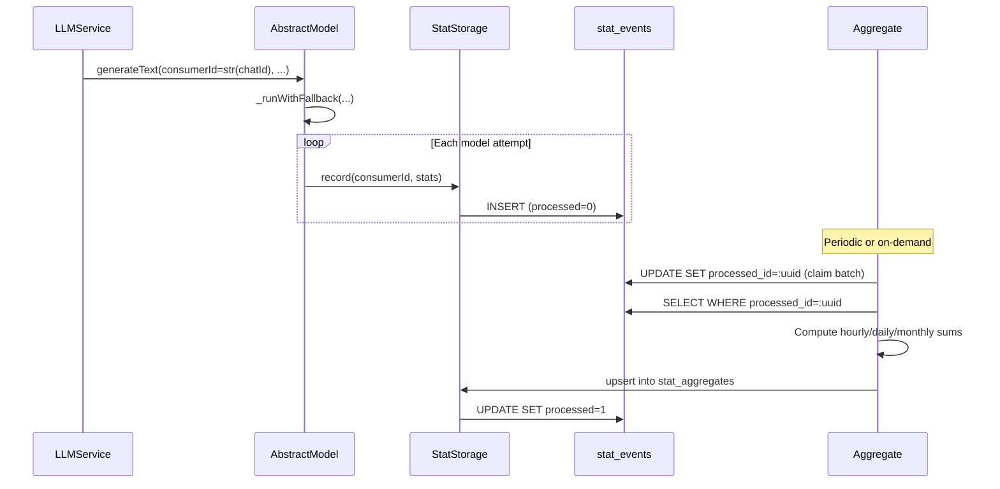

# lib/stat — Statistics Collection Library

> **Status:** Draft plan — pending review

## Problem Statement

Gromozeka currently has no systematic statistics collection. We want to track:

- **LLM usage**: which models were used, how many tokens (input/output/total), status (success/error),
  whether fallback was triggered, which chat, generation type (text/structured/image).
- **User messages**: message counts, command counts, per chat, per user.
- **Extensibility**: future stat types (cache hits, API call latencies, etc.) without schema migrations.

Stats must be aggregateable across time windows: **hourly**, **daily**, **monthly**, and **global** (all-time).
Stats must be sliceable by **consumer** (usually `chatId`) and **globally**.

The library should live in `lib/stat/` (no `internal/` dependencies), with the DB-backed implementation
in `internal/database/stat_storage.py` following the same pattern as `GenericDatabaseCache` in
`internal/database/generic_cache.py`.

## Architecture Overview

```
                        ┌──────────────────────┐
                        │      main.py          │
                        │  GromozekBot.__init__ │
                        └──────┬───────┬───────┘
                               │       │
                    creates    │       │  creates
                               ▼       ▼
              ┌────────────────┐   ┌─────────────────────┐
              │  LLMManager    │   │ StatStorage          │
              │  (lib/ai)      │◄──│ (internal/database/  │
              │                │   │  stat_storage.py)    │
              │ .statStorage ──┼──►│                      │
              └───────┬────────┘   │ - logDataSource      │
                      │            │ - aggDataSource      │
                      │ propagate  │ - db: Database       │
                      ▼            └──────────┬───────────┘
              ┌────────────────┐              │
              │ AbstractModel  │              │ getProvider()
              │ (lib/ai)       │              ▼
              │                │   ┌──────────────────────┐
              │ .statStorage   │   │   DatabaseManager    │
              │ _runWithFallback│──►│                      │
              └────────────────┘   │ stats_log  provider  │
                                   │ stats_agg  provider  │
                                   └──────────┬───────────┘
                                              │
                          ┌───────────────────┼───────────────────┐
                          ▼                   ▼                   │
                   ┌─────────────┐    ┌─────────────┐            │
                   │ stat_events │    │stat_aggregates│           │
                   │ (append-only│    │ (materialized │           │
                   │  log)       │    │  views)       │           │
                   └─────────────┘    └─────────────┘            │
                          │                   ▲                   │
                          │    aggregate()    │                   │
                          └───────────────────┘                   │
                                                                  │
              ┌───────────────────────────────────────────────────┘
              │  Both tables can live in the same DB file
              │  or separate files (independent backup/retention)
```

### Data Flow



## 1. Database Migration (016)

**File:** `internal/database/migrations/versions/migration_016_add_stat_tables.py`

### Tables

**`stat_events`** — append-only log, one row per raw event.

```sql
CREATE TABLE stat_events (
    event_id     TEXT NOT NULL,
    event_type   TEXT NOT NULL,           -- e.g. 'llm_request', 'message_received'
    consumer_id  TEXT NOT NULL,           -- e.g. str(chatId), 'global'
    event_time   TIMESTAMP NOT NULL,
    data         TEXT NOT NULL,           -- JSON: {"metric_key": numeric_value, ...}
    processed    INTEGER NOT NULL DEFAULT 0,   -- 0 = pending, 1 = aggregated
    processed_id TEXT DEFAULT NULL,            -- batch UUID for claim tracking
    claimed_at   TIMESTAMP DEFAULT NULL,       -- for orphan reclaim
    created_at   TIMESTAMP NOT NULL,
    PRIMARY KEY (event_id)
);
CREATE INDEX idx_stat_events_unprocessed
    ON stat_events(processed, processed_id, claimed_at);
CREATE INDEX idx_stat_events_lookup
    ON stat_events(event_type, consumer_id, event_time);
```

**`stat_aggregates`** — pre-computed buckets per period per consumer.

```sql
CREATE TABLE stat_aggregates (
    event_type    TEXT NOT NULL,
    consumer_id   TEXT NOT NULL,
    period_start  TIMESTAMP NOT NULL,
    period_type   TEXT NOT NULL,           -- 'hourly', 'daily', 'monthly', 'total'
    metric_key    TEXT NOT NULL,
    metric_value  REAL NOT NULL,
    updated_at    TIMESTAMP NOT NULL,
    PRIMARY KEY (event_type, consumer_id, period_start, period_type, metric_key)
);
```

### Migration implementation

```python
"""Add stat_events and stat_aggregates tables."""

from typing import Type

from ...providers import BaseSQLProvider, ParametrizedQuery
from ..base import BaseMigration


class Migration016AddStatTables(BaseMigration):
    """Add statistics infrastructure tables.

    Attributes:
        version: Migration version number (16).
        description: Human-readable description.
    """

    version: int = 16
    description: str = "Add stat_events and stat_aggregates tables"

    async def up(self, sqlProvider: BaseSQLProvider) -> None:
        """Create stat_events and stat_aggregates tables.

        Args:
            sqlProvider: SQL provider abstraction.

        Returns:
            None
        """
        await sqlProvider.batchExecute(
            [
                ParametrizedQuery("""
                    CREATE TABLE stat_events (
                        event_id TEXT NOT NULL,
                        event_type TEXT NOT NULL,
                        consumer_id TEXT NOT NULL,
                        event_time TIMESTAMP NOT NULL,
                        data TEXT NOT NULL,
                        processed INTEGER NOT NULL DEFAULT 0,
                        processed_id TEXT DEFAULT NULL,
                        claimed_at TIMESTAMP DEFAULT NULL,
                        created_at TIMESTAMP NOT NULL,
                        PRIMARY KEY (event_id)
                    )
                """),
                ParametrizedQuery("""
                    CREATE INDEX idx_stat_events_unprocessed
                        ON stat_events(processed, processed_id, claimed_at)
                """),
                ParametrizedQuery("""
                    CREATE INDEX idx_stat_events_lookup
                        ON stat_events(event_type, consumer_id, event_time)
                """),
                ParametrizedQuery("""
                    CREATE TABLE stat_aggregates (
                        event_type TEXT NOT NULL,
                        consumer_id TEXT NOT NULL,
                        period_start TIMESTAMP NOT NULL,
                        period_type TEXT NOT NULL,
                        metric_key TEXT NOT NULL,
                        metric_value REAL NOT NULL,
                        updated_at TIMESTAMP NOT NULL,
                        PRIMARY KEY (event_type, consumer_id, period_start, period_type, metric_key)
                    )
                """),
            ]
        )

    async def down(self, sqlProvider: BaseSQLProvider) -> None:
        """Drop stats tables.

        Args:
            sqlProvider: SQL provider abstraction.

        Returns:
            None
        """
        await sqlProvider.batchExecute(
            [
                ParametrizedQuery("DROP TABLE IF EXISTS stat_aggregates"),
                ParametrizedQuery("DROP TABLE IF EXISTS stat_events"),
            ]
        )


def getMigration() -> Type[BaseMigration]:
    """Return the migration class for auto-discovery."""
    return Migration016AddStatTables
```

### Portability checklist

- [x] No `AUTOINCREMENT` — composite natural keys or TEXT app-generated IDs
- [x] No `DEFAULT CURRENT_TIMESTAMP` — app sets `created_at`/`updated_at` explicitly
- [x] `TEXT` for JSON, `REAL` for numeric values, `INTEGER` for booleans (0/1)
- [x] Composite PKs: `(event_id)` on log, `(event_type, consumer_id, period_start, period_type, metric_key)` on aggregates
- [x] Named `:param` placeholders

## 2. `lib/stat/stat_storage.py` — ABC + Null Implementation

**File:** `lib/stat/stat_storage.py`

```python
"""Abstract stat storage interface with null implementation."""

from abc import ABC, abstractmethod
from datetime import datetime
from typing import Optional


class StatStorage(ABC):
    """Abstract storage for time-series statistics with batch aggregation.

    Implementations may be backed by a database, file system, or nothing
    (NullStatStorage). The interface separates raw event recording from
    batch aggregation, allowing callers to write events at high frequency
    and aggregate periodically.
    """

    @abstractmethod
    async def record(
        self, consumerId: str, stats: dict[str, float | int], *, eventTime: Optional[datetime] = None
    ) -> None:
        """Append a raw stat event to the log.

        Args:
            consumerId: Consumer identifier (e.g. str(chatId), 'global', model name).
            stats: Metric key -> numeric value dict. All values must be float or int.
            eventTime: When the event occurred; defaults to now (UTC).

        Returns:
            None
        """
        ...

    @abstractmethod
    async def aggregate(self, *, limit: int = 1000) -> int:
        """Claim up to ``limit`` unprocessed events, aggregate into
        hourly/daily/monthly buckets, upsert into the aggregation table,
        and mark events as processed.

        Args:
            limit: Maximum number of unprocessed events to claim in one batch.

        Returns:
            Number of events processed (0 if nothing to do).
        """
        ...


class NullStatStorage(StatStorage):
    """No-op storage — discards all events, ``aggregate()`` is a no-op.

    Use when statistics collection is disabled in configuration.
    """

    async def record(
        self, consumerId: str, stats: dict[str, float | int], *, eventTime: Optional[datetime] = None
    ) -> None:
        """Discard the event (no-op).

        Args:
            consumerId: Ignored.
            stats: Ignored.
            eventTime: Ignored.

        Returns:
            None
        """
        pass

    async def aggregate(self, *, limit: int = 1000) -> int:
        """No-op — returns 0.

        Args:
            limit: Ignored.

        Returns:
            0
        """
        return 0
```

**File:** `lib/stat/__init__.py`

```python
"""Statistics collection library for Gromozeka.

Provides a generic, storage-agnostic interface for recording time-series
statistics events and aggregating them into periodic buckets.

    Example:
        >>> from lib.stat import StatStorage, NullStatStorage
        >>> storage = NullStatStorage()
        >>> await storage.record("chat_123", {"messages": 1})
"""

from .stat_storage import NullStatStorage, StatStorage
```

## 3. `internal/database/stat_storage.py` — DB-Backed Implementation

**File:** `internal/database/stat_storage.py`

Follows the exact pattern of `internal/database/generic_cache.py`:
- Implements the ABC from `lib/` directly.
- Receives `db: Database` in the constructor.
- Stores `dataSource`-equivalent parameters as `logDataSource` and `aggDataSource`.
- Uses `self.db.manager.getProvider(dataSource=..., readonly=False)` for all DB access.
- Has `__slots__`.

```python
"""Database-backed stat storage implementation.

Provides a database-backed implementation of StatStorage that uses the
Database manager to store raw stat events and materialized aggregates.
Supports separate data sources for the event log and aggregate tables,
enabling independent backup and retention strategies.
"""

import datetime
import json
import logging
import uuid
from typing import Any, Optional

from lib.stat.stat_storage import StatStorage
from lib import utils as libUtils

from .database import Database
from .providers.base import ExcludedValue

logger = logging.getLogger(__name__)


class StatStorage(StatStorage):
    """Database-backed stat storage with separate log and aggregate data sources.

    Raw events are appended to the ``stat_events`` table in the log data source.
    The ``aggregate()`` method claims batches of unprocessed events, computes
    hourly/daily/monthly buckets, and upserts into the ``stat_aggregates`` table
    in the aggregate data source.

    Both sources can point to the same database file (simplest setup) or to
    different files (e.g. rotating the log file independently).

    Attributes:
        db: Database instance for provider access.
        eventType: Event type discriminator (e.g. 'llm_request').
        logDataSource: Data source name for the stat_events table.
        aggDataSource: Data source name for the stat_aggregates table.
    """

    __slots__ = ("db", "eventType", "logDataSource", "aggDataSource")

    def __init__(
        self, db: Database, eventType: str, *, logDataSource: str, aggDataSource: str
    ) -> None:
        """Initialize database-backed stat storage.

        Args:
            db: Database instance from internal.database.database.
            eventType: Event type discriminator written to every event.
            logDataSource: Named data source for the stat_events table.
            aggDataSource: Named data source for the stat_aggregates table.
        """
        self.db = db
        self.eventType = eventType
        self.logDataSource = logDataSource
        self.aggDataSource = aggDataSource

    # ------------------------------------------------------------------
    # Public API
    # ------------------------------------------------------------------

    async def record(
        self, consumerId: str, stats: dict[str, float | int], *, eventTime: Optional[datetime.datetime] = None
    ) -> None:
        """Append a raw stat event to the log table.

        Generates a UUID event_id, serializes the stats dict as JSON,
        and inserts a row with ``processed = 0``.

        Args:
            consumerId: Consumer identifier (e.g. str(chatId), 'global').
            stats: Metric key -> numeric value dict.
            eventTime: When the event occurred; defaults to now (UTC).

        Returns:
            None
        """
        if eventTime is None:
            eventTime = datetime.datetime.now(datetime.UTC)

        eventId = str(uuid.uuid4())
        now = datetime.datetime.now(datetime.UTC)

        sqlProvider = await self.db.manager.getProvider(
            dataSource=self.logDataSource, readonly=False
        )
        await sqlProvider.execute(
            """INSERT INTO stat_events
               (event_id, event_type, consumer_id, event_time, data,
                processed, processed_id, claimed_at, created_at)
               VALUES
               (:eventId, :eventType, :consumerId, :eventTime, :data,
                0, NULL, NULL, :createdAt)""",
            {
                "eventId": eventId,
                "eventType": self.eventType,
                "consumerId": consumerId,
                "eventTime": eventTime,
                "data": libUtils.jsonDumps(stats),
                "createdAt": now,
            },
        )

    async def aggregate(self, *, limit: int = 1000) -> int:
        """Claim and aggregate a batch of unprocessed events.

        Implements a poor-man's transaction using ``processed_id`` to claim
        rows without relying on BEGIN/COMMIT (portable across SQLink, SQLite,
        MySQL, PostgreSQL).

        Processing steps:
            0. Reclaim orphaned events (crashed mid-aggregation, older than 5 min).
            1. SELECT up to ``limit`` unprocessed event IDs.
            2. UPDATE those rows with a batch UUID (claim).
            3. SELECT the claimed rows' data.
            4. Compute hourly/daily/monthly aggregates in Python.
            5. Upsert into ``stat_aggregates`` via the agg data source.
            6. Mark claimed rows as ``processed = 1``.

        Args:
            limit: Maximum number of unprocessed events to claim.

        Returns:
            Number of events processed (0 if nothing to aggregate).
        """
        batchId = str(uuid.uuid4())
        now = datetime.datetime.now(datetime.UTC)
        orphanTimeout = now - datetime.timedelta(minutes=60)

        # --- Step 0: reclaim orphans ---
        logProvider = await self.db.manager.getProvider(
            dataSource=self.logDataSource, readonly=False
        )
        await logProvider.execute(
            """UPDATE stat_events
               SET processed_id = NULL, claimed_at = NULL
               WHERE processed = 0
                 AND processed_id IS NOT NULL
                 AND claimed_at < :timeout""",
            {"timeout": orphanTimeout},
        )

        # --- Step 1: select unprocessed event IDs ---
        rows = await logProvider.executeFetchAll(
            """SELECT event_id FROM stat_events
               WHERE processed = 0 AND processed_id IS NULL
               ORDER BY event_time
               LIMIT :limit""",
            {"limit": limit},
        )
        if not rows:
            return 0

        eventIds = [r["event_id"] for r in rows]
        nClaimed = len(eventIds)

        # Build IN clause placeholders
        inPlaceholders = {f"id{i}": eventIds[i] for i in range(nClaimed)}
        inClause = ", ".join(f":id{i}" for i in range(nClaimed))

        # --- Step 2: claim the batch ---
        await logProvider.execute(
            f"""UPDATE stat_events
                SET processed_id = :batchId, claimed_at = :now
                WHERE event_id IN ({inClause})""",
            {"batchId": batchId, "now": now, **inPlaceholders},
        )

        # --- Step 3: read claimed events ---
        events = await logProvider.executeFetchAll(
            """SELECT consumer_id, event_time, data
               FROM stat_events
               WHERE processed_id = :batchId""",
            {"batchId": batchId},
        )

        # --- Step 4: aggregate in Python ---
        # Key: (consumerId, periodStart, periodType, metricKey) -> sum
        aggregates: dict[tuple[str, str, str, str], float] = {}
        for event in events:
            consumerId = event["consumer_id"]
            eventTime = event["event_time"]  # already a datetime from the driver
            data = _parseJson(event["data"])

            for periodType, truncated in _computePeriods(eventTime):
                for metricKey, metricValue in data.items():
                    key = (consumerId, truncated, periodType, metricKey)
                    aggregates[key] = aggregates.get(key, 0.0) + float(metricValue)

        # --- Step 5: upsert into aggregate table ---
        aggProvider = await self.db.manager.getProvider(
            dataSource=self.aggDataSource, readonly=False
        )
        for (consumerId, periodStart, periodType, metricKey), total in aggregates.items():
            await aggProvider.upsert(
                table="stat_aggregates",
                values={
                    "event_type": self.eventType,
                    "consumer_id": consumerId,
                    "period_start": periodStart,
                    "period_type": periodType,
                    "metric_key": metricKey,
                    "metric_value": total,
                    "updated_at": now,
                },
                conflictColumns=[
                    "event_type", "consumer_id", "period_start",
                    "period_type", "metric_key",
                ],
                updateExpressions={
                    "metric_value": f"metric_value + {total}",
                    "updated_at": ExcludedValue(),
                },
            )

        # --- Step 6: mark processed ---
        await logProvider.execute(
            """UPDATE stat_events
               SET processed = 1
               WHERE processed_id = :batchId""",
            {"batchId": batchId},
        )

        return nClaimed


# ------------------------------------------------------------------
# Internal helpers
# ------------------------------------------------------------------

def _computePeriods(eventTime: datetime.datetime) -> list[tuple[str, str]]:
    """Return (periodType, truncatedISOTimestamp) for hourly, daily, monthly.

    All timestamps are in ISO 8601 format for consistent string comparison
    and storage across RDBMS.

    Args:
        eventTime: The event timestamp (naive or UTC).

    Returns:
        List of (periodType, truncatedISO) tuples.
    """
    hourly = eventTime.replace(minute=0, second=0, microsecond=0)
    daily = hourly.replace(hour=0)
    monthly = daily.replace(day=1)

    return [
        ("hourly", hourly.isoformat()),
        ("daily", daily.isoformat()),
        ("monthly", monthly.isoformat()),
    ]


def _parseJson(raw: str) -> dict[str, float | int]:
    """Parse a JSON string, returning empty dict on failure.

    Args:
        raw: JSON string from the ``data`` column.

    Returns:
        Parsed dict, or empty dict if parsing fails.
    """
    try:
        return json.loads(raw)
    except (json.JSONDecodeError, TypeError):
        logger.error(f"Failed to parse stat event data: {raw[:200]}")
        return {}
```

### Why `period_start` as ISO string

Storing `period_start` as an ISO 8601 string (`"2026-05-09T14:00:00"`) rather than a native
`TIMESTAMP` value avoids RDBMS dialect differences in timestamp truncation. The application
computes the truncated value in Python (always correct) and stores it as TEXT. This is simpler
than `DATE_TRUNC('hour', ...)` (PG), `DATE_FORMAT(...)` (MySQL), or `strftime(...)` (SQLite).

## 4. Configuration

**File:** `configs/00-defaults/database.toml` — appended to the existing providers section.

```toml
# Stats data sources (can point to same or different DB files)

[database.providers.stats_log]
provider = "sqlite3"

[database.providers.stats_log.parameters]
dbPath = "stats.db"

[database.providers.stats_agg]
provider = "sqlite3"

[database.providers.stats_agg.parameters]
dbPath = "stats.db"
```

For production, `stats_log` and `stats_agg` can point to the same file (simplest).
To enable independent backup/retention (e.g. rotate the log file monthly while
keeping aggregates forever), point them to different files:

```toml
[database.providers.stats_log.parameters]
dbPath = "stats_log.db"       # rotated/cleaned monthly

[database.providers.stats_agg.parameters]
dbPath = "stats_agg.db"       # kept forever
```

**File:** `configs/00-defaults/stats.toml` — new file for stats-specific settings (future use).

```toml
[stats]
enabled = true
# Future: aggregation schedule, retention TTL, etc.
```

## 5. Integration with `lib/ai`

### Changes required (in order)

#### 5.1 `LLMManager` (`lib/ai/manager.py`)

- Add `statStorage: Optional[StatStorage] = None` parameter to `__init__`.
- Store as `self.statStorage`.
- In `_initModels()`, after model creation, set `model.statStorage = self.statStorage`.

```python
# lib/ai/manager.py — LLMManager

from lib.stat.stat_storage import StatStorage

class LLMManager:
    def __init__(self, config: Dict[str, Any], *, statStorage: Optional[StatStorage] = None) -> None:
        ...
        self.statStorage = statStorage
        self._initModels()

    def _initModels(self) -> None:
        ...
        for modelName, modelConfig in modelsConfig.items():
            ...
            model = provider.addModel(...)  # existing code
            if self.statStorage is not None:
                model.statStorage = self.statStorage
```

#### 5.2 `AbstractModel` (`lib/ai/abstract.py`)

- Add `statStorage: Optional[StatStorage] = None` attribute in `__init__`.
- Add `consumerId: Optional[str] = None` keyword argument to `generateText()`,
  `generateStructured()`, and `generateImage()`.
- Pass `consumerId` through to `_runWithFallback()`.
- In `_runWithFallback()`, after each model attempt, call
  `self.statStorage.record()` if set.
- In each public method's non-fallback path, call `self._recordStats()` after
  the model call.

```python
# lib/ai/abstract.py — AbstractModel

class AbstractModel:
    def __init__(self, ...):
        ...
        self.statStorage: Optional[StatStorage] = None

    async def generateText(
        self, messages, tools=None, *, fallbackModels=None, consumerId=None
    ) -> ModelRunResult:
        if fallbackModels:
            return await self._runWithFallback(
                [self, *fallbackModels],
                lambda m: m.generateText(messages=messages, tools=tools, fallbackModels=None),
                ModelRunResult,
                consumerId=consumerId,
                generationType="text",
            )
        # ... existing non-fallback logic ...
        ret = await self._generateText(messages=messages, tools=tools)
        await self._recordStats(consumerId, ret, "text")
        if self.enableJSONLog:
            self.printJSONLog(messages, ret)
        return ret

    async def generateImage(
        self, messages, *, fallbackModels=None, consumerId=None
    ) -> ModelRunResult:
        # Same pattern: pass consumerId + generationType="image"
        ...

    async def generateStructured(
        self, messages, schema, *, schemaName="response", strict=True,
        fallbackModels=None, consumerId=None
    ) -> ModelStructuredResult:
        # Same pattern: pass consumerId + generationType="structured"
        ...

    async def _runWithFallback(
        self, models, call, retType, *, consumerId=None, generationType="unknown"
    ):
        for i, model in enumerate(models):
            # ... existing call + error handling ...
            result = await call(model)
            if i > 0:
                result.setFallback(True)

            # --- Stats recording ---
            if self.statStorage is not None:
                await self.statStorage.record(
                    consumerId=consumerId or "global",
                    stats={
                        f"generation_{generationType}": 1,
                        "request_count": 1,
                        "input_tokens": result.inputTokens or 0,
                        "output_tokens": result.outputTokens or 0,
                        "total_tokens": result.totalTokens or 0,
                        "is_error": 1 if result.status in ERROR_STATUSES else 0,
                        "is_fallback": 1 if i > 0 else 0,
                    },
                )

            if result.status not in ERROR_STATUSES:
                return result
        return lastResult

    async def _recordStats(
        self, consumerId: Optional[str], result: ModelRunResult, generationType: str
    ) -> None:
        """Record stats for a non-fallback (direct) model call."""
        if self.statStorage is None:
            return
        await self.statStorage.record(
            consumerId=consumerId or "global",
            stats={
                f"generation_{generationType}": 1,
                "request_count": 1,
                "input_tokens": result.inputTokens or 0,
                "output_tokens": result.outputTokens or 0,
                "total_tokens": result.totalTokens or 0,
                "is_error": 1 if result.status in ERROR_STATUSES else 0,
                "is_fallback": 0,
            },
        )
```

### Stats recorded for LLM events

| Metric Key | Type | Description |
|---|---|---|
| `generation_text` | int (0/1) | Set to 1 when generation type is text |
| `generation_structured` | int (0/1) | Set to 1 when generation type is structured |
| `generation_image` | int (0/1) | Set to 1 when generation type is image |
| `request_count` | int | Always 1 per attempt |
| `input_tokens` | int | Input token count (0 if unavailable) |
| `output_tokens` | int | Output token count (0 if unavailable) |
| `total_tokens` | int | Total token count (0 if unavailable) |
| `is_error` | int (0/1) | 1 if status in ERROR_STATUSES |
| `is_fallback` | int (0/1) | 1 if this result came from a fallback model |

All values are integers. Aggregating via SUM gives: total requests, total tokens,
error count, fallback count per period per consumer.

## 6. Integration with `LLMService`

### Changes required

**File:** `internal/services/llm/service.py`

In `generateText()` (line ~554), `generateStructured()` (line ~650), and
`generateImage()` (line ~690), pass `consumerId=str(chatId)` to the model call:

```python
# LLMService.generateText — after model resolution, before the call

ret = await llmModel.generateText(
    prompt,
    tools=tools,
    fallbackModels=[fallbackModel],
    consumerId=str(chatId),       # <-- new
)
```

Same change in `generateStructured` and `generateImage`.

## 7. Wiring in `main.py`

**File:** `main.py`

In `GromozekBot.__init__()`, after `self.database` is initialized:

```python
# main.py — GromozekBot.__init__

from internal.database.stat_storage import StatStorage

# ... after self.database is ready ...

llmStatStorage = StatStorage(
    db=self.database,
    eventType="llm_request",
    logDataSource="stats_log",
    aggDataSource="stats_agg",
)

self.llmManager = LLMManager(
    self.configManager.getModelsConfig(),
    statStorage=llmStatStorage,
)
```

If stats are disabled in config, use `NullStatStorage` instead:

```python
from lib.stat import NullStatStorage

if self.configManager.getStatsConfig().get("enabled", True):
    llmStatStorage = StatStorage(...)
else:
    llmStatStorage = NullStatStorage()
```

## 8. Tests

### 8.1 `lib/stat/test/test_null_storage.py`

```python
"""Unit tests for NullStatStorage."""
import pytest

from lib.stat import NullStatStorage


async def testNullRecordDoesNotRaise():
    storage = NullStatStorage()
    await storage.record("test", {"foo": 1})  # should not raise

async def testNullAggregateReturnsZero():
    storage = NullStatStorage()
    result = await storage.aggregate()
    assert result == 0

async def testNullAggregateWithLimit():
    storage = NullStatStorage()
    result = await storage.aggregate(limit=500)
    assert result == 0
```

### 8.2 `lib/stat/test/test_sql_storage.py`

Integration tests using an in-memory SQLite provider. Test cases:

```python
"""Integration tests for StatStorage (DB-backed)."""
import datetime
import pytest

from internal.database.stat_storage import StatStorage
# Use testDatabase fixture from tests/conftest.py


@pytest.mark.asyncio
async def testRecordAndAggregateSingleEvent(testDatabase):
    storage = StatStorage(
        db=testDatabase,
        eventType="test_event",
        logDataSource="default",
        aggDataSource="default",
    )
    eventTime = datetime.datetime(2026, 5, 9, 14, 30, 0, tzinfo=datetime.UTC)

    await storage.record("consumer_1", {"metric_a": 10, "metric_b": 5}, eventTime=eventTime)
    processed = await storage.aggregate(limit=100)
    assert processed == 1

    # Verify aggregates exist for hourly, daily, monthly
    ...


@pytest.mark.asyncio
async def testAggregateEmptyReturnsZero(testDatabase):
    storage = StatStorage(...)
    result = await storage.aggregate()
    assert result == 0


@pytest.mark.asyncio
async def testAggregateRespectsLimit(testDatabase):
    storage = StatStorage(...)
    for i in range(50):
        await storage.record("c", {"x": 1})
    result = await storage.aggregate(limit=10)
    assert result == 10

    # Remaining 40 should still be unprocessed
    result2 = await storage.aggregate(limit=100)
    assert result2 == 40


@pytest.mark.asyncio
async def testOrphanReclaim(testDatabase):
    """Simulate crash: claim rows but don't mark processed."""
    ...


@pytest.mark.asyncio
async def testMultiplePeriods(testDatabase):
    """Verify an event at 14:30 produces hourly (14:00), daily (00:00), monthly (day 1)."""
    ...


@pytest.mark.asyncio
async def testMultipleConsumers(testDatabase):
    """Verify aggregates are grouped by consumer_id."""
    ...
```

### 8.3 `lib/ai/test_stat_integration.py`

Test that `AbstractModel` records stats through the chain:

```python
@pytest.mark.asyncio
async def testGenerateTextRecordsStats(mockModel, mockStatStorage):
    model.statStorage = mockStatStorage
    result = await model.generateText(messages, consumerId="chat_42")
    
    mockStatStorage.record.assert_called_with(
        consumerId="chat_42",
        stats=pytest.approx({"generation_text": 1, "request_count": 1, ...}),
    )
```

## 9. Implementation Order

| # | Task | File(s) | Skill to Dispatch | Depends On |
|---|---|---|---|---|
| 1 | Migration 016 | `migrations/versions/migration_016_add_stat_tables.py` | `add-database-migration` | — |
| 2 | `lib/stat/` — ABC + Null | `lib/stat/__init__.py`, `lib/stat/stat_storage.py` | `software-developer` | — |
| 3 | DB-backed storage | `internal/database/stat_storage.py` | `software-developer` | 1, 2 |
| 4 | Tests for `lib/stat` | `lib/stat/test/test_null_storage.py`, `lib/stat/test/test_sql_storage.py` | `software-developer` | 2, 3 |
| 5 | Quality gates | `make format lint && make test` | `run-quality-gates` | 4 |
| 6 | LLMManager integration | `lib/ai/manager.py` | `software-developer` | 2 |
| 7 | AbstractModel integration | `lib/ai/abstract.py` | `software-developer` | 2, 6 |
| 8 | LLMService integration | `internal/services/llm/service.py` | `software-developer` | 7 |
| 9 | Wiring in main.py | `main.py` | `software-developer` | 3, 6 |
| 10 | Config | `configs/00-defaults/database.toml`, `configs/00-defaults/stats.toml` | `software-developer` | 1 |
| 11 | Full quality gates | `make format lint && make test` | `run-quality-gates` | 9 |
| 12 | Documentation | `docs/llm/*.md`, `docs/database-schema*.md` | `update-project-docs` | 11 |

### Deferred

- **Aggregation trigger** (cron-like periodic task via `DelayedTasksRepository`).
  Design is known (call `aggregate()` on a timer) but the scheduling mechanism
  needs further thought. Deferred to a follow-up plan.
- **Message stats** (extending existing `chat_stats` with hourly/monthly or
  creating a separate `StatStorage` instance for `eventType="message"`).
  The library supports it trivially: create another `StatStorage` with
  `eventType="message_received"` and call `record()` from
  `chatMessages.saveChatMessage()`.
- **Query API** (methods to read from `stat_aggregates` with time range +
  consumer filters). The raw SQL queries are straightforward; a query API
  on `StatStorage` can be added later without schema changes.

## 10. Documentation Impact

| Document | Change |
|---|---|
| `docs/llm/libraries.md` | Add `lib/stat` section — API overview, StatStorage, NullStatStorage |
| `docs/llm/database.md` | Add migration 016 to migration list, `stat_events` + `stat_aggregates` to tables |
| `docs/database-schema.md` | Add `stat_events` and `stat_aggregates` tables with column descriptions |
| `docs/database-schema-llm.md` | Same, LLM format |
| `docs/llm/index.md` | Add `lib/stat/` to `lib/` directory map |
| `docs/llm/architecture.md` | Stats data flow section (Mermaid diagram from this plan) |
| `AGENTS.md` | No changes needed (no new conventions) |

## 11. Risks & Mitigations

| Risk | Mitigation |
|---|---|
| **TOCTOU in aggregate step 1–2** (SELECT then UPDATE by IDs). | Single-process bot — no concurrent aggregators. If multi-process ever happens, orphan reclaim handles collisions; or switch to `SELECT ... FOR UPDATE SKIP LOCKED`. |
| **SQLink LIMIT compatibility**. | Only `SELECT ... LIMIT` is used (no LIMIT in UPDATE). SQLink supports this. |
| **`consumerId` type mismatch** (Telegram int vs Max string). | Stored as TEXT everywhere — both platforms work. |
| **Crash between claim and mark-processed**. | `claimed_at` timeout + orphan reclaim on next `aggregate()` run. Events older than 5 min with `processed=0, processed_id!=NULL` are re-claimed. |
| **JSON `data` column parsing failure**. | `_parseJson()` returns empty dict on failure + logs error. Event is still counted as processed (no retry). |
| **`period_start` as ISO string** — ordering/comparison across RDBMS. | ISO 8601 strings sort lexicographically in the same order as timestamps. No RDBMS timestamp functions needed. |
| **`__slots__` conflict with `StatStorage` ABC**. | `StatStorage` (ABC) does not define `__slots__`. `internal/database/stat_storage.StatStorage` defines only its own slots. No conflict. |

## 12. Alternative Designs Considered

### Separate tables per metric domain (like existing `chat_stats`)

**Rejected** because it requires a migration for every new stat type. The hybrid
(raw events + EAV aggregates) approach supports arbitrary metric keys without
schema changes.

### Singleton StatService

**Rejected** — user explicitly requested non-singleton, configurable instances.
Different `StatStorage` instances serve different `eventType`s with different
data sources. The caller controls lifecycle.

### Background aggregation thread

**Rejected** — adds complexity for v1. `aggregate()` is a public method; callers
invoke it on their own schedule. A cron-like trigger can be added later without
API changes.
