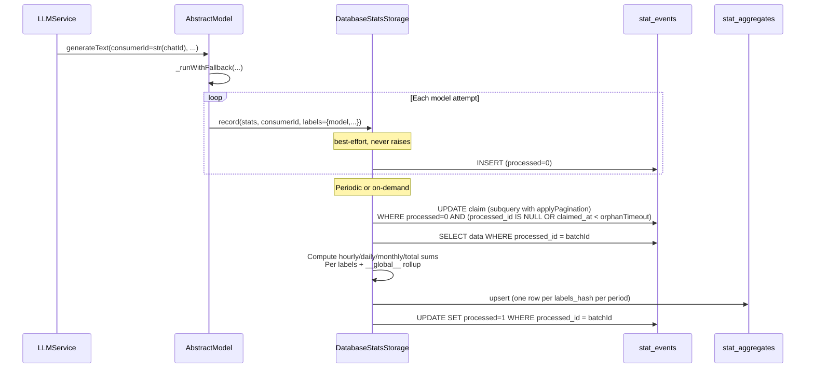

# lib/stats — Statistics Collection Library (v3)

> **Status:** Draft plan — incorporates review feedback from `docs/review/lib-stats-v2-review.md`
>
> **Changes from v2 (review-driven):**
> 1. Single data source (`stats`) — enables future transactional upsert + mark-processed
> 2. `consumer_id` deleted from schema; replaced with generic `labels` + `labels_hash`
> 3. Global stats: `__global__` consumer rollup + `total` period type
> 4. Timestamp columns changed to `TEXT` (ISO 8601 strings), matching the provider layer
> 5. Best-effort `record()` with try-except; metric validation to prevent NaN/Inf in SQL
> 6. `applyPagination()` used instead of raw `LIMIT` in claim query
> 7. Skipped: `stats.enabled = true` default (deferred until trigger/query API exist)
> 8. `ConfigManager.getStatsConfig()` getter added
> 9. DB-backed class renamed from `StatsStorage` to `DatabaseStatsStorage`

## Problem Statement

Same as v2: track LLM usage (models, tokens, errors, fallbacks, per chat, per generation type),
user messages, and future stat types. Stats must be aggregateable across **hourly**, **daily**,
**monthly**, and **total** (all-time) periods, sliced by **consumer**, **model**, **provider**,
**generation type**, and other dimensions via a generic labels system.

v3 adds: global/all-chat rollups (`__global__`) and model-level slicing via labels.

## Architecture Overview

```
                        ┌───────────────────────┐
                        │      main.py          │
                        │  GromozekBot.__init__ │
                        └──────┬───────┬────────┘
                               │       │
                    creates    │       │  creates
                               ▼       ▼
              ┌────────────────┐   ┌──────────────────────┐
              │  LLMManager    │   │ DatabaseStatsStorage │
              │  (lib/ai)      │◄──│ (internal/database/  │
              │                │   │  stats_storage.py)   │
              │ .statsStorage ─┼──►│                      │
              └───────┬────────┘   │ - record()           │
                      │            │ - aggregate()        │
                      │ propagate  │ - db: Database       │
                      ▼            │ - dataSource: "stats"│
              ┌─────────────────┐  └──────────┬───────────┘
              │ AbstractModel   │             │
              │ (lib/ai)        │             │ single provider
              │                 │             ▼
              │ .statsStorage   │  ┌──────────────────────┐
              │ _runWithFallback│  │   DatabaseManager    │
              └─────────────────┘  │                      │
                                   │ "stats" provider     │
                                   └──────────┬───────────┘
                                              │
                          ┌───────────────────┼───────────────────┐
                          ▼                   ▼
                   ┌─────────────┐    ┌───────────────┐
                   │ stat_events │    │stat_aggregates│
                   │ (append-only│    │ (materialized │
                   │  log)       │    │  views)       │
                   └─────────────┘    └───────────────┘
                          │                   ▲
                          │    aggregate()    │
                          └───────────────────┘
```

**Key difference from v2:** Single `"stats"` data source. Both `stat_events` and `stat_aggregates`
live in the same database file accessed through one provider. This means:

- No cross-provider transaction problem (v2's separate `stats_log` + `stats_agg`)
- In a future iteration, the aggregate upsert + mark-processed can be wrapped in a single
  transaction once the provider gains batch/transaction primitives
- Simpler configuration: one provider entry, not two

### Data Flow (v3)



## 1. Database Migration (016)

**File:** `internal/database/migrations/versions/migration_016_add_stat_tables.py`

### Tables

**`stat_events`** — append-only log, one row per raw event.

```sql
CREATE TABLE stat_events (
    event_id     TEXT NOT NULL,             -- app-generated UUID
    event_type   TEXT NOT NULL,             -- e.g. 'llm_request'
    event_time   TIMESTAMP NOT NULL,             -- ISO 8601 string
    data         TEXT NOT NULL,             -- JSON: {"metric_key": numeric_value, ...}
    labels_hash  TEXT NOT NULL,             -- hash of canonical labels JSON (for compact lookup)
    labels       TEXT NOT NULL,             -- canonical JSON: {"consumer":"...","modelName":"...",...}
    processed    INTEGER NOT NULL DEFAULT 0,-- 0 = pending, 1 = aggregated
    processed_id TEXT DEFAULT NULL,         -- batch UUID for claim tracking
    claimed_at   TIMESTAMP DEFAULT NULL,         -- ISO 8601, for orphan reclaim
    created_at   TIMESTAMP NOT NULL,             -- ISO 8601
    PRIMARY KEY (event_id)
);
CREATE INDEX idx_stat_events_unprocessed
    ON stat_events(processed, processed_id, claimed_at);
CREATE INDEX idx_stat_events_lookup
    ON stat_events(event_type, event_time);
```

**`stat_aggregates`** — pre-computed buckets per period per labels set.

```sql
CREATE TABLE stat_aggregates (
    event_type    TEXT NOT NULL,
    period_start  TEXT NOT NULL,            -- ISO 8601 string (truncated to hour/day/month/epoch)
    period_type   TEXT NOT NULL,            -- 'hourly', 'daily', 'monthly', 'total'
    labels_hash   TEXT NOT NULL,            -- hash of canonical labels JSON
    labels        TEXT NOT NULL,            -- canonical JSON
    metric_key    TEXT NOT NULL,
    metric_value  REAL NOT NULL,
    updated_at    TIMESTAMP NOT NULL,       -- ISO 8601
    PRIMARY KEY (event_type, period_start, period_type, labels_hash, metric_key)
);
```

**Schema changes from v2:**

| v2 | v3 | Reason |
|---|---|---|
| `consumer_id TEXT NOT NULL` | `labels_hash TEXT NOT NULL` + `labels TEXT NOT NULL` | Generic dimensions; consumer is now a label |
| `period_start TIMESTAMP` | `period_start TEXT` | Plan already stores ISO strings; schema should match |
| PK: `(event_type, consumer_id, period_start, period_type, metric_key)` | `(event_type, period_start, period_type, labels_hash, metric_key)` | `consumer_id` removed, `labels_hash` replaces it |
| No `total` period | `period_type = 'total'` supported | Global all-time aggregation |
| Separate `stats_log` + `stats_agg` sources | Single `"stats"` source | Enables future transactional upsert + mark-processed |

### Migration implementation

```python
"""Add stat_events and stat_aggregates tables (v3 schema)."""

from typing import Type

from ...providers import BaseSQLProvider, ParametrizedQuery
from ..base import BaseMigration


class Migration016AddStatTables(BaseMigration):
    """Add statistics infrastructure tables.

    Attributes:
        version: Migration version number (16).
        description: Human-readable description.
    """

    version: int = 16
    description: str = "Add stat_events and stat_aggregates tables (v3 - labels, TEXT timestamps, single source)"

    async def up(self, sqlProvider: BaseSQLProvider) -> None:
        """Create stat_events and stat_aggregates tables.

        Args:
            sqlProvider: SQL provider abstraction.

        Returns:
            None
        """
        await sqlProvider.batchExecute(
            [
                ParametrizedQuery("""
                    CREATE TABLE stat_events (
                        event_id TEXT NOT NULL,
                        event_type TEXT NOT NULL,
                        event_time TIMESTAMP NOT NULL,
                        data TEXT NOT NULL,
                        labels_hash TEXT NOT NULL,
                        labels TEXT NOT NULL,
                        processed INTEGER NOT NULL DEFAULT 0,
                        processed_id TEXT DEFAULT NULL,
                        claimed_at TIMESTAMP DEFAULT NULL,
                        created_at TIMESTAMP NOT NULL,
                        PRIMARY KEY (event_id)
                    )
                """),
                ParametrizedQuery("""
                    CREATE INDEX idx_stat_events_unprocessed
                        ON stat_events(processed, processed_id, claimed_at)
                """),
                ParametrizedQuery("""
                    CREATE INDEX idx_stat_events_lookup
                        ON stat_events(event_type, event_time)
                """),
                ParametrizedQuery("""
                    CREATE TABLE stat_aggregates (
                        event_type TEXT NOT NULL,
                        period_start TEXT NOT NULL,
                        period_type TEXT NOT NULL,
                        labels_hash TEXT NOT NULL,
                        labels TEXT NOT NULL,
                        metric_key TEXT NOT NULL,
                        metric_value REAL NOT NULL,
                        updated_at TIMESTAMP NOT NULL,
                        PRIMARY KEY (event_type, period_start, period_type, labels_hash, metric_key)
                    )
                """),
            ]
        )

    async def down(self, sqlProvider: BaseSQLProvider) -> None:
        """Drop stats tables.

        Args:
            sqlProvider: SQL provider abstraction.

        Returns:
            None
        """
        await sqlProvider.batchExecute(
            [
                ParametrizedQuery("DROP TABLE IF EXISTS stat_aggregates"),
                ParametrizedQuery("DROP TABLE IF EXISTS stat_events"),
            ]
        )


def getMigration() -> Type[BaseMigration]:
    """Return the migration class for auto-discovery."""
    return Migration016AddStatTables
```

### Portability checklist

- [x] No `AUTOINCREMENT` — `event_id` is app-generated UUID TEXT PK
- [x] No `DEFAULT CURRENT_TIMESTAMP` — app sets `created_at`/`updated_at` explicitly as ISO strings
- [x] `TEXT` for JSON (`data`, `labels`), `REAL` for numeric values, `INTEGER` for booleans (0/1)
- [x] Composite PK: `(event_type, period_start, period_type, labels_hash, metric_key)` on aggregates
- [x] Named `:param` placeholders
- [x] All timestamps are `TEXT` — matches provider layer behavior (`datetime.isoformat()` in `convertToSQLite`)
- [x] `labels_hash` is a hex digest (SHA-256 truncated to 16 chars) for compact PK indexing

## 2. `lib/stats/stats_storage.py` — ABC + Null Implementation

**File:** `lib/stats/stats_storage.py`

```python
"""Abstract stats storage interface with null implementation."""

from abc import ABC, abstractmethod
from datetime import datetime
from typing import Optional


# Sentinel consumer ID for global (all-consumer) aggregation
GLOBAL_CONSUMER_ID = "__global__"


class StatsStorage(ABC):
    """Abstract storage for time-series statistics with batch aggregation.

    Implementations may be backed by a database, file system, or nothing
    (NullStatsStorage). The interface separates raw event recording from
    batch aggregation, allowing callers to write events at high frequency
    and aggregate periodically.

    Labels provide a generic dimension system. For LLM events, labels
    should include at least: ``consumer`` (from consumerId), ``modelName``,
    ``modelId``, ``provider``, ``generationType``. The aggregation layer
    automatically produces a ``__global__`` rollup for each unique labels
    combination (substituting consumer with ``GLOBAL_CONSUMER_ID``).
    """

    @abstractmethod
    async def record(
        self,
        stats: dict[str, float | int],
        *,
        consumerId: Optional[str] = None,
        labels: Optional[dict[str, str]] = None,
        eventTime: Optional[datetime] = None,
    ) -> None:
        """Append a raw stat event to the log.

        The ``consumerId`` is merged into ``labels`` as ``{"consumer": consumerId}``.
        If both ``consumerId`` and ``labels["consumer"]`` are provided, ``consumerId``
        takes precedence.

        Implementations SHOULD be best-effort: failures during recording must not
        propagate to the caller. Log and return silently on error.

        Args:
            stats: Metric key -> numeric value dict. All values must be finite float or int.
            consumerId: Consumer identifier (e.g. str(chatId)). Merged into labels.
            labels: Additional dimension labels (e.g. modelName, provider, generationType).
            eventTime: When the event occurred; defaults to now (UTC).

        Returns:
            None
        """
        ...

    @abstractmethod
    async def aggregate(self, *, limit: int = 1000, orphanTimeoutSeconds: int = 3600) -> int:
        """Claim up to ``limit`` unprocessed (or orphaned) events, aggregate into
        hourly/daily/monthly/total buckets, upsert into the aggregation table,
        and mark events as processed.

        The claim step uses a single UPDATE that picks rows where
        ``processed = 0 AND (processed_id IS NULL OR claimed_at < :orphanTimeout)``,
        so stale claims from a crashed prior aggregation are reclaimed in-place
        without a separate cleanup pass.

        For each event, aggregation produces rows for:
        - The event's own labels (per-consumer, per-model, etc.)
        - A global rollup where ``consumer`` is replaced with ``GLOBAL_CONSUMER_ID``

        Args:
            limit: Maximum number of unprocessed events to claim in one batch.
            orphanTimeoutSeconds: Age in seconds after which a claimed-but-unprocessed
                row is considered orphaned and eligible for reclaim. Default 3600 (1 hour).

        Returns:
            Number of events processed (0 if nothing to do).
        """
        ...


class NullStatsStorage(StatsStorage):
    """No-op storage — discards all events, ``aggregate()`` is a no-op.

    Use when statistics collection is disabled in configuration.
    """

    async def record(
        self,
        stats: dict[str, float | int],
        *,
        consumerId: Optional[str] = None,
        labels: Optional[dict[str, str]] = None,
        eventTime: Optional[datetime] = None,
    ) -> None:
        """Discard the event (no-op).

        Args:
            stats: Ignored.
            consumerId: Ignored.
            labels: Ignored.
            eventTime: Ignored.

        Returns:
            None
        """
        pass

    async def aggregate(self, *, limit: int = 1000, orphanTimeoutSeconds: int = 3600) -> int:
        """No-op — returns 0.

        Args:
            limit: Ignored.
            orphanTimeoutSeconds: Ignored.

        Returns:
            0
        """
        return 0
```

**File:** `lib/stats/__init__.py`

```python
"""Statistics collection library for Gromozeka.

Provides a generic, storage-agnostic interface for recording time-series
statistics events and aggregating them into periodic buckets.

Labels provide a generic dimension system for slicing aggregates by
consumer, model, provider, generation type, and any future dimensions.

    Example:
        >>> from lib.stats import StatsStorage, NullStatsStorage
        >>> storage = NullStatsStorage()
        >>> await storage.record(
        ...     {"tokens": 150},
        ...     consumerId="chat_123",
        ...     labels={"model": "gpt-4o", "provider": "openrouter"},
        ... )
"""

from .stats_storage import GLOBAL_CONSUMER_ID, NullStatsStorage, StatsStorage
```

## 3. `internal/database/stats_storage.py` — DB-Backed Implementation

**File:** `internal/database/stats_storage.py`

Follows the exact pattern of `internal/database/generic_cache.py`:
- Implements the ABC from `lib/` directly.
- Receives `db: Database` in the constructor.
- Stores a single `dataSource` parameter (both tables in the same source).
- Uses `self.db.manager.getProvider(dataSource=self.dataSource, readonly=False)` for all DB access.
- Has `__slots__`.

Renamed to `DatabaseStatsStorage` to avoid shadowing the ABC name.

```python
"""Database-backed stats storage implementation.

Provides a database-backed implementation of StatsStorage that uses the
Database manager to store raw stat events and materialized aggregates.
Both tables live in a single data source, enabling future transactional
upsert + mark-processed operations.
"""

import datetime
import hashlib
import json
import logging
import math
import uuid
from typing import Any, Optional

from lib.stats.stats_storage import GLOBAL_CONSUMER_ID, StatsStorage as BaseStatsStorage
from lib import utils as libUtils

from .database import Database
from .providers.base import ExcludedValue

logger = logging.getLogger(__name__)


class DatabaseStatsStorage(BaseStatsStorage):
    """Database-backed stats storage with a single data source for both tables.

    Raw events are appended to the ``stat_events`` table. The ``aggregate()``
    method claims batches of unprocessed events (including orphaned ones from
    crashed prior runs) via a single UPDATE, then computes hourly/daily/monthly/total
    buckets and upserts into ``stat_aggregates``.

    Both tables share the same data source, so when the provider gains
    transactional batch primitives, the upsert + mark-processed steps can be
    wrapped in a single transaction for exactly-once semantics.

    Attributes:
        db: Database instance for provider access.
        eventType: Event type discriminator (e.g. 'llm_request').
        dataSource: Data source name for both stat_events and stat_aggregates.
    """

    __slots__ = ("db", "eventType", "dataSource")

    def __init__(self, db: Database, eventType: str, *, dataSource: str) -> None:
        """Initialize database-backed stats storage.

        Args:
            db: Database instance from internal.database.database.
            eventType: Event type discriminator written to every event.
            dataSource: Named data source for both tables.
        """
        self.db = db
        self.eventType = eventType
        self.dataSource = dataSource

    # ------------------------------------------------------------------
    # Public API
    # ------------------------------------------------------------------

    async def record(
        self,
        stats: dict[str, float | int],
        *,
        consumerId: Optional[str] = None,
        labels: Optional[dict[str, str]] = None,
        eventTime: Optional[datetime.datetime] = None,
    ) -> None:
        """Append a raw stat event to the log table. Best-effort — never raises.

        Generates a UUID event_id, merges consumerId into labels, hashes
        the canonical labels JSON, serializes stats as JSON, and inserts
        a row with ``processed = 0``.

        Args:
            stats: Metric key -> numeric value dict. Values must be finite.
            consumerId: Consumer identifier (e.g. str(chatId)). Merged into labels.
            labels: Additional dimension labels (modelName, provider, etc.).
            eventTime: When the event occurred; defaults to now (UTC).

        Returns:
            None
        """
        try:
            if eventTime is None:
                eventTime = datetime.datetime.now(datetime.UTC)

            # Merge consumerId into labels
            mergedLabels = dict(labels or {})
            mergedLabels["consumer"] = consumerId or GLOBAL_CONSUMER_ID

            labelsJson = utils.jsonDumps(mergedLabels)
            labelsHash = _hashLabels(labelsJson)

            # Validate stats values are finite
            statsJson = libUtils.jsonDumps(stats)

            eventId = str(uuid.uuid4())
            now = datetime.datetime.now(datetime.UTC)

            sqlProvider = await self.db.manager.getProvider(
                dataSource=self.dataSource, readonly=False
            )
            await sqlProvider.execute(
                """INSERT INTO stat_events
                   (event_id, event_type, event_time, data, labels_hash, labels,
                    processed, processed_id, claimed_at, created_at)
                   VALUES
                   (:eventId, :eventType, :eventTime, :data, :labelsHash, :labels,
                    0, NULL, NULL, :createdAt)""",
                {
                    "eventId": eventId,
                    "eventType": self.eventType,
                    "eventTime": eventTime,
                    "data": statsJson,
                    "labelsHash": labelsHash,
                    "labels": labelsJson,
                    "createdAt": now,
                },
            )
        except Exception:
            logger.exception("Failed to record stat event")

    async def aggregate(self, *, limit: int = 1000, orphanTimeoutSeconds: int = 3600) -> int:
        """Claim and aggregate a batch of unprocessed events.

        **v3 flow — claim-first, reclaim-in-place, global rollup, total period:**

            1. UPDATE claim: claims up to ``limit`` rows with ``processed = 0``
               whose ``processed_id IS NULL`` (never claimed) OR whose
               ``claimed_at`` is older than the orphan timeout (stale claim
               from a crashed previous run). Uses ``applyPagination()`` for
               portable LIMIT.
            2. SELECT claimed rows' data by ``processed_id = batchId``.
            3. Compute hourly/daily/monthly/total aggregates in Python.
               Each event produces rows for its own labels AND a global
               rollup (consumer replaced with ``GLOBAL_CONSUMER_ID``).
            4. Upsert into ``stat_aggregates`` (same data source).
            5. Mark claimed rows as ``processed = 1``.

        No separate orphan-reclaim pass — stale rows are reclaimed as part
        of the claim UPDATE itself.

        Args:
            limit: Maximum number of unprocessed events to claim.
            orphanTimeoutSeconds: Age in seconds after which a claimed-but-
                unprocessed row is considered orphaned. Default 3600 (1 hour).

        Returns:
            Number of events processed (0 if nothing to aggregate).
        """
        batchId = str(uuid.uuid4())
        now = datetime.datetime.now(datetime.UTC)
        orphanTimeout = now - datetime.timedelta(seconds=orphanTimeoutSeconds)

        sqlProvider = await self.db.manager.getProvider(
            dataSource=self.dataSource, readonly=False
        )

        # --- Step 1: claim batch (includes orphan reclaim) ---
        #
        # Claims up to ``limit`` rows where:
        #   processed = 0              — not yet aggregated
        #   processed_id IS NULL       — never claimed before
        #      OR
        #   claimed_at < :orphanTimeout — claimed too long ago (crashed mid-aggregation)
        #
        # Uses provider.applyPagination() for portable LIMIT. The inner select is
        # wrapped in a double-nested subquery because:
        #   - PostgreSQL does not support LIMIT in UPDATE.
        #   - MySQL forbids updating a table that also appears in a direct
        #     subquery (ERROR 1093). The double nesting materializes the inner
        #     result, bypassing MySQL's restriction.
        #   - SQLite and PostgreSQL handle double-nested subqueries natively.
        #
        innerSelect = sqlProvider.applyPagination(
            """SELECT event_id FROM stat_events
               WHERE processed = 0
                 AND (processed_id IS NULL OR claimed_at < :orphanTimeout)
               ORDER BY event_time""",
            limit=limit,
        )
        # innerSelect is now: SELECT ... WHERE ... ORDER BY event_time LIMIT <limit>
        # Double-nested for MySQL compatibility:
        claimQuery = (
            "UPDATE stat_events SET processed_id = :batchId, claimed_at = :now "
            "WHERE event_id IN (SELECT event_id FROM (" + innerSelect + ") AS _claim)"
        )
        await sqlProvider.execute(
            claimQuery,
            {"batchId": batchId, "now": now, "orphanTimeout": orphanTimeout},
        )

        # --- Step 2: read claimed events ---
        events = await sqlProvider.executeFetchAll(
            """SELECT labels_hash, labels, event_time, data
               FROM stat_events
               WHERE processed_id = :batchId""",
            {"batchId": batchId},
        )
        nClaimed = len(events)
        if nClaimed == 0:
            return 0

        # --- Step 3: aggregate in Python ---
        # Key: (labelsHash, labelsJson, periodStart, periodType, metricKey) -> sum
        aggregates: dict[tuple[str, str, str, str, str], float] = {}
        for event in events:
            labelsHash = event["labels_hash"]
            labelsJson = event["labels"]
            eventTime = _normalizeDatetime(event["event_time"])
            data = _parseJson(event["data"])

            # Build global labels: same labels but consumer = __global__
            labelsDict = json.loads(labelsJson)
            globalLabelsDict = dict(labelsDict)
            globalLabelsDict["consumer"] = GLOBAL_CONSUMER_ID
            globalLabelsJson = json.dumps(globalLabelsDict, sort_keys=True, ensure_ascii=True)
            globalLabelsHash = _hashLabels(globalLabelsJson)

            for periodType, truncated in _computePeriods(eventTime):
                for metricKey, metricValue in data.items():
                    # Skip non-finite values
                    if not math.isfinite(float(metricValue)):
                        continue

                    # Per-consumer aggregation
                    key = (labelsHash, labelsJson, truncated, periodType, metricKey)
                    aggregates[key] = aggregates.get(key, 0.0) + float(metricValue)

                    # Global rollup
                    globalKey = (globalLabelsHash, globalLabelsJson, truncated, periodType, metricKey)
                    aggregates[globalKey] = aggregates.get(globalKey, 0.0) + float(metricValue)

        # --- Step 4: upsert into aggregate table ---
        for (labelsHash, labelsJson, periodStart, periodType, metricKey), total in aggregates.items():
            # total is guaranteed finite by the math.isfinite check above
            await sqlProvider.upsert(
                table="stat_aggregates",
                values={
                    "event_type": self.eventType,
                    "period_start": periodStart,
                    "period_type": periodType,
                    "labels_hash": labelsHash,
                    "labels": labelsJson,
                    "metric_key": metricKey,
                    "metric_value": total,
                    "updated_at": now,
                },
                conflictColumns=[
                    "event_type", "period_start", "period_type",
                    "labels_hash", "metric_key",
                ],
                updateExpressions={
                    "metric_value": f"metric_value + :metric_value",
                    "updated_at": ExcludedValue(),
                },
            )

        # --- Step 5: mark processed ---
        await sqlProvider.execute(
            """UPDATE stat_events
               SET processed = 1
               WHERE processed_id = :batchId""",
            {"batchId": batchId},
        )

        return nClaimed


# ------------------------------------------------------------------
# Internal helpers
# ------------------------------------------------------------------

def _hashLabels(labelsJson: str) -> str:
    """Compute a deterministic hash of the canonical labels JSON.

    Uses SHA-256 truncated to 16 hex characters (64 bits). This is
    sufficient for label-set disambiguation in a primary key.
    Non-cryptographic use — hash collisions are astronomically unlikely
    at this scale but not impossible. If collision becomes a concern,
    the full labels JSON is stored alongside for disambiguation.

    Args:
        labelsJson: Canonical JSON string (sorted keys).

    Returns:
        16-character hex digest.
    """
    return hashlib.sha256(labelsJson.encode("utf-8")).hexdigest()[:16]


def _normalizeDatetime(value: Any) -> datetime.datetime:
    """Convert a value from the DB to a UTC datetime.

    The provider layer stores datetimes as ISO 8601 strings. This
    function handles both string and already-parsed datetime inputs.

    Args:
        value: ISO 8601 string or datetime object from the DB row.

    Returns:
        A timezone-aware UTC datetime, or epoch if parsing fails.
    """
    if isinstance(value, datetime.datetime):
        return value.replace(tzinfo=datetime.UTC) if value.tzinfo is None else value
    if isinstance(value, str):
        try:
            dt = datetime.datetime.fromisoformat(value)
            return dt.replace(tzinfo=datetime.UTC) if dt.tzinfo is None else dt
        except (ValueError, TypeError):
            logger.error(f"Failed to parse event_time: {value!r}")
            return datetime.datetime(1970, 1, 1, tzinfo=datetime.UTC)
    logger.error(f"Unexpected event_time type: {type(value)}")
    return datetime.datetime(1970, 1, 1, tzinfo=datetime.UTC)


def _computePeriods(eventTime: datetime.datetime) -> list[tuple[str, str]]:
    """Return (periodType, truncatedISOTimestamp) for hourly, daily, monthly, total.

    All timestamps are in ISO 8601 format for consistent string comparison
    and storage across RDBMS. The ``total`` period uses a fixed epoch sentinel.

    Args:
        eventTime: The event timestamp (must be UTC).

    Returns:
        List of (periodType, truncatedISO) tuples.
    """
    hourly = eventTime.replace(minute=0, second=0, microsecond=0)
    daily = hourly.replace(hour=0)
    monthly = daily.replace(day=1)
    total = datetime.datetime(1970, 1, 1, tzinfo=datetime.UTC)

    return [
        ("hourly", hourly.isoformat()),
        ("daily", daily.isoformat()),
        ("monthly", monthly.isoformat()),
        ("total", total.isoformat()),
    ]


def _parseJson(raw: str) -> dict[str, float | int]:
    """Parse a JSON string, returning empty dict on failure.

    Args:
        raw: JSON string from the ``data`` column.

    Returns:
        Parsed dict, or empty dict if parsing fails.
    """
    try:
        return json.loads(raw)
    except (json.JSONDecodeError, TypeError):
        logger.error(f"Failed to parse stat event data: {raw[:200]}")
        return {}
```

### `labels_hash` design rationale

- **Why a hash?** The labels JSON can be long (model name + provider + consumer + generation type). Putting it directly in a composite PK would bloat the index. A 16-char hex hash keeps the PK compact while the full JSON is stored in the `labels` column for human readability and disambiguation.
- **Why SHA-256?** Non-cryptographic use. SHA-256 truncated to 16 chars (64 bits) provides more than enough uniqueness: a collision would require ~4 billion label combinations, and even if one occurs, the full JSON is stored for disambiguation.
- **Why canonical JSON?** `utils.jsonDumps(mergedLabels)` produces deterministic output regardless of dict insertion order.

### `applyPagination()` usage note

The plan follows the repo rule: "never append `LIMIT … OFFSET …` yourself" (`AGENTS.md:123-126`).
Instead of `LIMIT :limit` in the raw query, the claim step uses:

```python
innerSelect = sqlProvider.applyPagination(
    """SELECT event_id FROM stat_events
       WHERE processed = 0 AND (processed_id IS NULL OR claimed_at < :orphanTimeout)
       ORDER BY event_time""",
    limit=limit,
)
```

The resulting string is then embedded in the double-nested claim UPDATE. Since
`applyPagination()` returns provider-specific LIMIT syntax, this remains portable
across SQLite/PostgreSQL/MySQL.

## 4. Configuration

**File:** `configs/00-defaults/database.toml` — appended to the existing providers section.

```toml
# Stats data source (single source for both stat_events and stat_aggregates)
# Both tables live in the same DB file, enabling future transactional
# upsert + mark-processed operations.

[database.providers.stats]
provider = "sqlite3"

[database.providers.stats.parameters]
dbPath = "stats.db"
```

**File:** `configs/00-defaults/stats.toml` — new file.

```toml
[stats]
# Disabled by default until aggregation trigger and query API are implemented.
# Set to true once the full pipeline (record -> aggregate -> query) is operational.
enabled = false
```

Note: v2 defaulted `enabled = true`. v3 defaults to `false` because the aggregation
trigger and query API are deferred. Enabling stats without those means unbounded raw
event accumulation with no way to consume the data.

## 5. `ConfigManager.getStatsConfig()` Getter

**File:** `internal/config/manager.py` — add after existing getters.

```python
def getStatsConfig(self) -> Dict[str, Any]:
    """Get stats-specific configuration.

    Returns:
        A dictionary containing stats configuration settings including
        enabled flag and future scheduling/retention parameters.
        Returns an empty dict if not configured.

    Example:
        >>> config_manager = ConfigManager()
        >>> stats_config = config_manager.getStatsConfig()
        >>> print(stats_config.get("enabled"))
        False
    """
    return self.get("stats", {})
```

## 6. Integration with `lib/ai`

### 6.1 `LLMManager` (`lib/ai/manager.py`)

- Add `statsStorage: Optional[StatsStorage] = None` parameter to `__init__`.
- Store as `self.statsStorage`.
- In `_initModels()`, after model creation, set `model.statsStorage = self.statsStorage`.

```python
# lib/ai/manager.py — LLMManager

from lib.stats.stats_storage import StatsStorage

class LLMManager:
    def __init__(self, config: Dict[str, Any], *, statsStorage: Optional[StatsStorage] = None) -> None:
        ...
        self.statsStorage = statsStorage
        self._initModels()

    def _initModels(self) -> None:
        ...
        for modelName, modelConfig in modelsConfig.items():
            ...
            model = provider.addModel(...)
            if self.statsStorage is not None:
                model.statsStorage = self.statsStorage
```

### 6.2 `AbstractModel` (`lib/ai/abstract.py`)

- Add `statsStorage: Optional[StatsStorage] = None` attribute in `__init__`.
- Add `consumerId: Optional[str] = None` keyword argument to `generateText()`,
  `generateStructured()`, and `generateImage()`.
- Pass `consumerId` through to `_runWithFallback()`.
- In `_runWithFallback()`, after each model attempt, call `self._recordAttemptStats()`
  if statsStorage is set.
- Stats recording is best-effort — `record()` never raises.

```python
# lib/ai/abstract.py — AbstractModel

class AbstractModel:
    def __init__(self, ...):
        ...
        self.statsStorage: Optional[StatsStorage] = None

    async def generateText(
        self, messages, tools=None, *, fallbackModels=None, consumerId=None
    ) -> ModelRunResult:
        if fallbackModels:
            return await self._runWithFallback(
                [self, *fallbackModels],
                lambda m: m.generateText(messages=messages, tools=tools, fallbackModels=None),
                ModelRunResult,
                consumerId=consumerId,
                generationType="text",
            )
        ret = await self._generateText(messages=messages, tools=tools)
        await self._recordAttemptStats(consumerId, ret, "text", isFallback=False)
        if self.enableJSONLog:
            self.printJSONLog(messages, ret)
        return ret

    async def generateImage(
        self, messages, *, fallbackModels=None, consumerId=None
    ) -> ModelRunResult:
        # Same pattern: pass consumerId + generationType="image"
        ...

    async def generateStructured(
        self, messages, schema, *, schemaName="response", strict=True,
        fallbackModels=None, consumerId=None
    ) -> ModelStructuredResult:
        # Same pattern: pass consumerId + generationType="structured"
        ...

    async def _runWithFallback(
        self, models, call, retType, *, consumerId=None, generationType="unknown"
    ):
        for i, model in enumerate(models):
            result = await call(model)
            if i > 0:
                result.setFallback(True)

            await self._recordAttemptStats(
                consumerId, result, generationType, isFallback=(i > 0)
            )

            if result.status not in ERROR_STATUSES:
                return result
        return lastResult

    async def _recordAttemptStats(
        self,
        consumerId: Optional[str],
        result: ModelRunResult,
        generationType: str,
        *,
        isFallback: bool = False,
    ) -> None:
        """Record stats for a single model attempt. Best-effort — never raises.

        Args:
            consumerId: Consumer identifier (chat ID).
            result: The model result with tokens and status.
            generationType: 'text', 'structured', or 'image'.
            isFallback: True if this attempt is a fallback model.
        """
        if self.statsStorage is None:
            return

        info = self.getInfo()
        await self.statsStorage.record(
            stats={
                f"generation_{generationType}": 1,
                "request_count": 1,
                "input_tokens": result.inputTokens or 0,
                "output_tokens": result.outputTokens or 0,
                "total_tokens": result.totalTokens or 0,
                "is_error": 1 if result.status in ERROR_STATUSES else 0,
                "is_fallback": 1 if isFallback else 0,
            },
            consumerId=consumerId,
            labels={
                "modelName": info.get("model_id", "unknown"),
                "modelId": info.get("model_id", "unknown"),
                "provider": info.get("provider", "unknown"),
                "generationType": generationType,
            },
        )
```

### Stats recorded for LLM events

| Metric Key | Type | Description |
|---|---|---|
| `generation_text` | int (0/1) | Set to 1 when generation type is text |
| `generation_structured` | int (0/1) | Set to 1 when generation type is structured |
| `generation_image` | int (0/1) | Set to 1 when generation type is image |
| `request_count` | int | Always 1 per attempt |
| `input_tokens` | int | Input token count (0 if unavailable) |
| `output_tokens` | int | Output token count (0 if unavailable) |
| `total_tokens` | int | Total token count (0 if unavailable) |
| `is_error` | int (0/1) | 1 if status in ERROR_STATUSES |
| `is_fallback` | int (0/1) | 1 if this attempt used a fallback model |

### Labels recorded for LLM events

| Label Key | Source | Example |
|---|---|---|
| `consumer` | `consumerId` parameter | `"123456789"` or `"__global__"` |
| `modelName` | `getInfo()["model_id"]` | `"openai/gpt-4o"` |
| `modelId` | `getInfo()["model_id"]` | `"openai/gpt-4o"` |
| `provider` | `getInfo()["provider"]` | `"OpenAIProvider"` |
| `generationType` | Call site | `"text"`, `"structured"`, `"image"` |

## 7. Integration with `LLMService`

**File:** `internal/services/llm/service.py`

In `generateText()`, `generateStructured()`, and `generateImage()`, pass `consumerId=str(chatId)`:

```python
ret = await llmModel.generateText(
    prompt,
    tools=tools,
    fallbackModels=[fallbackModel],
    consumerId=str(chatId),
)
```

## 8. Wiring in `main.py`

**File:** `main.py`

In `GromozekBot.__init__()`, after `self.database` is initialized:

```python
from internal.database.stats_storage import DatabaseStatsStorage
from lib.stats import NullStatsStorage

# ... after self.database is ready ...

if self.configManager.getStatsConfig().get("enabled", False):
    llmStatsStorage = DatabaseStatsStorage(
        db=self.database,
        eventType="llm_request",
        dataSource="stats",
    )
else:
    llmStatsStorage = NullStatsStorage()

self.llmManager = LLMManager(
    self.configManager.getModelsConfig(),
    statsStorage=llmStatsStorage,
)
```

## 9. Tests

### 9.1 `lib/stats/test/test_null_storage.py`

```python
"""Unit tests for NullStatsStorage."""
import pytest

from lib.stats import NullStatsStorage


async def testNullRecordDoesNotRaise():
    storage = NullStatsStorage()
    await storage.record({"foo": 1}, consumerId="test")  # should not raise

async def testNullRecordWithLabelsDoesNotRaise():
    storage = NullStatsStorage()
    await storage.record(
        {"foo": 1},
        consumerId="test",
        labels={"model": "gpt-4o"},
    )

async def testNullAggregateReturnsZero():
    storage = NullStatsStorage()
    result = await storage.aggregate()
    assert result == 0

async def testNullAggregateWithLimit():
    storage = NullStatsStorage()
    result = await storage.aggregate(limit=500)
    assert result == 0
```

### 9.2 `lib/stats/test/test_sql_storage.py`

Integration tests using `testDatabase` fixture. Test cases:

- **`testRecordAndAggregateSingleEvent`** — record one event, aggregate, verify hourly/daily/monthly/total rows exist for both per-consumer and global.
- **`testAggregateEmptyReturnsZero`** — no events, aggregate returns 0.
- **`testAggregateRespectsLimit`** — claim limit is honored across multiple aggregate calls.
- **`testOrphanReclaim`** — manually set old `claimed_at`, verify aggregate picks them up.
- **`testOrphanNotReclaimedWhenFresh`** — recent claim is not reclaimed.
- **`testMultiplePeriods`** — event at 14:30 produces hourly (14:00), daily (00:00), monthly (day 1), total (epoch).
- **`testMultipleConsumers`** — verify aggregates are separated by labels_hash.
- **`testGlobalRollup`** — verify `__global__` consumer rollup is produced.
- **`testTimestampNormalization`** — ISO string from DB is correctly parsed.
- **`testRecordNonFiniteValues`** — NaN/Inf values are handled without crashes.
- **`testRecordFailureIsNonFatal`** — simulate DB error, verify no exception propagates.

### 9.3 `lib/ai/test_stat_integration.py`

Test that `AbstractModel` records stats through the chain:

- **`testGenerateTextRecordsStats`** — mock statsStorage, verify `record()` called with correct stats and labels.
- **`testStatsFailureDoesNotBreakLLMCall`** — mock statsStorage that raises, verify LLM result still returned.
- **`testFallbackRecordsIsFallback`** — fallback attempt records `is_fallback=1`.

Note: The repo uses `asyncio_mode = "auto"` — no `@pytest.mark.asyncio` decorator needed.

## 10. Implementation Order

| # | Task | File(s) | Skill to Dispatch | Depends On |
|---|---|---|---|---|
| 1 | Migration 016 (v3 schema) | `migrations/versions/migration_016_add_stat_tables.py` | `add-database-migration` | — |
| 2 | `lib/stats/` — ABC + Null | `lib/stats/__init__.py`, `lib/stats/stats_storage.py` | `software-developer` | — |
| 3 | DB-backed storage (v3: `DatabaseStatsStorage`) | `internal/database/stats_storage.py` | `software-developer` | 1, 2 |
| 4 | `ConfigManager.getStatsConfig()` | `internal/config/manager.py` | `software-developer` | — |
| 5 | Tests for `lib/stats` | `lib/stats/test/test_null_storage.py`, `lib/stats/test/test_sql_storage.py` | `software-developer` | 2, 3 |
| 6 | Quality gates | `make format lint && make test` | `run-quality-gates` | 5 |
| 7 | LLMManager integration | `lib/ai/manager.py` | `software-developer` | 2 |
| 8 | AbstractModel integration (labels, best-effort) | `lib/ai/abstract.py` | `software-developer` | 2, 7 |
| 9 | LLMService integration | `internal/services/llm/service.py` | `software-developer` | 8 |
| 10 | Wiring in main.py | `main.py` | `software-developer` | 3, 4, 7 |
| 11 | Config | `configs/00-defaults/database.toml`, `configs/00-defaults/stats.toml` | `software-developer` | 1 |
| 12 | Full quality gates | `make format lint && make test` | `run-quality-gates` | 10 |
| 13 | Documentation | `docs/llm/*.md`, `docs/database-schema*.md` | `update-project-docs` | 12 |

### Deferred

- **Aggregation trigger** (cron-like periodic task). Call `aggregate()` on a timer. The scheduling
  mechanism (delayed tasks or external cron) needs further design.
- **Message stats** (extending with `eventType="message_received"`). Trivial: create another
  `DatabaseStatsStorage` instance and call `record()` from `chatMessages.saveChatMessage()`.
- **Query API** (methods to read from `stat_aggregates` by time range + labels filter).
  Raw SQL queries are straightforward; needs a clean filtering interface for labels.

## 11. Documentation Impact

| Document | Change |
|---|---|
| `docs/llm/libraries.md` | Add `lib/stats` section — API overview, `StatsStorage`, `NullStatsStorage`, `GLOBAL_CONSUMER_ID` |
| `docs/llm/database.md` | Add migration 016 to migration list, `stat_events` + `stat_aggregates` to tables |
| `docs/database-schema.md` | Add `stat_events` and `stat_aggregates` tables with column descriptions |
| `docs/database-schema-llm.md` | Same, LLM format |
| `docs/llm/configuration.md` | Add `getStatsConfig()` to ConfigManager getter list; add `stats.toml` to config files |
| `docs/llm/index.md` | Add `lib/stats/` to `lib/` directory map |
| `docs/llm/architecture.md` | Stats data flow section (Mermaid diagram from this plan) |
| `AGENTS.md` | No changes needed (no new conventions) |

## 12. Risks & Mitigations

| Risk | Mitigation |
|---|---|
| **Crash after upsert, before mark-processed** (double-counting). | Single data source models the problem as "same DB". v3 does NOT yet solve this — a provider-level transaction API is needed. Mitigated by: (a) single-process bot means no concurrent aggregators, (b) orphan timeout ensures the NEXT aggregate reclaims and re-adds — but for now, this IS a double-count. **Tracked as follow-up work:** add transactional batch API to `BaseSQLProvider` so upsert + mark-processed commit atomically. |
| **`UPDATE ... LIMIT` portability.** | Uses `applyPagination()` for the inner SELECT, then double-nested subquery for MySQL compatibility. Provider-controlled, portable. |
| **`consumerId` type mismatch** (Telegram int vs Max string). | Stored in labels JSON as string — both platforms work. |
| **Crash between claim and mark-processed.** | v3 reclaim: the next `aggregate()` call's claim UPDATE picks up rows with `processed_id IS NOT NULL AND claimed_at < :orphanTimeout` and overwrites them with the new batchId. |
| **Labels hash collision.** | SHA-256 truncated to 16 chars (64 bits) — collision probability is ~1 in 4 billion for a single hash pair. Full labels JSON is stored alongside for disambiguation. |
| **`labels_hash` bloat on index.** | The hash is 16 fixed-width hex chars — compact and index-friendly. |
| **`period_start` as ISO string** — ordering/comparison across RDBMS. | ISO 8601 strings sort lexicographically in the same order as timestamps. |
| **`__slots__` conflict with ABC.** | `StatsStorage` (ABC) does not define `__slots__`. `DatabaseStatsStorage` defines only its own slots. |
| **Stats recording on hot path** — LLM response delayed if stats DB is slow. | `record()` is best-effort: catches all exceptions, logs, and returns. LLM flow never blocks on stats failure. |
| **`metric_value` SQL injection via NaN/Inf.** | `math.isfinite()` check in aggregation loop rejects non-finite values before they reach the `f"metric_value + {total}"` expression. |
| **Timestamp type confusion** (provider returns strings). | `_normalizeDatetime()` handles both `str` and `datetime` inputs, with error fallback to epoch. |
