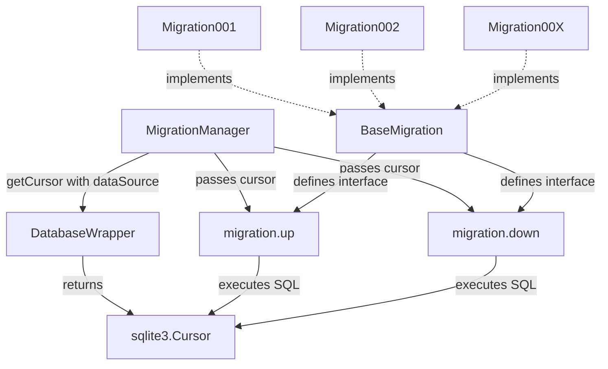
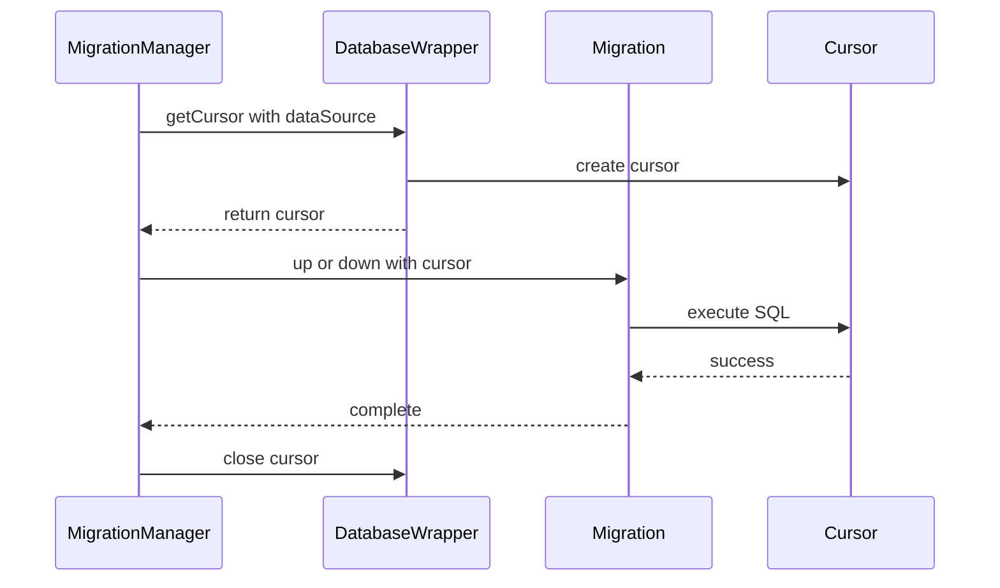

# Task: Migration System Cursor Refactoring

**Phase:** Code Quality Improvement
**Category:** Database Migration System
**Priority:** Medium
**Complexity:** Moderate
**Estimated Duration:** 2-3 hours
**Assigned To:** Code Mode
**Date Created:** 2025-11-30

## Objective

Refactor the database migration system to pass `sqlite3.Cursor` objects directly to migration `up()` and `down()` methods instead of passing the entire `DatabaseWrapper` instance. This improves separation of concerns, reduces coupling, and makes migrations more focused on their core responsibility of executing SQL commands.

**Success Definition:** All migrations receive cursor objects directly, eliminating the need for each migration to call `db.getCursor()` internally, with all tests passing and no breaking changes.

## Prerequisites

### Dependency Tasks
- [x] **Analysis Complete:** Migration system analysis has been completed - Status: Complete
- [x] **Context Gathered:** All 6 migration files identified and analyzed - Status: Complete

### Required Artifacts
- [`internal/database/migrations/base.py`](internal/database/migrations/base.py:1) - Base migration class with abstract methods
- [`internal/database/migrations/manager.py`](internal/database/migrations/manager.py:1) - Migration manager with TODO comments at lines 172 and 228
- [`internal/database/migrations/create_migration.py`](internal/database/migrations/create_migration.py:1) - Migration template generator
- All 6 migration files in [`internal/database/migrations/versions/`](internal/database/migrations/versions/) directory

## Detailed Steps

### Step 1: Update Base Migration Class
**Estimated Time:** 15 minutes
**Description:** Update the abstract method signatures in [`BaseMigration`](internal/database/migrations/base.py:12) to accept `cursor` parameter instead of `db` parameter.

**Actions:**
- [ ] Update [`up()`](internal/database/migrations/base.py:20) method signature from `up(self, db: "DatabaseWrapper")` to `up(self, cursor: sqlite3.Cursor)`
- [ ] Update [`down()`](internal/database/migrations/base.py:30) method signature from `down(self, db: "DatabaseWrapper")` to `down(self, cursor: sqlite3.Cursor)`
- [ ] Update docstrings to reflect cursor parameter instead of db parameter
- [ ] Add `import sqlite3` at the top of the file

**Completion Criteria:**
- Abstract method signatures updated with correct type hints
- Docstrings accurately describe the cursor parameter
- No syntax errors in the file

**Potential Issues:**
- Type checking may initially fail until all implementations are updated
- Mitigation: This is expected and will be resolved in subsequent steps

### Step 2: Update Migration Manager
**Estimated Time:** 30 minutes
**Description:** Update [`MigrationManager`](internal/database/migrations/manager.py:25) to obtain cursor and pass it to migration methods, removing TODO comments.

**Actions:**
- [ ] In [`migrate()`](internal/database/migrations/manager.py:172) method at line 172:
  - Replace `migration.up(self.db)` with cursor acquisition and passing
  - Use `cursor = self.db.getCursor(dataSource=dataSource)`
  - Call `migration.up(cursor)` within cursor context
  - Remove TODO comment at line 171
- [ ] In [`rollback()`](internal/database/migrations/manager.py:228) method at line 228:
  - Replace `migration.down(self.db)` with cursor acquisition and passing
  - Use `cursor = self.db.getCursor(dataSource=dataSource)`
  - Call `migration.down(cursor)` within cursor context
  - Remove corresponding TODO comment
- [ ] Ensure proper cursor context management (with statement)
- [ ] Verify error handling remains intact

**Completion Criteria:**
- Manager obtains cursor via `self.db.getCursor(dataSource=dataSource)`
- Cursor is passed to `migration.up(cursor)` and `migration.down(cursor)`
- TODO comments removed
- Cursor context properly managed with `with` statement
- Error handling and logging preserved

**Potential Issues:**
- Cursor context management must be correct to avoid resource leaks
- Mitigation: Use `with` statement for automatic cursor cleanup

### Step 3: Update All Existing Migrations
**Estimated Time:** 45 minutes
**Description:** Update all 6 migration files to accept cursor parameter and remove internal `db.getCursor()` calls.

**Actions:**
- [ ] Update [`migration_001_initial_schema.py`](internal/database/migrations/versions/migration_001_initial_schema.py:1):
  - Change `up(self, db: "DatabaseWrapper")` to `up(self, cursor: sqlite3.Cursor)` at line 20
  - Remove `with db.getCursor() as cursor:` at line 22
  - Dedent cursor operations
  - Update `down()` method similarly
  - Update docstrings
- [ ] Update `migration_002_add_is_spammer_to_chat_users.py`:
  - Apply same pattern as migration 001
  - Remove `db.getCursor()` calls
  - Accept cursor parameter directly
- [ ] Update `migration_003_add_metadata_to_chat_users.py`:
  - Apply same pattern
  - Remove `db.getCursor()` calls
- [ ] Update `migration_004_add_cache_storage_table.py`:
  - Apply same pattern
  - Remove `db.getCursor()` calls
- [ ] Update `migration_005_add_yandex_cache.py`:
  - Apply same pattern
  - Remove `db.getCursor()` calls
- [ ] Update `migration_006_new_cache_tables.py`:
  - Apply same pattern
  - Remove `db.getCursor()` calls
- [ ] Add `import sqlite3` to each migration file
- [ ] Remove `DatabaseWrapper` from TYPE_CHECKING imports

**Completion Criteria:**
- All 6 migrations accept `cursor: sqlite3.Cursor` parameter
- No internal `db.getCursor()` calls remain
- All cursor operations properly dedented
- Docstrings updated to reflect cursor parameter
- Type hints correct with `sqlite3.Cursor`

**Potential Issues:**
- Indentation errors when removing `with` statement
- Mitigation: Carefully dedent all cursor operations by one level

### Step 4: Update Migration Template
**Estimated Time:** 20 minutes
**Description:** Update the migration template in [`create_migration.py`](internal/database/migrations/create_migration.py:74) to generate migrations with new cursor parameter pattern.

**Actions:**
- [ ] Update template at line 74-85 to use cursor parameter
- [ ] Change method signatures to accept `cursor: sqlite3.Cursor`
- [ ] Update template docstrings
- [ ] Add `import sqlite3` to template
- [ ] Remove `DatabaseWrapper` from TYPE_CHECKING in template
- [ ] Update example code in template to use cursor directly

**Completion Criteria:**
- Template generates migrations with `cursor: sqlite3.Cursor` parameter
- Template includes `import sqlite3`
- Template does not include `db.getCursor()` pattern
- Generated migrations follow new pattern

**Potential Issues:**
- Existing migrations won't be affected, only new ones
- Mitigation: This is expected behavior - old migrations already updated in Step 3

### Step 5: Testing and Validation
**Estimated Time:** 30 minutes
**Description:** Run comprehensive tests to ensure all migrations work correctly with the new cursor-based approach.

**Actions:**
- [ ] Run full test suite: `./venv/bin/python3 -m pytest`
- [ ] Verify all 961+ tests pass
- [ ] Test migration up: Run migrations on fresh database
- [ ] Test migration down: Test rollback functionality
- [ ] Verify no regression in multi-source database functionality
- [ ] Check that dataSource parameter still works correctly
- [ ] Manually inspect migration logs for any errors

**Completion Criteria:**
- All tests passing (961+ tests)
- Migrations can be applied successfully
- Rollbacks work correctly
- No errors in migration logs
- Multi-source database functionality intact

**Potential Issues:**
- Tests may fail if cursor context not properly managed
- Mitigation: Review cursor usage in manager.py carefully

## Expected Outcome

### Primary Deliverables
- [`internal/database/migrations/base.py`](internal/database/migrations/base.py:1) - Updated with cursor parameter signatures
- [`internal/database/migrations/manager.py`](internal/database/migrations/manager.py:1) - Updated to pass cursor, TODOs removed
- [`internal/database/migrations/create_migration.py`](internal/database/migrations/create_migration.py:1) - Updated template with cursor pattern
- All 6 migration files in [`internal/database/migrations/versions/`](internal/database/migrations/versions/) - Updated to accept cursor

### Secondary Deliverables
- Task completion report in [`docs/reports/`](docs/reports/) directory
- Updated Memory Bank with architectural decision

### Quality Standards
- All 961+ tests must pass
- No breaking changes to existing functionality
- Code follows camelCase naming conventions
- Docstrings updated with proper Args/Returns sections
- No TODO comments remain in modified files

### Integration Points
- Migration system integrates with DatabaseWrapper's `getCursor()` method
- Multi-source database architecture remains functional
- Migration auto-discovery continues to work
- Version tracking in settings table unaffected

## Testing Criteria

### Unit Testing
- [ ] **Migration Execution:** Verify migrations can be applied
  - Run `migrate()` on test database
  - Check all tables created correctly
  - Verify version tracking updated
  - Pass criteria: No errors, all tables present

- [ ] **Migration Rollback:** Verify migrations can be rolled back
  - Run `rollback()` on migrated database
  - Check tables removed correctly
  - Verify version tracking updated
  - Pass criteria: No errors, rollback successful

### Integration Testing
- [ ] **Multi-Source Database:** Test with multiple data sources
  - Apply migrations to different data sources
  - Verify dataSource parameter works
  - Check cross-source functionality intact
  - Pass criteria: All sources migrated correctly

- [ ] **Full Test Suite:** Run complete project test suite
  - Execute `./venv/bin/python3 -m pytest`
  - Verify 961+ tests pass
  - Check no new failures introduced
  - Pass criteria: All tests passing

### Manual Validation
- [ ] **Code Review:** Review all changes for correctness
  - Check cursor context management
  - Verify no `db.getCursor()` calls in migrations
  - Confirm docstrings updated
  - Pass criteria: Code follows patterns, no issues found

- [ ] **Migration Logs:** Inspect migration execution logs
  - Run migrations with logging enabled
  - Check for any warnings or errors
  - Verify timing information correct
  - Pass criteria: Clean logs, no errors

## Definition of Done

### Functional Completion
- [ ] All steps in the detailed plan have been completed
- [ ] All 6 migrations updated to use cursor parameter
- [ ] Migration manager passes cursor correctly
- [ ] Template generates new pattern
- [ ] TODO comments removed from manager.py

### Quality Assurance
- [ ] All 961+ unit tests are passing
- [ ] Migration up/down tested successfully
- [ ] Code review completed
- [ ] No regression in existing functionality
- [ ] Multi-source database functionality verified

### Documentation
- [ ] Code properly documented with updated docstrings
- [ ] All method signatures have correct type hints
- [ ] Args/Returns sections updated in docstrings
- [ ] Task completion report created in [`docs/reports/`](docs/reports/)

### Integration and Deployment
- [ ] Changes integrate cleanly with existing codebase
- [ ] No breaking changes to migration system API
- [ ] Backward compatibility maintained (old migrations still work)
- [ ] Memory Bank updated with architectural decision

### Administrative
- [ ] Task status updated
- [ ] Implementation time recorded
- [ ] Lessons learned documented in completion report
- [ ] Memory Bank updated with decision log entry

---

## Architecture Diagram

## Implementation Flow

---

**Related Tasks:**
**Previous:** Migration system analysis (completed)
**Next:** Future migration development using new pattern
**Parent Phase:** Code Quality Improvement Phase

---

## Notes for Implementation

1. **Order of Operations:** Follow steps sequentially to avoid breaking changes
2. **Testing Strategy:** Test after each major step (base class, manager, migrations)
3. **Cursor Management:** Always use `with` statement for cursor context
4. **Type Hints:** Ensure `import sqlite3` added where needed
5. **Docstrings:** Update all docstrings to reflect cursor parameter
6. **TODO Removal:** Remove TODO comments at lines 171 and corresponding line in rollback
7. **Backward Compatibility:** Old migrations will work after update since they implement same interface