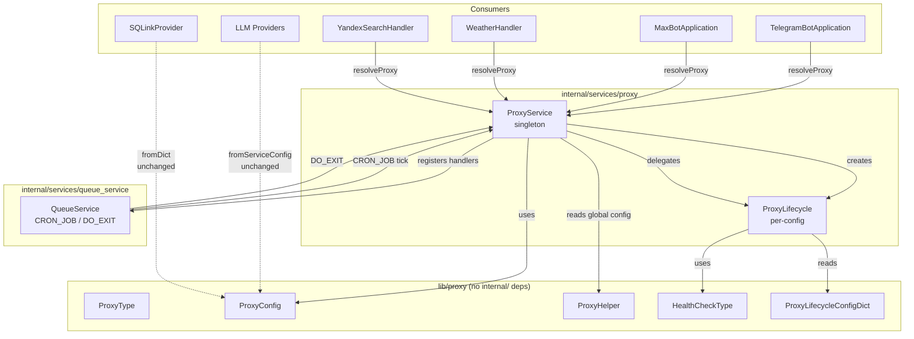
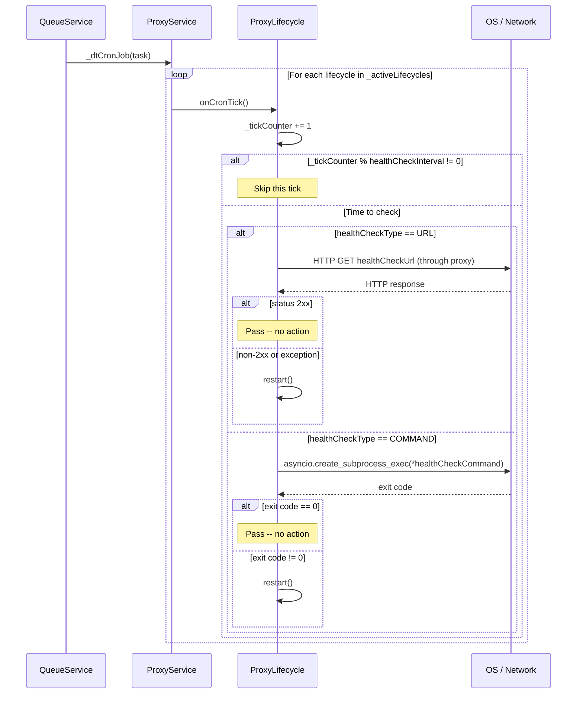
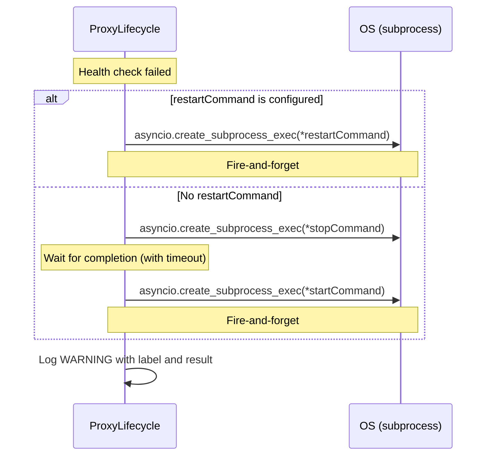
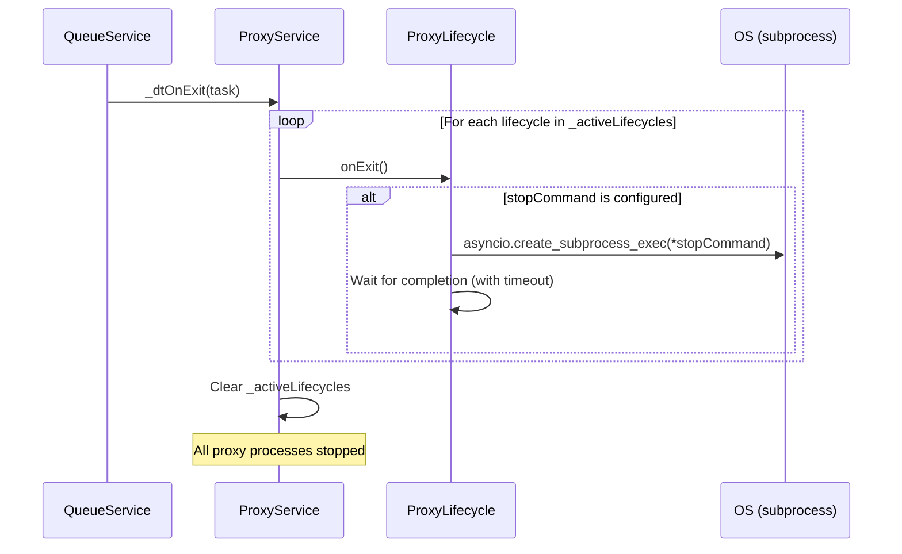

# Proxy Lifecycle Management -- Design Document

> **Status:** READY FOR IMPLEMENTATION
> **Last updated:** 2026-06-26
> **Depends on:** Existing `lib/proxy` module (implemented via [proxy-support.md](proxy-support.md))

---

## Table of Contents

1. [Overview & Motivation](#1-overview--motivation)
2. [Design Goals & Use Case](#2-design-goals--use-case)
3. [Architecture](#3-architecture)
4. [Configuration Specification](#4-configuration-specification)
5. [Lifecycle Stages](#5-lifecycle-stages)
6. [Integration with Existing Patterns](#6-integration-with-existing-patterns)
7. [Call Site Migration](#7-call-site-migration)
8. [Implementation Phases](#8-implementation-phases)
9. [Testing Strategy](#9-testing-strategy)
10. [Documentation Impact](#10-documentation-impact)
11. [Open Questions & Future Work](#11-open-questions--future-work)

---

## 1. Overview & Motivation

The Gromozeka proxy module (`lib/proxy/__init__.py`) is a stateless configuration
resolution system. It provides `ProxyType`, `ProxyConfig`, `ProxyHelper`, and a
merge system (`getCombined()`) for per-service proxy overrides. Consumers resolve
proxy config independently at point-of-use; the module has zero lifecycle hooks,
zero connection management, and zero subprocess management.

This works well for proxies that are managed externally (system-wide SOCKS daemons,
corporate HTTP proxies, etc.), but falls short for a common deployment scenario:
**the proxy process itself must be started, monitored, and stopped by the
application** -- for example, an SSH SOCKS5 tunnel (`ssh -D 1080 -N user@host`)
that exists only to serve this bot.

This design adds optional proxy lifecycle management: start/stop commands, periodic
health checks, and automatic restart on failure. The feature is fully opt-in;
existing deployments that do not configure a `[proxy.lifecycle]` section are
unaffected.

### Non-Goals

| Excluded | Reason |
|---|---|
| PID tracking / SIGTERM of managed processes | Commands are fire-and-forget; the user's `stop-command` is responsible for teardown (e.g., `pkill`). This avoids the complexity of PID management, orphan detection, and cross-platform signal handling. |
| Exception interception at consumer HTTP call sites | Detecting proxy failures at the point of use (e.g., `httpx.ConnectError`) and triggering restart is deferred to a future iteration. Health checks cover the monitoring gap for now. |
| Hot-reload of lifecycle config | Like the base proxy config, lifecycle config is loaded once at startup. |
| Per-request proxy selection | Out of scope; same as the base proxy module. |
| Managed proxy processes for `lib/` consumers directly | `lib/` has no access to `internal/`. Lifecycle management lives in `internal/services/proxy/`; `lib/` consumers receive a resolved `ProxyConfig` as before. |

---

## 2. Design Goals & Use Case

### Primary Use Case: SSH SOCKS5 Tunnel

A Gromozeka deployment behind a restrictive network runs an SSH tunnel for
outbound traffic:

```bash
# Start a SOCKS5 tunnel on port 1080
ssh -D 1080 -N -q -o ServerAliveInterval=60 user@jumpbox.example.com
```

Today, the operator must start this tunnel manually before the bot and ensure it
stays alive. If it dies, the bot's outbound requests silently fail until someone
notices and restarts the tunnel.

**After this feature:**

```toml
[proxy]
enabled = true
type = "socks5"
address = "socks5://127.0.0.1:1080"

[proxy.lifecycle]
start-command = ["ssh", "-D", "1080", "-N", "-q", "-o", "ServerAliveInterval=60", "user@jumpbox"]
stop-command = ["pkill", "-f", "ssh.*-D.*1080"]
health-check-type = "command"
health-check-command = ["nc", "-z", "127.0.0.1", "1080"]
health-check-interval = 5
```

The bot starts the tunnel on boot, checks it every 5 minutes, restarts it on
failure, and kills it on shutdown.

### Design Principles

1. **Opt-in, zero-impact default.** No `[proxy.lifecycle]` section = no behavior
   change.
2. **Fire-and-forget commands.** The simplest model that works. No PID files, no
   `SIGTERM`, no process group management.
3. **Follow existing patterns.** Use `CRON_JOB` / `DO_EXIT` via `QueueService`,
   singleton service in `internal/services/`, same config merge semantics.
4. **Per-proxy lifecycle.** Each proxy config with a `lifecycle` section gets its
   own `ProxyLifecycle` instance. Global proxy and per-service proxies are
   independent.
5. **Unlimited restart on health-check failure.** The proxy is infrastructure;
   if it's down, keep trying. Log warnings, never give up.

---

## 3. Architecture

### 3.1 File Layout

```
lib/proxy/__init__.py                        # MODIFIED -- new types only
    +  HealthCheckType(StrEnum)
    +  ProxyLifecycleConfigDict(TypedDict)
    +  ProxyConfig.lifecycle: Optional[ProxyLifecycleConfigDict]

internal/services/proxy/__init__.py          # NEW -- package init, re-exports
internal/services/proxy/service.py           # NEW -- ProxyService singleton
internal/services/proxy/lifecycle.py         # NEW -- ProxyLifecycle per-config instance

configs/00-defaults/proxy.toml               # MODIFIED -- lifecycle defaults
```

### 3.2 Class Relationships

```
lib/proxy/__init__.py
+--------------------------------------------------+
| ProxyType(StrEnum)          -- existing, unchanged|
| ProxyConfigDict(TypedDict)  -- existing, unchanged|
| ProxyKwargs(TypedDict)      -- existing, unchanged|
| ProxyConfig                 -- existing class      |
|   + lifecycle: Optional[ProxyLifecycleConfigDict] | NEW field
| ProxyHelper                 -- existing, unchanged|
|                                                    |
| HealthCheckType(StrEnum)    -- NEW                 |
|   NONE = "none"                                    |
|   URL  = "url"                                     |
|   COMMAND = "command"                               |
|                                                    |
| ProxyLifecycleConfigDict(TypedDict, total=False)   |
|   startCommand: List[str]                          |
|   stopCommand: List[str]                           |
|   restartCommand: List[str]                        |
|   healthCheckType: HealthCheckType                 |
|   healthCheckUrl: str                              |
|   healthCheckCommand: List[str]                    |
|   healthCheckInterval: int                         |
+--------------------------------------------------+

internal/services/proxy/service.py
+--------------------------------------------------+
| ProxyService (singleton)                          |
|   _instance: Optional[ProxyService]               |
|   _lock: RLock                                    |
|   initialized: bool                               |
|                                                    |
|   + getInstance() -> ProxyService                  |
|   + initialize(queueService, configManager) -> None|
|   + resolveProxy(serviceConfig) -> ProxyConfig     |
|   + getGlobalProxyConfig() -> ProxyConfig          |
|   + _activeLifecycles: Dict[str, ProxyLifecycle]   |
|   + _dtCronJob(task) -> None                       |
|   + _dtOnExit(task) -> None                        |
+--------------------------------------------------+
         |  creates/manages
         v
internal/services/proxy/lifecycle.py
+--------------------------------------------------+
| ProxyLifecycle (non-singleton, one per proxy)     |
|   label: str                                       |
|   config: ProxyLifecycleConfigDict                 |
|   proxyConfig: ProxyConfig                         |
|   _tickCounter: int                                |
|                                                    |
|   + start() -> None                                |
|   + stop() -> None                                 |
|   + restart() -> None                              |
|   + healthCheck() -> bool                          |
|   + onCronTick() -> None                           |
|   + onExit() -> None                               |
+--------------------------------------------------+
```

### 3.3 Dependency Flow

```
main.py
  |
  +-> GromozekBot.__init__()
        |
        +-> ProxyHelper.getInstance().setGlobalProxyConfig(...)    # existing, stays
        +-> ProxyService.getInstance().initialize(                 # NEW
        |       queueService=QueueService.getInstance(),
        |       configManager=self.configManager,
        |   )
        |     |
        |     +-> reads configManager.getProxyConfig()
        |     +-> if lifecycle section present:
        |     |     creates ProxyLifecycle("global", lifecycleConfig, proxyConfig)
        |     |     calls lifecycle.start()
        |     +-> registers CRON_JOB handler
        |     +-> registers DO_EXIT handler
        |
        +-> TelegramBotApplication / MaxBotApplication
              |
              +-> ProxyService.getInstance().resolveProxy(botConfig)   # replaces
                  ProxyConfig.fromServiceConfig(botConfig)              # existing calls
```

### 3.4 Component Diagram (Mermaid)



**Note on LLM providers and sqlink:** These consumers live in `lib/` and cannot
import from `internal/`. They continue to use `ProxyConfig.fromServiceConfig()`
directly. Lifecycle management for per-service proxies configured on these
consumers is handled when `ProxyService.resolveProxy()` is called during their
initialization (see [Section 7](#7-call-site-migration)).

---

## 4. Configuration Specification

### 4.1 Full TOML Schema

The `lifecycle` sub-section is added under `[proxy]` (global) and under any
per-service `[<service>.proxy]` section. All fields are optional; omitting the
entire `[proxy.lifecycle]` section disables lifecycle management.

#### Global proxy with lifecycle (append to `configs/00-defaults/proxy.toml`)

```toml
[proxy]
enabled = false
type = "http"
address = ""
user = ""
password = ""

# --- Lifecycle management (optional) ---
# Omit this entire section to disable lifecycle management.
# When present, proxy lifecycle commands are executed at startup/shutdown,
# and health checks run periodically.
#
# [proxy.lifecycle]
# # Command to start the proxy process. Executed on application startup.
# # Array of strings (passed to asyncio.create_subprocess_exec).
# start-command = []
#
# # Command to stop the proxy process. Executed on application shutdown
# # and before restart (if no restart-command is provided).
# stop-command = []
#
# # Command to restart the proxy process. Optional.
# # If omitted, restart = stop-command + start-command sequentially.
# restart-command = []
#
# # Health check type: "none", "url", or "command".
# # "none" (default): no health monitoring, no CRON_JOB overhead.
# # "url": HTTP GET through the proxy to health-check-url; 2xx = pass.
# # "command": run health-check-command; exit 0 = pass.
# health-check-type = "none"
#
# # URL to probe when health-check-type = "url".
# health-check-url = ""
#
# # Command to run when health-check-type = "command".
# health-check-command = []
#
# # Health check interval in minutes. The CRON_JOB fires every ~60s;
# # the health check runs every Nth tick (gated by modulo counter).
# # Default: 5 (every 5 minutes).
# health-check-interval = 5
```

#### Per-service proxy with lifecycle (user config example)

```toml
# Example: Weather service with its own SOCKS tunnel
[openweathermap]
enabled = true
api-key = "${OWM_API_KEY}"
use-proxy = true

[openweathermap.proxy]
enabled = true
type = "socks5"
address = "socks5://127.0.0.1:1081"

[openweathermap.proxy.lifecycle]
start-command = ["ssh", "-D", "1081", "-N", "-q", "user@weather-proxy"]
stop-command = ["pkill", "-f", "ssh.*-D.*1081"]
health-check-type = "url"
health-check-url = "https://api.openweathermap.org/data/2.5/weather?q=London&appid=test"
health-check-interval = 10
```

### 4.2 Field Reference

| Field | Type | Required | Default | Description |
|---|---|---|---|---|
| `start-command` | `List[str]` | No | `[]` | Command + args for `asyncio.create_subprocess_exec`. Executed on app startup. If empty, no start action. |
| `stop-command` | `List[str]` | No | `[]` | Executed on app shutdown and as part of restart (if no `restart-command`). |
| `restart-command` | `List[str]` | No | `[]` | If present, used instead of stop+start on health-check failure. |
| `health-check-type` | `str` | No | `"none"` | One of `"none"`, `"url"`, `"command"`. |
| `health-check-url` | `str` | No | `""` | URL for health-check-type `"url"`. HTTP GET; any 2xx = pass. |
| `health-check-command` | `List[str]` | No | `[]` | Command for health-check-type `"command"`. Exit 0 = pass. |
| `health-check-interval` | `int` | No | `5` | Minutes between health checks. Gated via tick counter modulo. |

### 4.3 Config Key Mapping (TOML to TypedDict)

TOML uses `kebab-case`; the TypedDict uses `camelCase` per project convention.
Conversion happens in `ProxyLifecycleConfigDict.fromDict()` (a classmethod
or standalone factory function):

| TOML key | TypedDict field |
|---|---|
| `start-command` | `startCommand` |
| `stop-command` | `stopCommand` |
| `restart-command` | `restartCommand` |
| `health-check-type` | `healthCheckType` |
| `health-check-url` | `healthCheckUrl` |
| `health-check-command` | `healthCheckCommand` |
| `health-check-interval` | `healthCheckInterval` |

---

## 5. Lifecycle Stages

### 5.1 Startup Sequence

```mermaid
sequenceDiagram
    participant M as main.py
    participant GB as GromozekBot
    participant PH as ProxyHelper
    participant PS as ProxyService
    participant PL as ProxyLifecycle
    participant QS as QueueService
    participant OS as OS (subprocess)

    M->>GB: GromozekBot(configManager)
    GB->>PH: setGlobalProxyConfig(proxyDict)
    GB->>PS: getInstance().initialize(queueService, configManager)
    PS->>PS: Read configManager.getProxyConfig()
    PS->>PS: Check for lifecycle sub-section
    alt lifecycle section present
        PS->>PL: ProxyLifecycle("global", lifecycleConfig, proxyConfig)
        PS->>PS: Store in _activeLifecycles["global"]
        PL->>OS: asyncio.create_subprocess_exec(*startCommand)
        Note over PL,OS: Fire-and-forget; no PID tracking
    end
    PS->>QS: registerDelayedTaskHandler(CRON_JOB, _dtCronJob)
    PS->>QS: registerDelayedTaskHandler(DO_EXIT, _dtOnExit)
    Note over PS: Initialization complete
    GB->>GB: Continue with bot app creation...
```

**Important timing:** `ProxyService.initialize()` is called **after**
`ProxyHelper.setGlobalProxyConfig()` in `GromozekBot.__init__`, so the global
proxy config is already available for `getCombined()` calls. The start command is
fire-and-forget: the subprocess is created but not awaited for completion (a
long-running daemon like `ssh -D ... -N` never exits on its own). No PID is
tracked. If the proxy process needs time to bind its port (e.g., SSH key exchange),
the operator can include a `sleep` in their start script or use a wrapper that
waits for readiness before backgrounding. See also Section 11.3 (Start Delay /
Readiness Check) for a possible future enhancement.

### 5.2 Health Check (CRON_JOB Tick)



**Interval gating:** The `CRON_JOB` fires every ~60 seconds
(`internal/services/queue_service/service.py:192`). Each `ProxyLifecycle` maintains
a `_tickCounter` that increments on every `onCronTick()` call. The actual health
check runs only when `_tickCounter % healthCheckInterval == 0`. With the default
interval of 5, the health check runs approximately every 5 minutes.

### 5.3 Restart on Failure



**Unlimited retries:** There is no retry limit or backoff. If the health check
keeps failing, restart is attempted every `healthCheckInterval` minutes. This is
intentional: the proxy is infrastructure, and the operator is expected to fix the
underlying issue. The WARNING log provides visibility.

### 5.4 Shutdown (DO_EXIT)



**Ordering:** The `DO_EXIT` handler runs as part of the `QueueService` shutdown
sequence. Since `QueueService.beginShutdown()` is called from `postStop()` in
both `TelegramBotApplication` (`application.py:329`) and `MaxBotApplication`
(`application.py:135`), proxy stop commands execute before the final
`GromozekBot._shutdown()` closes LLM HTTP clients and database connections.
This is the correct order: stop the proxy last (or at least after the HTTP
clients are closed), so in-flight requests can complete through the proxy.

However, the `DO_EXIT` handlers are called in registration order by
`QueueService`, and multiple components register `DO_EXIT` handlers. The
`ProxyService` `DO_EXIT` handler should be registered early (it registers during
`GromozekBot.__init__`, before the bot application creates its handlers), but
the actual execution order among all `DO_EXIT` handlers is:

1. `QueueService._doExitHandler` (built-in, waits for background tasks)
2. `HandlersManager._dtOnExit` (cleans up old data)
3. `SandboxHandler._dtOnExit` (shuts down Docker containers)
4. `ResenderHandler._dtOnExit` (flushes pending resends)
5. **`ProxyService._dtOnExit`** (stops proxy processes)
6. Other handlers as registered...

This order is acceptable: proxy processes should be stopped late, after other
components have finished their cleanup work that may require proxy connectivity.

### 5.5 Per-Service Proxy Lifecycle

When a consumer calls `ProxyService.resolveProxy(serviceConfig)`, the service:

1. Calls `ProxyConfig.fromServiceConfig(serviceConfig)` to get the base
   `ProxyConfig` (same logic as today).
2. Checks if `serviceConfig` contains a `proxy.lifecycle` sub-section.
3. If present and no `ProxyLifecycle` exists for this service key yet:
   - Creates a `ProxyLifecycle(label=serviceKey, config=lifecycleConfig, proxyConfig=proxyConfig)`.
   - Calls `lifecycle.start()`.
   - Stores it in `_activeLifecycles[serviceKey]`.
4. Returns the `ProxyConfig` (which the consumer uses as before).

The `serviceKey` is derived from the config section name. For handler-level
proxies (weather, yandex-search), this is deterministic and stable because the
handler is initialized once. The `ProxyService` deduplicates by key, so calling
`resolveProxy()` with the same config multiple times is safe.

---

## 6. Integration with Existing Patterns

### 6.1 QueueService: CRON_JOB and DO_EXIT

The design follows the same pattern used by `SandboxHandler`
(`internal/bot/common/handlers/sandbox.py:92-93`), `HandlersManager`
(`internal/bot/common/handlers/manager.py:562-563`), `ChatSearchHandler`
(`internal/bot/common/handlers/chat_search.py:192`), and `ResenderHandler`
(`internal/bot/common/handlers/resender.py:241-244`):

```python
self.queueService.registerDelayedTaskHandler(DelayedTaskFunction.CRON_JOB, self._dtCronJob)
self.queueService.registerDelayedTaskHandler(DelayedTaskFunction.DO_EXIT, self._dtOnExit)
```

Multiple handlers can register for the same `DelayedTaskFunction`; they are
called sequentially in registration order (`service.py:378`).

### 6.2 Singleton Pattern

`ProxyService` follows the project's standard singleton pattern:

```python
class ProxyService:
    """Singleton service for proxy lifecycle management.

    Manages proxy process lifecycles (start, health-check, restart, stop)
    for the global proxy and per-service proxy overrides. Integrates with
    QueueService for periodic health checks (CRON_JOB) and graceful
    shutdown (DO_EXIT).

    Attributes:
        _activeLifecycles: Registry of active ProxyLifecycle instances,
            keyed by a unique label (e.g. "global", "openweathermap").
    """

    _instance: Optional["ProxyService"] = None
    _lock = RLock()

    def __new__(cls) -> "ProxyService":
        """Create or return the singleton instance.

        Returns:
            The singleton ProxyService instance.
        """
        with cls._lock:
            if cls._instance is None:
                cls._instance = super().__new__(cls)
            return cls._instance

    @classmethod
    def getInstance(cls) -> "ProxyService":
        """Get or create the singleton ProxyService instance.

        Returns:
            The singleton ProxyService instance.
        """
        if cls._instance is None:
            return cls()
        return cls._instance

    def __init__(self) -> None:
        """Initialise the proxy service.

        Only the first call executes; subsequent calls are guarded by
        the hasattr(self, 'initialized') sentinel.
        """
        if hasattr(self, "initialized"):
            return
        self.initialized = True
        self._activeLifecycles: Dict[str, ProxyLifecycle] = {}
```

### 6.3 SandboxHandler Analogy

`SandboxHandler` is the closest existing analogue. It manages Docker container
lifecycles with:

- **Recovery on startup** via `_dtCronJob` (first tick, `sandbox.py:211-218`)
- **Periodic GC** via `_dtCronJob` with time-based gating (`sandbox.py:221-228`)
- **Graceful shutdown** via `_dtOnExit` (`sandbox.py:230-243`)

`ProxyService` mirrors this structure but with simpler lifecycle:

| Aspect | SandboxHandler | ProxyService |
|---|---|---|
| Managed resource | Docker containers | Shell subprocesses |
| Startup | `SandboxManager.injectConfig()` | `ProxyLifecycle.start()` |
| Periodic check | `collectGarbage()` every 30 min | `healthCheck()` every N min |
| Shutdown | `SandboxManager.shutdown()` | `ProxyLifecycle.stop()` for all |
| Recovery | `SandboxManager.recover()` on first tick | Start command runs at init time |
| Gating | `time.time()` delta check | Tick counter modulo |

### 6.4 Subprocess Execution

The app currently has zero subprocess management. This design introduces
`asyncio.create_subprocess_exec` for the first time. The implementation should:

1. Use `asyncio.create_subprocess_exec(*command)` -- not `shell=True`, not
   `subprocess.run()`.
2. For fire-and-forget commands (start, restart): create the process, optionally
   wait a brief configurable delay, do **not** track the PID.
3. For commands that must complete before proceeding (stop, health-check command):
   await `process.wait()` with a timeout (e.g., 30 seconds). If the timeout
   expires, log a warning and continue.
4. Capture `stdout`/`stderr` via `subprocess.PIPE` and log at DEBUG level for
   troubleshooting.

```python
async def _runCommand(self, command: List[str], *, waitForCompletion: bool = False) -> Optional[int]:
    """Run a shell command via asyncio subprocess.

    Args:
        command: Command and arguments as a list of strings.
        waitForCompletion: If True, wait for the process to exit (with timeout).
            If False, fire-and-forget.

    Returns:
        Exit code if waitForCompletion is True, None otherwise.
    """
    if not command:
        return None

    logger.debug("Running command: %s (wait=%s)", command, waitForCompletion)
    try:
        process = await asyncio.create_subprocess_exec(
            *command,
            stdout=asyncio.subprocess.PIPE,
            stderr=asyncio.subprocess.PIPE,
        )
        if waitForCompletion:
            try:
                stdout, stderr = await asyncio.wait_for(process.communicate(), timeout=30)
                if stdout:
                    logger.debug("[%s] stdout: %s", self.label, stdout.decode(errors="replace"))
                if stderr:
                    logger.debug("[%s] stderr: %s", self.label, stderr.decode(errors="replace"))
                return process.returncode
            except asyncio.TimeoutError:
                logger.warning("[%s] Command timed out after 30s: %s", self.label, command)
                return None
        return None
    except Exception as e:
        logger.warning("[%s] Failed to run command %s: %s", self.label, command, e)
        return None
```

### 6.5 Health Check via URL

For `healthCheckType == HealthCheckType.URL`, the health check makes an HTTP GET
request **through the proxy** to `healthCheckUrl`. This verifies end-to-end
connectivity, not just that the proxy port is open.

```python
async def _checkUrl(self, url: str) -> bool:
    """Perform a URL-based health check through the proxy.

    Args:
        url: URL to probe. Any 2xx response = healthy.

    Returns:
        True if the probe succeeds (2xx), False otherwise.
    """
    try:
        proxyKwargs = self.proxyConfig.toKwargs()
        async with httpx.AsyncClient(**proxyKwargs, timeout=10.0) as client:
            response = await client.get(url)
            return 200 <= response.status_code < 300
    except Exception as e:
        logger.warning("[%s] URL health check failed (%s): %s", self.label, url, e)
        return False
```

This requires importing `httpx` in `lifecycle.py`. Since `httpx` is already a
core dependency of the project (used everywhere), this adds no new dependency.

---

## 7. Call Site Migration

### 7.1 Overview

Consumers in `internal/` switch from `ProxyConfig.fromServiceConfig()` to
`ProxyService.getInstance().resolveProxy()`. Consumers in `lib/` remain unchanged
(they cannot import from `internal/`).

### 7.2 Sites That Change

#### `main.py:45` -- Global proxy setup

**Before (stays as-is):**
```python
ProxyHelper.getInstance().setGlobalProxyConfig(self.configManager.getProxyConfig())
```

**After (add immediately below):**
```python
ProxyHelper.getInstance().setGlobalProxyConfig(self.configManager.getProxyConfig())
ProxyService.getInstance().initialize(
    queueService=QueueService.getInstance(),
    configManager=self.configManager,
)
```

Note: `QueueService.getInstance()` is safe to call here -- the singleton is
created (but `startDelayedScheduler` hasn't been called yet). The `initialize()`
method stores the reference for later handler registration; it does not need the
scheduler to be running. The `CRON_JOB` and `DO_EXIT` handlers are registered
eagerly (the queue accepts handler registrations before the scheduler starts), and
the start command runs synchronously via `asyncio.run()` or is deferred to the
first `CRON_JOB` tick.

**Important caveat:** `GromozekBot.__init__` runs in a synchronous context (called
from `main()` before `bot.run()`). The proxy start command needs `async` execution
(`asyncio.create_subprocess_exec`). Two options:

- **Option A:** Use `asyncio.run()` for the initial start command, similar to how
  `main.py:74` already uses `asyncio.run(self.rateLimiterManager.loadConfig(...))`.
- **Option B (preferred):** Defer the start command to the first `CRON_JOB` tick
  (same pattern as `SandboxHandler._recoveryDone` flag). This is simpler and
  avoids creating a second event loop. The trade-off is that the proxy starts
  ~60 seconds after boot (first CRON tick), not instantly. For most use cases
  this is acceptable; the proxy likely already runs or starts fast.

Recommendation: **Option A** for the global proxy (it must be ready before the bot
starts polling), **Option B** for per-service proxies (lazily started on first
`resolveProxy()` call if the event loop is already running).

#### `internal/bot/telegram/application.py:357` -- Telegram bot proxy

**Before:**
```python
proxyConfig = ProxyConfig.fromServiceConfig(botConfig).getCombined()
```

**After:**
```python
proxyConfig = ProxyService.getInstance().resolveProxy(botConfig).getCombined()
```

#### `internal/bot/max/application.py:293` -- Max bot proxy

**Before:**
```python
proxyConfig = ProxyConfig.fromServiceConfig(botConfig)
```

**After:**
```python
proxyConfig = ProxyService.getInstance().resolveProxy(botConfig)
```

#### `internal/bot/common/handlers/weather.py:78` -- OpenWeatherMap proxy

**Before:**
```python
weatherProxyConfig = ProxyConfig.fromServiceConfig(openWeatherMapConfig)
```

**After:**
```python
weatherProxyConfig = ProxyService.getInstance().resolveProxy(openWeatherMapConfig)
```

#### `internal/bot/common/handlers/weather.py:110` -- Geocode Maps proxy

**Before:**
```python
geocodeProxyConfig = ProxyConfig.fromServiceConfig(geocodeMapsConfig)
```

**After:**
```python
geocodeProxyConfig = ProxyService.getInstance().resolveProxy(geocodeMapsConfig)
```

#### `internal/bot/common/handlers/yandex_search.py:113` -- Yandex Search proxy

**Before:**
```python
self._proxyConfig = ProxyConfig.fromServiceConfig(ysConfig)
```

**After:**
```python
self._proxyConfig = ProxyService.getInstance().resolveProxy(ysConfig)
```

### 7.3 Sites That Do NOT Change

These consumers live in `lib/` and cannot import from `internal/`. They continue
to use `ProxyConfig.fromServiceConfig()` or `ProxyConfig.fromDict()` directly.
They receive already-resolved proxy configs from their callers:

| File | Call | Reason unchanged |
|---|---|---|
| `lib/ai/providers/basic_openai_provider.py:828` | `ProxyConfig.fromServiceConfig(self.provider.config).toKwargs()` | `lib/` -- no access to `internal/`. Lifecycle for LLM provider proxies is handled when the provider's config is passed through. If the LLM provider has per-service proxy lifecycle, it must be started by `ProxyService` via a `resolveProxy()` call during LLM manager init. |
| `lib/ai/providers/basic_openai_provider.py:1025` | `ProxyConfig.fromServiceConfig(self.config)` | Same as above. |
| `lib/ai/providers/openrouter_provider.py:280` | `ProxyConfig.fromServiceConfig(self.config).toKwargs()` | Same as above. |
| `lib/openweathermap/client.py` | Receives `ProxyConfig` parameter | Library; no change needed. |
| `lib/yandex_search/client.py` | Receives `ProxyConfig` parameter | Library; no change needed. |
| `lib/geocode_maps/client.py` | Receives `ProxyConfig` parameter | Library; no change needed. |
| `lib/max_bot/client.py` | Receives `ProxyConfig` parameter | Library; no change needed. |
| `internal/database/providers/sqlink.py` | Receives `proxy: ProxyConfigDict` | Receives raw dict; creates its own `ProxyConfig`. |

**LLM provider proxy lifecycle:** The LLM providers in `lib/ai/providers/`
resolve proxy config from `self.config`, which comes from the `[models]` TOML
section. If a model provider config has a `proxy.lifecycle` section, the
lifecycle management will **not** be automatic because these providers call
`ProxyConfig.fromServiceConfig()` directly. To support lifecycle for LLM
provider proxies, a separate integration point would be needed in
`LLMManager.initialize()` or in `GromozekBot.__init__` after creating the
`LLMManager`. This is noted as a future enhancement (see Section 11).

---

## 8. Implementation Phases

### Phase 1: Types and Config (low risk, no behavior change)

**Files modified:** `lib/proxy/__init__.py`, `configs/00-defaults/proxy.toml`

1. Add `HealthCheckType(StrEnum)` to `lib/proxy/__init__.py`.
2. Add `ProxyLifecycleConfigDict(TypedDict, total=False)` to `lib/proxy/__init__.py`.
3. Add optional `lifecycle` field to `ProxyConfig.__init__()` and `__slots__`.
4. Extend `ProxyConfig.fromDict()` to read the `lifecycle` sub-key from the data
   dict and pass it through.
5. Add commented-out lifecycle defaults to `configs/00-defaults/proxy.toml`.
6. **Run `make format lint` and `make test`.**

### Phase 2: ProxyLifecycle class (new code, no wiring)

**Files created:** `internal/services/proxy/__init__.py`,
`internal/services/proxy/lifecycle.py`

1. Create `internal/services/proxy/__init__.py` with re-exports.
2. Implement `ProxyLifecycle` class in `lifecycle.py`:
   - `__init__(self, label: str, config: ProxyLifecycleConfigDict, proxyConfig: ProxyConfig)` -- stores
     config and proxy config reference (needed for URL health checks), initializes tick counter.
   - `async start()` -- runs `startCommand` fire-and-forget.
   - `async stop()` -- runs `stopCommand`, waits for completion.
   - `async restart()` -- runs `restartCommand` if present, else stop+start.
   - `async healthCheck() -> bool` -- dispatches to URL or command check.
   - `async onCronTick()` -- increments counter, gates health check, triggers
     restart on failure.
   - `async onExit()` -- delegates to `stop()`.
   - Private `async _runCommand(command, waitForCompletion)` helper.
   - Private `async _checkUrl(url)` for URL health checks (uses stored `self.proxyConfig`).
3. Write unit tests for `ProxyLifecycle` with mocked subprocess and httpx.
4. **Run `make format lint` and `make test`.**

### Phase 3: ProxyService singleton (new code, wiring)

**Files created:** `internal/services/proxy/service.py`
**Files modified:** `main.py`

1. Implement `ProxyService` singleton in `service.py`:
   - `initialize(queueService, configManager)` -- reads config, creates global
     `ProxyLifecycle` if needed, registers `CRON_JOB`/`DO_EXIT`.
   - `resolveProxy(serviceConfig) -> ProxyConfig` -- wraps
     `ProxyConfig.fromServiceConfig()`, creates per-service `ProxyLifecycle`
     if lifecycle config is present.
   - `_dtCronJob(task)` -- iterates `_activeLifecycles`, calls `onCronTick()`.
   - `_dtOnExit(task)` -- iterates `_activeLifecycles`, calls `onExit()`.
2. Wire `ProxyService.initialize()` in `main.py` after `setGlobalProxyConfig()`.
3. Add autouse test fixture to reset `ProxyService._instance = None` (same
   pattern as other singletons in `tests/conftest.py`).
4. Write integration tests for `ProxyService` with mocked `QueueService` and
   `ConfigManager`.
5. **Run `make format lint` and `make test`.**

### Phase 4: Call site migration (mechanical, low risk)

**Files modified:** `internal/bot/telegram/application.py`,
`internal/bot/max/application.py`,
`internal/bot/common/handlers/weather.py`,
`internal/bot/common/handlers/yandex_search.py`

1. Replace `ProxyConfig.fromServiceConfig(...)` with
   `ProxyService.getInstance().resolveProxy(...)` at each call site listed
   in Section 7.2.
2. Add `from internal.services.proxy import ProxyService` import to each file.
3. **Run `make format lint` and `make test`.**
4. Verify all existing proxy tests still pass (the `resolveProxy` method
   delegates to `fromServiceConfig` internally; behavior is identical unless
   lifecycle config is present).

### Phase 5: Documentation sync

Load the `update-project-docs` skill and update documentation per the matrix
in Section 10.

---

## 9. Testing Strategy

### 9.1 Unit Tests

**`tests/services/proxy/test_lifecycle.py`** (new):

| Test | Description |
|---|---|
| `test_startRunsStartCommand` | Mock `asyncio.create_subprocess_exec`; verify start command is called with correct args. |
| `test_startEmptyCommand` | Empty `startCommand` is a no-op, no subprocess created. |
| `test_stopWaitsForCompletion` | Mock subprocess; verify `process.communicate()` is awaited. |
| `test_stopTimeout` | Mock subprocess that hangs; verify timeout logs warning and returns. |
| `test_restartUsesRestartCommand` | When `restartCommand` is set, verify it is called instead of stop+start. |
| `test_restartFallsBackToStopStart` | When `restartCommand` is empty, verify stop then start are called sequentially. |
| `test_healthCheckUrl2xx` | Mock httpx; return 200; verify `healthCheck()` returns True. |
| `test_healthCheckUrl5xx` | Mock httpx; return 503; verify `healthCheck()` returns False. |
| `test_healthCheckUrlException` | Mock httpx to raise `ConnectError`; verify returns False. |
| `test_healthCheckCommand0` | Mock subprocess exit code 0; verify returns True. |
| `test_healthCheckCommandNonZero` | Mock subprocess exit code 1; verify returns False. |
| `test_healthCheckNone` | `healthCheckType` is `NONE`; verify `healthCheck()` returns True (no-op). |
| `test_onCronTickGating` | Call `onCronTick()` N times; verify health check runs only every Nth tick. |
| `test_onCronTickRestartsOnFailure` | Mock failing health check; verify `restart()` is called. |
| `test_onExitCallsStop` | Verify `onExit()` calls `stop()`. |

**`tests/services/proxy/test_service.py`** (new):

| Test | Description |
|---|---|
| `test_singletonPattern` | `getInstance()` returns same instance. |
| `test_initializeWithoutLifecycle` | Config without lifecycle section; no `ProxyLifecycle` created. |
| `test_initializeWithLifecycle` | Config with lifecycle section; `ProxyLifecycle` created and `start()` called. |
| `test_resolveProxyDelegates` | `resolveProxy()` returns same result as `ProxyConfig.fromServiceConfig()`. |
| `test_resolveProxyWithLifecycle` | Service config with lifecycle; verify `ProxyLifecycle` created. |
| `test_resolveProxyDeduplicates` | Calling `resolveProxy()` twice with same config; only one `ProxyLifecycle`. |
| `test_dtCronJobDelegatesToLifecycles` | Register mock lifecycles; verify `onCronTick()` called on each. |
| `test_dtOnExitDelegatesToLifecycles` | Register mock lifecycles; verify `onExit()` called on each. |

### 9.2 Existing Tests

All existing proxy tests in `tests/lib/test_proxy.py` must continue to pass
unchanged. The new `lifecycle` field is optional and defaults to `None`; existing
`ProxyConfig` construction paths are unaffected.

### 9.3 Integration Test (Optional)

A manual or slow-marked integration test that:

1. Starts a simple TCP echo server as the "proxy" via a start command.
2. Verifies the health check command detects it.
3. Kills it and verifies health check fails and restart is triggered.
4. Calls the DO_EXIT path and verifies stop command runs.

This test would use real subprocesses (not mocks) and should be marked `@slow`.

### 9.4 Test Fixtures

Add to `tests/conftest.py`:

```python
@pytest.fixture(autouse=True)
def resetProxyServiceSingleton():
    """Reset ProxyService singleton between tests to prevent state leakage."""
    yield
    from internal.services.proxy.service import ProxyService
    ProxyService._instance = None
```

---

## 10. Documentation Impact

| Change | Documents to update |
|---|---|
| New types in `lib/proxy/__init__.py` | `docs/llm/libraries.md` (proxy module section) |
| New `internal/services/proxy/` package | `docs/llm/services.md` (add ProxyService section), `docs/llm/index.md` (update layout map) |
| Config changes in `proxy.toml` | `docs/llm/configuration.md` (proxy section) |
| Architecture: new service, subprocess management | `docs/llm/architecture.md` (services layer) |
| New test files | `docs/llm/testing.md` (test layout mention) |
| This design doc itself | `docs/llm/tasks.md` (reference if relevant gotchas emerge) |

The `update-project-docs` skill should be loaded after implementation to ensure
all documentation is synchronized.

---

## 11. Open Questions & Future Work

### 11.1 Exception Interception at Consumer Call Sites (Deferred)

Currently, if the proxy dies between health checks, consumer HTTP requests fail
with `httpx.ConnectError` (or similar). The consumer logs the error and the user
sees a "failed to get weather" message. The proxy stays dead until the next
health-check tick detects the failure.

A future enhancement could intercept proxy-related exceptions at the `ProxyConfig`
or `httpx.AsyncClient` level, notify `ProxyService` of the failure, and trigger
an immediate restart. This is deferred because:

1. It requires wrapping or monkey-patching httpx calls across many consumers.
2. The health-check mechanism provides adequate coverage for most failure modes.
3. The complexity is disproportionate to the benefit for v1.

### 11.2 LLM Provider Proxy Lifecycle

LLM providers in `lib/ai/providers/` call `ProxyConfig.fromServiceConfig()`
directly and cannot use `ProxyService` (wrong layer). To support lifecycle for
per-provider proxies, options include:

- **Wrapper in `GromozekBot.__init__`**: After creating `LLMManager`, iterate
  provider configs, call `ProxyService.resolveProxy()` for each, discard the
  return value (the side effect is lifecycle registration).
- **Callback from `LLMManager`**: Add a `proxyResolver` callback parameter to
  `LLMManager` that it calls instead of `ProxyConfig.fromServiceConfig()`.

Both add complexity for a rare use case (most deployments use the global proxy
for LLM providers). Deferred.

### 11.3 Start Delay / Readiness Check

After running the `startCommand`, the proxy process may need time to bind its
port and establish connections (e.g., SSH key exchange). A configurable
`start-delay-seconds` field (default 0) could be added to pause after start.
Alternatively, a `readiness-command` could be polled in a loop until it succeeds.

For v1, the operator can include a `sleep` in their start script or use a wrapper
that waits for readiness before exiting.

### 11.4 Startup Command in Sync Context

As noted in Section 7.2, `GromozekBot.__init__` runs synchronously. The
recommended approach is `asyncio.run()` for the global proxy start command
(matching the existing pattern at `main.py:74`). If this proves problematic,
the alternative is to defer to the first `CRON_JOB` tick and accept a ~60s
startup delay.

### 11.5 Multiple Global Proxies

The current design supports one global proxy and N per-service proxies. Some
deployments may want multiple global proxies (e.g., one for HTTP, one for SOCKS5)
with service-level selection. This is out of scope for v1 and would require
changes to the base proxy module.

### 11.6 Config Validation

The design does not currently validate lifecycle config fields at startup (e.g.,
`health-check-type = "url"` without `health-check-url`). Phase 2 should include
validation in `ProxyLifecycle.__init__` that logs a clear WARNING for
misconfiguration (e.g., "health-check-type is 'url' but health-check-url is
empty; health checks will be disabled").
