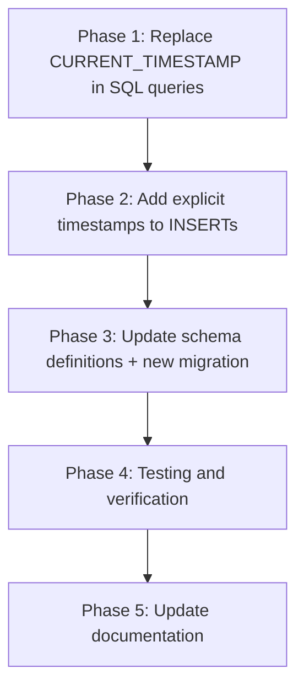

# Plan: Remove All `CURRENT_TIMESTAMP` from `internal/database/**`

## Goal

Remove every occurrence of the SQL expression `CURRENT_TIMESTAMP` from:
1. **SQL queries** in repositories and `bayes_storage.py` — replace with Python-generated UTC timestamps via [`dbUtils.getCurrentTimestamp()`](internal/database/utils.py:219)
2. **Table schema definitions** — remove `DEFAULT CURRENT_TIMESTAMP` from column declarations and create a migration to apply the schema change
3. **`database.py` settings table** — update the inline `CREATE TABLE` statement

To maintain correctness, every `INSERT` / `UPDATE` / `REPLACE` / `upsert` query that previously relied on `DEFAULT CURRENT_TIMESTAMP` must be updated to explicitly provide `created_at` and/or `updated_at` values.

---

## Current State Analysis

### Already converted — no `CURRENT_TIMESTAMP` in SQL

These files already use [`dbUtils.getCurrentTimestamp()`](internal/database/utils.py:219) or [`getCurrentTimestamp()`](internal/database/utils.py:219) for all timestamp values passed into queries. **No work needed on their SQL text**, but some may need to start providing `created_at` if schema defaults are removed.

| File | Methods | Notes |
|------|---------|-------|
| [`cache.py`](internal/database/repositories/cache.py) | `setCacheStorage`, `setCacheEntry`, `getCacheEntry`, `clearOldCacheEntries` | `setCacheEntry` provides both `created_at` + `updated_at` ✅; `setCacheStorage` does NOT provide `created_at` ⚠️ |
| [`chat_users.py`](internal/database/repositories/chat_users.py) | `updateChatUser`, `updateUserMetadata` | Upsert provides `updated_at` only — no `created_at` ⚠️ |
| [`chat_settings.py`](internal/database/repositories/chat_settings.py) | `setChatSetting` | Upsert provides `updated_at` only — no `created_at` ⚠️ |
| [`chat_messages.py`](internal/database/repositories/chat_messages.py) | `saveChatMessage` | Provides `updated_at` for stats tables — no `created_at` for any table ⚠️ |
| [`user_data.py`](internal/database/repositories/user_data.py) | `addUserData` | Upsert provides `updated_at` only — no `created_at` ⚠️ |
| [`delayed_tasks.py`](internal/database/repositories/delayed_tasks.py) | `cleanupOldCompletedDelayedTasks` | Read-only timestamp comparison — OK ✅ |

### Still using `CURRENT_TIMESTAMP` in SQL queries

| File | Method | Lines | Usage Pattern |
|------|--------|-------|---------------|
| [`common.py`](internal/database/repositories/common.py) | `setSetting` | 64 | `VALUES (:key, :value, CURRENT_TIMESTAMP)` |
| [`bayes_storage.py`](internal/database/bayes_storage.py) | `updateTokenStats` | 157-158, 164 | INSERT VALUES + ON CONFLICT `updated_at = CURRENT_TIMESTAMP` |
| [`bayes_storage.py`](internal/database/bayes_storage.py) | `updateClassStats` | 205-206, 211 | INSERT VALUES + ON CONFLICT `updated_at = CURRENT_TIMESTAMP` |
| [`bayes_storage.py`](internal/database/bayes_storage.py) | `batchUpdateTokens` | 386-387, 393 | INSERT VALUES + ON CONFLICT `updated_at = CURRENT_TIMESTAMP` |
| [`chat_summarization.py`](internal/database/repositories/chat_summarization.py) | `addChatSummarization` | 107, 110 | INSERT VALUES + ON CONFLICT `updated_at = CURRENT_TIMESTAMP` |
| [`delayed_tasks.py`](internal/database/repositories/delayed_tasks.py) | `updateDelayedTask` | 99 | `updated_at = CURRENT_TIMESTAMP` in UPDATE |
| [`chat_info.py`](internal/database/repositories/chat_info.py) | `updateChatInfo` | 80 | ON CONFLICT `updated_at = CURRENT_TIMESTAMP` |
| [`chat_info.py`](internal/database/repositories/chat_info.py) | `updateChatTopicInfo` | 157, 162 | INSERT VALUES + ON CONFLICT `updated_at = CURRENT_TIMESTAMP` |
| [`media_attachments.py`](internal/database/repositories/media_attachments.py) | `updateMediaAttachment` | 201 | `updated_at = CURRENT_TIMESTAMP` in UPDATE |

### `CURRENT_TIMESTAMP` in schema definitions

| File | Table | Columns with DEFAULT |
|------|-------|----------------------|
| [`database.py`](internal/database/database.py:162) | `settings` | `created_at`, `updated_at` |
| [`migration_001`](internal/database/migrations/versions/migration_001_initial_schema.py) | `chat_messages` | `created_at` |
| [`migration_001`](internal/database/migrations/versions/migration_001_initial_schema.py) | `chat_settings` | `created_at`, `updated_at` |
| [`migration_001`](internal/database/migrations/versions/migration_001_initial_schema.py) | `chat_users` | `created_at`, `updated_at` |
| [`migration_001`](internal/database/migrations/versions/migration_001_initial_schema.py) | `chat_info` | `created_at`, `updated_at` |
| [`migration_001`](internal/database/migrations/versions/migration_001_initial_schema.py) | `chat_stats` | `created_at`, `updated_at` |
| [`migration_001`](internal/database/migrations/versions/migration_001_initial_schema.py) | `chat_user_stats` | `created_at`, `updated_at` |
| [`migration_001`](internal/database/migrations/versions/migration_001_initial_schema.py) | `media_attachments` | `created_at`, `updated_at` |
| [`migration_001`](internal/database/migrations/versions/migration_001_initial_schema.py) | `delayed_tasks` | `created_at`, `updated_at` |
| [`migration_001`](internal/database/migrations/versions/migration_001_initial_schema.py) | `user_data` | `created_at`, `updated_at` |
| [`migration_001`](internal/database/migrations/versions/migration_001_initial_schema.py) | `spam_messages` | `created_at`, `updated_at` |
| [`migration_001`](internal/database/migrations/versions/migration_001_initial_schema.py) | `ham_messages` | `created_at`, `updated_at` |
| [`migration_001`](internal/database/migrations/versions/migration_001_initial_schema.py) | `chat_topics` | `created_at`, `updated_at` |
| [`migration_001`](internal/database/migrations/versions/migration_001_initial_schema.py) | `chat_summarization_cache` | `created_at`, `updated_at` |
| [`migration_001`](internal/database/migrations/versions/migration_001_initial_schema.py) | `bayes_tokens` | `created_at`, `updated_at` |
| [`migration_001`](internal/database/migrations/versions/migration_001_initial_schema.py) | `bayes_classes` | `created_at`, `updated_at` |
| [`migration_001`](internal/database/migrations/versions/migration_001_initial_schema.py) | `cache_*` per CacheType | `created_at`, `updated_at` |
| [`migration_004`](internal/database/migrations/versions/migration_004_add_cache_storage_table.py) | `cache_storage` | `updated_at` |
| [`migration_005`](internal/database/migrations/versions/migration_005_add_yandex_cache.py) | yandex cache | `created_at`, `updated_at` |
| [`migration_006`](internal/database/migrations/versions/migration_006_new_cache_tables.py) | new cache tables | `created_at`, `updated_at` |
| [`migration_008`](internal/database/migrations/versions/migration_008_add_media_group_support.py) | `media_groups` | `created_at` |
| [`migration_012`](internal/database/migrations/versions/migration_012_unify_cache_tables.py) | `cache` | `created_at`, `updated_at` |

---

## INSERT Dependency Trace

When `DEFAULT CURRENT_TIMESTAMP` is removed from schemas, every INSERT that omits `created_at` / `updated_at` will break. Here is the full trace of which INSERTs rely on the default, dood:

| Table | Insert Location | Provides `created_at` | Provides `updated_at` | Action needed |
|-------|-----------------|----------------------|----------------------|---------------|
| `settings` | [`common.py:setSetting()`](internal/database/repositories/common.py:60) | ❌ relies on DEFAULT | ✅ via CURRENT_TIMESTAMP in SQL — needs param | Add both as params |
| `chat_messages` | [`chat_messages.py:saveChatMessage()`](internal/database/repositories/chat_messages.py:102) | ❌ relies on DEFAULT | N/A — no updated_at column | Add `created_at` as param |
| `chat_settings` | [`chat_settings.py:setChatSetting()`](internal/database/repositories/chat_settings.py:61) via upsert | ❌ relies on DEFAULT | ✅ via `getCurrentTimestamp()` | Add `created_at` to upsert values |
| `chat_users` | [`chat_users.py:updateChatUser()`](internal/database/repositories/chat_users.py:69) via upsert | ❌ relies on DEFAULT | ✅ via `getCurrentTimestamp()` | Add `created_at` to upsert values |
| `chat_info` | [`chat_info.py:updateChatInfo()`](internal/database/repositories/chat_info.py:69) | ❌ relies on DEFAULT | ❌ relies on DEFAULT for INSERT; uses CURRENT_TIMESTAMP in ON CONFLICT | Add both as params |
| `chat_stats` | [`chat_messages.py:saveChatMessage()`](internal/database/repositories/chat_messages.py:148) | ❌ relies on DEFAULT | ✅ via `getCurrentTimestamp()` | Add `created_at` as param |
| `chat_user_stats` | [`chat_messages.py:saveChatMessage()`](internal/database/repositories/chat_messages.py:163) | ❌ relies on DEFAULT | ✅ via `getCurrentTimestamp()` | Add `created_at` as param |
| `media_attachments` | [`media_attachments.py:addMediaAttachment()`](internal/database/repositories/media_attachments.py:106) | ❌ relies on DEFAULT | ❌ relies on DEFAULT | Add both as params |
| `delayed_tasks` | [`delayed_tasks.py:addDelayedTask()`](internal/database/repositories/delayed_tasks.py:59) | ❌ relies on DEFAULT | ❌ relies on DEFAULT | Add both as params |
| `user_data` | [`user_data.py:addUserData()`](internal/database/repositories/user_data.py:63) via upsert | ❌ relies on DEFAULT | ✅ via `getCurrentTimestamp()` | Add `created_at` to upsert values |
| `spam_messages` | [`spam.py:addSpamMessage()`](internal/database/repositories/spam.py:73) | ❌ relies on DEFAULT | ❌ relies on DEFAULT | Add both as params |
| `ham_messages` | [`spam.py:addHamMessage()`](internal/database/repositories/spam.py:126) | ❌ relies on DEFAULT | ❌ relies on DEFAULT | Add both as params |
| `chat_topics` | [`chat_info.py:updateChatTopicInfo()`](internal/database/repositories/chat_info.py:152) | ❌ relies on DEFAULT | ✅ via CURRENT_TIMESTAMP in SQL — needs param | Add `created_at`; convert `updated_at` to param |
| `chat_summarization_cache` | [`chat_summarization.py:addChatSummarization()`](internal/database/repositories/chat_summarization.py:101) | ✅ via CURRENT_TIMESTAMP in SQL — needs param | ✅ via CURRENT_TIMESTAMP in SQL — needs param | Convert both to params |
| `bayes_tokens` | [`bayes_storage.py:updateTokenStats()`](internal/database/bayes_storage.py:147) | ✅ via CURRENT_TIMESTAMP in SQL — needs param | ✅ via CURRENT_TIMESTAMP in SQL — needs param | Convert both to params |
| `bayes_tokens` | [`bayes_storage.py:batchUpdateTokens()`](internal/database/bayes_storage.py:376) | ✅ via CURRENT_TIMESTAMP in SQL — needs param | ✅ via CURRENT_TIMESTAMP in SQL — needs param | Convert both to params |
| `bayes_classes` | [`bayes_storage.py:updateClassStats()`](internal/database/bayes_storage.py:196) | ✅ via CURRENT_TIMESTAMP in SQL — needs param | ✅ via CURRENT_TIMESTAMP in SQL — needs param | Convert both to params |
| `cache_storage` | [`cache.py:setCacheStorage()`](internal/database/repositories/cache.py:80) via upsert | N/A — no `created_at` in this table | ✅ via `getCurrentTimestamp()` | Nothing needed ✅ |
| `cache` | [`cache.py:setCacheEntry()`](internal/database/repositories/cache.py:205) via upsert | ✅ via `getCurrentTimestamp()` | ✅ via `getCurrentTimestamp()` | Nothing needed ✅ |
| `media_groups` | [`media_attachments.py:ensureMediaInGroup()`](internal/database/repositories/media_attachments.py:55) via upsert | ❌ relies on DEFAULT | N/A — no `updated_at` column | Add `created_at` to upsert values |

---

## Implementation Plan

### Phase 1: Update SQL Queries — Replace CURRENT_TIMESTAMP with Python params

For each file below, replace inline `CURRENT_TIMESTAMP` in SQL text with named parameters bound to `dbUtils.getCurrentTimestamp()`.

#### Step 1.1: [`internal/database/repositories/common.py`](internal/database/repositories/common.py)

- **`setSetting()`** — line 64
  - Replace `CURRENT_TIMESTAMP` with `:updatedAt` parameter
  - Add `created_at` column + `:createdAt` parameter to the INSERT
  - Add `"updatedAt": dbUtils.getCurrentTimestamp()` and `"createdAt": dbUtils.getCurrentTimestamp()` to params dict
  - Add `import .. utils as dbUtils` at top

#### Step 1.2: [`internal/database/bayes_storage.py`](internal/database/bayes_storage.py)

- **`updateTokenStats()`** — lines 157-158, 164
  - Replace the 2x `CURRENT_TIMESTAMP` in VALUES with `:createdAt` and `:updatedAt`
  - Replace `updated_at = CURRENT_TIMESTAMP` in ON CONFLICT with `updated_at = :updatedAt`
  - Add both timestamp params to dict using `dbUtils.getCurrentTimestamp()`

- **`updateClassStats()`** — lines 205-206, 211
  - Same pattern as above

- **`batchUpdateTokens()`** — lines 386-387, 393
  - Same pattern as above
  - Note: generate the timestamp once outside the loop, reuse for all batch items

#### Step 1.3: [`internal/database/repositories/chat_summarization.py`](internal/database/repositories/chat_summarization.py)

- **`addChatSummarization()`** — lines 107, 110
  - Replace `CURRENT_TIMESTAMP, CURRENT_TIMESTAMP` in VALUES with `:createdAt, :updatedAt`
  - Replace `updated_at = CURRENT_TIMESTAMP` in ON CONFLICT with `updated_at = :updatedAt`
  - Add timestamp params

#### Step 1.4: [`internal/database/repositories/delayed_tasks.py`](internal/database/repositories/delayed_tasks.py)

- **`updateDelayedTask()`** — line 99
  - Replace `updated_at = CURRENT_TIMESTAMP` with `updated_at = :updatedAt`
  - Add `"updatedAt": dbUtils.getCurrentTimestamp()` to params

#### Step 1.5: [`internal/database/repositories/chat_info.py`](internal/database/repositories/chat_info.py)

- **`updateChatInfo()`** — line 80
  - Replace `updated_at = CURRENT_TIMESTAMP` in ON CONFLICT with `updated_at = :updatedAt`
  - Add `"updatedAt": dbUtils.getCurrentTimestamp()` to params

- **`updateChatTopicInfo()`** — lines 157, 162
  - Replace `CURRENT_TIMESTAMP` in VALUES with `:updatedAt`
  - Replace `updated_at = CURRENT_TIMESTAMP` in ON CONFLICT with `updated_at = :updatedAt`
  - Add timestamp param

#### Step 1.6: [`internal/database/repositories/media_attachments.py`](internal/database/repositories/media_attachments.py)

- **`updateMediaAttachment()`** — line 201
  - Replace `updated_at = CURRENT_TIMESTAMP` with `updated_at = :updatedAt`
  - Add `"updatedAt": dbUtils.getCurrentTimestamp()` to the values dict

### Phase 2: Add Explicit Timestamps to INSERTs That Relied on DEFAULT

After schema defaults are removed, these queries need to explicitly supply `created_at` and/or `updated_at`.

#### Step 2.1: [`internal/database/repositories/chat_messages.py`](internal/database/repositories/chat_messages.py)

- **`saveChatMessage()`** — INSERT into `chat_messages`
  - Add `created_at` column to INSERT column list and `:createdAt` to VALUES
  - Add `"createdAt": dbUtils.getCurrentTimestamp()` to params
  - Also add `created_at` to `chat_stats` and `chat_user_stats` INSERT queries

#### Step 2.2: [`internal/database/repositories/chat_users.py`](internal/database/repositories/chat_users.py)

- **`updateChatUser()`** — upsert into `chat_users`
  - Add `"created_at": dbUtils.getCurrentTimestamp()` to the `values` dict in the upsert call
  - Note: the `created_at` won't be updated on conflict because it's not in `updateExpressions`

#### Step 2.3: [`internal/database/repositories/chat_settings.py`](internal/database/repositories/chat_settings.py)

- **`setChatSetting()`** — upsert into `chat_settings`
  - Add `"created_at": dbUtils.getCurrentTimestamp()` to the `values` dict

#### Step 2.4: [`internal/database/repositories/chat_info.py`](internal/database/repositories/chat_info.py)

- **`updateChatInfo()`** — INSERT into `chat_info`
  - Add `created_at` and `updated_at` columns to INSERT column list
  - Add both timestamp params to dict
  - The `updated_at` will be overwritten on conflict already from Phase 1

- **`updateChatTopicInfo()`** — INSERT into `chat_topics`
  - Add `created_at` column to INSERT column list and `:createdAt` to VALUES
  - Add timestamp param

#### Step 2.5: [`internal/database/repositories/media_attachments.py`](internal/database/repositories/media_attachments.py)

- **`addMediaAttachment()`** — INSERT into `media_attachments`
  - Add `created_at` and `updated_at` columns to INSERT column list
  - Add both timestamp params to dict

- **`ensureMediaInGroup()`** — upsert into `media_groups`
  - Add `"created_at": dbUtils.getCurrentTimestamp()` to the `values` dict

#### Step 2.6: [`internal/database/repositories/delayed_tasks.py`](internal/database/repositories/delayed_tasks.py)

- **`addDelayedTask()`** — INSERT into `delayed_tasks`
  - Add `created_at` and `updated_at` columns to INSERT column list
  - Add both timestamp params to dict

#### Step 2.7: [`internal/database/repositories/spam.py`](internal/database/repositories/spam.py)

- **`addSpamMessage()`** — INSERT into `spam_messages`
  - Add `created_at` and `updated_at` columns to INSERT column list
  - Add both timestamp params

- **`addHamMessage()`** — INSERT into `ham_messages`
  - Same as above

#### Step 2.8: [`internal/database/repositories/user_data.py`](internal/database/repositories/user_data.py)

- **`addUserData()`** — upsert into `user_data`
  - Add `"created_at": dbUtils.getCurrentTimestamp()` to the `values` dict

#### Step 2.9: [`internal/database/repositories/common.py`](internal/database/repositories/common.py)

- **`setSetting()`** — already addressed in Phase 1 Step 1.1

### Phase 3: Update Schema Definitions

#### Step 3.1: Update [`internal/database/database.py`](internal/database/database.py:158)

- Remove `DEFAULT CURRENT_TIMESTAMP` from the `settings` table CREATE statement at line 162-163
- Change to: `created_at TIMESTAMP` and `updated_at TIMESTAMP`

#### Step 3.2: Update [`migration_001_initial_schema.py`](internal/database/migrations/versions/migration_001_initial_schema.py)

- Remove `DEFAULT CURRENT_TIMESTAMP` from all column definitions across all tables
- Every `created_at TIMESTAMP DEFAULT CURRENT_TIMESTAMP` becomes `created_at TIMESTAMP NOT NULL`
- Every `updated_at TIMESTAMP DEFAULT CURRENT_TIMESTAMP` becomes `updated_at TIMESTAMP NOT NULL`

#### Step 3.3: Update remaining migration files

For each of these, remove `DEFAULT CURRENT_TIMESTAMP`:
- [`migration_004`](internal/database/migrations/versions/migration_004_add_cache_storage_table.py:36) — `cache_storage` table
- [`migration_005`](internal/database/migrations/versions/migration_005_add_yandex_cache.py:37) — yandex cache table
- [`migration_006`](internal/database/migrations/versions/migration_006_new_cache_tables.py:37) — new cache tables
- [`migration_008`](internal/database/migrations/versions/migration_008_add_media_group_support.py:46) — `media_groups` table
- [`migration_012`](internal/database/migrations/versions/migration_012_unify_cache_tables.py:39) — unified `cache` table

#### Step 3.4: Create new migration `migration_013_remove_timestamp_defaults`

Since SQLite does not support `ALTER COLUMN` to remove defaults, a new migration must recreate all affected tables using the standard pattern:
1. Create new table without defaults
2. Copy all data from old table
3. Drop old table
4. Rename new table
5. Recreate indexes

Tables to recreate: `settings`, `chat_messages`, `chat_settings`, `chat_users`, `chat_info`, `chat_stats`, `chat_user_stats`, `media_attachments`, `delayed_tasks`, `user_data`, `spam_messages`, `ham_messages`, `chat_topics`, `chat_summarization_cache`, `bayes_tokens`, `bayes_classes`, `cache_storage`, `cache`, `media_groups`

> **Note:** The `down()` migration should recreate tables WITH the `DEFAULT CURRENT_TIMESTAMP` to allow rollback.

### Phase 4: Testing & Verification

#### Step 4.1: Run existing tests
```bash
make format lint
make test
```

#### Step 4.2: Verify no remaining CURRENT_TIMESTAMP
```bash
grep -rn "CURRENT_TIMESTAMP" internal/database/
```
Expected: zero results.

#### Step 4.3: Verify timestamp consistency

- Check that all INSERT operations explicitly supply `created_at` and `updated_at`
- Check that all UPDATE operations explicitly supply `updated_at`
- Verify tests pass with in-memory SQLite databases

### Phase 5: Update Documentation

- Update [`docs/database-schema.md`](docs/database-schema.md) — note that timestamp columns no longer have defaults
- Update [`docs/database-schema-llm.md`](docs/database-schema-llm.md) — same
- Update [`docs/sql-portability-guide.md`](docs/sql-portability-guide.md) — mark CURRENT_TIMESTAMP issue as resolved
- Update [`docs/llm/database.md`](docs/llm/database.md) — update migration example to not use DEFAULT CURRENT_TIMESTAMP

---

## Summary of Changes by File

| File | Changes |
|------|---------|
| [`common.py`](internal/database/repositories/common.py) | Replace CURRENT_TIMESTAMP with params; add created_at |
| [`bayes_storage.py`](internal/database/bayes_storage.py) | Replace 3 methods worth of CURRENT_TIMESTAMP with params |
| [`chat_summarization.py`](internal/database/repositories/chat_summarization.py) | Replace CURRENT_TIMESTAMP with params |
| [`delayed_tasks.py`](internal/database/repositories/delayed_tasks.py) | Replace CURRENT_TIMESTAMP in UPDATE; add timestamps to INSERT |
| [`chat_info.py`](internal/database/repositories/chat_info.py) | Replace CURRENT_TIMESTAMP with params in 2 methods; add created_at |
| [`media_attachments.py`](internal/database/repositories/media_attachments.py) | Replace CURRENT_TIMESTAMP in UPDATE; add timestamps to INSERT; add created_at to upsert |
| [`chat_messages.py`](internal/database/repositories/chat_messages.py) | Add created_at to 3 INSERT queries in saveChatMessage |
| [`chat_users.py`](internal/database/repositories/chat_users.py) | Add created_at to upsert values |
| [`chat_settings.py`](internal/database/repositories/chat_settings.py) | Add created_at to upsert values |
| [`user_data.py`](internal/database/repositories/user_data.py) | Add created_at to upsert values |
| [`spam.py`](internal/database/repositories/spam.py) | Add created_at + updated_at to 2 INSERT queries |
| [`cache.py`](internal/database/repositories/cache.py) | No SQL changes needed; consider adding created_at to setCacheStorage |
| [`database.py`](internal/database/database.py) | Remove DEFAULT CURRENT_TIMESTAMP from settings table |
| [`migration_001`](internal/database/migrations/versions/migration_001_initial_schema.py) | Remove DEFAULT CURRENT_TIMESTAMP from all tables |
| [`migration_004`](internal/database/migrations/versions/migration_004_add_cache_storage_table.py) | Remove DEFAULT from cache_storage |
| [`migration_005`](internal/database/migrations/versions/migration_005_add_yandex_cache.py) | Remove DEFAULT from yandex cache |
| [`migration_006`](internal/database/migrations/versions/migration_006_new_cache_tables.py) | Remove DEFAULT from new cache tables |
| [`migration_008`](internal/database/migrations/versions/migration_008_add_media_group_support.py) | Remove DEFAULT from media_groups |
| [`migration_012`](internal/database/migrations/versions/migration_012_unify_cache_tables.py) | Remove DEFAULT from unified cache |
| New: `migration_013_remove_timestamp_defaults.py` | Recreate all tables without DEFAULT CURRENT_TIMESTAMP |

---

## Execution Order



**Important**: Phases 1 and 2 can be done together file-by-file. Phase 3 schema changes can also be done in parallel. The migration itself must be tested thoroughly since it recreates 19 tables.

---

*Document created: 2026-05-02*
*Status: ✅ IMPLEMENTED (2026-05-02)*

## Implementation Summary

All phases completed successfully:
- ✅ Phase 1: Replaced all `CURRENT_TIMESTAMP` in SQL queries with Python-generated timestamps
- ✅ Phase 2: Added explicit timestamps to all INSERT operations
- ✅ Phase 3: Updated schema definitions and created migration_013
- ✅ Phase 4: Testing and verification completed
- ✅ Phase 5: Documentation updated to reflect changes

All timestamp columns now use `TIMESTAMP NOT NULL` without defaults, and all INSERT/UPDATE operations explicitly provide timestamp values using `dbUtils.getCurrentTimestamp()`.
