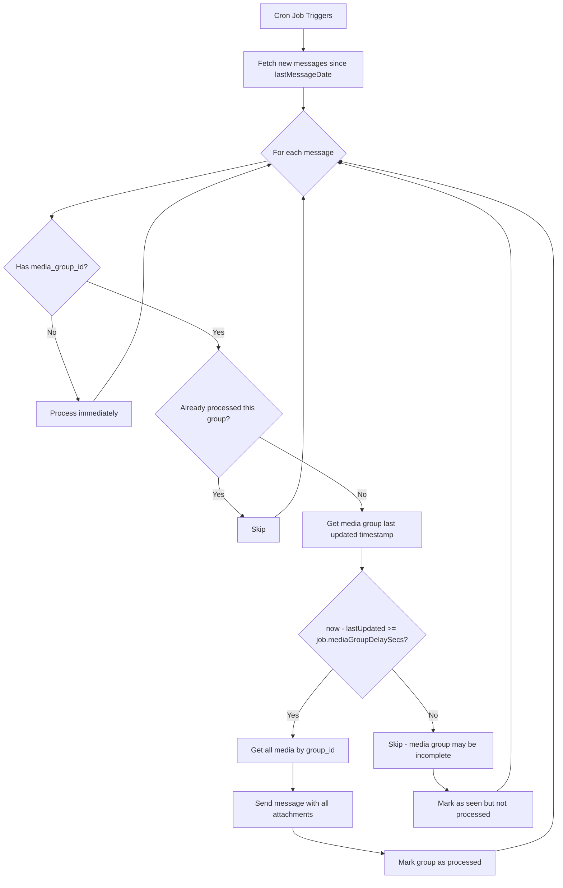

# Media Group Completion Detection Plan

## Problem Statement

When resending messages from Telegram to Max Messenger, media groups (albums) arrive as separate messages but need to be resent together. Telegram sends each media item in a group as a separate message with the same `media_group_id`, but doesn't indicate when all items have arrived.

## Solution: Time-Based Completion Detection

Wait a configurable delay after the last media item is received before considering a media group complete and ready for resending.

## Architecture



## Implementation Details

### 1. New Database Method

Add to `internal/database/wrapper.py`:

```python
def getMediaGroupLastUpdatedAt(
    self, mediaGroupId: str, *, dataSource: Optional[str] = None
) -> Optional[datetime.datetime]:
    """
    Get the timestamp of the most recently added media in a group.

    Args:
        mediaGroupId: Media group ID to query
        dataSource: Optional data source name for multi-source routing

    Returns:
        datetime of the most recent media addition, or None if group not found
    """
    with self.getCursor(readonly=True, dataSource=dataSource) as cursor:
        cursor.execute(
            """
            SELECT MAX(created_at) as last_updated
            FROM media_groups
            WHERE media_group_id = ?
            """,
            (mediaGroupId,),
        )
        row = cursor.fetchone()
        if row and row["last_updated"]:
            return row["last_updated"]
        return None
```

### 2. Per-Job Configuration Option

The delay is configured **per ResendJob**, not globally. This allows different jobs to have different delays based on their source chat characteristics.

Add to `ResendJob` class in `internal/bot/common/handlers/resender.py`:

```python
# Add to __slots__:
"mediaGroupDelaySecs",

# Add to __init__ parameters:
mediaGroupDelaySecs: float = 5.0,

# Add in __init__ body:
self.mediaGroupDelaySecs = mediaGroupDelaySecs
"""Delay in seconds to wait for media group completion before resending."""
```

**Example job configuration in TOML:**

```toml
[[resender.jobs]]
id = "telegram-to-max"
dataSource = "telegram"
sourceChatId = -1001234567890
targetChatId = 9876543210
messageTypes = ["channel", "user"]
messagePrefix = "From Telegram: "
mediaGroupDelaySecs = 5.0  # Optional, defaults to 5.0 seconds
```

### 3. Updated Resender Logic

Modify `internal/bot/common/handlers/resender.py` `_dtCronJob` method:

```python
# In _dtCronJob, modify the media group processing logic:
async def _dtCronJob(self, task: DelayedTask) -> None:
    logger.debug("Cron job started")
    for job in self.jobs:
        if job.isLocked():
            continue

        async with job.getLock():
            logger.debug(f"Processing job {job}")
            newData = self.db.getChatMessagesSince(
                chatId=job.sourceChatId,
                sinceDateTime=job.lastMessageDate,
                messageCategory=job.messageTypes,
                threadId=job.sourceTheadId,
                dataSource=job.dataSource,
            )
            if not newData:
                continue
                
            processedMediaGroups: MutableSet[str] = set()
            pendingMediaGroups: MutableSet[str] = set()  # NEW: track incomplete groups
            
            for message in reversed(newData):
                try:
                    # Skip if this media group was already processed
                    if message["media_group_id"] is not None:
                        if message["media_group_id"] in processedMediaGroups:
                            continue
                        
                        # NEW: Check if media group is ready for processing
                        if message["media_group_id"] in pendingMediaGroups:
                            # Already determined this group is not ready
                            continue
                            
                        lastUpdated = self.db.getMediaGroupLastUpdatedAt(
                            message["media_group_id"],
                            dataSource=job.dataSource,
                        )
                        
                        if lastUpdated is not None:
                            age = utils.getAgeInSecs(lastUpdated)
                            # Use per-job delay setting
                            if age < job.mediaGroupDelaySecs:
                                # Media group may be incomplete, skip for now
                                logger.debug(
                                    f"Media group {message['media_group_id']} "
                                    f"too recent ({age:.1f}s < {job.mediaGroupDelaySecs}s), waiting..."
                                )
                                pendingMediaGroups.add(message["media_group_id"])
                                continue
                        
                        # Media group is ready, mark as processed
                        processedMediaGroups.add(message["media_group_id"])
                    
                    # ... rest of the processing logic remains the same ...
```

### 4. Key Changes Summary

| Component | Change |
|-----------|--------|
| `DatabaseWrapper` | Add `getMediaGroupLastUpdatedAt()` method |
| `ResendJob` class | Add `mediaGroupDelaySecs` attribute (default: 5.0) |
| `ResenderHandler._dtCronJob` | Check `job.mediaGroupDelaySecs` before processing media groups |

### 5. Behavior

- **Single media messages**: Processed immediately on the same cron run
- **Media groups less than N seconds old**: Skipped, will be processed on next cron run
- **Media groups N+ seconds old**: All media collected and sent together
- **Default delay**: 5.0 seconds (configurable per-job in TOML)

### 6. Edge Cases Handled

1. **User sends media items slowly**: Each new item resets the "last updated" timestamp, so the group waits longer
2. **User sends 10 photos at once**: All arrive within ~1-2 seconds, processed together after delay
3. **Network delays**: If some media arrives late, the timestamp updates and group waits
4. **Empty media groups**: Handled by existing null check on `lastUpdated`
5. **Jobs with different needs**: Each job can have its own delay (e.g., faster for known small groups)

## Testing Plan

### Unit Tests

1. Test `getMediaGroupLastUpdatedAt()` returns correct timestamp
2. Test `getMediaGroupLastUpdatedAt()` returns None for non-existent group
3. Test `ResendJob` default `mediaGroupDelaySecs` is 5.0
4. Test `ResendJob` accepts custom `mediaGroupDelaySecs` from config

### Integration Tests

1. Create media group with 3 items at t=0
2. Verify group is NOT processed at t=2 seconds
3. Verify group IS processed at t=6 seconds
4. Verify all 3 media items are included in resent message

## Files to Modify

1. `internal/database/wrapper.py` - Add `getMediaGroupLastUpdatedAt()` method
2. `internal/bot/common/handlers/resender.py` - Add `mediaGroupDelaySecs` to `ResendJob`, update `_dtCronJob`
3. `tests/unit/test_database_wrapper.py` - Add unit tests for new method
